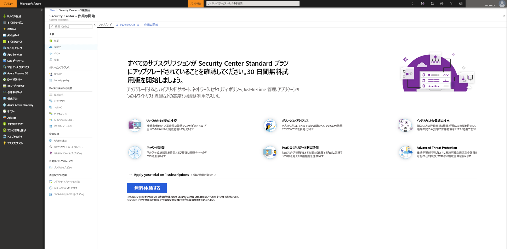
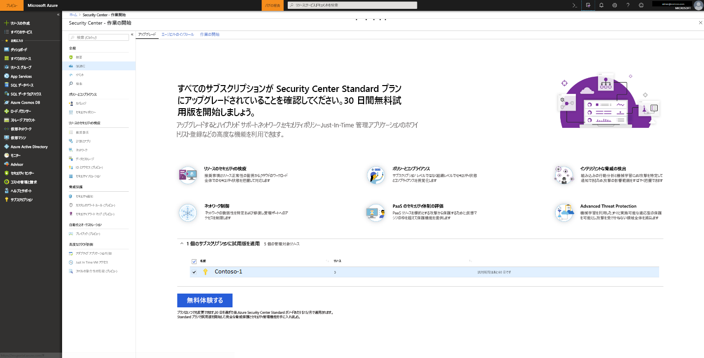

# セキュリティ強化のための Azure Security Center Standard へのオンボード
ハイブリッド クラウドのワークロードで強化されたセキュリティ管理と脅威保護を利用するには、Security Center Standard にアップグレードします。  Standard は無料で試用できます。 詳細については、「[Security Center の価格](https://azure.microsoft.com/pricing/details/security-center/)」をご覧ください。

Security Center Standard は次の機能を備えています。

- **ハイブリッド セキュリティ** - オンプレミスとクラウドのすべてのワークロードのセキュリティを、統合された 1 つのビューで確認できます。 セキュリティ ポリシーを適用し、ハイブリッド クラウドのワークロードのセキュリティを継続的に評価することで、セキュリティ標準に確実に準拠できます。 ファイアウォールやその他のパートナー ソリューションなどのさまざまなソースから、セキュリティ データを収集、検索、分析します。
- **高度な脅威検出** - 高度な分析と Microsoft インテリジェント セキュリティ グラフを使用して、巧妙化していくサイバー攻撃に対応します。  組み込みの行動分析と機械学習を活用して、各種攻撃やゼロデイ攻撃を特定します。 ネットワーク、マシン、クラウド サービスに対する攻撃や侵害後のアクティビティを監視します。 対話型のツールと状況に応じた脅威インテリジェンスにより、調査を効率化します。
- **アクセスとアプリケーションの制御** - 特定のワークロードに適応し、機械学習を活用したホワイトリスト登録の推奨事項を適用することで、マルウェアや他の望ましくないアプリケーションをブロックします。 Azure VM の管理ポートへの制御された Just-In-Time アクセスによってネットワーク攻撃対象領域を縮小することで、ブルート フォース攻撃などのネットワーク攻撃にさらされる機会を大幅に減らします。

## 保護されていないリソースの検出     
Security Center では、Security Center Standard に対応していない Azure サブスクリプションまたはワークスペースが自動的に検出されます。 これには、Security Center Free を使用する Azure サブスクリプションと、セキュリティ ソリューションが有効になっていないワークスペースが含まれます。

Azure サブスクリプション全体を Standard レベルにアップグレードできます。この場合、サブスクリプション内のサポートされるすべてのリソースによって継承されます。 Standard レベルをワークスペースに適用すると、ワークスペースに報告するすべてのリソースに適用されます。

> [!NOTE]
> ソリューションを特定のエージェント セットに制限することで、コストを管理し、ソリューション用に収集されるデータの量を制限することもできます。 [ソリューションのターゲット設定](../operations-management-suite/operations-management-suite-solution-targeting.md)を使用すると、ソリューションにスコープを適用し、ワークスペース内のコンピューターのサブセットをターゲットにすることができます。  ソリューションのターゲット設定を使用している場合、Security Center はソリューションがないものとしてワークスペースを表示します。
>
>

## Azure サブスクリプションまたはワークスペースをアップグレードする
サブスクリプションまたはワークスペースを Standard にアップグレードするには:
1. Security Center メイン メニューの **[使用の開始]** を選択します。
  
2. Security Center の **[アップグレード]** に、オンボードの対象となるサブスクリプションとワークスペースが一覧表示されます。 
   - 展開可能な **[Apply your trial] \(試用版を適用)** をクリックすると、すべてのサブスクリプションとワークスペースの一覧を各試用版の資格の状態と共に表示できます。
   -    試用版の対象にならないサブスクリプションとワークスペースをアップグレードできます。
   -    対象となるワークスペースとサブスクリプションを選択すると、ご自身の試用版を開始できます。
3.  **[無料体験する]** をクリックして、選択したサブスクリプションでご自身の試用版を開始します。
  

   > [!NOTE]
   > Security Center の Free レベルの機能は Azure VM と VMSS にのみ適用されます。 Free レベルの機能は、Azure 以外のコンピューターには適用されません。 Standard を選択した場合、ワークスペースに報告するすべての Azure VM、VM スケール セット、および Azure 以外のコンピューターに Standard レベルの機能が適用されます。 Azure リソースと Azure 以外のリソースに高度なセキュリティを提供するために、Standard を適用することをお勧めします。
   >
   >

## Azure 以外のコンピューターのオンボード
Security Center では、Azure 以外のコンピューターのセキュリティの状況を監視できますが、これらのリソースをオンボードしておく必要があります。 Azure 以外のコンピューターは、**[使用の開始]** ブレードまたは **[コンピューティング]** ブレードから追加できます。 ここでは両方の方法を紹介します。

### **[使用の開始]** から新しい Azure 以外のコンピューターを追加する

1. **[使用の開始]** に戻ります。   
2. **[作業の開始]** タブを選択します。

   

3. **[Azure 以外のコンピューターの新規追加]** で **[構成]** をクリックします。 Log Analytics ワークスペースの一覧が表示されます。 該当する場合、一覧には、自動プロビジョニングが有効になっているときに Security Center によって作成された既定のワークスペースが含まれます。 このワークスペースまたは使用する別のワークスペースを選択します。

   ![Azure 以外のコンピューターの追加][7]

既存のワークスペースがある場合は、**[Add new Non-Azure computers]\(新しい Azure 以外のコンピューターの追加\)** に一覧表示されます。 コンピューターを既存のワークスペースに追加することも、新しいワークスペースを作成することもできます。 新しいワークスペースを作成するには、**[add a new workspace]\(新しいワークスペースを追加\)** リンクをクリックします。

### **[コンピューティング]** から新しい Azure 以外のコンピューターを追加する

**新しいワークスペースを作成してコンピューターを追加する**

1. **[Add new non-Azure computers]\(新しい Azure 以外のコンピューターの追加\)** で、**[add a new workspace]\(新しいワークスペースを追加\)** をクリックします。

   ![新しいワークスペースの追加][4]

2. **[セキュリティおよび監査]** で、**[OMS ワークスペース]** を選択して新しいワークスペースを作成します。
   > [!NOTE]
   > OMS ワークスペースは、Log Analytics ワークスペースと呼ばれるようになりました。
3. **[OMS ワークスペース]** で、ワークスペースの情報を入力します。
4. **[OMS ワークスペース]** で **[OK]** をクリックします。  [OK] をクリックすると、Windows または Linux エージェントをダウンロードするためのリンクと、エージェントの構成時に使用するワークスペース ID のキーが提供されます。
5. **[セキュリティおよび監査]** で **[OK]** をクリックします。

**既存のワークスペースを選択してコンピューターを追加する**

前述の **[オンボード]** からのワークフローに従ってコンピューターを追加できます。 また、**[コンピューティング]** からのワークフローに従ってコンピューターを追加することもできます。 この例では、**[コンピューティング]** を使用します。

1. Security Center のメイン メニューに戻り、**[概要]** ダッシュボードに移動します。

   ![概要][5]

2. **[Compute & apps (コンピューティングとアプリ)]** を選択します。
3. **[Compute & apps (コンピューティングとアプリ)]** で、**[コンピューターの追加]** を選択します。

   ![[コンピューティング] ブレード][6]

4. **[Add new non-Azure computers]\(新しい Azure 以外のコンピューターの追加\)** で、コンピューターの接続先となるワークスペースを選択し、**[コンピューターの追加]** をクリックします。

   ![コンピューターの追加][7]

   **[直接エージェント]** ブレードには、Windows または Linux エージェントをダウンロードするためのリンクや、エージェントの構成で使用するワークスペース ID とキーが表示されます。   

## 次の手順
この記事では、Security Center の高度なセキュリティのメリットを得るために、Azure リソースと Azure 以外のリソースをオンボードする方法について説明しました。  オンボードされたリソースを活用するには、以下を参照してください。

- [データ収集を有効にする](security-center-enable-data-collection.md)
- [脅威インテリジェンス レポート](security-center-threat-report.md)
- [Just In Time VM アクセス](security-center-just-in-time.md)

<!--Image references-->
[1]: ./media/security-center-onboarding/onboard.png
[2]: ./media/security-center-onboarding/onboard-subscription.png
[3]: ./media/security-center-onboarding/get-started.png
[4]: ./media/security-center-onboarding/create-workspace.png
[5]: ./media/security-center-onboarding/overview.png
[6]: ./media/security-center-onboarding/compute-blade.png
[7]: ./media/security-center-onboarding/add-computer.png
[8]: ./media/security-center-onboarding/onboard-workspace.png
