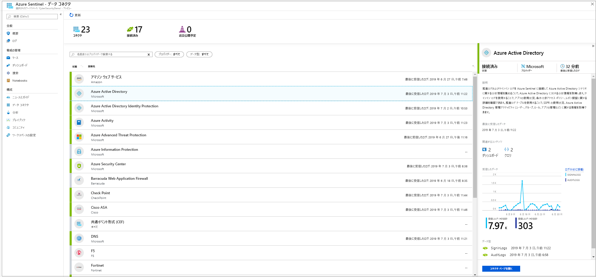

# データ ソースの接続

> [!IMPORTANT]
> 現在、Azure Sentinel はパブリック プレビュー段階にあります。
> このプレビュー バージョンはサービス レベル アグリーメントなしで提供されています。運用環境のワークロードに使用することはお勧めできません。 特定の機能はサポート対象ではなく、機能が制限されることがあります。 詳しくは、[Microsoft Azure プレビューの追加使用条件](https://azure.microsoft.com/support/legal/preview-supplemental-terms/)に関するページをご覧ください。

Azure Sentinel をオンボードするには、まずデータ ソースに接続する必要があります。 Azure Sentinel には、Microsoft Threat Protection ソリューションや Microsoft 365 ソース (Office 365、Azure AD、Azure ATP、Microsoft Cloud App Security) など、すぐに使用できるリアルタイム統合を提供する Microsoft ソリューション用コネクタが多数付属しています。 さらに、Microsoft 以外のソリューション用のより広範なセキュリティ エコシステムへの組み込みコネクタがあります。 一般的なイベント形式 (Syslog や REST-API) を使用して、データ ソースを Azure Sentinel に接続することもできます。  

## データ収集方法

Azure Sentinel では、次のデータ収集方法がサポートされています。

- **Microsoft のサービス**:  Microsoft のサービスは、標準統合用の Azure 基盤を利用して、ネイティブに接続されるので、ほんの数回のクリックで次のソリューションを接続できます。
    - [Office 365](connect-office-365.md)
    - [Azure AD 監査ログとサインイン](connect-azure-active-directory.md)
    - [Azure アクティビティ](connect-azure-activity.md)
    - [Azure AD Identity Protection](connect-azure-ad-Identity-protection.md)
    - [Azure Security Center](connect-azure-security-center.md)
    - [Azure Information Protection](connect-azure-information-protection.md)
    - [Azure Advanced Threat Protection](connect-azure-atp.md)
    - [Cloud App Security](connect-cloud-app-security.md)
    - [Windows セキュリティ イベント](connect-windows-security-events.md) 
    - [Windows ファイアウォール](connect-windows-firewall.md)

- **API による外部ソリューション**:一部のデータ ソースは、接続されるデータ ソースによって提供される API を使用して接続されます。 通常、ほとんどのセキュリティ テクノロジでは、イベント ログの取得に使用できる API のセットが提供されています。API を使用して、Azure Sentinel に接続し、特定の種類のデータを収集して、Azure Log Analytics に送信します。 API を使用して接続されるアプライアンスは次のとおりです。
    - [Barracuda](connect-barracuda.md)
    - Symantec
- **エージェントによる外部ソリューション**:Azure Sentinel は、Syslog プロトコルを使用してリアルタイムのログ ストリーミングを実行できる他のすべてのデータ ソースに対し、エージェントを使用して接続できます。  ほとんどのアプライアンスでは、Syslog プロトコルを使用して、ログ自体とログに関するデータが含まれるイベント メッセージが送信されます。 ログの形式は異なりますが、ほとんどのアプライアンスで 共通イベント形式 (CEF) 標準がサポートされています。  OMS エージェントに基づく Azure Sentinel エージェントでは、CEF 形式のログが、Log Analytics で取り込むことのできる形式に変換されます。 アプライアンスの種類により、エージェントは、アプライアンス上に直接、または専用の Linux サーバー上にインストールされます。 Linux 用エージェントは、UDP 経由で Syslog デーモンからイベントを受信しますが、Linux マシンで大量の Syslog イベントを収集することが予想される場合は、イベントは TCP 経由で Syslog デーモンからエージェントに送信され、そこから Log Analytics に送信されます。
    - ファイアウォール、プロキシ、エンドポイント:
        - [F5](connect-f5.md)
        - [Check Point](connect-checkpoint.md)
        - [Cisco ASA](connect-cisco.md)
        - [Fortinet](connect-fortinet.md)
        - [Palo Alto](connect-paloalto.md)
        - [その他の CEF アプライアンス](connect-common-event-format.md)
        - [その他の Syslog アプライアンス](connect-syslog.md)
    - DLP ソリューション
    - [脅威インテリジェンス プロバイダー](connect-threat-intelligence.md)
    - [DNS マシン](connect-dns.md) - DNS マシンに直接インストールされたエージェント
    - Linux サーバー
    - その他のクラウド
    
## エージェントの接続オプション

外部のアプライアンスを Azure Sentinel に接続するには、エージェントを専用のマシン (VM またはオンプレミス) に展開して、アプライアンスと Azure Sentinel の間の通信をサポートする必要があります。 エージェントの展開は、自動または手動で行うことができます。 自動展開は、専用マシンが Azure に作成中の新しい VM である場合にのみ使用できます。 

または、既存の Azure VM、別のクラウド内の VM、またはオンプレミスのコンピューターに、手動でエージェントを展開することもできます。

## 次の手順

- Azure Sentinel を使用するには、Microsoft Azure のサブスクリプションが必要です。 サブスクリプションがない場合は、 [無料試用版](https://azure.microsoft.com/free/)にサインアップできます。
- [データを Azure Sentine にオンボード](quickstart-onboard.md)し、[データや潜在的な脅威を視覚化する](quickstart-get-visibility.md)方法を説明します。
