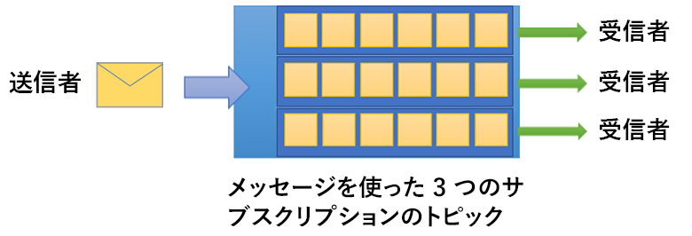

# Azure Service Bus とは

Microsoft Azure Service Bus は、完全なマネージド エンタープライズ統合メッセージ ブローカーです。 Service Bus の最も一般的な用途は、アプリとサービスを相互に分離する場合です。Service Bus は非同期データと状態転送に適した信頼性の高い安全なプラットフォームです。 データは、*メッセージ*を使用してさまざまなアプリとサービス間で転送されます。 メッセージはバイナリ形式であり、JSON、XML、または単なるテキストを含むことができます。 

一般的なメッセージング シナリオの例を次にいくつか示します。

* メッセージング: 販売または購入の注文、仕訳帳、在庫移動などのビジネス データを転送します。
* アプリの分離: アプリとサービスの信頼性とスケーラビリティを向上します (クライアントとサービスが同時にオンラインである必要はありません)。
* トピックとサブスクリプション: 公開元とサブスクライバーの間で 1:*n* の関係が可能になります。
* メッセージ セッション: メッセージの順序付けやメッセージの遅延が必要なワークフローを実装します。

## 名前空間

名前空間は、すべてのメッセージング コンポーネントのスコープ コンテナーです。 複数のキューとトピックを 1 つの名前空間に格納できます。多くの場合、名前空間はアプリケーション コンテナーとして機能します。

## キュー

メッセージは*キュー*に送受信されます。 受信側アプリがメッセージを受信して処理できるようになるまで、キューにメッセージを格納できます。

キュー内のメッセージは到着順に並べ替えられ、タイムスタンプが付けられます。 メッセージは、受理されると、冗長ストレージに安全に保管されます。 メッセージは " *プル*" モードで配信されます。このモードでは、要求に応じてメッセージが配信されます。

## トピック

*トピック*を使用してメッセージを送受信することもできます。 キューはポイント間通信によく使用されますが、トピックは公開/サブスクライブのシナリオで役立ちます。

トピックは、複数の独立したサブスクリプションを持つことができます。 トピックのサブスクライバーは、そのトピックに送信された各メッセージのコピーを受信できます。 サブスクリプションは名前付きエンティティであり、永続的に作成されますが、必要に応じて期限切れまたは自動削除にすることができます。

シナリオによっては、トピックに送信されたすべてのメッセージを個々のサブスクリプションに受信させたくない場合があります。 そのような場合は、[ルールとフィルター](topic-filters.md)を使用して、オプションの[アクション](topic-filters.md#actions)をトリガーし、指定されたメッセージをフィルター処理し、メッセージのプロパティを設定または変更する条件を定義することができます。

## 高度な機能

Service Bus には、より複雑なメッセージングの問題を解決できる高度な機能もあります。 以下のセクションでは、その主な機能について説明します。

### メッセージ セッション

Service Bus の先入れ先出し (FIFO) 処理を保証するには、セッションを使用します。 [メッセージ セッション](message-sessions.md)では、関連メッセージのバインドなしシーケンスの結合および順序指定処理が可能です。 

### 自動転送

[自動転送](service-bus-auto-forwarding.md)機能を使用すると、キューまたはサブスクリプションを同じ名前空間に属する別のキューまたはトピックにチェーンできます。 自動転送が有効な場合は、Service Bus は、一方のキューまたはサブスクリプション (転送元) にあるメッセージを自動的に削除し、もう一方のキューまたはトピック (転送先) に追加します。

### 配信不能処理

Service Bus は、受信者に配信できないメッセージ、または処理できなかったメッセージを保持するために[配信不能キュー](service-bus-dead-letter-queues.md) (DLQ) をサポートしています。 そのため、DLQ のメッセージを削除し、検査することができます。

### スケジュールされた配信

メッセージを、[遅延処理](message-sequencing.md#scheduled-messages)されるようにキューまたはトピックに送信できます。たとえば、特定の時刻にシステムによって処理可能になるようにジョブをスケジュール設定できます。

### メッセージ遅延

キューまたはサブスクリプションのクライアントが処理すべきメッセージを受信したものの、アプリケーション内の特別な状況が原因ですぐに処理を行えない場合、[メッセージを取得するタイミングを遅延させる](message-deferral.md)ことができます。 メッセージは、キューまたはサブスクリプションに留まり、確保されます。

### バッチ処理

[クライアント側のバッチ処理](service-bus-performance-improvements.md#client-side-batching)により、キューまたはトピックのクライアントはメッセージの送信を一定期間遅らせることができます。 クライアントがこの期間内に追加のメッセージを送信すると、1 つのバッチで複数のメッセージが送信されます。 

### トランザクション

[トランザクション](service-bus-transactions.md)により、複数の操作が 1 つの実行スコープにグループ化されます。 Service Bus は、トランザクションのスコープ内の単一メッセージング エンティティ (キュー、トピック、サブスクリプション) に対するグループ化操作をサポートしています。

### フィルター処理とアクション

サブスクライバーは、トピックから受信するメッセージを定義できます。 これらのメッセージは、1 つ以上の[名前付きのサブスクリプション ルール](topic-filters.md)の形式で指定されます。 サブスクリプションは、対応するルールの条件ごとに、対応する各ルールに異なる注釈を付けることができる、メッセージのコピーを作成します。

### アイドル状態時の自動削除

[アイドル状態時の自動削除](/dotnet/api/microsoft.servicebus.messaging.queuedescription.autodeleteonidle)機能を使用すると、アイドル間隔を指定できます。この間隔が経過すると、キューは自動的に削除されます。 最小時間は、5 分です。

### 重複検出

クライアントが送信操作の結果について何か疑問を持つようなエラーが発生した場合、[重複メッセージの検出](duplicate-detection.md)機能は、送信側が同じメッセージを再送信することを可能にすることで、このような状況を解決します。重複メッセージは、キューまたはトピックで削除されます。

### SAS、RBAC、および Azure リソースのマネージド ID

Service Bus は、[Shared Access Signatures](service-bus-sas.md) (SAS)、[ロールベースのアクセス制御](service-bus-role-based-access-control.md) (RBAC)、および [Azure リソースのマネージド ID](service-bus-managed-service-identity.md) などのセキュリティ プロトコルをサポートしています。

### geo ディザスター リカバリー

Azure リージョンまたはデータセンターでダウンタイムが発生すると、[geo ディザスター リカバリー](service-bus-geo-dr.md)により、異なるリージョンまたはデータ センターでデータ処理を継続できます。

### セキュリティ

Service Bus は、標準の [AMQP 1.0](service-bus-amqp-overview.md) および [HTTP/REST](/rest/api/servicebus/) プロトコルをサポートしています。

## クライアント ライブラリ

Service Bus は、[.NET](https://github.com/Azure/azure-service-bus-dotnet/tree/master)、[Java](https://github.com/Azure/azure-service-bus-java/tree/master)、[JMS](https://github.com/Azure/azure-service-bus/tree/master/samples/Java/qpid-jms-client) のクライアント ライブラリをサポートしています。

## 統合

Service Bus は、以下の Azure サービスと完全に統合されています。

- [Event Grid](https://azure.microsoft.com/services/event-grid/) 
- [Logic Apps](https://azure.microsoft.com/services/logic-apps/) 
- [関数](https://azure.microsoft.com/services/functions/) 
- [Dynamics 365](https://dynamics.microsoft.com)
- [Stream Analytics](https://azure.microsoft.com/services/stream-analytics/)
 
## 次の手順

Service Bus メッセージングの基本的な使い方については、以下の記事を参照してください。

* [Azure メッセージング サービスの比較](../event-grid/compare-messaging-services.md?toc=%2fazure%2fservice-bus-messaging%2ftoc.json&bc=%2fazure%2fservice-bus-messaging%2fbreadcrumb%2ftoc.json)
* Azure Service Bus の [Standard レベルと Premium レベル](https://azure.microsoft.com/pricing/details/service-bus/)とその価格の詳細
* [Azure Service Bus Premium レベルのパフォーマンスと待機時間](https://blogs.msdn.microsoft.com/servicebus/2016/07/18/premium-messaging-how-fast-is-it/)
* [.NET](service-bus-quickstart-powershell.md)、[Java](service-bus-quickstart-powershell.md)、または[JMS](service-bus-quickstart-powershell.md) のクイック スタートを試す
