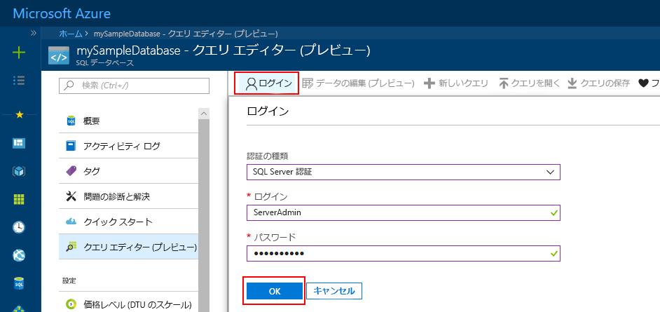
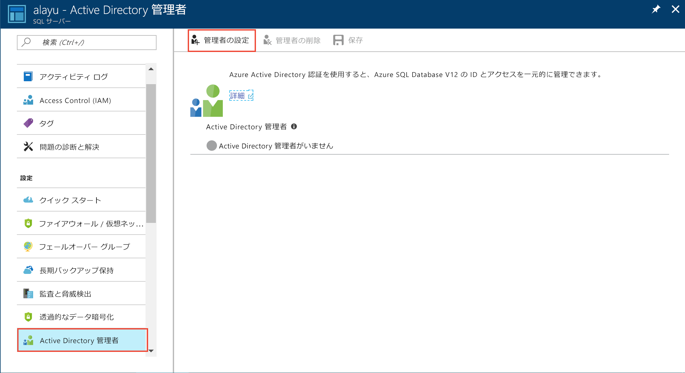
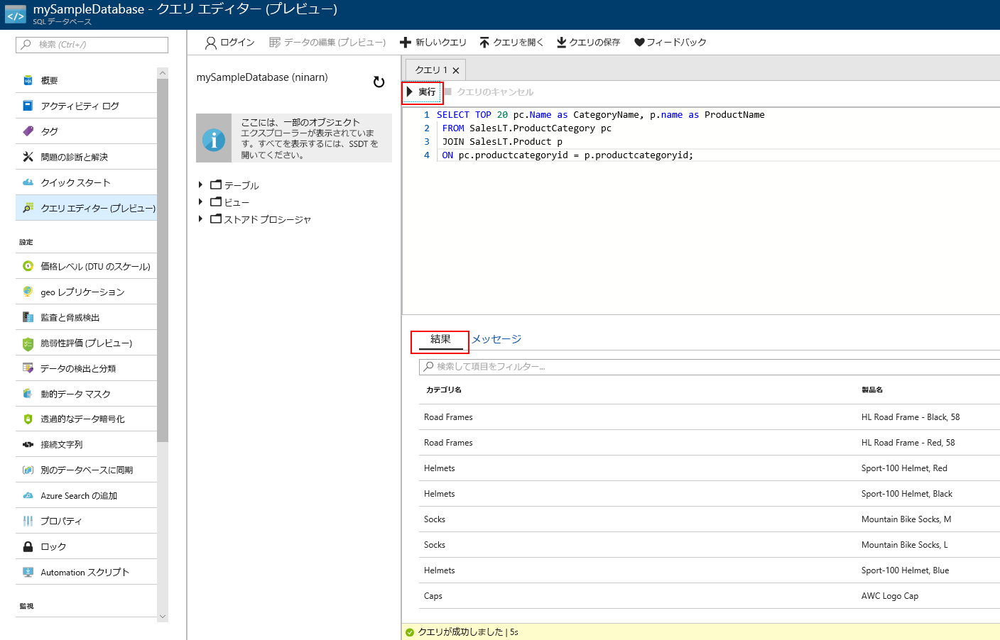

# <a name="azure-portal-use-the-sql-query-editor-to-connect-and-query-data"></a>Azure Portal: SQL クエリ エディターを使用した接続とデータの照会

SQL クエリ エディターは、Azure Portal から離れずに、Azure SQL Database または Azure SQL Data Warehouse に対して SQL クエリを効率的かつ簡単に実行できるブラウザー クエリ ツールです。 このクイック スタート チュートリアルでは、クエリ エディターを使用して SQL Database に接続し、Transact-SQL ステートメントを使用してデータベース内のデータを照会、挿入、更新、および削除する方法について説明します。

## <a name="prerequisites"></a>前提条件

このクイック スタートでは、次のクイック スタートで作成されたリソースが出発点として使用されます。

[!INCLUDE [prerequisites-create-db](../../includes/sql-database-connect-query-prerequisites-create-db-includes.md)]

> [!NOTE]
> SQL Server のファイアウォール設定で、[Azure サービスへのアクセスを許可する] が [オン] に設定されていることを確認します。 このオプションにより、SQL クエリ エディターはデータベースおよびデータ ウェアハウスにアクセスできるようになります。

## <a name="log-in-to-the-azure-portal"></a>Azure Portal にログインする

[Azure Portal](https://portal.azure.com/) にログインします。


## <a name="connect-using-sql-authentication"></a>SQL 認証を使用して接続する

1. 左側のメニューの **[SQL データベース]** をクリックし、照会するデータベースをクリックします。

2. データベースの SQL Database ページで、左側のメニューの **[クエリ エディター (プレビュー)]** を見つけてクリックします。

    

3. **[ログイン]** をクリックし、メッセージが表示されたら **[SQL Server 認証]** を選択して、データベースの作成時に指定したサーバー管理者ログインとパスワードを入力します。

    

4. **[OK]** をクリックしてログインします。


## <a name="connect-using-azure-ad"></a>Azure AD を使用して接続する

Active Directory 管理者を構成すると、1 つの ID で Azure Portal と SQL Database にログインできます。 次の手順に従って、作成済みの SQL Server の Active Directory 管理者を構成します。

> [!NOTE]
> 電子メール アカウント (outlook.com、hotmail.com、live.com、gmail.com、yahoo.com など) は、Active Directory 管理者としてまだサポートされていません。 Azure Active Directory でネイティブに作成されたユーザー、または Azure Active Directory にフェデレーションされたユーザーを必ず選択してください。

1. 左側のメニューの **[SQL Server]** を選択し、サーバーの一覧から使用する SQL Server を選択します。

2. SQL Server の設定メニューから、**[Active Directory 管理者]** を選択します。

3. Active Directory 管理者ブレードで、**[管理者の設定]** をクリックし、Active Directory 管理者になるユーザーまたはグループを選択します。

    

4. Active Directory 管理者ブレードの上部にある **[保存]** をクリックして、Active Directory 管理者を設定します。

クエリを実行する SQL データベースに移動し、左側のメニューから **[Data explorer (プレビュー)]** をクリックします。 Data explorer ページが開き、データベースに自動的に接続されます。


## <a name="run-query-using-query-editor"></a>クエリ エディターを使用してクエリを実行する

認証されたら、クエリ エディター ウィンドウに次のクエリを入力して、カテゴリ単位で上位 20 個の製品を照会します。

```sql
 SELECT TOP 20 pc.Name as CategoryName, p.name as ProductName
 FROM SalesLT.ProductCategory pc
 JOIN SalesLT.Product p
 ON pc.productcategoryid = p.productcategoryid;
```

**[実行]** をクリックし、**[結果]** ウィンドウでクエリの結果を確認します。



## <a name="insert-data-using-query-editor"></a>クエリ エディターを使用してデータを挿入する

次のコードを使用して、SalesLT.Product テーブルに新しい製品を挿入します。ここでは [INSERT](https://msdn.microsoft.com/library/ms174335.aspx) Transact-SQL ステートメントを使用します。

1. クエリ ウィンドウで、先ほどのクエリを次のクエリに置き換えます。

   ```sql
   INSERT INTO [SalesLT].[Product]
           ( [Name]
           , [ProductNumber]
           , [Color]
           , [ProductCategoryID]
           , [StandardCost]
           , [ListPrice]
           , [SellStartDate]
           )
     VALUES
           ('myNewProduct'
           ,123456789
           ,'NewColor'
           ,1
           ,100
           ,100
           ,GETDATE() );
   ```

2. ツール バーの **[実行]** をクリックして、Product テーブルに新しい行を挿入します。

## <a name="update-data-using-query-editor"></a>クエリ エディターを使用してデータを更新する

次のコードを使用して、先ほど追加した新しい製品を更新します。ここでは [UPDATE](https://msdn.microsoft.com/library/ms177523.aspx) Transact-SQL ステートメントを使用します。

1. クエリ ウィンドウで、先ほどのクエリを次のクエリに置き換えます。

   ```sql
   UPDATE [SalesLT].[Product]
   SET [ListPrice] = 125
   WHERE Name = 'myNewProduct';
   ```

2. ツール バーの **[実行]** をクリックして、Product テーブルの指定した行を更新します。

## <a name="delete-data-using-query-editor"></a>クエリ エディターを使用してデータを削除する

次のコードを使用して、先ほど追加した新しい製品を削除します。ここでは [DELETE](https://msdn.microsoft.com/library/ms189835.aspx) Transact-SQL ステートメントを使用します。

1. クエリ ウィンドウで、先ほどのクエリを次のクエリに置き換えます。

   ```sql
   DELETE FROM [SalesLT].[Product]
   WHERE Name = 'myNewProduct';
   ```

2. ツール バーの **[実行]** をクリックして、Product テーブルの指定した行を削除します。


## <a name="query-editor-considerations"></a>クエリ エディターに関する考慮事項

クエリ エディターを操作するときは次の点に注意してください。

1. Azure SQL Server のファイアウォール設定で、[Azure サービスへのアクセスを許可する] が [オン] に設定されていることを確認します。 このオプションにより、SQL クエリ エディターは SQL データベースおよびデータ ウェアハウスにアクセスできるようになります。

2. SQL サーバーが Virtual Network 内に存在する場合、クエリ エディターを使って、そのサーバーのデータベースを照会することはできません。

3. F5 キーを押すと、クエリ エディター ページが更新され、作業中のクエリが失われます。 クエリを実行するには、ツール バーの [実行] ボタンを使用します。

4. クエリ エディターは、master DB への接続をサポートしません。

5. クエリの実行には、5 分のタイムアウトがあります。

6. Azure Active Directory 管理者ログインは、2 要素認証が有効になっているアカウントでは機能しません。

7. 電子メール アカウント (outlook.com、hotmail.com、live.com、gmail.com、yahoo.com など) は、Active Directory 管理者としてまだサポートされていません。 Azure Active Directory でネイティブに作成されたユーザー、または Azure Active Directory にフェデレーションされたユーザーを必ず選択してください。

8. geography データ型に関してクエリ エディターでサポートされるのは円柱投影のみです。

9. データベース テーブルおよびビューでは、IntelliSense はサポートされていません。 ただし、エディターでは、既に入力されている名前のオート コンプリートをサポートしています。


## <a name="next-steps"></a>次の手順

- Azure SQL Database でサポートされる Transact-SQL については、[SQL Database の Transact-SQL の相違点](sql-database-transact-sql-information.md)に関する記事をご覧ください。
