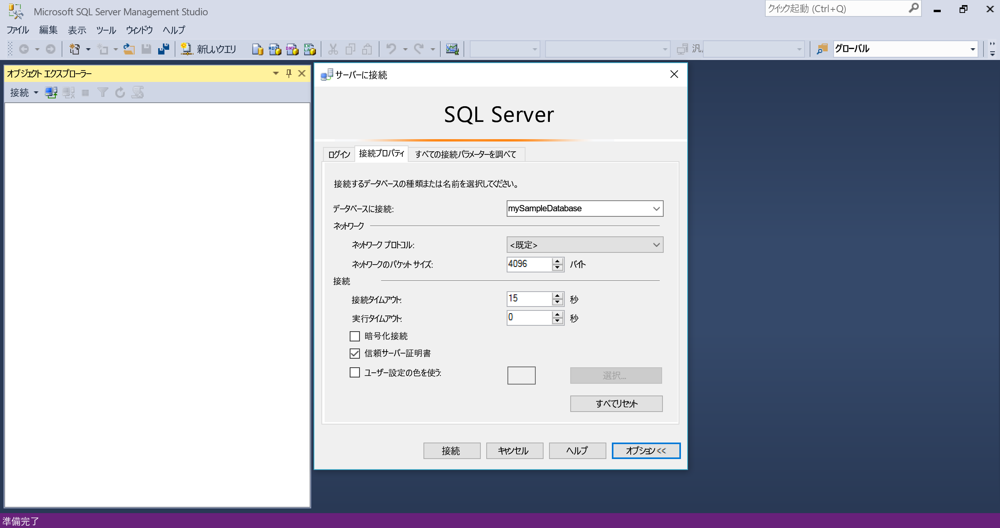
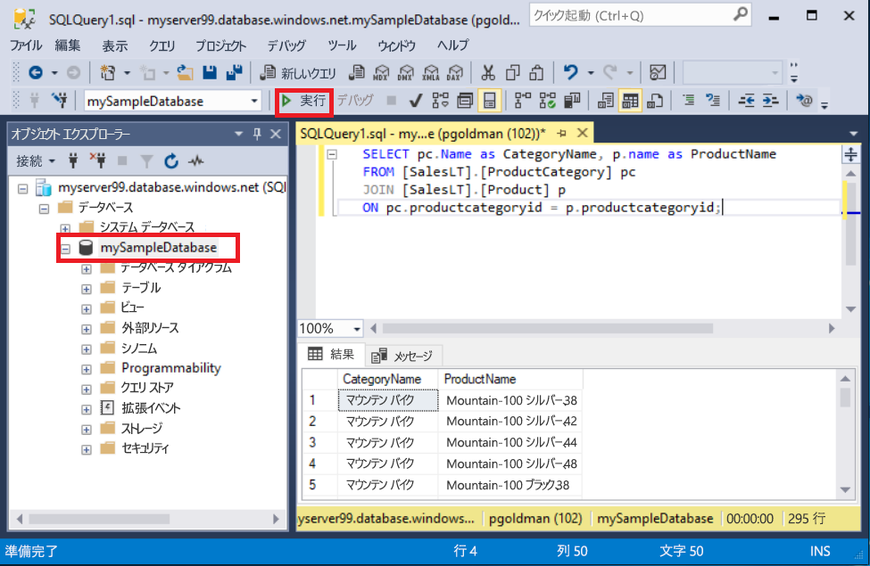

# <a name="quickstart-use-sql-server-management-studio-to-connect-and-query-an-azure-sql-database"></a>クイック スタート: SQL Server Management Studio を使用して Azure SQL Database に接続しクエリを実行する

このクイック スタートでは、[SQL Server Management Studio][ssms-install-latest-84g] (SSMS) を使用して、Azure SQL Database に接続します。 その後、Transact-SQL ステートメントを実行して、データの照会、挿入、更新、および削除を実行します。 SSMS を使用して、SQL Server から Microsoft Windows の SQL Database まで、任意の SQL インフラストラクチャを管理できます。  

## <a name="prerequisites"></a>前提条件

- Azure SQL Database。 以下のいずれかのクイック スタートを使用して、Azure SQL Database でデータベースを作成し、構成できます。

  || 単一データベース | マネージド インスタンス |
  |:--- |:--- |:---|
  | Create| [ポータル](sql-database-single-database-get-started.md) | [ポータル](sql-database-managed-instance-get-started.md) |
  || [CLI](scripts/sql-database-create-and-configure-database-cli.md) | [CLI](https://medium.com/azure-sqldb-managed-instance/working-with-sql-managed-instance-using-azure-cli-611795fe0b44) |
  || [PowerShell](scripts/sql-database-create-and-configure-database-powershell.md) | [PowerShell](scripts/sql-database-create-configure-managed-instance-powershell.md) |
  | 構成 | [サーバーレベルの IP ファイアウォール規則](sql-database-server-level-firewall-rule.md)| [VM からの接続](sql-database-managed-instance-configure-vm.md)|
  |||[オンサイトからの接続](sql-database-managed-instance-configure-p2s.md)
  |データを読み込む|クイック スタートごとに読み込まれる Adventure Works|[Wide World Importers を復元する](sql-database-managed-instance-get-started-restore.md)
  |||[GitHub](https://github.com/Microsoft/sql-server-samples/tree/master/samples/databases/adventure-works) の [BACPAC](sql-database-import.md) ファイルから Adventure Works を復元またはインポートする|
  |||

  > [!IMPORTANT]
  > この記事のスクリプトは、Adventure Works データベースを使用するように記述されています。 マネージド インスタンスの場合は、Adventure Works データベースをインスタンス データベースにインポートするか、Wide World Importers データベースを使用するようにこの記事のスクリプトを修正する必要があります。

## <a name="install-the-latest-ssms"></a>最新の SSMS をインストールします。

開始する前に、最新の [SSMS][ssms-install-latest-84g] がインストールされていることを確認します。

## <a name="get-sql-server-connection-information"></a>SQL サーバーの接続情報を取得する

Azure SQL データベースに接続するために必要な接続情報を取得します。 後の手順で、完全修飾サーバー名またはホスト名、データベース名、およびログイン情報が必要になります。

1. [Azure Portal](https://portal.azure.com/) にサインインします。

2. **[SQL データベース]** または **[SQL マネージド インスタンス]** ページに移動します。

3. **[概要]** ページで、単一データベースの場合は **[サーバー名]** の横の完全修飾サーバー名を確認し、マネージド インスタンスの場合は **[ホスト]** の横の完全修飾サーバー名を確認します。 サーバー名またはホスト名をコピーするには、名前をポイントして **[コピー]** アイコンを選択します。

## <a name="connect-to-your-database"></a>データベースに接続する

SMSS で、Azure SQL Database サーバーに接続します。

> [!IMPORTANT]
> Azure SQL Database サーバーは、ポート 1433 でリッスンします。 企業のファイアウォールの外側から SQL Database サーバーに接続するには、そのファイアウォールでこのポートが開かれている必要があります。
>

1. SSMS を開きます。 **[サーバーへの接続]** ダイアログ ボックスが表示されます。

2. 次の情報を入力します。

   | Setting      | 推奨値    | 説明 |
   | ------------ | ------------------ | ----------- |
   | **サーバーの種類** | データベース エンジン | 必須値。 |
   | **サーバー名** | 完全修飾サーバー名 | 例: **mynewserver20170313.database.windows.net** |
   | **Authentication** | パブリック | このチュートリアルでは、SQL 認証を使用します。 |
   | **ログイン** | サーバー管理者アカウントのユーザー ID | サーバーを作成するために使用するサーバー管理者アカウントのユーザー ID。 |
   | **パスワード** | サーバー管理者アカウントのパスワード | サーバーを作成するために使用するサーバー管理者アカウントのパスワード。 |
   ||||

   ![[サーバーへの接続]](./media/sql-database-connect-query-ssms/connect.png)  

3. **[サーバーへの接続]** ダイアログ ボックスの **[オプション]** を選択します。 **[データベースへの接続]** ドロップダウン メニューで、**mySampleDatabase** を選択します。

     

4. **[接続]** を選択します。 オブジェクト エクスプローラー ウィンドウが開きます。

5. データベースのオブジェクトを表示するには、**[データベース]** を展開して、**mySampleDatabase** を展開します。

     

## <a name="query-data"></a>データのクエリを実行する

次の [SELECT](https://msdn.microsoft.com/library/ms189499.aspx) Transact-SQL のコードを実行して、カテゴリごとに上位 20 個の製品を照会します。

1. オブジェクト エクスプローラーで **mySampleDatabase** を右クリックし、**[新しいクエリ]** を選択します。 データベースに接続された新しいクエリ ウィンドウが開きます。

2. クエリ ウィンドウに、この SQL クエリを貼り付けます。

   ```sql
   SELECT pc.Name as CategoryName, p.name as ProductName
   FROM [SalesLT].[ProductCategory] pc
   JOIN [SalesLT].[Product] p
   ON pc.productcategoryid = p.productcategoryid;
   ```

3. ツールバーで、**[実行する]** を選択して、`Product` および `ProductCategory` テーブルからデータを取得します。

    

## <a name="insert-data"></a>データを挿入する

次の [INSERT](https://msdn.microsoft.com/library/ms174335.aspx) Transact-SQL のコードを実行して、`SalesLT.Product` テーブルに新しい製品を作成します。

1. 前のクエリを次のクエリに置き換えます。

   ```sql
   INSERT INTO [SalesLT].[Product]
           ( [Name]
           , [ProductNumber]
           , [Color]
           , [ProductCategoryID]
           , [StandardCost]
           , [ListPrice]
           , [SellStartDate] )
     VALUES
           ('myNewProduct'
           ,123456789
           ,'NewColor'
           ,1
           ,100
           ,100
           ,GETDATE() );
   ```

2. **[実行する]** を選択して、新しい行を `Product` テーブルに挿入します。 **メッセージ** ペインに、**(1 行処理されました)** と表示されます。

## <a name="view-the-result"></a>結果を表示する

1. 前のクエリを次のクエリに置き換えます。

   ```sql
   SELECT * FROM [SalesLT].[Product]
   WHERE Name='myNewProduct'
   ```

2. **[Execute (実行)]** を選択します。 次の結果が表示されます。

   

## <a name="update-data"></a>データの更新

次の [UPDATE](https://msdn.microsoft.com/library/ms177523.aspx) Transact-SQL コードを実行して、新しい製品を変更します。

1. 前のクエリを次のクエリに置き換えます。

   ```sql
   UPDATE [SalesLT].[Product]
   SET [ListPrice] = 125
   WHERE Name = 'myNewProduct';
   ```

2. **[実行する]** を選択して、`Product` テーブルの指定した行を更新します。 **メッセージ** ペインに、**(1 行処理されました)** と表示されます。

## <a name="delete-data"></a>データの削除

次の [DELETE](https://msdn.microsoft.com/library/ms189835.aspx) Transact-SQL コードを実行して、新しい製品を削除します。

1. 前のクエリを次のクエリに置き換えます。

   ```sql
   DELETE FROM [SalesLT].[Product]
   WHERE Name = 'myNewProduct';
   ```

2. **[実行する]** を選択して、`Product` テーブルの指定した行を削除します。 **メッセージ** ペインに、**(1 行処理されました)** と表示されます。

## <a name="next-steps"></a>次の手順

- SSMS については、[SQL Server Management Studio](https://msdn.microsoft.com/library/ms174173.aspx) のページを参照してください。
- Azure Portal を使用して接続とクエリを実行するには、[Azure Portal の SQL クエリ エディターを使用した接続とクエリ実行](sql-database-connect-query-portal.md)に関するページをご覧ください。
- Visual Studio Code を使用して接続とデータの照会を行うには、[Visual Studio Code を使った接続とデータの照会](sql-database-connect-query-vscode.md)に関するページを参照してください。
- .NET を使用して接続とデータの照会を行うには、[.NET を使った接続とデータの照会](sql-database-connect-query-dotnet.md)に関するページを参照してください。
- PHP を使用して接続とデータの照会を行うには、[PHP を使った接続とデータの照会](sql-database-connect-query-php.md)に関するページを参照してください。
- Node.js を使用して接続とデータの照会を行うには、[Node.js を使った接続とデータの照会](sql-database-connect-query-nodejs.md)に関するページを参照してください。
- Java を使用して接続とデータの照会を行うには、[Java を使った接続とデータの照会](sql-database-connect-query-java.md)に関するページを参照してください。
- Python を使用して接続とデータの照会を行うには、[Python を使った接続とデータの照会](sql-database-connect-query-python.md)に関するページを参照してください。
- Ruby を使用して接続とデータの照会を行うには、[Ruby を使った接続とデータの照会](sql-database-connect-query-ruby.md)に関するページを参照してください。

<!-- Article link references. -->

[ssms-install-latest-84g]: https://docs.microsoft.com/sql/ssms/sql-server-management-studio-ssms