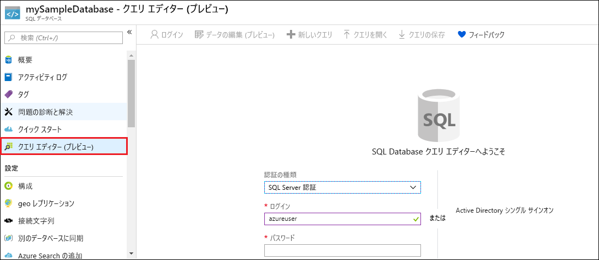

# <a name="quickstart-create-an-azure-sql-database-in-the-azure-portal"></a>クイック スタート:Azure Portal で Azure SQL データベースを作成する

Azure SQL Database は、クラウド内で可用性の高い SQL Server データベースの実行とスケーリングを可能にする "*サービスとしてのデータベース*" です。 このクイック スタートでは、Azure portal を使用して Azure SQL データベースを作成し、クエリを実行することによって作業を開始する方法を示します。 

Azure サブスクリプションをお持ちでない場合は、[無料アカウントを作成](https://azure.microsoft.com/free/)してください。

このクイック スタートのすべての手順では、[Azure portal](https://portal.azure.com/) にサインインします。

## <a name="create-a-sql-database"></a>SQL Database の作成

Azure SQL データベースには、定義済みの一連の[コンピューティング リソースとストレージ リソース](sql-database-service-tiers-dtu.md)があります。 データベースは、[Azure リソース グループ](../azure-resource-manager/resource-group-overview.md)内の [SQL Database サーバー](sql-database-features.md)上に作成します。

Adventure Works LT サンプル データを含む SQL データベースを作成するには:

1. Azure Portal の左上隅にある **[リソースの作成]** を選択します。
2. **[データベース]** を選択してから、**[SQL Database]** を選択します。
3. **[SQL データベースの作成]** フォームで、次の値を入力または選択します。 

   - **データベース名**: 「*mySampleDatabase*」と入力します。
   - **サブスクリプション**:表示されていない場合は、ドロップ ダウンして適切なサブスクリプションを選択します。
   - **[リソース グループ]**:**[新規作成]** を選択し、「*myResourceGroup*」と入力して、**[OK]** を選択します。 
   - **ソースの選択**:ドロップ ダウンして **[Sample (AdventureWorksLT) (サンプル (AdventureWorksLT))]** を選択します。

    >[!IMPORTANT]
    >必ず **[Sample (AdventureWorksLT) (サンプル (AdventureWorksLT))]** を選択して、このクイック スタートとこのデータを使用する他の Azure SQL Database クイック スタートに従えるようにします。
  
   

4. **[サーバー]** の **[新規作成]** を選択します。 
5. **[新しいサーバー]** フォームで、次の値を入力または選択します。 

   - **サーバー名**: 「*mysqlserver*」と入力します。
   - **サーバー管理者ログイン**:「*azureuser*」と入力します。 
   - **Password**:「*Azure1234567*」と入力します。 
   - **パスワードの確認**:パスワードを再入力します。
   - **[場所]**:ドロップ ダウンして任意の有効な場所を選択します。  

   >[!IMPORTANT]
   >忘れずにサーバー管理者のログインとパスワードを記録して、このクイック スタートと他のクイック スタートのためにサーバーとデータベースにログインできるようにします。 ログインまたはパスワードを忘れた場合は、**[SQL サーバー]** ページでログイン名を取得するかパスワードをリセットします。 **[SQL サーバー]** ページを開くには、データベースの作成後にデータベースの **[概要]** ページでサーバー名を選択します。

    

6. **[選択]** を選択します。
7. **[SQL Database]** フォームで、**[価格レベル]** を選択します。 サービス レベルごとに利用できる DTU の量とストレージの容量を調べます。

   >[!NOTE]
   >このクイック スタートでは、[DTU ベースの購入モデル](sql-database-service-tiers-dtu.md)を使用しますが、[仮想コアベースの購入モデル](sql-database-service-tiers-vcore.md)も利用できます。
   >[!IMPORTANT]
   >現在、1 TB を超える Premium レベルのストレージは、英国北部、米国中西部、英国南部 2、中国東部、US DoD 中部、ドイツ中部、US DoD 東部、US Gov 南西部、US Gov 中南部、ドイツ北東部、中国北部、US Gov 東部を除くすべてのリージョンで使用できます。 これらのリージョンでは、Premium レベルのストレージの最大容量は 1 TB です。 詳しくは、[P11-P15 の現在の制限事項](sql-database-dtu-resource-limits-single-databases.md#single-database-limitations-of-p11-and-p15-when-the-maximum-size-greater-than-1-tb)に関するページをご覧ください。  

8. このクイック スタートでは、**Standard** サービス レベルを選択したうえで、スライダーを使用して **10 DTU (S0)** と **1** GB のストレージを選択します。
9. **[適用]** を選択します。  

   

10. **[SQL Database]** フォームで **[作成]** を選択して、リソース グループ、サーバー、データベースをデプロイし、プロビジョニングします。 

   デプロイには、数分かかります。 ツール バーの **[通知]** を選択して、デプロイの進行状況を監視できます。

   

## <a name="query-the-sql-database"></a>SQL データベースに対するクエリ

Azure SQL データベースを作成したので、Azure portal に組み込まれているクエリ ツールを使用して、データベースへの接続とデータへのクエリを実行します。

1. データベースの **[SQL Database]** ページで、左側のメニューの **[クエリ エディター (プレビュー)]** を選択します。 

   

2. ログイン情報を入力し、**[OK]** を選択します。
3. **[クエリ エディター]** ウィンドウに次のクエリを入力します。

   ```sql
   SELECT TOP 20 pc.Name as CategoryName, p.name as ProductName
   FROM SalesLT.ProductCategory pc
   JOIN SalesLT.Product p
   ON pc.productcategoryid = p.productcategoryid;
   ```

4. **[実行]** を選択し、**[結果]** ウィンドウでクエリの結果を確認します。

   

5. **[クエリ エディター]** ページを閉じ、未保存の編集を破棄するかどうかを確認するプロンプトが表示されたら **[OK]** をクリックします。

## <a name="clean-up-resources"></a>リソースのクリーンアップ

「[次のステップ](#next-steps)」に進む場合は、このリソース グループ、SQL サーバー、SQL データベースを維持してください。 次のステップでは、データベースに接続してクエリを実行するさまざまな方法を紹介しています。 

これらのリソースの使用が終了したら、次のように削除できます。

1. Azure portal の左側のメニューで、**[リソース グループ]**、**[myResourceGroup]** の順に選択します。
2. リソース グループ ページで **[リソース グループの削除]** を選択します。 
3. フィールドに「*myResourceGroup*」と入力してから、**[削除]** を選択します。

## <a name="next-steps"></a>次の手順

- オンプレミスまたはリモート ツールから Azure SQL データベースに接続するために、サーバーレベルのファイアウォール規則を作成します。 詳細については、「[サーバーレベルのファイアウォール規則を作成する](sql-database-get-started-portal-firewall.md)」を参照してください。
- サーバーレベルのファイアウォール規則を作成した後に、いくつかの異なるツールと言語を使用して、データベースに[接続し、クエリを実行](sql-database-connect-query.md)します。 
  - [SQL Server Management Studio を使用して接続およびクエリを実行する](sql-database-connect-query-ssms.md)
  - [Azure Data Studio を使用して接続およびクエリを実行する](https://docs.microsoft.com/sql/azure-data-studio/quickstart-sql-database?toc=/azure/sql-database/toc.json)
- Azure CLI を使用して Azure SQL データベースを作成するには、「[Azure CLI のサンプル](sql-database-cli-samples.md)」をご覧ください。
- Azure PowerShell を使用して Azure SQL データベースを作成するには、「[Azure PowerShell サンプル](sql-database-powershell-samples.md)」をご覧ください。
