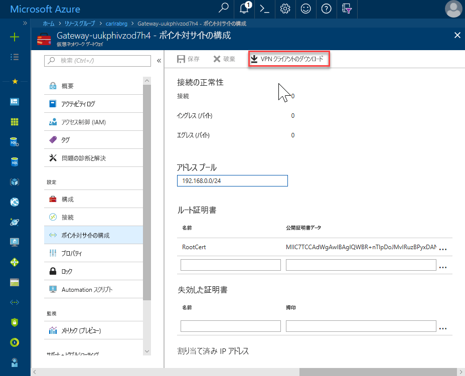

# <a name="quickstart-configure-a-point-to-site-connection-to-an-azure-sql-database-managed-instance-from-on-premises"></a>クイック スタート: オンプレミスから Azure SQL Database Managed Instance へのポイント対サイト接続を構成する

このクイック スタートでは、オンプレミスのクライアント コンピューターからポイント対サイト接続を行い、[SQL Server Management Studio](https://docs.microsoft.com/sql/ssms/sql-server-management-studio-ssms) (SSMS) を使用して Azure SQL Database Managed Instance に接続する方法を示します。 ポイント対サイト接続の詳細については、「[ポイント対サイト VPN について](../vpn-gateway/point-to-site-about.md)」を参照してください。

## <a name="prerequisites"></a>前提条件

このクイック スタート:

- クイック スタート: [マネージド インスタンスの作成](sql-database-managed-instance-get-started.md)に関するページで作成されたリソースが出発点として使用されます。
- オンプレミスのクライアント コンピューターには、PowerShell 5.1 と Azure PowerShell 5.4.2 以降をインストールしておく必要があります。
- オンプレミスのクライアント コンピューターには、最新版の [SQL Server Management Studio](https://docs.microsoft.com/sql/ssms/sql-server-management-studio-ssms) (SSMS) をインストールしておく必要があります。

## <a name="attach-a-vpn-gateway-to-your-managed-instance-virtual-network"></a>マネージド インスタンス仮想ネットワークに VPN Gateway を接続する

1. オンプレミスのクライアント コンピューターで PowerShell を開きます。
2. この PowerShell スクリプトをコピーして貼り付けます。 このスクリプトにより、[マネージド インスタンスの作成](sql-database-managed-instance-get-started.md)のクイック スタートで作成したマネージド インスタンス仮想ネットワークに VPN Gateway が接続されます。 このスクリプトにより次の 3 つの手順が実行されます。

   - 証明書が作成され、クライアント コンピューターにインストールされます
   - 今後の VPN Gateway サブネット IP 範囲が計算されます
   - ゲートウェイ サブネットが作成されます
   - VPN Gateway を VPN サブネットに接続する Azure Resource Manager テンプレートがデプロイされます

     ```powershell
     $scriptUrlBase = 'https://raw.githubusercontent.com/Microsoft/sql-server-samples/master/samples/manage/azure-sql-db-managed-instance/attach-vpn-gateway'

     $parameters = @{
       subscriptionId = '<subscriptionId>'
       resourceGroupName = '<resourceGroupName>'
       virtualNetworkName = '<virtualNetworkName>'
       certificateNamePrefix  = '<certificateNamePrefix>'
       }

     Invoke-Command -ScriptBlock ([Scriptblock]::Create((iwr ($scriptUrlBase+'/attachVPNGateway.ps1?t='+ [DateTime]::Now.Ticks)).Content)) -ArgumentList $parameters, $scriptUrlBase
     ```

3. 要求されたパラメーターを PowerShell スクリプトに指定します。 `<subscriptionId>`、`<resourceGroup>`、`<virtualNetworkName>` の値は、[マネージド インスタンスの作成](sql-database-managed-instance-get-started.md)のクイック スタートで使用されている値に一致する必要があります。 `<certificateNamePrefix>` の値は、自分で選択した文字列にすることができます。

4. PowerShell スクリプトを実行します。

## <a name="create-a-vpn-connection-to-your-managed-instance"></a>マネージド インスタンスへの VPN 接続を作成する

1. [Azure Portal](https://portal.azure.com/) にサインインします。
2. 仮想ネットワーク ゲートウェイを作成したリソース グループを開き、仮想ネットワーク ゲートウェイ リソースを開きます。

      

3. **[ポイント対サイトの構成]** をクリックし、**[VPN クライアントのダウンロード]** をクリックします。

      
4. zip ファイルからファイルを抽出し、抽出されたフォルダーを開きます。
5. WindowsAmd64 フォルダーに移動し、**VpnClientSetupAmd64.exe** ファイルを開きます。
6. **[Windows によって PC が保護されました]** というメッセージが表示されたら、**[詳細]** をクリックし、**[実行]** をクリックします。

    \
7. [ユーザー アカウント制御] ダイアログ ボックスで **[はい]** をクリックして続行します。
8. [MyNewVNet] ダイアログ ボックスで **[はい]** をクリックし、MyNewVNet 用の VPN クライアントをインストールします。

## <a name="connect-to-the-vpn-connection"></a>VPN で接続する

1. クライアント コンピューターで VPN 接続に移動し、**[MyNewVNet]** をクリックしてこの VNet への接続を確立します。

      
2. **[接続]** をクリックします。
3. [MyNewVNet] ダイアログ ボックスで **[接続]** をクリックします。

      
4. 接続マネージャーで昇格された特権がルート テーブルの更新に必要であると表示されたら、**[続行]** をクリックします。
5. [ユーザー アカウント制御] ダイアログ ボックスで **[はい]** をクリックして続行します。

      

   マネージド インスタンス VNet への VPN 接続が確立されました。

## <a name="use-ssms-to-connect-to-the-managed-instance"></a>SSMS を使用してマネージド インスタンスに接続する

1. オンプレミスのクライアント コンピューターで、SQL Server Management Studio (SSMS) を開きます。
2. **[サーバーに接続]** ダイアログ ボックスで、**[サーバー名]** ボックスにマネージド インスタンスの完全修飾**ホスト名**を入力し、**[SQL Server 認証]** を選択し、ログイン アカウントとパスワードを入力し、**[接続]** をクリックします。

      

接続後は、データベース ノード内のシステム データベースとユーザー データベースを確認できます。また、セキュリティ、サーバー オブジェクト、レプリケーション、管理、SQL Server エージェント、および XEvent プロファイラー ノードのさまざまなオブジェクトを確認できます。

## <a name="next-steps"></a>次の手順

- Azure 仮想マシンから接続する方法のクイック スタートが必要であれば、[ポイント対サイト接続の構成](sql-database-managed-instance-configure-p2s.md)に関するページを参照してください。
- アプリケーションの接続オプションの概要については、[マネージド インスタンスにアプリケーションを接続する](sql-database-managed-instance-connect-app.md)方法に関するページを参照してください。
- 既存の SQL Server データベースをオンプレミスからマネージド インスタンスに復元するには、[移行用の Azure Database Migration Service (DMS)](../dms/tutorial-sql-server-to-managed-instance.md) を使用してデータベース バックアップ ファイルから復元するか、[T-SQL RESTORE コマンド](sql-database-managed-instance-get-started-restore.md)を使用してデータベース バックアップ ファイルから復元します。
