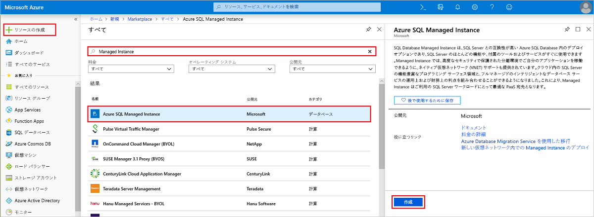
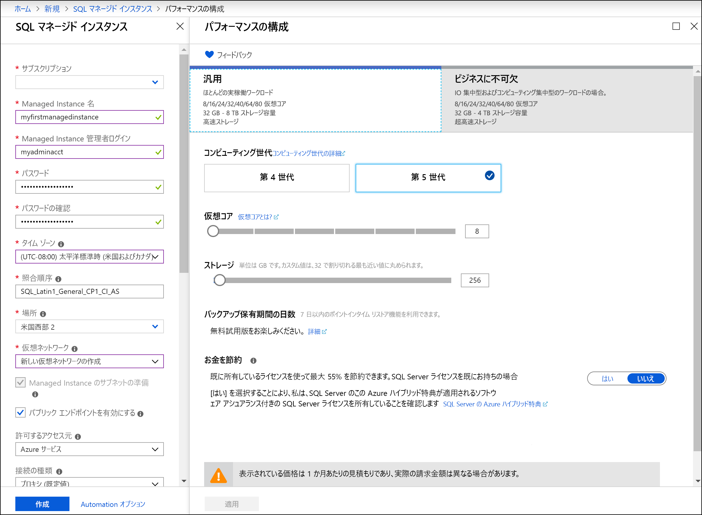
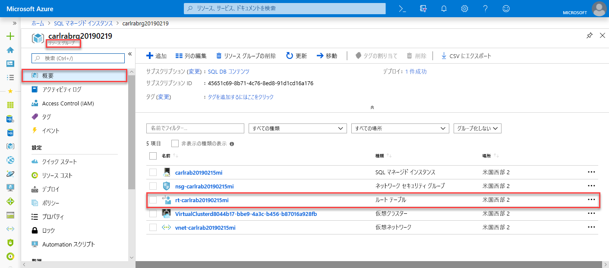
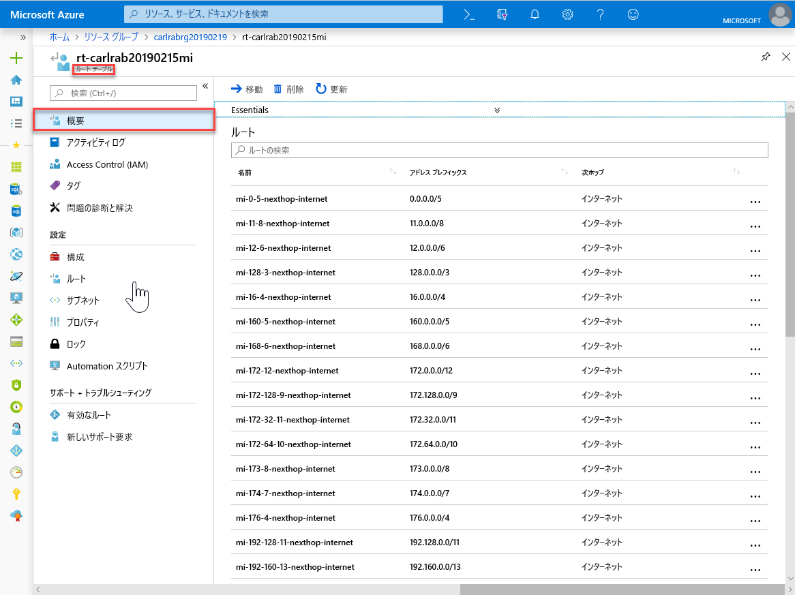
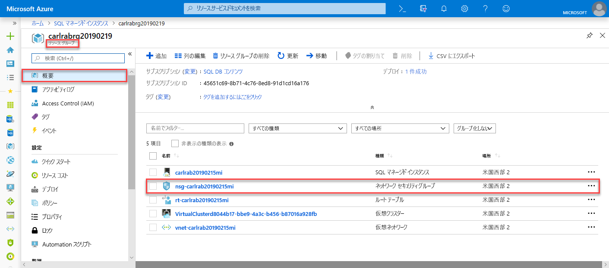
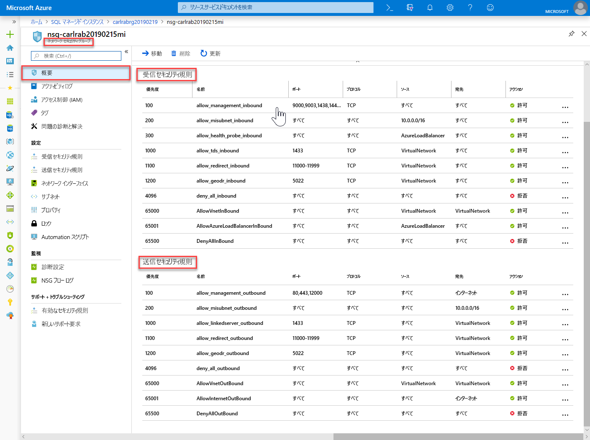
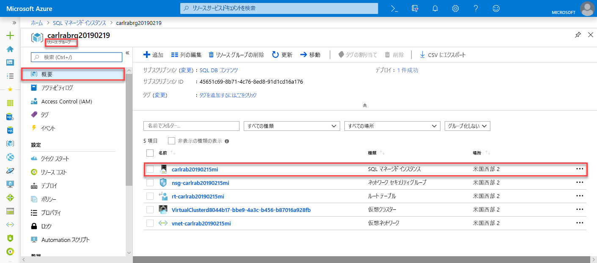

# クイック スタート:Azure SQL Database マネージド インスタンスの作成

このクイック スタートでは、Azure portal で Azure SQL Database [マネージド インスタンス](sql-database-managed-instance.md)を作成する方法について説明します。

> [!IMPORTANT]
> 制限については、[サポートされているリージョン](sql-database-managed-instance-resource-limits.md#supported-regions)と[サポートされているサブスクリプションの種類](sql-database-managed-instance-resource-limits.md#supported-subscription-types)に関するセクションを参照してください。

## Azure portal にサインインします

[Azure Portal](https://portal.azure.com/) にサインインします。

## マネージド インスタンスを作成する

次の手順に従って、マネージド インスタンスを作成します。

1. Azure portal の左上隅にある **[リソースの作成]** を選択します。
2. **[マネージド インスタンス]** を探し、**[Azure SQL Managed Instance]** を選択します。
3. **作成** を選択します。

   

4. 次の表の情報を参考にして、**SQL マネージド インスタンス** フォームに必要な情報を入力します。

   | Setting| 推奨値 | 説明 |
   | ------ | --------------- | ----------- |
   | **サブスクリプション** | 該当するサブスクリプション | 新しいリソースを作成するアクセス許可があるサブスクリプション |
   |**マネージド インスタンス名**|有効な名前|有効なサーバー名については、[名前付け規則と制限事項](https://docs.microsoft.com/azure/architecture/best-practices/naming-conventions)に関するページを参照してください。|
   |**マネージド インスタンス管理者ログイン**|任意の有効なユーザー名|有効なサーバー名については、[名前付け規則と制限事項](https://docs.microsoft.com/azure/architecture/best-practices/naming-conventions)に関するページを参照してください。 "serveradmin" は予約済みのサーバー レベルのロールであるため、使用しないでください。|
   |**パスワード**|有効なパスワード|パスワードは 16 文字以上で、[定義された複雑さの要件](../virtual-machines/windows/faq.md#what-are-the-password-requirements-when-creating-a-vm)を満たす必要があります。|
   |**タイム ゾーン**|マネージド インスタンスで監視するタイム ゾーン|詳細については、[タイム ゾーン](sql-database-managed-instance-timezone.md)に関するページを参照してください。|
   |**Collation**|マネージド インスタンスに対して使用する照合順序|SQL Server からデータベースを移行する場合は、`SELECT SERVERPROPERTY(N'Collation')` を使用してソースの照合順序を確認し、その値を使用してください。 照合順序の詳細については、[サーバーレベルの照合順序](https://docs.microsoft.com/sql/relational-databases/collations/set-or-change-the-server-collation)に関するページを参照してください。|
   |**Location**|マネージド インスタンスの作成先となる場所|リージョンについては、「[Azure リージョン](https://azure.microsoft.com/regions/)」を参照してください。|
   |**仮想ネットワーク**|**[新しい仮想ネットワークの作成]** または有効な仮想ネットワークとサブネットを選択します。| ネットワーク/サブネットが使用できない場合は、新しいマネージド インスタンスのターゲットとして選択する前に、[ネットワーク要件を満たすように変更する](sql-database-managed-instance-configure-vnet-subnet.md)必要があります。 マネージド インスタンスのネットワーク環境を構成するための要件については、[マネージド インスタンスの VNet の構成](sql-database-managed-instance-connectivity-architecture.md)に関する記事を参照してください。 |
   |**リソース グループ**|新規または既存のリソース グループ|有効なリソース グループ名については、[名前付け規則と制限](https://docs.microsoft.com/azure/architecture/best-practices/naming-conventions)に関するページを参照してください。|

   

5. マネージド インスタンスをインスタンス フェールオーバー グループのセカンダリとして使用するには、チェックアウトを選択し、DnsAzurePartner マネージド インスタンスを指定します。 この機能はプレビュー段階のため、スクリーンショットには表示されていません。
6. **[価格レベル]** を選択してコンピューティング リソースとストレージ リソースのサイズを指定し、価格レベルのオプションを確認します。 [汎用] 価格レベルでは、32 GB のメモリと 16 仮想コアが既定値となっています。
7. スライダーまたはテキスト ボックスを使用して、記憶域のサイズと仮想コアの数を指定します。
8. 完了したら **[適用]** を選択して選択内容を保存します。  
9. **[作成]** を選択してマネージド インスタンスをデプロイします。
10. **[通知]** アイコンを選択してデプロイの状態を表示します。

    

11. **[デプロイを実行しています]** を選択して [マネージド インスタンス] ウィンドウを開き、デプロイの進行状況を詳しく監視します。

> [!IMPORTANT]
> サブネット内の最初のインスタンスの場合、通常、デプロイ時間は後続のインスタンスよりもはるかに長くなります。 デプロイ操作が予想以上に長くなった場合でも、デプロイ操作を取り消さないでください。 サブネット内に 2 つ目のマネージド インスタンスを作成するときにかかる時間はわずか数分です。

## リソースの確認と完全修飾サーバー名の取得

デプロイが正常に完了した後は、作成したリソースを確認し、以降のクイック スタートで使用する完全修飾サーバー名を取得します。

1. マネージド インスタンスのリソース グループを開き、「[マネージド インスタンスを作成する](#create-a-managed-instance)」クイック スタートで作成したリソースを表示します。

   

2. ルート テーブルを選択して、作成されたユーザー定義ルート (UDR) テーブルを確認します。

   

3. ルート テーブルで、マネージド インスタンス仮想ネットワークから、またはその内部でトラフィックをルーティングするエントリを確認します。 ルート テーブルを手動で作成または構成する場合は、これらのエントリをルート テーブルに必ず作成する必要があります。

   

4. リソース グループに戻り、ネットワーク セキュリティ グループを選択して、セキュリティ規則を確認します。

   

5. 受信および送信セキュリティ規則を確認します。

   

6. リソース グループに戻り、マネージド インスタンスを選択します。

   

7. **[概要]** タブで **[ホスト]** プロパティを探し、次のクイック スタートで使用するマネージド インスタンスの完全修飾ホスト アドレスをコピーします。

   

   名前は、**your_machine_name.a1b2c3d4e5f6.database.windows.net** のようになります。

## 次の手順

- マネージド インスタンスへの接続の詳細について、以下をご覧ください。
  - アプリケーションの接続オプションの概要については、[マネージド インスタンスにアプリケーションを接続する](sql-database-managed-instance-connect-app.md)方法に関するページを参照してください。
  - Azure 仮想マシンからマネージド インスタンスに接続する方法を説明したクイック スタートが必要であれば、[Azure 仮想マシン接続の構成](sql-database-managed-instance-configure-vm.md)に関するページを参照してください。
  - ポイント対サイト接続を使用して、オンプレミスのクライアント コンピューターからマネージド インスタンスに接続する方法を示すクイック スタートについては、[ポイント対サイト接続の構成](sql-database-managed-instance-configure-p2s.md)に関する記事を参照してください。
- 既存の SQL Server データベースをオンプレミスからマネージド インスタンスに復元するには、[移行用の Azure Database Migration Service (DMS)](../dms/tutorial-sql-server-to-managed-instance.md) を使用してデータベース バックアップ ファイルから復元するか、[T-SQL RESTORE コマンド](sql-database-managed-instance-get-started-restore.md)を使用してデータベース バックアップ ファイルから復元します。
- 組み込みのトラブルシューティング インテリジェンスを使用したマネージド インスタンス データベースの高度なパフォーマンス監視については、[Azure SQL Analytics を使用した Azure SQL Database の監視](../azure-monitor/insights/azure-sql.md)に関するページを参照してください
