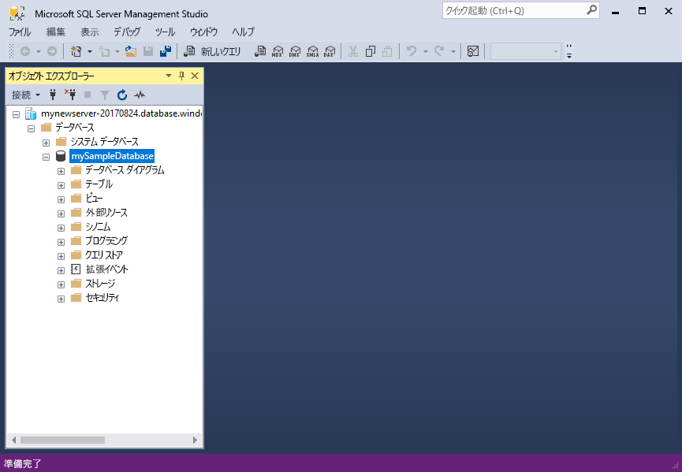

# <a name="migrate-your-sql-server-database-to-azure-sql-database"></a>SQL Server データベースを Azure SQL Database に移行する

SQL Server データベースから Azure SQL Database への移行は、Azure に空の SQL データベースを作成して、[Data Migration Assistant](https://www.microsoft.com/download/details.aspx?id=53595) (DMA) を使って Azure にデータベースをインポートする場合と同じくらい簡単です。 このチュートリアルで学習する内容は次のとおりです。

> [!div class="checklist"]
> * Azure ポータルで空の Azure SQL データベースを作成する (新規または既存の Azure SQL Database サーバーを使用)
> * Azure Portal でサーバーレベルのファイアウォールを作成する (以前に作成されていない場合)
> * [Data Migration Assistant](https://www.microsoft.com/download/details.aspx?id=53595) を使用して、空の Azure SQL データベースに SQL Server データベースをインポートする 
> * [SQL Server Management Studio](https://docs.microsoft.com/sql/ssms/download-sql-server-management-studio-ssms) (SSMS) を使用して、データベースのプロパティを変更する

Azure サブスクリプションをお持ちでない場合は、開始する前に[無料アカウントを作成](https://azure.microsoft.com/free/)してください。

## <a name="prerequisites"></a>前提条件

このチュートリアルを完了するには、次の前提条件を満たしておく必要があります。

- 最新バージョンの [SQL Server Management Studio](https://docs.microsoft.com/sql/ssms/download-sql-server-management-studio-ssms) (SSMS) がインストールされていること。  
- 最新バージョンの [Data Migration Assistant](https://www.microsoft.com/download/details.aspx?id=53595) (DMA) がインストールされていること。
- 移行するデータベースを指定してアクセスできます。 このチュートリアルでは SQL Server 2008 R2 以降のインスタンス上にある [SQL Server 2008 R2 AdventureWorks OLTP データベース](https://msftdbprodsamples.codeplex.com/releases/view/59211)を使用しますが、任意のデータベースを使用してかまいません。 互換性の問題を修正するには、[SQL Server Data Tools](https://docs.microsoft.com/sql/ssdt/download-sql-server-data-tools-ssdt) を使用してください。

## <a name="log-in-to-the-azure-portal"></a>Azure ポータルにログインする

[Azure Portal](https://portal.azure.com/) にログインします。

## <a name="create-a-blank-sql-database"></a>空の SQL データベースを作成する

Azure SQL データベースは、定義済みの一連の[コンピューティング リソースとストレージ リソース](sql-database-service-tiers.md)を使って作成されます。 データベースは、[Azure リソース グループ](../azure-resource-manager/resource-group-overview.md)内と [Azure SQL Database 論理サーバー](sql-database-features.md)内に作成されます。 

空の SQL Database を作成するには、次の手順に従います。 

1. Azure Portal の左上にある **[新規]** ボタンをクリックします。

2. **[新規]** ページから **[データベース]** を選択し、**[新規]** ページの **[SQL Database]** で **[作成]** を選択します。

   

3. 前の画像で示されているように、[SQL Database] のフォームに次の情報を入力します。   

   | 設定       | 推奨値 | Description | 
   | ------------ | ------------------ | ------------------------------------------------- | 
   | **[データベース名]** | mySampleDatabase | 有効なデータベース名については、「[Database Identifiers (データベース識別子)](https://docs.microsoft.com/sql/relational-databases/databases/database-identifiers)」を参照してください。 | 
   | **サブスクリプション** | 該当するサブスクリプション  | サブスクリプションの詳細については、[サブスクリプション](https://account.windowsazure.com/Subscriptions)に関するページを参照してください。 |
   | **[リソース グループ]** | myResourceGroup | 有効なリソース グループ名については、[名前付け規則と制限](https://docs.microsoft.com/azure/architecture/best-practices/naming-conventions)に関するページを参照してください。 |
   | **[ソースの選択]** | 空のデータベース | 空のデータベースを作成するように指定します。 |

4. **[サーバー]** をクリックして、新しいデータベース用の新しいサーバーを作成して構成します。 **[新しいサーバー]** フォームには次の情報を入力してください。 

   | Setting       | 推奨値 | Description | 
   | ------------ | ------------------ | ------------------------------------------------- | 
   | **[サーバー名]** | グローバルに一意の名前 | 有効なサーバー名については、[名前付け規則と制限](https://docs.microsoft.com/azure/architecture/best-practices/naming-conventions)に関するページを参照してください。 | 
   | **[サーバー管理者ログイン]** | 有効な名前 | 有効なログイン名については、「[Database Identifiers (データベース識別子)](https://docs.microsoft.com/sql/relational-databases/databases/database-identifiers)」を参照してください。|
   | **パスワード** | 有効なパスワード | パスワードには 8 文字以上が使用され、大文字、小文字、数字、英数字以外の文字のうち、3 つのカテゴリの文字が含まれている必要があります。 |
   | **場所** | 有効な場所 | リージョンについては、「[Azure リージョン](https://azure.microsoft.com/regions/)」を参照してください。 |

   

5. **[選択]**をクリックします。

6. **[価格レベル]** をクリックして、サービス レベル、DTU 数、ストレージの容量を指定します。 DTU 数とストレージに関して、サービス レベルごとに利用できるオプションを調べます。 

7. このチュートリアルでは、**Standard** サービス レベルを選択したうえで、スライダーを使用して **100 DTU (S3)** と **400** GB のストレージを選択します。

   

8. プレビューの使用条件に同意して、**[Add-on Storage]\(アドオン ストレージ\)** オプションを使用します。 

   > [!IMPORTANT]
   > \* 付属のストレージ容量を超えるストレージ サイズはプレビュー段階であり、追加料金が適用されます。 詳細については、「 [SQL Database の価格](https://azure.microsoft.com/pricing/details/sql-database/)」をご覧ください。 
   >
   >\* 現在、Premium レベルでは、米国東部 2、米国西部、米国政府バージニア、西ヨーロッパ、ドイツ中部、東南アジア、東日本、オーストラリア東部、カナダ中部、およびカナダ東部の各リージョンにおいて、1 TB を超えるストレージが利用できます。 [P11 ～ P15 の現時点での制限](sql-database-resource-limits.md#single-database-limitations-of-p11-and-p15-when-the-maximum-size-greater-than-1-tb)に関するページを参照してください。  
   > 

9. サーバーのレベル、DTU 数、ストレージの容量を選択したら、**[適用]** をクリックします。  

10. 空のデータベースの**照合順序**を選択します (このチュートリアルでは既定値を使用)。 照合順序の詳細については、「[Collations (照合順序)](https://docs.microsoft.com/sql/t-sql/statements/collations)」を参照してください。

11. これで SQL Database フォームの入力が完了したので、**[作成]** をクリックして、データベースをプロビジョニングします。 プロビジョニングには数分かかります。 

12. ツール バーの **[通知]** をクリックして、デプロイ プロセスを監視します。
    
     

## <a name="create-a-server-level-firewall-rule"></a>サーバーレベルのファイアウォール規則を作成する

SQL Database サービスは、外部のアプリケーションやツールに、サーバーまたはサーバー上のすべてのデータベースへの接続を禁止するファイアウォールをサーバーレベルで作成します。それらに接続するためには、特定の IP アドレスに対してファイアウォールを開放するファイアウォール規則が作成されている必要があります。 以下の手順に従い、クライアントの IP アドレスに対して [SQL Database サーバーレベルのファイアウォール規則](sql-database-firewall-configure.md)を作成し、その IP アドレスのみに SQL Database ファイアウォールを介して外部接続できるようにします。 

> [!NOTE]
> SQL Database の通信は、ポート 1433 上で行われます。 企業ネットワーク内から接続しようとしても、ポート 1433 での送信トラフィックがネットワークのファイアウォールで禁止されている場合があります。 その場合、会社の IT 部門によってポート 1433 が開放されない限り、Azure SQL Database サーバーに接続することはできません。
>

1. デプロイが完了したら、左側のメニューから **[SQL データベース]** をクリックし、**SQL データベース** ページで、**mySampleDatabase** をクリックします。 このデータベースの概要ページが開くと、完全修飾サーバー名 (**mynewserver-20170824.database.windows.net** など) や追加の構成オプションが表示されます。 

2. この完全修飾サーバー名をコピーします。以降のクイック スタートでサーバーとそのデータベースに接続する際に必要となります。 

    

3. ツール バーで **[Set server firewall]\(サーバー ファイアウォールの設定\)** をクリックします。 SQL Database サーバーの **[ファイアウォール設定]** ページが開きます。 

    

4. ツール バーの **[クライアント IP の追加]** をクリックし、現在の IP アドレスをファイアウォール規則に追加します。 ファイアウォール規則は、単一の IP アドレスまたは IP アドレスの範囲に対して、ポート 1433 を開くことができます。

5. [ **Save**] をクリックします。 論理サーバーでポート 1433 を開いている現在の IP アドレスに対して、サーバーレベルのファイアウォール規則が作成されます。

6. **[OK]** をクリックし、**[ファイアウォール設定]** ページを閉じます。

これで、SQL Server Management Studio、Data Migration Assistant、およびその他のツールを使用して、SQL Database サーバーとそのデータベースに、前の手順で作成したサーバー管理者アカウントでこの IP アドレスから接続できるようになりました。

> [!IMPORTANT]
> 既定では、すべての Azure サービスで、SQL Database ファイアウォール経由のアクセスが有効になります。 すべての Azure サービスに対して無効にするには、このページの **[オフ]** をクリックします。

## <a name="sql-server-connection-information"></a>SQL Server の接続情報

Azure Portal で、Azure SQL Database サーバーの完全修飾サーバー名を取得します。 Data Migration Assistance および SQL Server Management Studio などのクライアント ツールを使って、完全修飾サーバー名を使用してお使いの Azure SQL サーバーへ接続します。

1. [Azure Portal](https://portal.azure.com/) にログインします。
2. 左側のメニューから **[SQL データベース]** を選択し、**[SQL データベース]** ページで目的のデータベースをクリックします。 
3. そのデータベースの Azure Portal ページの **[要点]** ウィンドウで、**サーバー名**を見つけてコピーします。

   

## <a name="migrate-your-database"></a>データの移行

**[Data Migration Assistant](https://www.microsoft.com/download/details.aspx?id=53595)** を使用して、Azure SQL Database に移行するデータベースの準備状態を評価するため、また、移行を完了するために、以下の手順に従います。

1. **Data Migration Assistant** を開きます。 移行を計画しているデータベースがある SQL Server インスタンスに接続でき、かつ、インターネットに接続できれば、どのコンピューターで DMA を実行してもかまいません。 移行する SQL Server インスタンスをホストしているコンピューターに DMA をインストールする必要はありません。 Data Migration Assistant を実行しているコンピューターが、前の手順で作成したファイアウォール規則の対象になっている必要があります。

     

2. 左側のメニューで **[+ New]** (新規) をクリックし、**[Assessment]** (評価) を選択して、評価プロジェクトを作成します。 要求された値を入力し、**[作成]** をクリックします。

   | 設定      | 推奨値 | Description | 
   | ------------ | ------------------ | ------------------------------------------------- | 
   | プロジェクトの種類 | 移行 | 移行するデータベースを評価するか、または、同じワークフローの一部として移行を評価するかを選択します。 |
   |プロジェクト名|移行のチュートリアル| わかりやすい名前 |
   |ソース サーバー名| SQL Server | 現在サポートされている唯一のソースです。 |
   |ターゲット サーバー名| Azure SQL Database| 含まれるオプション: Azure SQL データベース、SQL Server、Azure の仮想マシン上の SQL Server |
   |移行スコープ| スキーマとデータ| 含まれるオプション: スキーマとデータ、スキーマのみ、データのみ |
   
   

3.  **[ソースの選択]** ページで、要求された値を入力して、**[接続]** をクリックします。

    | 設定      | 推奨値 | Description | 
    | ------------ | ------------------ | ------------------------------------------------- | 
    | サーバー名 | サーバー名または IP アドレス | サーバー名または IP アドレス |
    | 認証の種類 | 推奨される認証の種類| オプション: Windows 認証、SQL Server 認証、Active Directory 統合認証、Active Directory パスワード認証 |
    | ユーザー名 | お使いのログイン名 | ログインには、**CONTROL SERVER** 権限が必要です。 |
    | パスワード| お使いのパスワード | お使いのパスワード |
    | 接続のプロパティ| 環境に適するように **[暗号化接続]** および **[サーバー証明書を信頼する]** の値を選択します。 | サーバーへの接続に適したプロパティを選択します。 |

    

5. Azure SQL Database に移行する単一のデータベースをソース サーバーから選択し、**[次へ]** をクリックします。 このチュートリアルでは、1 つのデータベースしかありません。

6. **[ターゲットの選択]** ページで、要求された値を入力して、**[接続]** をクリックします。

    | 設定      | 推奨値 | Description | 
    | ------------ | ------------------ | ------------------------------------------------- | 
    | サーバー名 | 完全修飾 Azure データベース サーバー名を取得します。 | 前の手順の完全修飾 Azure データベース サーバー名 |
    | 認証の種類 | パブリック | このチュートリアルでは SQL Server 認証が唯一のオプションですが、Azure SQL Database では Active Directory 統合認証および Active Directory パスワード認証もサポートされています。 |
    | ユーザー名 | お使いのログイン名 | ログインには、ソース データベースに対する **CONTROL DATABASE** 権限が必要です。 |
    | パスワード| お使いのパスワード | お使いのパスワード |
    | 接続のプロパティ| 環境に適するように **[暗号化接続]** および **[サーバー証明書を信頼する]** の値を選択します。 | サーバーへの接続に適したプロパティを選択します。 |

    

7. 前の手順で作成したターゲット サーバーからデータベースを選択し、**[次へ]** をクリックして、ソース データベース スキーマ評価プロセスを開始します。 このチュートリアルでは、1 つのデータベースしかありません。 このデータベースの互換性レベルが 140 に設定されていることに注意してください。これは、Azure SQL Database 内のすべての新しいデータベースに対する既定の互換性レベルです。

   > [!IMPORTANT] 
   > Azure SQL Database にデータベースを移行した後は、下位互換性を目的として、指定した互換性レベルでデータベースを操作することを選択できます。 データベースを指定の互換性レベルで運用する影響とオプションについて詳しくは、[ALTER DATABASE の互換性レベル](https://docs.microsoft.com/sql/t-sql/statements/alter-database-transact-sql-compatibility-level)に関する記事をご覧ください。 また、互換性レベルに関連する追加のデータベースレベルの設定について詳しくは、[ALTER DATABASE SCOPED CONFIGURATION](https://docs.microsoft.com/sql/t-sql/statements/alter-database-scoped-configuration-transact-sql) に関する記事をご覧ください。
   >

8. ソース データベースのスキーマ評価プロセスが完了した後、**[オブジェクトの選択]** ページで移行のために選択したオブジェクトを確認し、問題を含むオブジェクトを調べます。 たとえば、**SERVERPROPERTY('LCID')** の **dbo.uspSearchCandidateResumes** オブジェクトの動作変更とフルテキスト検索の **HumanResourcesJobCandidate** オブジェクトの変更を調べます。 

   > [!IMPORTANT] 
   > データベースの設計やお使いのアプリケーションの設計によっては、ソース データベースを移行するときに、移行後 (場合によっては、移行前) のデータベースまたはアプリケーションの一方または両方を変更する必要が生じます。 移行に影響を及ぼす可能性がある Transact-SQL の相違点については、「[Resolving Transact-SQL differences during migration to SQL Database (SQL データベースへの移行時に Transact-SQL の相違点を解決する)](sql-database-transact-sql-information.md)」をご覧ください。

     

9. **[SQL スクリプトの生成]** をクリックして、ソース データベースのスキーマ オブジェクトをスクリプト化します。 
10. 生成されたスクリプトを確認し、**[Next issue\(次の問題)\]**をクリックし、必要に応じて、特定された評価の問題と推奨事項を確認します。 たとえば、フルテキスト検索の場合、アップグレード時の推奨事項は、フルテキストの機能を利用しているアプリケーションをテストすることです。 必要に応じて、スクリプトを保存またはコピーできます。

     

11. **[Deploy schema\(スキーマの配置\)]** をクリックして、スキーマ移行プロセスを確認します。

     

12. スキーマの移行が完了したら、エラーの結果を調べ、問題ないことがわかったら、**[データの移行]** をクリックします。
13. **[テーブルの選択]** ページで、移行のために選択したテーブルを確認してから、**[Start data migration\(データ移行の開始\)]** をクリックします。

     

14. 移行プロセスを確認します。

     

## <a name="connect-to-the-database-with-ssms"></a>SSMS を使用してデータベースに接続する

[SQL Server Management Studio](https://docs.microsoft.com/sql/ssms/sql-server-management-studio-ssms) を使用して、Azure SQL Database サーバーに対する接続を確立します。

1. SQL Server Management Studio を開きます。

2. **[サーバーへの接続]** ダイアログ ボックスで、次の情報を入力します。

   | 設定       | 推奨値 | Description | 
   | ------------ | ------------------ | ------------------------------------------------- | 
   | サーバーの種類 | データベース エンジン | この値は必須です |
   | サーバー名 | 完全修飾サーバー名 | 名前は **mynewserver20170824.database.windows.net** のような形式で指定する必要があります。 |
   | 認証 | パブリック | このチュートリアルで構成した認証の種類は "SQL 認証" のみです。 |
   | ログイン | サーバー管理者アカウント | これは、サーバーの作成時に指定したアカウントです。 |
   | パスワード | サーバー管理者アカウントのパスワード | これは、サーバーの作成時に指定したパスワードです。 |

   ![[サーバーへの接続]](./media/sql-database-connect-query-ssms/connect.png)

3. **[サーバーへの接続]** ダイアログ ボックスの **[オプション]** をクリックします。 **[データベースへの接続]** セクションに「**mySampleDatabase**」と入力して、このデータベースに接続します。

     

4. **[接続]**をクリックします。 SSMS でオブジェクト エクスプローラー ウィンドウが開きます。 

5. オブジェクト エクスプローラーで、**Databases** フォルダー、**mySampleDatabase** フォルダーの順に展開して、サンプル データベース内のオブジェクトを表示します。

     

## <a name="change-database-properties"></a>データベースのプロパティを変更する

SQL Server Management Studio を使用して、サービス レベル、パフォーマンス レベル、互換性レベルを変更できます。 インポート フェーズ中には、パフォーマンスを最大化するために、パフォーマンス レベルがより高いデータベースへインポートすることをお勧めしますが、インポートの完了後は、インポートされたデータベースを積極的に使用する準備が整うまで、スケールダウンして費用を節約することをお勧めします。 互換性レベルを変更すると、パフォーマンスが向上し、Azure SQL Database サービスの最新機能を使用できるようになります。 古いデータベースを移行する場合、データベースの互換性レベルは、インポートされるデータベースと互換性のある最低サポート レベルで維持されます。 詳細については、「[Azure SQL Database の互換性レベル 130 によるクエリ パフォーマンスの向上](sql-database-compatibility-level-query-performance-130.md)」を参照してください。

1. オブジェクト エクスプローラーで **mySampleDatabase** を右クリックしてから、**[新しいクエリ]** をクリックします。 データベースに接続されたクエリ ウィンドウが開きます。

2. 次のコマンドを実行して、サービス レベルを **Standard**、パフォーマンス レベルを **S1** に設定します。

    ```sql
    ALTER DATABASE mySampleDatabase 
    MODIFY 
        (
        EDITION = 'Standard'
        , MAXSIZE = 250 GB
        , SERVICE_OBJECTIVE = 'S1'
    );
    ```

## <a name="next-steps"></a>次のステップ 
このチュートリアルで学習した内容は次のとおりです。

> * Azure Portal で空の Azure SQL データベースを作成する 
> * Azure Portal でサーバーレベルのファイアウォールを作成する 
> * [Data Migration Assistant](https://www.microsoft.com/download/details.aspx?id=53595) を使用して、空の Azure SQL データベースに SQL Server データベースをインポートする 
> * [SQL Server Management Studio](https://docs.microsoft.com/sql/ssms/download-sql-server-management-studio-ssms) (SSMS) を使用して、データベースのプロパティを変更する

次のチュートリアルに進み、データベースをセキュリティで保護する方法を学習してください。

> [!div class="nextstepaction"]
> [Azure SQL データベースのセキュリティ保護](sql-database-security-tutorial.md)


