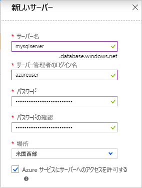
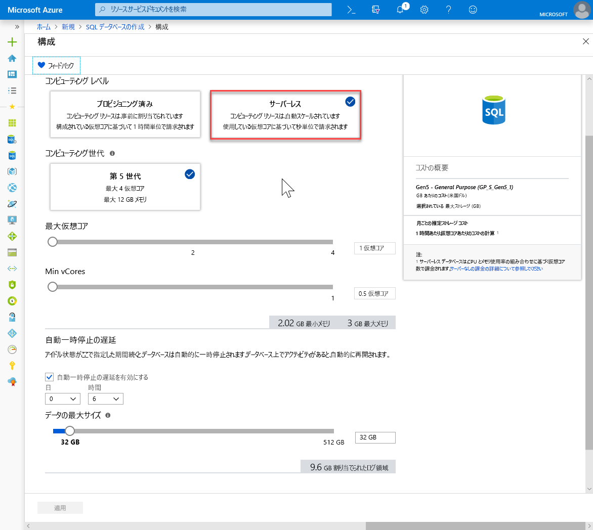
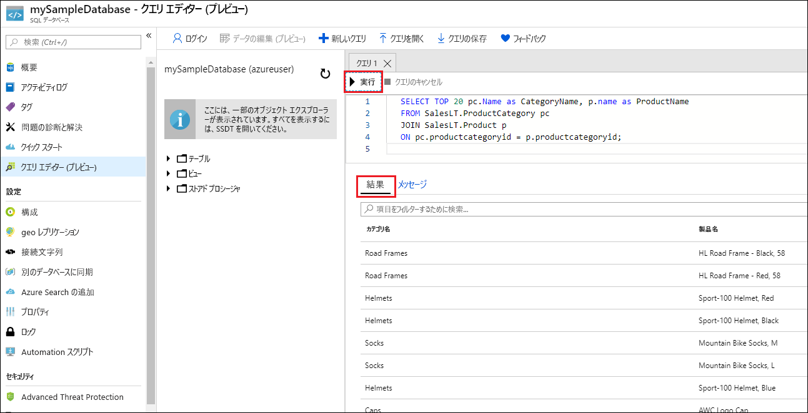

# <a name="quickstart-create-a-single-database-in-azure-sql-database-using-the-azure-portal"></a>クイック スタート:Azure portal を使用して Azure SQL Database で単一データベースを作成する

[単一データベース](sql-database-single-database.md)の作成は、Azure SQL Database でデータベースを作成する場合の最も迅速かつ簡単なデプロイ オプションです。 このクイック スタートでは、Azure portal を使用して単一データベースを作成した後、クエリを実行する方法について説明します。

Azure サブスクリプションをお持ちでない場合は、[無料アカウントを作成](https://azure.microsoft.com/free/)してください。

このクイック スタートのすべての手順では、[Azure portal](https://portal.azure.com/) にサインインします。

## <a name="create-a-single-database"></a>単一データベースを作成する

単一データベースは、プロビジョニング済みコンピューティング レベルでも、サーバーレス コンピューティング レベル (プレビュー) でも作成できます。

- プロビジョニング済みコンピューティング レベルの単一データベースには、定義された量の事前割り当てコンピューティング リソースと、2 つの[購入モデル](sql-database-purchase-models.md)のうちの 1 つを使用した一連のメモリおよびストレージ リソースがあります。
- サーバーレス コンピューティング レベルの単一データベースには、自動スケーリングされる一定範囲のコンピューティング リソースと、コアあたりで指定された量のメモリ、および指定された量のストレージ リソースがあり、[仮想コアベースの購入モデル](sql-database-service-tiers-vcore.md)だけで使用できます。

単一データベースを作成するときは、それを管理するための [SQL Database サーバー](sql-database-servers.md)も定義し、指定したリージョンの [Azure リソース グループ](../azure-resource-manager/resource-group-overview.md)内にそれを配置します。

> [!NOTE]
> このクイックスタートでは、[仮想コアベースの購入モデル](sql-database-service-tiers-vcore.md)と[サーバーレス](sql-database-serverless.md) コンピューティング レベルを使用しますが、[DTU ベースの購入モデル](sql-database-service-tiers-DTU.md)も利用できます。

Adventure Works LT サンプル データを含む単一データベースを作成するには:

1. Azure Portal の左上隅にある **[リソースの作成]** を選択します。
2. **[データベース]** を選択してから、 **[SQL Database]** を選択し、 **[SQL データベースの作成]** ページを開きます。

   

3. **[基本]** タブの **[プロジェクトの詳細]** セクションで、次の値を入力または選択します。

   - **サブスクリプション**:表示されていない場合は、ドロップ ダウンして適切なサブスクリプションを選択します。
   - **[リソース グループ]** : **[新規作成]** を選択し、「`myResourceGroup`」と入力して、 **[OK]** を選択します。

     

4. **[データベースの詳細]** セクションで、次の値を入力または選択します。

   - **データベース名**: 「 `mySampleDatabase` 」を入力します。
   - **サーバー**: **[新規作成]** を選択して次の値を入力し、 **[選択]** を選択します。
       - **サーバー名**: 一意性を確保するためにいくつかの数字とともに「`mysqlserver`」と入力します。
       - **サーバー管理者ログイン**:「 `azureuser`」と入力します。
       - **Password**:パスワードの要件を満たす複雑なパスワードを入力します。
       - **[場所]** :ドロップダウンから場所 (`West US 2` など) を選択します。

         

      > [!IMPORTANT]
      > 忘れずにサーバー管理者のログインとパスワードを記録して、このクイック スタートと他のクイック スタートのためにサーバーとデータベースにログインできるようにします。 ログインまたはパスワードを忘れた場合は、 **[SQL サーバー]** ページでログイン名を取得するかパスワードをリセットします。 **[SQL サーバー]** ページを開くには、データベースの作成後にデータベースの **[概要]** ページでサーバー名を選択します。

        

   - **[SQL エラスティック プールを使用しますか?]** : **[いいえ]** オプションを選択します。
   - **[コンピューティングとストレージ]** : **[データベースの構成]** を選択し、このクイックスタートでは **[仮想コアベースの購入オプション]** を選択します。

     

   - **[サーバーレス]** を選択します。

     

   - **[最大 vCores]** 、 **[最小 vCores]** 、 **[自動一時停止の遅延]** 、および **[データの最大サイズ]** の設定を確認します。 必要に応じて、これらを変更します。
   - プレビューの使用条件に同意し、 **[OK]** をクリックします。
   - **[適用]** を選択します。

5. **[追加設定]** タブを選択します。 
6. **[データ ソース]** セクションの **[既存のデータを使用します]** で、`Sample` を選択します。 

   

   > [!IMPORTANT]
   > このクイック スタートとこのデータを使用する他の Azure SQL Database クイック スタートを簡単に実行できるように、必ず **Sample (AdventureWorksLT)** を選択します。

7. 残りの値は既定値のままにして、フォームの下部にある **[確認および作成]** を選択します。
8. 最終設定を確認し、 **[作成]** を選択します。

9. **[SQL Database]** フォームで **[作成]** を選択して、リソース グループ、サーバー、データベースをデプロイし、プロビジョニングします。

## <a name="query-the-database"></a>データベースのクエリを実行する

データベースを作成したので、Azure portal に組み込まれているクエリ ツールを使用して、データベースへの接続とデータへのクエリを実行します。

1. データベースの **[SQL Database]** ページで、左側のメニューの **[クエリ エディター (プレビュー)]** を選択します。

   

2. ログイン情報を入力し、 **[OK]** を選択します。
3. **[クエリ エディター]** ウィンドウに次のクエリを入力します。

   ```sql
   SELECT TOP 20 pc.Name as CategoryName, p.name as ProductName
   FROM SalesLT.ProductCategory pc
   JOIN SalesLT.Product p
   ON pc.productcategoryid = p.productcategoryid;
   ```

4. **[実行]** を選択し、 **[結果]** ウィンドウでクエリの結果を確認します。

   

5. **[クエリ エディター]** ページを閉じ、未保存の編集を破棄するかどうかを確認するプロンプトが表示されたら **[OK]** をクリックします。

## <a name="clean-up-resources"></a>リソースのクリーンアップ

「[次の手順](#next-steps)」に進む場合は、このリソース グループ、データベース サーバー、単一データベースをそのままにしてください。 次のステップでは、データベースに接続してクエリを実行するさまざまな方法を紹介しています。

これらのリソースの使用が終了したら、次のように削除できます。

1. Azure portal の左側のメニューで、 **[リソース グループ]** 、 **[myResourceGroup]** の順に選択します。
2. リソース グループ ページで **[リソース グループの削除]** を選択します。
3. フィールドに「*myResourceGroup*」と入力してから、 **[削除]** を選択します。

## <a name="next-steps"></a>次の手順

- オンプレミスまたはリモート ツールから単一データベースに接続するために、サーバー レベルのファイアウォール規則を作成します。 詳細については、「[サーバーレベルのファイアウォール規則を作成する](sql-database-server-level-firewall-rule.md)」を参照してください。
- サーバーレベルのファイアウォール規則を作成した後に、いくつかの異なるツールと言語を使用して、データベースに[接続し、クエリを実行](sql-database-connect-query.md)します。
  - [SQL Server Management Studio を使用して接続およびクエリを実行する](sql-database-connect-query-ssms.md)
  - [Azure Data Studio を使用して接続およびクエリを実行する](https://docs.microsoft.com/sql/azure-data-studio/quickstart-sql-database?toc=/azure/sql-database/toc.json)
- Azure CLI を使用して、プロビジョニング済みコンピューティング レベルで単一データベースを作成するには、[Azure CLI のサンプル](sql-database-cli-samples.md)に関するページを参照してください。
- Azure PowerShell を使用して、プロビジョニング済みコンピューティング レベルで単一データベースを作成するには、[Azure PowerShell のサンプル](sql-database-powershell-samples.md)に関するページを参照してください。
- Azure PowerShell を使用して、サーバーレス コンピューティング レベルで単一データベースを作成するには、[PowerShell を使用したサーバーレス データベースの作成](sql-database-serverless.md#create-new-serverless-database-using-powershell)に関するページを参照してください。
