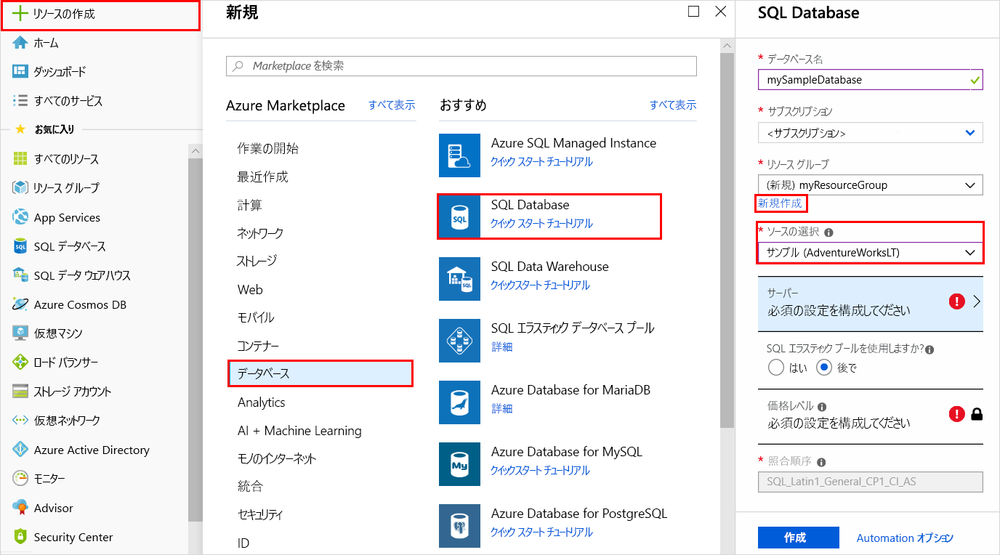

# Azure SQL Database での SQL Database サーバーと単一データベースの作成と管理

SQL Database サーバーと単一データベースを作成および管理するには、Azure portal、PowerShell、Azure CLI、REST API、および Transact-SQL を使用します。

## Azure portal:SQL Database サーバーと単一データベースの管理

サーバー自体を作成する前に、あるいは作成するときに Azure SQL データベースのリソース グループを作成できます。 新しい SQL サーバーのフォームは新しい SQL サーバーか新しいデータベースを作成するときに表示されます。

### 空の SQL Database サーバーを作成する

[Azure portal](https://portal.azure.com) を利用して SQL Database サーバーを作成するには、空の SQL サーバー (論理サーバー) のフォームに移動します。  

### 空またはサンプルの SQL の単一データベースを作成する

[Azure portal](https://portal.azure.com) を利用して単一の Azure SQL データベースを作成するには、空の SQL Database のフォームに移動し、要求された情報を指定します。 Azure SQL データベースのリソース グループや SQL Database サーバーは、単一データベース自体を作成する前に、あるいは作成するときに作成できます。 Adventure Works LT に基づいて空のデータベースやサンプル データベースを作成できます。

  

> [!IMPORTANT]
> データベースの価格レベルを選択する方法については、[DTU ベースの購入モデル](sql-database-service-tiers-dtu.md)および[仮想コアベースの購入モデル ](sql-database-service-tiers-vcore.md)に関するページを参照してください。

Azure SQL Database マネージド インスタンスを作成する方法については、[マネージド インスタンスを作成する](sql-database-managed-instance-get-started.md)を参照してください。

## 既存の SQL Database サーバーを管理する

既存の SQL Database サーバーを管理するときにサーバーに移動するには、特定の SQL データベース ページ、**SQL サーバー** ページ、**すべてのリソース** ページから移動するなど、さまざまな方法があります。

既存のデータベースを管理するには、**SQL データベース** ページに移動し、管理するデータベースをクリックします。 次のスクリーンショットでは、データベースの**概要**ページからデータベースにサーバーレベルのファイアウォールを設定する方法を確認できます。

   

> [!IMPORTANT]
> データベースのパフォーマンス プロパティを構成するには、[DTU ベースの購入モデル](sql-database-service-tiers-dtu.md)および[仮想コアベースの購入モデル](sql-database-service-tiers-vcore.md)に関するページを参照してください。
> [!TIP]
> Azure ポータル クイックスタートについては、「[Azure ポータルで Azure SQL データベースを作成する](sql-database-single-database-get-started.md)」を参照してください。

## PowerShell:SQL Database サーバーと単一データベースの管理

[!INCLUDE [updated-for-az](../../includes/updated-for-az.md)]
> [!IMPORTANT]
> PowerShell Azure Resource Manager モジュールは Azure SQL Database で引き続きサポートされますが、今後の開発はすべて Az.Sql モジュールを対象に行われます。 これらのコマンドレットについては、「[AzureRM.Sql](https://docs.microsoft.com/powershell/module/AzureRM.Sql/)」を参照してください。 Az モジュールと AzureRm モジュールのコマンドの引数は実質的に同じです。

Azure PowerShell を利用して、Azure SQL Database サーバー、単一のプールされたデータベース、SQL Database サーバーのファイアウォールを作成し、管理するには、次の PowerShell コマンドレットを使用します。 PowerShell をインストールまたはアップグレードする必要がある場合は、[Azure PowerShell モジュールのインストール](/powershell/azure/install-az-ps)に関するページを参照してください。

> [!TIP]
> PowerShell のスクリプトの例については、[PowerShell を使用した Azure SQL の単一データベースの作成と、SQL Database サーバーのファイアウォール規則の構成](scripts/sql-database-create-and-configure-database-powershell.md)および [PowerShell を使用した単一の SQL データベースの監視およびスケーリング](scripts/sql-database-monitor-and-scale-database-powershell.md)に関するページを参照してください。

| コマンドレット | 説明 |
| --- | --- |
|[New-AzSqlDatabase](/powershell/module/az.sql/new-azsqldatabase)|データベースを作成します。 |
|[Get-AzSqlDatabase](/powershell/module/az.sql/get-azsqldatabase)|1 つまたは複数のデータベースを取得します。|
|[Set-AzSqlDatabase](/powershell/module/az.sql/set-azsqldatabase)|データベースのプロパティを設定するか、既存のデータベースをエラスティック プールに移動します。|
|[Remove-AzSqlDatabase](/powershell/module/az.sql/remove-azsqldatabase)|データベースを削除します。|
|[New-AzResourceGroup](/powershell/module/az.resources/new-azresourcegroup)|リソース グループを作成します。|
|[New-AzSqlServer](/powershell/module/az.sql/new-azsqlserver)|サーバーを作成します。|
|[Get-AzSqlServer](/powershell/module/az.sql/get-azsqlserver)|サーバーに関する情報を返します。|
|[Set-AzSqlServer](https://docs.microsoft.com/powershell/module/az.sql/set-azsqlserver)|サーバーのプロパティを変更します。|
|[Remove-AzSqlServer](/powershell/module/az.sql/remove-azsqlserver)|サーバーを削除します。|
|[New-AzSqlServerFirewallRule](/powershell/module/az.sql/new-azsqlserverfirewallrule)|サーバーレベルのファイアウォール規則を作成します。 |
|[Get-AzSqlServerFirewallRule](/powershell/module/az.sql/get-azsqlserverfirewallrule)|サーバーのファイアウォール規則を取得します。|
|[Set-AzSqlServerFirewallRule](/powershell/module/az.sql/set-azsqlserverfirewallrule)|サーバーのファイアウォール規則を変更します。|
|[Remove-AzSqlServerFirewallRule](/powershell/module/az.sql/remove-azsqlserverfirewallrule)|サーバーからファイアウォール規則を削除します。|
| New-AzSqlServerVirtualNetworkRule | 仮想ネットワーク サービス エンドポイントであるサブネットに基づいて、[*仮想ネットワーク規則*](sql-database-vnet-service-endpoint-rule-overview.md)を作成します。 |

## Azure CLI:SQL Database サーバーと単一データベースの管理

[Azure CLI](/cli/azure) を利用して Azure SQL のサーバー、データベース、ファイアウォールを作成し、管理するには、次の [Azure CLI SQL Database](/cli/azure/sql/db) コマンドを使用します。 [Cloud Shell](/azure/cloud-shell/overview) を使用して CLI をブラウザーで実行することも、macOS、Linux、または Windows に[インストール](/cli/azure/install-azure-cli)することもできます。 エラスティック プールの作成と管理については、[エラスティック プール](sql-database-elastic-pool.md)に関する記事をご覧ください。

> [!TIP]
> Azure CLI クイックスタートについては、[Azure CLI を使用した単一の Azure SQL データベースの作成](sql-database-cli-samples.md)に関するページを参照してください。 Azure CLI のスクリプトの例については、[CLI を使用した単一の Azure SQL データベースの作成と、SQL Database サーバーのファイアウォール規則の構成](scripts/sql-database-create-and-configure-database-cli.md)および [CLI を使用した単一の Azure SQL データベースの監視およびスケーリング](scripts/sql-database-monitor-and-scale-database-cli.md)に関するページを参照してください。
>

| コマンドレット | 説明 |
| --- | --- |
|[az sql db create](/cli/azure/sql/db#az-sql-db-create) |データベースを作成します。|
|[az sql db list](/cli/azure/sql/db#az-sql-db-list)|サーバー内のすべてのデータベースとデータ ウェアハウス、またはエラスティック プール内のすべてのデータベースを一覧表示します。|
|[az sql db list-editions](/cli/azure/sql/db#az-sql-db-list-editions)|利用可能なサービス目標と容量の上限を一覧表示します。|
|[az sql db list-usages](/cli/azure/sql/db#az-sql-db-list-usages)|データベースの使用状況を返します。|
|[az sql db show](/cli/azure/sql/db#az-sql-db-show)|データベースまたはデータ ウェアハウスを取得します。|
|[az sql db update](/cli/azure/sql/db#az-sql-db-update)|データベースを更新します。|
|[az sql db delete](/cli/azure/sql/db#az-sql-db-delete)|データベースを削除します。|
|[az group create](/cli/azure/group#az-group-create)|リソース グループを作成します。|
|[az sql server create](/cli/azure/sql/server#az-sql-server-create)|サーバーを作成します。|
|[az sql server list](/cli/azure/sql/server#az-sql-server-list)|サーバーを一覧表示します。|
|[az sql server list-usages](/cli/azure/sql/server#az-sql-server-list-usages)|サーバーの使用状況を返します。|
|[az sql server show](/cli/azure/sql/server#az-sql-server-show)|サーバーを取得します。|
|[az sql server update](/cli/azure/sql/server#az-sql-server-update)|サーバーを更新します。|
|[az sql server delete](/cli/azure/sql/server#az-sql-server-delete)|サーバーを削除します。|
|[az sql server firewall-rule create](/cli/azure/sql/server/firewall-rule#az-sql-server-firewall-rule-create)|サーバーのファイアウォール規則を作成します。|
|[az sql server firewall-rule list](/cli/azure/sql/server/firewall-rule#az-sql-server-firewall-rule-list)|サーバーのファイアウォール規則を一覧表示します。|
|[az sql server firewall-rule show](/cli/azure/sql/server/firewall-rule#az-sql-server-firewall-rule-show)|ファイアウォール規則の詳細を表示します。|
|[az sql server firewall-rule update](/cli/azure/sql/server/firewall-rule##az-sql-server-firewall-rule-update)|ファイアウォール規則を更新します。|
|[az sql server firewall-rule delete](/cli/azure/sql/server/firewall-rule#az-sql-server-firewall-rule-delete)|ファイアウォール規則を削除します。|

## Transact-SQL:SQL Database サーバーと単一データベースの管理

Transact-SQL を利用して Azure SQL のサーバー、データベース、ファイアウォールを作成し、管理するには、次の T-SQL コマンドレットを使用します。 これらのコマンドは、Azure Portal、[SQL Server Management Studio](/sql/ssms/use-sql-server-management-studio)、[Visual Studio Code](https://code.visualstudio.com/docs)、または Azure SQL Database サーバーに接続して Transact-SQL コマンドを渡すことができるその他のプログラムを使用して実行できます。 エラスティック プールの管理については、[エラスティック プール](sql-database-elastic-pool.md)に関する記事をご覧ください。

> [!TIP]
> Microsoft Windows で SQL Server Management Studio を使用する方法に関するクイックスタートについては、[Azure SQL Database でSQL Server Management Studio を使ってデータに接続してクエリを行う方法](sql-database-connect-query-ssms.md)に関する記事をご覧ください。 macOS、Linux、Windows で Visual Studio Code を使用する方法に関するクイックスタートについては、[Azure SQL Database でVisual Studio Code を使ってデータに接続してクエリを行う方法](sql-database-connect-query-vscode.md)に関する記事をご覧ください。
> [!IMPORTANT]
> Transact-SQL を利用してサーバーを作成または削除することはできません。

| command | 説明 |
| --- | --- |
|[CREATE DATABASE](https://docs.microsoft.com/sql/t-sql/statements/create-database-transact-sql?view=azuresqldb-current)|新しい単一データベースを作成します。 新しいデータベースを作成するには、マスター データベースに接続する必要があります。|
| [ALTER DATABASE (Azure SQL Database)](https://docs.microsoft.com/sql/t-sql/statements/alter-database-transact-sql?view=azuresqldb-current) |Azure SQL データベースを変更します。 |
|[DROP DATABASE (Transact-SQL)](/sql/t-sql/statements/drop-database-transact-sql)|データベースを削除します。|
|[sys.database_service_objectives (Azure SQL Database)](/sql/relational-databases/system-catalog-views/sys-database-service-objectives-azure-sql-database)|Azure SQL データベースまたは Azure SQL Data Warehouse のエディション (サービス レベル)、サービス目標 (価格レベル)、およびエラスティック プール名 (存在する場合) を返します。 Azure SQL Database サーバーの master データベースにログオンしている場合は、すべてのデータベースの情報が返されます。 Azure SQL Data Warehouse の場合は、master データベースに接続する必要があります。|
|[sys.dm_db_resource_stats (Azure SQL Database)](/sql/relational-databases/system-dynamic-management-views/sys-dm-db-resource-stats-azure-sql-database)| Azure SQL Database データベースの CPU、IO、メモリ使用量を返します。 データベースにアクティビティがない場合でも、15 秒ごとに 1 つの行が存在します。|
|[sys.resource_stats (Azure SQL Database)](/sql/relational-databases/system-catalog-views/sys-resource-stats-azure-sql-database)|Azure SQL Database の CPU 使用率とストレージ データを返します。 データは 5 分間隔で収集され、集計されます。|
|[sys.database_connection_stats (Azure SQL Database)](/sql/relational-databases/system-catalog-views/sys-database-connection-stats-azure-sql-database)|SQL Database のデータベース接続のイベントの統計が含まれており、データベース接続の成功と失敗の概要を示します。 |
|[sys.event_log (Azure SQL Database)](/sql/relational-databases/system-catalog-views/sys-event-log-azure-sql-database)|成功した Azure SQL Database のデータベース接続、接続エラー、デッドロックを返します。 この情報を使用して、SQL Database を使用したデータベース アクティビティの追跡またはトラブルシューティングを行うことができます。|
|[sp_set_firewall_rule (Azure SQL Database)](/sql/relational-databases/system-stored-procedures/sp-set-firewall-rule-azure-sql-database)|SQL Database サーバーにサーバーレベルのファイアウォール設定を作成するか、更新します。 このストアド プロシージャは、マスター データベースのサーバーレベル プリンシパル ログインでのみ利用できます。 サーバーレベルのファイアウォール規則は、Azure レベルのアクセス許可を持つユーザーにより最初のサーバーレベルのファイアウォール規則が作成された後で Transact-SQL を使用しなければ作成できません。|
|[sys.firewall_rules (Azure SQL Database)](/sql/relational-databases/system-catalog-views/sys-firewall-rules-azure-sql-database)|Microsoft Azure SQL Database に関連付けられているサーバーレベルのファイアウォール設定に関する情報を返します。|
|[sp_delete_firewall_rule (Azure SQL Database)](/sql/relational-databases/system-stored-procedures/sp-delete-firewall-rule-azure-sql-database)|SQL Database サーバーからサーバーレベルのファイアウォール設定を削除します。 このストアド プロシージャは、マスター データベースのサーバーレベル プリンシパル ログインでのみ利用できます。|
|[sp_set_database_firewall_rule (Azure SQL Database)](/sql/relational-databases/system-stored-procedures/sp-set-database-firewall-rule-azure-sql-database)|Azure SQL Database または SQL Data Warehouse のデータベースレベルのファイアウォール規則を作成または更新します。 マスター データベースと SQL Database のユーザー データベースにデータベース ファイアウォール規則を構成できます。 データベース ファイアウォール規則は、包含データベース ユーザーの利用時に便利です。 |
|[sys.database_firewall_rules (Azure SQL Database)](/sql/relational-databases/system-catalog-views/sys-database-firewall-rules-azure-sql-database)|Microsoft Azure SQL Database に関連付けられているデータベースレベルのファイアウォール設定に関する情報を返します。 |
|[sp_delete_database_firewall_rule (Azure SQL Database)](/sql/relational-databases/system-stored-procedures/sp-delete-database-firewall-rule-azure-sql-database)|Azure SQL Database または SQL Data Warehouse からデータベースレベルのファイアウォール設定を削除します。 |

## REST API:SQL Database サーバーと単一データベースの管理

Azure SQL のサーバー、データベース、ファイアウォールを作成して管理するには、以下の REST API 要求を使います。

| command | 説明 |
| --- | --- |
|[サーバー - 作成または更新](https://docs.microsoft.com/rest/api/sql/servers/createorupdate)|新しいサーバーを作成または更新します。|
|[サーバー - 削除](https://docs.microsoft.com/rest/api/sql/servers/delete)|SQL サーバーを削除します。|
|[サーバー - 取得](https://docs.microsoft.com/rest/api/sql/servers/get)|サーバーを取得します。|
|[サーバー - 一覧取得](https://docs.microsoft.com/rest/api/sql/servers/list)|サブスクリプション内のサーバーの一覧を取得します。|
|[サーバー - リソース グループで一覧取得](https://docs.microsoft.com/rest/api/sql/servers/listbyresourcegroup)|リソース グループ内のサーバーの一覧を取得します。|
|[サーバー - 更新](https://docs.microsoft.com/rest/api/sql/servers/update)|既存のサーバーを更新します。|
|[データベース - 作成または更新](https://docs.microsoft.com/rest/api/sql/databases/createorupdate)|新しいデータベースを作成するか、既存のデータベースを更新します。|
|[データベース - 削除](https://docs.microsoft.com/rest/api/sql/databases/delete)|データベースを削除します。|
|[データベース - 取得](https://docs.microsoft.com/rest/api/sql/databases/get)|データベースを取得します。|
|[データベース - エラスティック プールごとの一覧取得](https://docs.microsoft.com/rest/api/sql/databases/listbyelasticpool)|エラスティック プール内のデータベースの一覧を返します。|
|[データベース - サーバーごとの一覧取得](https://docs.microsoft.com/rest/api/sql/databases/listbyserver)|サーバー内のデータベースの一覧を返します。|
|[データベース - 更新](https://docs.microsoft.com/rest/api/sql/databases/update)|既存のデータベースを更新します。|
|[ファイアウォール規則 - 作成または更新](https://docs.microsoft.com/rest/api/sql/firewallrules/createorupdate)|ファイアウォール規則を作成または更新します。|
|[ファイアウォール規則 - 削除](https://docs.microsoft.com/rest/api/sql/firewallrules/delete)|ファイアウォール規則を作成します。|
|[ファイアウォール規則 - 取得](https://docs.microsoft.com/rest/api/sql/firewallrules/get)|ファイアウォール規則を取得します。|
|[ファイアウォール規則 - サーバーごとに一覧取得](https://docs.microsoft.com/rest/api/sql/firewallrules/listbyserver)|ファイアウォール規則の一覧を返します。|

## 次の手順

- SQL Server データベースを Azure に移行する方法については、「[Azure SQL Database に移行](sql-database-single-database-migrate.md)」を参照してください。
- サポートされている機能については、[機能](sql-database-features.md)に関する記事をご覧ください。
