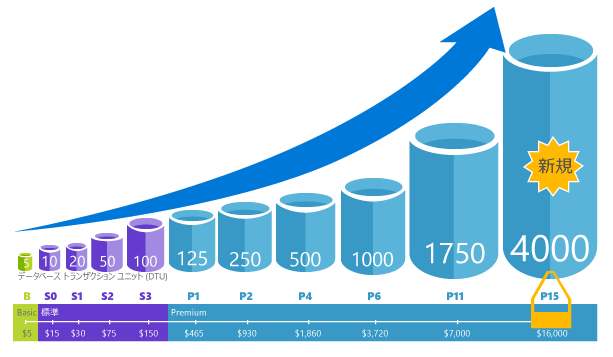
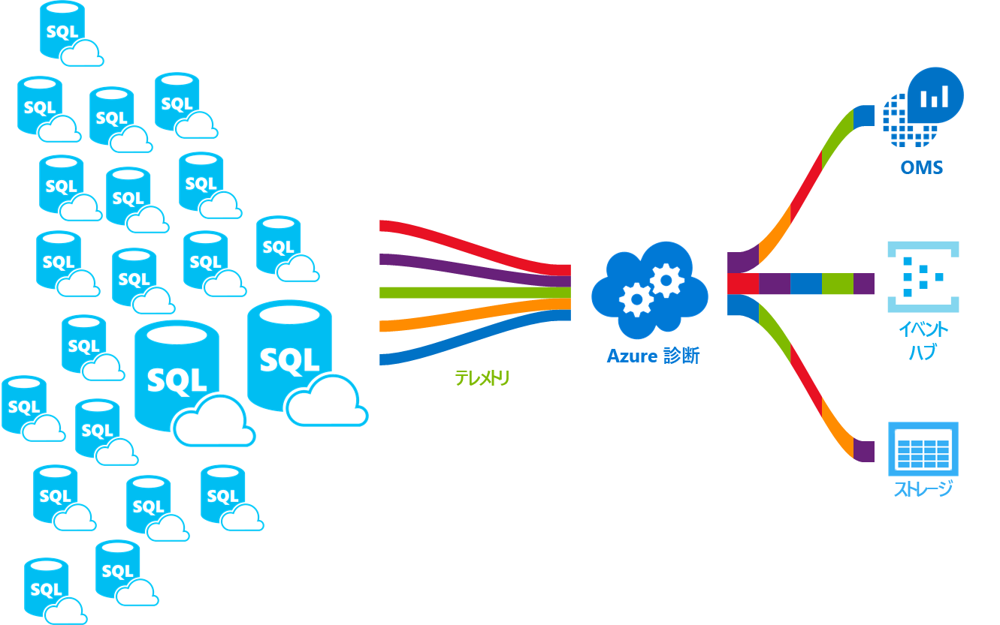

# Azure SQL Database サービスとは 

SQL Database は、リレーショナル データ、JSON、空間、XML などの構造をサポートする、Microsoft Azure における汎用リレーショナル データベース管理サービスです。 SQL Database には、マネージ [シングル SQL データベース](sql-database-servers-databases.md)と[エラスティック プール](sql-database-elastic-pool.md)内のマネージ SQL データベース、およびマネージ SQL インスタンス、いわゆる [SQL Database マネージ インスタンス](sql-database-managed-instance.md) (パブリック プレビュー) が用意されています。 それは、[動的にスケーラブルなパフォーマンス](sql-database-service-tiers.md)を提供し、徹底的な解析的分析とレポートを行うための[列ストア インデックス](https://docs.microsoft.com/sql/relational-databases/indexes/columnstore-indexes-overview)や、極度のトランザクション処理を行うための[インメモリ OLTP](sql-database-in-memory.md) などのオプションを備えています。 SQL コード ベースに対するパッチの適用と更新を Microsoft がすべてシームレスで処理するため、基になるインフラストラクチャの管理はすべて不要になります。 

SQL Database は、そのコード ベースを [Microsoft SQL Server データベース エンジン](https://docs.microsoft.com/sql/sql-server/sql-server-technical-documentation)と共有しています。 Microsoft のクラウド優先戦略に基づく SQL Server の最新機能のリリースは SQL Database から始まり、その後 SQL Server 自体に対してリリースされます。 この方法によって、修正プログラムの適用やアップグレードなしで SQL Server の最新の機能をユーザーに提供することができ、数百万のデータベースでこれらの新機能をテストすることができます。 発表される新しい機能の詳細については、以下を参照してください。

- **[SQL Database に関するAzure ロードマップ](https://azure.microsoft.com/roadmap/?category=databases)**: 最新情報や今後の予定を知ることができます。 
- **[Azure SQL Database のブログ](https://azure.microsoft.com/blog/topics/database)**: SQL Database に関するニュースと機能についての SQL Server 製品チームのメンバーのブログです。 

> [!IMPORTANT]
> SQL Database と SQL Server の機能の違いについては、[SQL の機能](sql-database-features.md)に関するページを参照してください。 

SQL Database は、パフォーマンスを予測できる複数のサービス レベルで提供され、ダウンタイムがない動的なスケーラビリティ、組み込みのインテリジェントな最適化、グローバルなスケーラビリティと可用性、および高度なセキュリティ オプションを備えています。それらはすべてほぼ管理する必要がありません。 これらの機能を使用すると、貴重な時間とリソースを仮想マシンとインフラストラクチャの管理に奪われることなく、迅速なアプリケーション開発や、製品化に要する時間の短縮化に専念することができます。 SQL Database サービスは、現在、世界中の 38 か所のデータ センターで提供されていますが、新しいデータ センターが定期的に開設されているため、ご利用のデータベースを最寄りのデータ センターで実行することができます。

> [!IMPORTANT]
> SQL Database マネージ インスタンスは現在プレビュー段階であり、単一サービス レベルでの利用に限られます。 詳細については、[SQL Database マネージ インスタンス](sql-database-managed-instance.md)に関するページを参照してください。
>

## スケーラブルなパフォーマンスとプール

SQL Database では、各データベースは互いに分離しており、移植可能です。各データベースは、パフォーマンス レベルが保証された独自の[サービス レベル](sql-database-service-tiers.md)で提供されます。 SQL Database には、さまざまなニーズに対応するための複数のパフォーマンス レベルがあり、リソースを最大限に利用してコストの節約するためにデータベースをプールすることができます。

SQL Database マネージ インスタンスでは、各インスタンスが他のインスタンスから分離され、リソースが保証されます。 詳細については、[SQL Database マネージ インスタンス](sql-database-managed-instance.md)に関するページを参照してください 

### ダウンタイムなしでのパフォーマンスの調整とスケール

SQL Database には、データベースの軽量のワークロードから重量のワークロードまでをサポートする、Basic、Standard、Premium の 3 つのサービス レベルがあります。 最初にアプリを月数ドルの小さな 1 つのデータベースでビルドし、後でいつでもソリューションのニーズに合わせて手動またはプログラムでサービス レベルを変更することができます。 アプリにも顧客にもダウンタイムを発生させずにパフォーマンスを調整することができます。 動的なスケーラビリティにより、データベースは変化の激しいリソース要件に透過的に対処することができ、必要なときに必要な分のリソースにのみ課金されます。

   

SQL Database マネージ インスタンスはプレビュー段階であり、単一サービス レベルでの提供となります。 詳細については、[SQL Database マネージ インスタンス](sql-database-managed-instance.md)に関するページを参照してください

### リソース使用率を最大化するためのエラスティック プール

多くのビジネスとアプリケーションにとって、特に使用パターンが比較的予測可能である場合、単一データベースを作成し、要求に応じてパフォーマンスを調整することができれば、それで十分です。 しかし、使用パターンが予測できない場合、コストおよびビジネス モデルを管理するのが難しくなる可能性があります。 [エラスティック プール](sql-database-elastic-pool.md)は、この問題を解決するように設計されています。 概念は単純です。 パフォーマンス リソースを個々のデータベースではなくプールに割り当て、課金は単一のデータベースのパフォーマンスではなくプールの全体的なパフォーマンス リソースに対して行われます。 

   

エラスティック プールを使用すると、リソースの需要が変動しても、データベース パフォーマンスの調整に気を配る必要がなくなります。 プールされたデータベースは、必要に応じて、エラスティック プールのパフォーマンス リソースを使用します。 しかし、プールされたデータベースの使用は、プールの上限を超えることはありません。したがって、個々のデータベースの使用状況が予測できなくても、コストが予測可能なことに変わりはありません。 さらに、[プールに対してデータベースの追加および削除を行う](sql-database-elastic-pool-manage-portal.md)ことで、完全に設定予算内で、アプリケーションを数個のデータベースから何千ものデータベースに及ぶ範囲でスケーリングすることができます。 また、プール内のデータベースが使用できるリソースの下限と上限を制御して、プール内のいずれかのデータベースがプールのすべてのリソースを使用してしまわないようにしたり、プールされているすべてのデータベースに最小限のリソースが保証されるようにしたりすることもできます。 エラスティック プールを使用する SaaS アプリケーションの設計パターンの詳細については、「[マルチテナント SaaS アプリケーションと Azure SQL Database の設計パターン](sql-database-design-patterns-multi-tenancy-saas-applications.md)」を参照してください。

> [!IMPORTANT]
> SQL Database マネージ インスタンスでは、エラスティック プールはサポートされません。

### 単一データベースとプールされたデータベースの組み合わせ

単一データベースとエラスティック プールのどちらの方法を採っても、その方法に固定されることはありません。 単一データベースをエラスティック プールと組み合わせると、状況に合わせて単一データベースとエラスティック プールのサービス レベルをすばやく簡単に変更することができます。 Azure の強力さと幅広さを利用して、他の Azure サービスを SQL Database とうまく組み合わせることにより、独自のアプリ設計のニーズを満たし、コストとリソースの効率性を向上させ、新たなビジネス チャンスを開くことができます。

### 広範囲に及ぶ監視とアラートの機能

しかし、単一データベースとエラスティック プールの相対的なパフォーマンスは、どのような方法で比較すればよいでしょうか? パフォーマンスの高低を調整するとき、何に基づいて右クリックでストップをかけますか? [組み込みのパフォーマンス監視ツール](sql-database-performance.md)と[アラート ツール](sql-database-insights-alerts-portal.md)を、パフォーマンス評価と組み合わせて使用してください。この評価は、[単一データベースの場合はデータベース トランザクション ユニット (DTU)、エラスティック プールの場合はエラスティック DTU (eDTU)](sql-database-what-is-a-dtu.md) に基づいています。 これらのツールを使用すると、現在または今後のパフォーマンスのニーズに基づいて、スケールアップとスケールダウンの影響をすばやく評価することができます。 詳細については、「 [SQL Database のオプションとパフォーマンス: 各サービス階層で使用できる内容について理解します](sql-database-service-tiers.md) 」を参照してください。

さらに、SQL Database では、監視を容易にするための[メトリックと診断ログを出力](sql-database-metrics-diag-logging.md)することができます。 リソース使用率、ワーカーとセッション、および接続性を次の Azure リソースのいずれかに格納するように SQL Database を構成することができます。

- **Azure Storage**: 大量のテレメトリを低価格でアーカイブします
- **Azure Event Hub**: SQL Database のテレメトリを、カスタム監視ソリューションまたはホット パイプラインと統合します
- **Azure Log Analytics**: レポート機能、アラート機能、および移行機能を備えた組み込みの監視ソリューション用です

    

## 可用性に関する機能

Microsoft が管理するデータセンターのグローバル ネットワークによって強化された、Azure の業界をリードする可用性 99.99% のサービス レベル アグリーメント [(SLA)](http://azure.microsoft.com/support/legal/sla/) により、アプリケーションの 24 時間 365 日の継続的な稼働が可能になります。 さらに、SQL Database には、次のような、組み込みの[ビジネス継続性とグローバルなスケーラビリティ](sql-database-business-continuity.md)の機能を備えています。

- **[自動バックアップ](sql-database-automated-backups.md)**: SQL Database は、完全バックアップ、差分バックアップ、およびトランザクション ログ バックアップを自動的に実行します。
- **[ポイントインタイム リストア](sql-database-recovery-using-backups.md)**: SQL Database は、自動バックアップのリテンション期間内の任意の時点への回復をサポートします。
- **[アクティブ geo レプリケーション](sql-database-geo-replication-overview.md)**: SQL Database を使用すると、同じ Azure データ センターまたは世界各地に分散された Azure データ センター内に、最大 4 つの読み取り可能なセカンダリ データベースを構成することができます。  たとえば、カタログ データベースを使用する SaaS アプリケーションで大量の同時実行の読み取り専用トランザクションが行われる場合は、アクティブ geo レプリケーションを使用してグローバル スケールの読み取りを有効することで、読み取りワークロードによるプライマリ上のボトルネックを取り除くことができます。 
- **[フェールオーバー グループ](sql-database-geo-replication-overview.md)**: SQL Database を使用すると、透過的な geo レプリケーションや大量のデータベースとエラスティック プールのフェールオーバーなどによって、高可用性と負荷分散をグローバル スケールで有効にすることができます。 フェールオーバー グループとアクティブ geo レプリケーションを使用すると、グローバルに分散された SaaS アプリケーションを最小限の管理オーバーヘッドで作成することができ、複雑な監視、ルーティング、およびフェールオーバーのオーケストレーションは、すべて SQL Database にまかせることができます。
- **[ゾーン冗長データベース](sql-database-high-availability.md)**: SQL Database の Premium データベースまたは Premium エラスティック プールは、複数の可用性ゾーンにまたがってプロビジョニングすることができます。 Premium データベースと Premium エラスティック プールには、高可用性を目的とする複数の冗長レプリカが存在します。それらのレプリカを複数の可用性ゾーンに配置することで回復性を高め、たとえばデータの損失を生じさせずにデータセンター規模の障害から自動的に復旧することができます。 現在、この機能はプレビュー段階にあります。 

## 組み込みのインテリジェンス

SQL Database には、インテリジェンスが組み込まれています。このインテリジェンスによって、データベースの運用コストと管理コストは大幅に削減され、アプリケーションのパフォーマンスとセキュリティの両方が最大化されます。 数百万の顧客のワークロードを 24 時間実行する SQL Database は、水面下で顧客のプライバシーを 100% 尊重しながら、膨大な量のテレメトリ データを収集して処理します。 アプリケーションの状況をサービスが学習し、状況に適応することができるように、さまざまなアルゴリズムによってテレメトリ データが継続的に評価されます。 この分析に基づいて、サービスは、特定のワークロードに合わせたパフォーマンスの向上に関する推奨事項を考え出すことができます。 

### 自動パフォーマンス監視とチューニング

SQL Database は、監視する必要があるクエリの詳細な洞察を提供します。 SQL Database は、データベースのパターンについて学習し、データベース スキーマをワークロードに適応させることができます。 SQL Database は[パフォーマンスのチューニングに関する推奨事項](sql-database-advisor.md)を提示します。チューニング アクションを確認してそれらを適用できます。 

ただし、データベースを常に監視することは厄介で面倒なタスクであり、多数のデータベースを処理する場合は特にそうなります。 [Intelligent Insights](sql-database-intelligent-insights.md) は、スケールで SQL Database のパフォーマンスを自動的に監視することによってこのジョブを行い、パフォーマンスの低下の問題を通知し、問題の根本原因を特定し、可能な場合にはパフォーマンスの向上の推奨事項を提供します。

膨大な数のデータベースを管理することは、SQL Database と Azure ポータルが備えているすべての使用可能なツールとレポートを使用しても、効率的に実行するのは不可能な場合があります。 データベースの監視とチューニングを手動で行う代わりに、[自動チューニング](sql-database-automatic-tuning.md)を使用して、監視とチューニング アクションの一部を SQL Database に委任することを検討できます。 SQL Database は、推奨事項を自動的に適用し、テストを行い、各チューニング アクションを検証して、パフォーマンスが向上していることを確認します。 このように、SQL Database は、制御された安全な方法で、ワークロードに自動的に適応します。 自動チューニングは、データベースのパフォーマンスを注意深く監視し、すべてのチューニング アクションの実行前と実行後のパフォーマンスを比較し、パフォーマンスが向上していない場合はチューニング アクションを取り消すことを意味します。

今日、SQL Database 上で [SaaS マルチテナント アプリ](sql-database-design-patterns-multi-tenancy-saas-applications.md)を実行している当社の多数のパートナーは、パフォーマンスの自動チューニングを信頼して、アプリケーションが常に安定した予測可能なパフォーマンスで実行されるようにしています。 パートナーにとって、この機能は、真夜中にパフォーマンス上の問題が発生するリスクを大幅に軽減するものです。 さらに、顧客ベースの一部では、SQL Server も使用しているため、SQL Database が提示するのと同じインデックスに関する推奨事項を使用して、SQL Server を使用している顧客を支援しています。

[SQL Database では](sql-database-automatic-tuning.md)、次の 2 つの自動チューニングを使用できます。

- **自動インデックス管理**: データベースに追加するインデックスと削除するインデックスを識別します。
- **プランの自動修正**: 問題のあるプランを識別し、SQL プランのパフォーマンスに関する問題を修正します (近日公開予定。SQL Server 2017 では既に利用可能)。

### クエリの適応処理

SQL Database には、[クエリの適応処理機能](/sql/relational-databases/performance/adaptive-query-processing)ファミリも追加されています。この中には、複数ステートメントのテーブル値関数のインターリーブ実行、バッチ モードのメモリ許可のフィードバック、バッチ モードの適応型結合が含まれています。 これらのクエリの適応処理機能には類似の "学習して適応する" 手法が適用されています。この手法は、解決困難なクエリの最適化問題に関連するパフォーマンス問題にさらに深く取り組むために役立っています。

### インテリジェントな脅威の検出

 [SQL の脅威の検出](sql-database-threat-detection.md)では、[SQL Database の監査](sql-database-auditing.md)を活用して、Azure SQL データベースの機密データに対する潜在的に有害なアクセスの試みを継続的に監視します。 SQL の脅威の検出で提供される新しいセキュリティ階層は、異常なアクティビティに対するセキュリティ アラートを提供することによって、潜在的な脅威が発生したときにユーザーがそれを検出して対応できるようにします。 不審なデータベース アクティビティ、潜在的な脆弱性、SQL インジェクション攻撃、異常なデータベース アクセス パターンが見つかった場合に、ユーザーはアラートを受信します。 SQL の脅威の検出によるアラートは、不審なアクティビティの詳細と、脅威の調査や危険性の軽減のために推奨される対処方法を提供します。 ユーザーは、疑わしいイベントを調査して、そのイベントがデータベース内のデータに対するアクセス、侵害、または悪用の試行による結果かどうかを判断できます。 脅威の検出を使用するとデータベースに対する潜在的な脅威に簡単に対処でき、セキュリティの専門家である必要や、高度なセキュリティ監視システムを管理する必要はありません。

## 高度なセキュリティとコンプライアンス

SQL Database は、アプリケーションがさまざまなセキュリティとコンプライアンスの要件を満たすために役立つ、幅広い[組み込みのセキュリティ機能とコンプライアンス機能](sql-database-security-overview.md)を備えています。 

### コンプライアンスとセキュリティの監査

[SQL Database の監査](sql-database-auditing.md)では、データベース イベントを追跡し、Azure Storage アカウントの監査ログにイベントを書き込みます。 監査により、規定遵守の維持、データベース活動の理解、およびビジネス上の懸念やセキュリティ違犯の疑いを示す差異や異常に対する洞察が容易になります。

### 保存データの暗号化

SQL Database の[透過的なデータ暗号化](/sql/relational-databases/security/encryption/transparent-data-encryption-azure-sql)を使用すると、データベース、関連付けられているバックアップ、保管されているトランザクション ログ ファイルの暗号化と暗号化解除をリアルタイムで実行することにより、悪意のあるアクティビティの脅威からデータを保護できます。アプリケーションを変更する必要はありません。 2017 年 5 月以降、新しく作成されるすべての Azure SQL データベースは、透過的なデータ暗号化 (TDE) によって自動的に保護されます。 TDE は、記憶域メディアの盗難を防ぐために多くのコンプライアンス基準で必要とされている、SQL の実証済みの保存データの暗号化テクノロジです。 顧客は、Azure Key Vault を使用して、TDE 暗号化キーとその他のシークレットをセキュリティで保護され、コンプライアンスに準拠している方法で管理できます。

### 移動中のデータの暗号化

SQL Database は、[Always Encrypted](https://docs.microsoft.com/sql/relational-databases/security/encryption/always-encrypted-database-engine) を使用して、転送中、保存中、およびクエリの処理中に機密データを保護する唯一のデータベース システムです。 Always Encrypted は、重要なデータの盗難を含む侵害に対する、これまでにないデータ セキュリティを提供する業界初の機能です。 たとえば、顧客のクレジット カード番号は、Always encrypted によって常に暗号化されてデータベースに格納されます。暗号化はクエリ処理中も行われます。復号化は、データを処理する必要がある承認されたスタッフまたはアプリケーションが使用するときに実行することができます。

### 動的データ マスク

[SQL Database の動的データ マスク](sql-database-dynamic-data-masking-get-started.md)は、特権のないユーザーに対して重要なデータをマスクすることでデータの公開を制限します。 動的データ マスクでは、公開するデリケートなデータの量を指定することで、デリケートなデータに対する未承認のアクセスを防ぎ、アプリケーション レイヤーへの影響は最小限に抑えられます。 これはポリシー ベースのセキュリティ機能であり、指定されたデータベース フィールドに対するクエリの結果セットに含まれるデリケートなデータが表示されないようにします。データベース内のデータは変更されません。

### 行レベルのセキュリティ

[行レベルのセキュリティ](https://docs.microsoft.com/sql/relational-databases/security/row-level-security)を使用して、クエリを実行しているユーザーの特性 (グループのメンバーシップや実行コンテキストなど) に基づいて、データベース テーブル内の行へのアクセスを制御できます。 行レベルのセキュリティ (RLS) により、アプリケーションでのセキュリティの設計やコーディングが簡略化されます。 RLS を使用すると、データ行のアクセスに対して制限を実装できます。 たとえば、ワーカーが自分の部署に関連するデータ行にのみアクセスできるようにしたり、顧客のデータ アクセスをその顧客の会社のデータにのみ制限したりできます。

### Azure Active Directory との統合と多要素認証

SQL Database では、[Azure Active Directory との統合](sql-database-aad-authentication.md)によって、データベース ユーザーの ID とその他の Microsoft サービスを一元的に管理できます。 この機能は、アクセス許可の管理を簡略化し、セキュリティを強化します。 Azure Active Directory は、[多要素認証](sql-database-ssms-mfa-authentication.md) (MFA) をサポートしています。これにより、シングル サインオン プロセスをサポートすると同時に、データとアプリケーションのセキュリティが強化されます。

### コンプライアンス認証

SQL Database は、定期監査に参加し、さまざまなコンプライアンス基準に対する認証を受けています。 詳細については、「[Microsoft Azure セキュリティ センター](https://azure.microsoft.com/support/trust-center/)」をご覧ください。ここから最新の [SQL Database コンプライアンス証明書](https://azure.microsoft.com/support/trust-center/services/)の一覧を入手できます。

## 使いやすいツール

SQL Database は、アプリケーションの開発と管理をより簡単で生産的にします。 SQL Database を使用すると、優れたアプリの構築に注力することができます。 既に所有しているツールとスキルを使用して、SQL Database で管理と開発を行うことができます。

- **[Azure ポータル](https://portal.azure.com/)**: すべての Azure サービスを管理するための Web ベースのアプリケーションです。 
- **[SQL Server Management Studio](https://docs.microsoft.com/sql/ssms/download-sql-server-management-studio-ssms)**: SQL Server から SQL Database まで、あらゆる SQL インフラストラクチャを管理するための、無料でダウンロードできるクライアント アプリケーションです。
- **[Visual Studio の SQL Server Data Tools](https://docs.microsoft.com/sql/ssdt/download-sql-server-data-tools-ssdt)**: SQL Server リレーショナル データベース、Azure SQL データベース、Integration Services パッケージ、Analysis Services データ モデル、および Reporting Services レポートを開発するための、無料でダウンロードできるクライアント アプリケーションです。
- **[Visual Studio Code](https://code.visualstudio.com/docs)**: Linux、macOS、および Windows 用の無料でダウンロードできるオープン ソースのコード エディターです。Microsoft SQL Server、Azure SQL Database、および SQL Data Warehouse のデータを照会するための [mssql 拡張機能](https://aka.ms/mssql-marketplace)を含む拡張機能をサポートします。

SQL Database は、MacOS、Linux、および Windows での Python、Java、Node.js、PHP、Ruby、および .NET によるアプリケーションの構築をサポートします。 SQL Database は、SQL Server と同じ[接続ライブラリ](sql-database-libraries.md)をサポートします。

## SQL Server エンジニアリング チームとの交流

- [DBA Stack Exchange](https://dba.stackexchange.com/questions/tagged/sql-server): データベースの管理に関するご質問はこちらへ
- [Stack Overflow](http://stackoverflow.com/questions/tagged/sql-server): 開発に関する質問はこちらへ
- [MSDN フォーラム](https://social.msdn.microsoft.com/Forums/home?category=sqlserver): 技術的なご質問はこちらへ
- [フィードバック](http://aka.ms/sqlfeedback): バグの報告や機能リクエスト
- [Reddit](https://www.reddit.com/r/SQLServer/): SQL Server についての意見交換

## 次の手順

- 単一データベースとエラスティック プールのコストの比較と計算ツールについては、[価格に関するページ](https://azure.microsoft.com/pricing/details/sql-database/)を参照してください。

- すぐに始めるには、次のクイック スタートをご覧ください。

  - [Azure Portal で SQL データベースを作成する](sql-database-get-started-portal.md)  
  - [Azure CLI で SQL データベースを作成する](sql-database-get-started-cli.md)
  - [PowerShell を使用して SQL データベースを作成する](sql-database-get-started-powershell.md)

- Azure CLI と PowerShell の各種サンプルについては、以下のページをご覧ください。
  - [Azure SQL Database 用の Azure CLI サンプル](sql-database-cli-samples.md)
  - [Azure SQL Database 用の Azure PowerShell サンプル](sql-database-powershell-samples.md)
