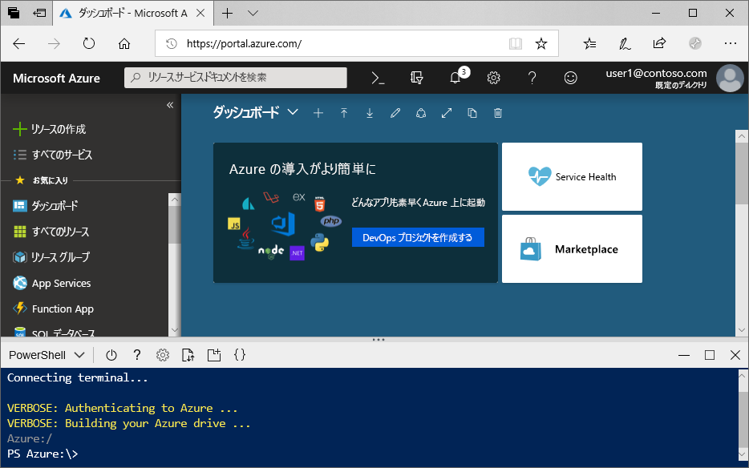
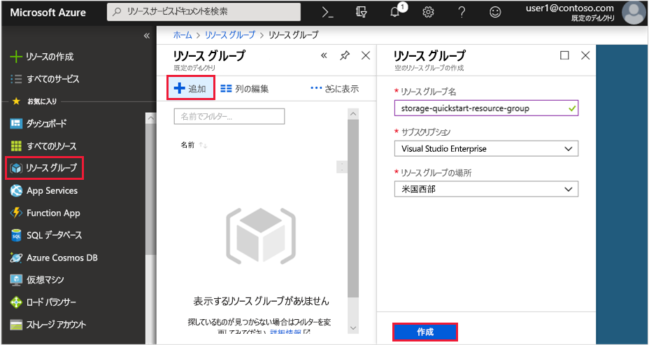
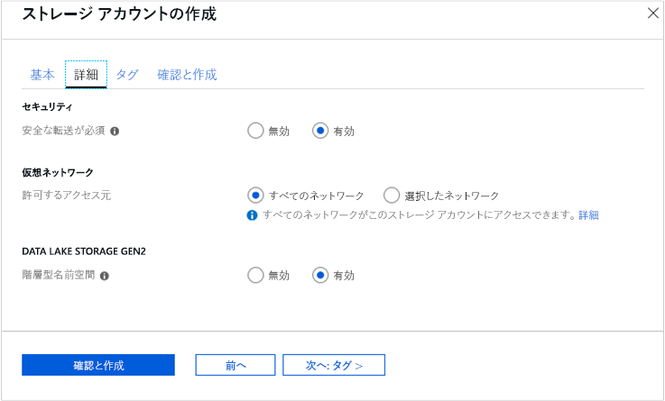

# <a name="quickstart-create-an-azure-data-lake-storage-gen2-storage-account"></a>クイック スタート: Azure Data Lake Storage Gen2 ストレージ アカウントを作成する

Azure Data Lake Storage Gen2 では、Hadoop 分散ファイル システム (HDFS) と連携するように調整された、ネイティブ ディレクトリ ベースのファイル システムを提供する[階層型名前空間サービスがサポート](data-lake-storage-introduction.md)されています。 HDFS から Data Lake Storage Gen2 データにアクセスするには、[ABFS ドライバー](data-lake-storage-abfs-driver.md)を使用します。

このクイック スタートでは、[Azure portal](https://portal.azure.com/)、[Azure PowerShell](https://docs.microsoft.com/powershell/azure/overview)、または [Azure CLI](https://docs.microsoft.com/cli/azure?view=azure-cli-latest) を使用して、アカウントを作成する方法を説明します。

## <a name="prerequisites"></a>前提条件

Azure サブスクリプションをお持ちでない場合は、開始する前に [無料アカウント](https://azure.microsoft.com/free/) を作成してください。 

|           | 前提条件 |
|-----------|--------------|
|ポータル     | なし         |
|PowerShell | このクイック スタートには、PowerShell モジュールの Az.Storage バージョン **0.7** 以降が必要です。 現在のバージョンを調べるには、`Get-Module -ListAvailable Az.Storage` コマンドを実行します。 このコマンドを実行した後に結果が表示されない場合、または **0.7** 以外のバージョンが表示された場合は、次の powershell モジュールをアップグレードする必要があります。 このガイドの「[PowerShell モジュールのアップグレード](#upgrade-your-powershell-module)」セクションを参照してください。
|CLI        | 次の 2 つの方法のいずれかで Azure にログインし、Azure CLI コマンドを実行できます。 <ul><li>Azure Portal 内から、Azure Cloud Shell で CLI コマンドを実行できます </li><li>CLI をインストールして、CLI コマンドをローカルで実行できます</li></ul>|

コマンド ラインを使用する場合は、Azure Cloud Shell を実行するか、CLI をローカルにインストールするオプションがあります。

### <a name="use-azure-cloud-shell"></a>Azure Cloud Shell を使用する

Azure Cloud Shell は、Azure Portal 内で直接実行できる無料の Bash シェルです。 Azure CLI が事前にインストールされており、アカウントで使用できるように構成されています。 Azure Portal の右上のメニューの **[Cloud Shell]** ボタンをクリックします。

[](https://portal.azure.com)

このボタンによって対話型のシェルが起動されます。このクイックスタートの手順はこれを使って実行できます。

[](https://portal.azure.com)

### <a name="install-the-cli-locally"></a>CLI をローカルにインストールする

Azure CLI はローカルにインストールして使用することもできます。 このクイック スタートでは、Azure CLI バージョン 2.0.38 以降を実行している必要があります。 バージョンを確認するには、`az --version` を実行します。 インストールまたはアップグレードが必要な場合は、[Azure CLI のインストール](/cli/azure/install-azure-cli)に関するページを参照してください。

## <a name="create-a-storage-account-with-azure-data-lake-storage-gen2-enabled"></a>Azure Data Lake Storage Gen2 対応のストレージ アカウントを作成する

アカウントを作成する前に、作成するストレージ アカウントまたは他の Azure リソースに対して、論理コンテナーとして機能するリソース グループを作成する必要があります。 このクイックスタートで作成したリソースをクリーンアップする場合は、リソース グループを削除するだけです。 リソース グループを削除すると、関連付けられているストレージ アカウント、およびリソース グループに関連付けられているその他のリソースも削除されます。 リソース グループの詳細については、「[Azure Resource Manager の概要](../../azure-resource-manager/resource-group-overview.md)」を参照してください。

> [!NOTE]
> Data Lake Storage Gen2 機能を利用するには、作成する新しいストレージ アカウントの種類を **StorageV2 (汎用 V2)** にする必要があります。  

ストレージ アカウントについて詳しくは、「[Azure ストレージ アカウントの概要](../common/storage-account-overview.md)」をご覧ください。

ストレージ アカウントに名前を付けるときは、次の規則に注意してください。

- ストレージ アカウント名の長さは 3 ～ 24 文字で、数字と小文字のみを使用できます。
- ストレージ アカウント名は Azure 内で一意である必要があります。 複数のストレージ アカウントが同じ名前を持つことはできません。

## <a name="create-an-account-using-the-azure-portal"></a>Azure portal を使用してアカウントを作成する

[Azure Portal](https://portal.azure.com) にログインします。

### <a name="create-a-resource-group"></a>リソース グループの作成

Azure Portal でリソース グループを作成するには、次の手順に従います。

1. Azure Portal で左側のメニューを展開してサービスのメニューを開き、**[リソース グループ]** を選択します。
2. **[追加]** ボタンをクリックして新しいリソース グループを追加します。
3. 新しいリソース グループの名前を入力します。
4. 新しいリソース グループを作成するサブスクリプションを選択します。
5. リソース グループの場所を選択します。
6. **[作成]** ボタンをクリックします。  

   

### <a name="create-a-general-purpose-v2-storage-account"></a>汎用 v2 ストレージ アカウントを作成する

Azure Portal で汎用 v2 ストレージ アカウントを作成するには、次の手順に従います。

> [!NOTE]
> 階層型名前空間は現在、すべてのパブリック リージョンで利用できます。 現在ソブリン クラウドでは利用できません。

1. Azure Portal で左側のメニューを展開してサービスのメニューを開き、**[すべてのサービス]** を選択します。 次に、下へスクロールして **[ストレージ]** の **[ストレージ アカウント]** を選択します。 表示された **[ストレージ アカウント]** ウィンドウで **[追加]** を選択します。
2. 先ほど作成した**サブスクリプション**と**リソース グループ**を選択します。
3. ストレージ アカウントの名前を入力します。
4. **[場所]** を **[米国西部 2]** に設定します
5. 次のフィールドは既定の設定のままにします。**パフォーマンス**、**アカウントの種類**、**レプリケーション**、**アクセス層**。
6. ストレージ アカウントを作成するサブスクリプションを選択します。
7. **[次へ] > [詳細]** の順に選択します。
8. **[セキュリティ]** および **[仮想ネットワーク]** フィールド下の値は既定の設定のままにします。
9. **[Data Lake Storage Gen2 (preview)]\(Data Lake Storage Gen2 (プレビュー)\)** セクションで、**[Hierarchical namespace]\(階層構造の名前空間\)** を **[有効]** に設定します。
10. **[確認および作成]** をクリックして、ストレージ アカウントを作成します。

    

これで、ご自身のストレージ アカウントがポータルで作成されました。

### <a name="clean-up-resources"></a>リソースのクリーンアップ

Azure Portal を使用してリソース グループを削除するには:

1. Azure Portal で左側のメニューを展開してサービスのメニューを開き、**[リソース グループ]** を選択して、リソース グループの一覧を表示します。
2. 削除するリソース グループを見つけて、一覧の右側にある **[詳細]** ボタン (**...**) を右クリックします。
3. **[リソース グループの削除]** を選択し、確認します。

## <a name="create-an-account-using-powershell"></a>PowerShell を使用してアカウントを作成する

最初に、[PowerShellGet](https://docs.microsoft.com/powershell/gallery/installing-psget) モジュールの最新バージョンをインストールします。

次に、PowerShell モジュールをアップグレードして、お使いの Azure サブスクリプションにログインし、リソース グループを作成してから、ストレージ アカウントを作成します。

### <a name="upgrade-your-powershell-module"></a>PowerShell モジュールのアップグレード

[!INCLUDE [updated-for-az](../../../includes/updated-for-az.md)]

PowerShell を使用して Data Lake Storage Gen2 を操作するには、モジュールの Az.Storage バージョン **0.7** 以降をインストールする必要があります。

最初に、引き上げられたアクセス許可を使って PowerShell セッションを開きます。

Az.Storage モジュールのインストール

```powershell
Install-Module Az.Storage -Repository PSGallery -RequiredVersion 0.7.0 -AllowPrerelease -AllowClobber -Force
```

> [!NOTE]
> Azure Powershell Az モジュールは、Powershell の Azure サービスを操作する場合に推奨されるモジュールです。 詳細については、「[新しい Azure PowerShell Az モジュールの概要](https://docs.microsoft.com/powershell/azure/new-azureps-module-az)」を参照してください。

### <a name="log-in-to-your-azure-subscription"></a>Azure サブスクリプションへのログイン

`Login-AzAccount` コマンドを使用して、画面上の指示に従って認証を行います。

```powershell
Login-AzAccount
```

### <a name="create-a-resource-group"></a>リソース グループの作成

PowerShell で新しいリソース グループを作成するには、[New-AzResourceGroup](/powershell/module/az.resources/new-azresourcegroup) コマンドを使用します。 

> [!NOTE]
> 階層型名前空間は現在、すべてのパブリック リージョンで利用できます。 現在ソブリン クラウドでは利用できません。

```powershell
# put resource group in a variable so you can use the same group name going forward,
# without hardcoding it repeatedly
$resourceGroup = "storage-quickstart-resource-group"
$location = "westus2"
New-AzResourceGroup -Name $resourceGroup -Location $location
```

### <a name="create-a-general-purpose-v2-storage-account"></a>汎用 v2 ストレージ アカウントを作成する

ローカル冗長ストレージ (LRS) を使用して汎用 v2 ストレージ アカウントを PowerShell から作成するには、[New-AzStorageAccount](/powershell/module/az.storage/New-azStorageAccount) コマンドを使用します。

```powershell
$location = "westus2"

New-AzStorageAccount -ResourceGroupName $resourceGroup `
  -Name "storagequickstart" `
  -Location $location `
  -SkuName Standard_LRS `
  -Kind StorageV2 `
  -EnableHierarchicalNamespace $True
```

### <a name="clean-up-resources"></a>リソースのクリーンアップ

リソース グループと関連付けられているリソース (新しいストレージ アカウントを含む) を削除するには、[Remove-AzResourceGroup](/powershell/module/az.resources/remove-azresourcegroup) コマンドを使用します。 

```powershell
Remove-AzResourceGroup -Name $resourceGroup
```

## <a name="create-an-account-using-azure-cli"></a>Azure CLI を使用してアカウントを作成する

Azure Cloud Shell を開始するには、[Azure portal](https://portal.azure.com) にログインします。

CLI のローカル インストールにログインする場合は、ログイン コマンドを実行します。

```cli
az login
```

### <a name="add-the-cli-extension-for-azure-data-lake-gen-2"></a>Azure Data Lake Gen 2 対応の CLI 拡張機能を追加する

CLI を使用して Data Lake Storage Gen2 と対話するには、お使いのシェルに拡張機能を追加する必要があります。

そのためには、Cloud Shell またはローカル シェルを使用して、`az extension add --name storage-preview` コマンドを入力します。

### <a name="create-a-resource-group"></a>リソース グループの作成

Azure CLI で新しいリソース グループを作成するには、[az group create](/cli/azure/group#az_group_create) コマンドを使用します。

```azurecli-interactive
az group create `
    --name storage-quickstart-resource-group `
    --location westus2
```

> [!NOTE]
> > 階層型名前空間は現在、すべてのパブリック リージョンで利用できます。 現在ソブリン クラウドでは利用できません。

### <a name="create-a-general-purpose-v2-storage-account"></a>汎用 v2 ストレージ アカウントを作成する

ローカル冗長ストレージを使用して汎用 v2 ストレージ アカウントを Azure CLI から作成するには、[az storage account create](/cli/azure/storage/account) コマンドを使用します。

```azurecli-interactive
az storage account create `
    --name storagequickstart `
    --resource-group storage-quickstart-resource-group `
    --location westus2 `
    --sku Standard_LRS `
    --kind StorageV2 `
    --hierarchical-namespace true
```

### <a name="clean-up-resources"></a>リソースのクリーンアップ

リソース グループと関連付けられているリソース (新しいストレージ アカウントを含む) を削除するには、[az group delete](/cli/azure/group) コマンドを使用します。

```azurecli-interactive
az group delete --name myResourceGroup
```

## <a name="next-steps"></a>次の手順

このクイック スタートでは、Data Lake Storage Gen2 の機能が利用できるストレージ アカウントを作成しました。 ストレージ アカウントとの間で BLOB をアップロードおよびダウンロードする方法を学習するには、次のトピックを参照してください。

* [AzCopy V10](https://docs.microsoft.com/azure/storage/common/storage-use-azcopy-v10?toc=%2fazure%2fstorage%2fblobs%2ftoc.json)
