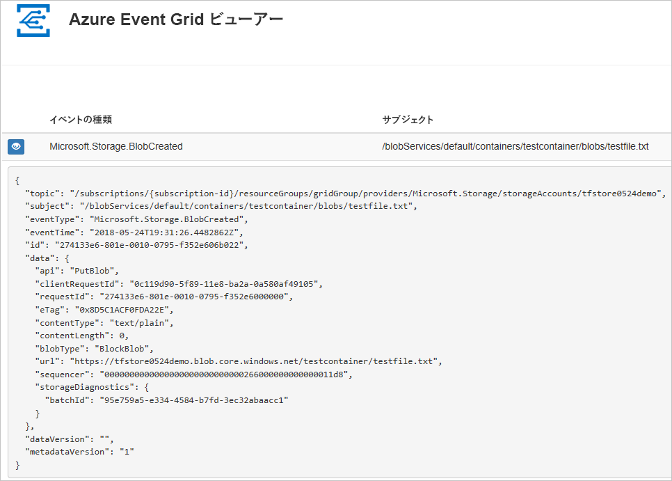
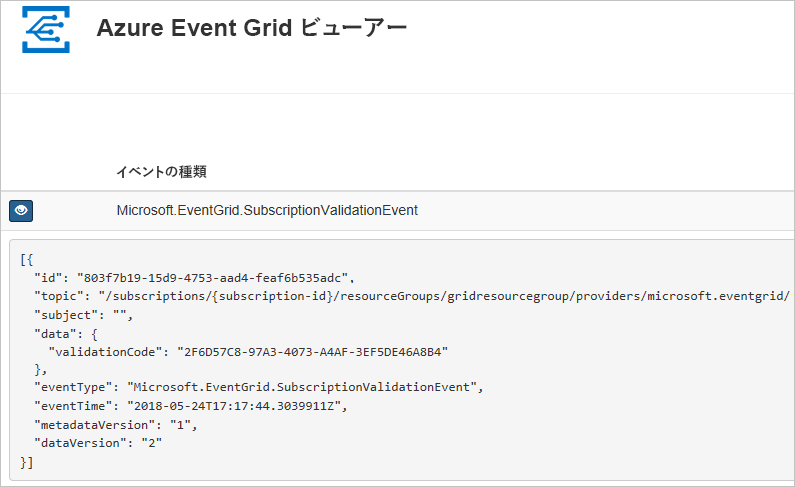

# <a name="quickstart-route-storage-events-to-web-endpoint-with-azure-cli"></a>クイック スタート: Azure CLI を使用してストレージ イベントを Web エンドポイントにルーティングする

Azure Event Grid は、クラウドのイベント処理サービスです。 この記事では、Azure CLI を使用して Blob Storage のイベントをサブスクライブし、イベントをトリガーして結果を表示します。

通常は、イベント データを処理し、アクションを実行するエンドポイントにイベントを送信します。 ただし、この記事では、単純化するために、メッセージを収集して表示する Web アプリにイベントを送信します。

この記事の手順の最後に、イベント データが Web アプリに送信済みであることを確認できます。




[!INCLUDE [quickstarts-free-trial-note.md](../../../includes/quickstarts-free-trial-note.md)]

[!INCLUDE [cloud-shell-try-it.md](../../../includes/cloud-shell-try-it.md)]

CLI をローカルにインストールして使用することを選択した場合、この記事では、最新バージョンの Azure CLI (2.0.24 以降) が実行されている必要があります。 バージョンを確認するには、`az --version` を実行します。 インストールまたはアップグレードする必要がある場合は、[Azure CLI のインストール](/cli/azure/install-azure-cli)に関するページを参照してください。

Cloud Shell を使用していない場合は、先に `az login` でサインインする必要があります。

## <a name="create-a-resource-group"></a>リソース グループの作成

Event Grid のトピックは Azure リソースであり、Azure リソース グループに配置する必要があります。 リソース グループは、Azure リソースをまとめてデプロイして管理するための論理上のコレクションです。

[az group create](/cli/azure/group#az_group_create) コマンドでリソース グループを作成します。 

次の例では、`<resource_group_name>` という名前のリソース グループを場所 *westcentralus* に作成します。  `<resource_group_name>` を、リソース グループの一意の名前に置き換えます。

```azurecli-interactive
az group create --name <resource_group_name> --location westcentralus
```

## <a name="create-a-storage-account"></a>ストレージ アカウントの作成

Blob Storage のイベントは、汎用 v2 ストレージ アカウントおよび BLOB ストレージ アカウントで使用できます。 **汎用 v2** ストレージ アカウントでは、BLOB、ファイル、キュー、テーブルをはじめとするすべてのストレージ サービスに対するすべての機能がサポートされます。 **BLOB ストレージ アカウント**とは、Azure Storage に BLOB (オブジェクト) として非構造化データを格納するための特殊なストレージ アカウントです。 Blob Storage アカウントは、汎用ストレージ アカウントと同様に、現在使われているすべての優れた耐久性、可用性、スケーラビリティ、およびパフォーマンス機能を共有します。たとえば、ブロック BLOB と追加 BLOB の 100% の API 整合性などです。 詳細については、「[Azure ストレージ アカウントの概要](../common/storage-account-overview.md)」を参照してください。

`<storage_account_name>` は、ご利用のストレージ アカウントの一意の名前に、`<resource_group_name>` は、先ほど作成したリソース グループに置き換えてください。

```azurecli-interactive
az storage account create \
  --name <storage_account_name> \
  --location westcentralus \
  --resource-group <resource_group_name> \
  --sku Standard_LRS \
  --kind BlobStorage \
  --access-tier Hot
```

## <a name="create-a-message-endpoint"></a>メッセージ エンドポイントの作成

トピックをサブスクライブする前に、イベント メッセージ用のエンドポイントを作成しましょう。 通常、エンドポイントは、イベント データに基づくアクションを実行します。 このクイック スタートを簡素化するために、イベント メッセージを表示する[構築済みの Web アプリ](https://github.com/Azure-Samples/azure-event-grid-viewer)をデプロしします。 デプロイされたソリューションには、App Service プラン、App Service Web アプリ、および GitHub からのソース コードが含まれています。

`<your-site-name>` は、Web アプリの一意の名前に置き換えてください。 Web アプリ名は、DNS エントリの一部であるため、一意である必要があります。

```azurecli-interactive
sitename=<your-site-name>

az group deployment create \
  --resource-group <resource_group_name> \
  --template-uri "https://raw.githubusercontent.com/Azure-Samples/azure-event-grid-viewer/master/azuredeploy.json" \
  --parameters siteName=$sitename hostingPlanName=viewerhost
```

デプロイが完了するまでに数分かかる場合があります。 デプロイが成功した後で、Web アプリを表示して、実行されていることを確認します。 Web ブラウザーで `https://<your-site-name>.azurewebsites.net` にアクセスします

現在表示されているメッセージがないサイトが表示されます。

[!INCLUDE [event-grid-register-provider-cli.md](../../../includes/event-grid-register-provider-cli.md)]

## <a name="subscribe-to-your-storage-account"></a>ストレージ アカウントをサブスクライブする

どのイベントを追跡し、どこにイベントを送信するかは、トピックをサブスクライブすることによって Event Grid に伝えます。 次の例では、作成したストレージ アカウントをサブスクライブし、Web アプリからの URL をイベント通知のエンドポイントとして渡します。 `<event_subscription_name>` をイベント サブスクリプションの名前に置き換えます。 `<resource_group_name>` と `<storage_account_name>` には、先ほど作成した値を使用します。

Web アプリのエンドポイントには、サフィックス `/api/updates/` が含まれている必要があります。

```azurecli-interactive
storageid=$(az storage account show --name <storage_account_name> --resource-group <resource_group_name> --query id --output tsv)
endpoint=https://$sitename.azurewebsites.net/api/updates

az eventgrid event-subscription create \
  --resource-id $storageid \
  --name <event_subscription_name> \
  --endpoint $endpoint
```

Web アプリをもう一度表示し、その Web アプリにサブスクリプションの検証イベントが送信されたことに注目します。 目のアイコンを選択してイベント データを展開します。 Event Grid は検証イベントを送信するので、エンドポイントはイベント データを受信することを確認できます。 Web アプリには、サブスクリプションを検証するコードが含まれています。



## <a name="trigger-an-event-from-blob-storage"></a>Blob Storage からのイベントのトリガー

では、イベントをトリガーして、Event Grid がメッセージをエンドポイントに配信するようすを見てみましょう。 まず、ストレージ アカウントの名前とキーを構成します。次にコンテナーを作成し、ファイルを作成してアップロードします。 ここでも、`<storage_account_name>` と `<resource_group_name>` には、先ほど作成した値を使用します。

```azurecli-interactive
export AZURE_STORAGE_ACCOUNT=<storage_account_name>
export AZURE_STORAGE_ACCESS_KEY="$(az storage account keys list --account-name <storage_account_name> --resource-group <resource_group_name> --query "[0].value" --output tsv)"

az storage container create --name testcontainer

touch testfile.txt
az storage blob upload --file testfile.txt --container-name testcontainer --name testfile.txt
```

以上でイベントがトリガーされ、そのメッセージが、Event Grid によってサブスクライブ時に構成したエンドポイントに送信されました。 Web アプリを表示して、送信したイベント確認します。


```json
[{
  "topic": "/subscriptions/xxxxxxxx-xxxx-xxxx-xxxx-xxxxxxxxxxxx/resourceGroups/myrg/providers/Microsoft.Storage/storageAccounts/myblobstorageaccount",
  "subject": "/blobServices/default/containers/testcontainer/blobs/testfile.txt",
  "eventType": "Microsoft.Storage.BlobCreated",
  "eventTime": "2017-08-16T20:33:51.0595757Z",
  "id": "4d96b1d4-0001-00b3-58ce-16568c064fab",
  "data": {
    "api": "PutBlockList",
    "clientRequestId": "d65ca2e2-a168-4155-b7a4-2c925c18902f",
    "requestId": "4d96b1d4-0001-00b3-58ce-16568c000000",
    "eTag": "0x8D4E4E61AE038AD",
    "contentType": "text/plain",
    "contentLength": 0,
    "blobType": "BlockBlob",
    "url": "https://myblobstorageaccount.blob.core.windows.net/testcontainer/testblob1.txt",
    "sequencer": "00000000000000EB0000000000046199",
    "storageDiagnostics": {
      "batchId": "dffea416-b46e-4613-ac19-0371c0c5e352"
    }
  },
  "dataVersion": "",
  "metadataVersion": "1"
}]

```

## <a name="clean-up-resources"></a>リソースのクリーンアップ
引き続きこのストレージ アカウントとイベント サブスクリプションを使用する場合は、この記事で作成したリソースをクリーンアップしないでください。 引き続き使用する予定がない場合は、次のコマンドを使用して、この記事で作成したリソースを削除します。

`<resource_group_name>` は、先ほど作成したリソース グループに置き換えます。

```azurecli-interactive
az group delete --name <resource_group_name>
```

## <a name="next-steps"></a>次の手順

トピックを作成し、イベントをサブスクライブする方法がわかったら、Blob Storage のイベントについて、また Event Grid でできることについて、さらに情報を収集しましょう。

- [Blob Storage のイベント処理](storage-blob-event-overview.md)
- [Event Grid について](../../event-grid/overview.md)
