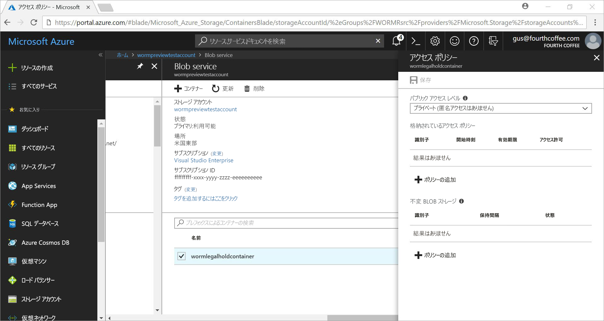
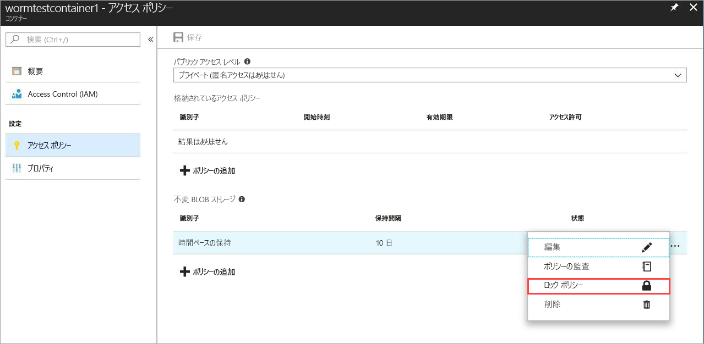

# <a name="immutable-storage-feature-of-azure-blob-storage-preview"></a>Azure Blob Storage の不変ストレージ機能 (プレビュー)

Azure BLOB の不変ストレージ機能を使用すると、ユーザーはビジネスに不可欠なデータを WORM (Write Once Read Many) 状態の Azure Blob Storage に保存できます。 この状態では、ユーザーが指定した期間、データを消去および変更できなくなります。 保持間隔の間、BLOB の作成と読み取りは可能ですが、変更または削除することはできません。

## <a name="overview"></a>概要

不変ストレージ機能により、多くの規制された業界の組織 (特に、ブローカーディーラー組織) は、SEC 17a-4(f) や他の規制に準拠した方法でデータを保存することができます。

一般的な用途は次のとおりです。

- **法令順守**: Azure BLOB の不変ストレージ機能は、金融機関と関連業界が SEC 17a-4(f)、CFTC 1.31©-(d)、FINRA などに対応できるように設計されています。

- **セキュリティ保護されたドキュメント リテンション**: Blob Storage サービスにより、アカウント管理特権を持つユーザーを含め、どのユーザーもデータを変更または削除できないことが保証されるため、最大限のデータ保護が提供されます。

- **訴訟ホールド**: Azure BLOB の不変ストレージを使用すると、ユーザーは訴訟や犯罪捜査などに不可欠な機密情報を、必要な期間中、改ざん防止状態で保存できます。

不変ストレージ機能により、次のことが可能になります。

- **時間ベースのリテンション ポリシーのサポート:** ユーザーは、指定した期間、データを保存するポリシーを設定できます。

- **訴訟ホールド ポリシーのサポート:** 保持間隔がわからない場合は、訴訟ホールドを設定することで、訴訟ホールドがクリアされるまでデータを不変状態で保存できます。  訴訟ホールドを設定すると、BLOB の作成と読み取りは可能ですが、変更または削除はできません。 各訴訟ホールドは、識別子文字列 (ケース ID など) として使用されるユーザー定義の英数字のタグに関連付けられています。

- **すべての BLOB 層のサポート:** WORM ポリシーは Azure BLOB ストレージ層から独立しており、ホット、クール、アーカイブのすべての層に適用されます。 これにより、データの不変性を維持しながら、ワークロードに対応する最もコストに最適化された層にデータを保存できます。

- **コンテナー レベルの構成:** 不変ストレージ機能では、時間ベースのリテンション ポリシーと訴訟ホールド タグをコンテナー レベルで構成できます。  ユーザーは、コンテナー レベルの簡単な設定を使用して、時間ベースのリテンション ポリシーの作成とロック、保持間隔の延長、訴訟ホールドの設定とクリアなどを行うことができます。  これらのポリシーは、コンテナー内の既存および新規のすべての BLOB に適用されます。

- **監査ログのサポート:** 各コンテナーには、保持間隔の延長の最大 3 つのログと共に、ロック済みの時間ベースのリテンション ポリシーの最大 5 つの時間ベースのリテンション コマンドを示す監査ログが含まれています。  時間ベースのリテンションの場合、ログにはユーザー ID、コマンドの種類、タイムスタンプ、保持間隔が含まれます。 訴訟ホールドの場合、ログにはユーザー ID、コマンドの種類、タイムスタンプ、訴訟ホールド タグが含まれます。 このログは、SEC 17a-4(f) 規制ガイドラインに従い、コンテナーの有効期間の間保持されます。 コントロール プレーンのすべてのアクティビティのより包括的なログは、[Azure アクティビティ ログ](https://docs.microsoft.com/azure/monitoring-and-diagnostics/monitoring-overview-activity-logs)にあります。 規制や他の目的で必要になる可能性のあるログは、ユーザーが永続的に保存する必要があります。

 この機能は、すべての Azure パブリック リージョンで有効になっています。

## <a name="how-it-works"></a>動作のしくみ

Azure BLOB の不変ストレージでは、時間ベースのリテンションと訴訟ホールドの 2 種類の WORM (不変) ポリシーがサポートされています。 これらの不変ポリシーの作成方法の詳細については、「[使用の開始](#Getting-started)」をご覧ください。
時間ベースのリテンション ポリシーまたは訴訟ホールドをコンテナーに適用すると、既存のすべての BLOB が不変 (書き込みおよび削除禁止) 状態に移行します。 コンテナーにアップロードされるすべての新しい BLOB も不変状態に移行します。

> [!IMPORTANT]
> SEC 17a-4(f) や他の規制を順守するために BLOB を不変 (書き込みおよび削除禁止) 状態にするには、時間ベースのリテンション ポリシーを "*ロック*" する必要があります。 適切な時間内 (通常は 24 時間以内) にポリシーをロックすることが推奨されます。 短期間の機能評価以外の目的で、"*ロック解除*" 状態を使用しないことをお勧めします。

 時間ベースのリテンション ポリシーをコンテナーに適用すると、"*有効な*" リテンション期間中、コンテナー内のすべての BLOB が不変状態のままになります。 既存の BLOB の有効なリテンション期間は、BLOB の作成時刻とユーザーが指定した保持間隔の差になります。 新しい BLOB の場合、有効なリテンション期間はユーザーが指定した保持間隔と同じです。 ユーザーは保持間隔を変更できるので、ユーザー指定の保持間隔の最新の値が有効なリテンション期間の計算に使用されます。

> [!TIP]
> 例: ユーザーが、保持間隔が 5 年の時間ベースのリテンション ポリシーを作成しました。
> そのコンテナーには、1 年前に作成された BLOB (testblob1) が既にあります。 testblob1 の有効なリテンション期間は 4 年間になります。
> 新しい BLOB (testblob2) がコンテナーにアップロードされました。 この新しい BLOB の有効なリテンション期間は 5 年間になります。

### <a name="legal-holds"></a>訴訟ホールド

訴訟ホールドの場合、訴訟ホールドがクリアされるまで、既存および新規のすべての BLOB が不変状態のままになります。
訴訟ホールドを設定およびクリアする方法の詳細については、「[使用の開始](#Getting-started)」をご覧ください。

コンテナーには、訴訟ホールドと時間ベースのリテンション ポリシーの両方を同時に適用できます。 有効なリテンション期間が終了していても、すべての訴訟ホールドがクリアされるまで、そのコンテナー内のすべての BLOB が不変状態のままになります。 逆に、すべての訴訟ホールドがクリアされていても、有効なリテンション期間が終了するまで、BLOB は不変状態のままになります。
次の表に、さまざまな不変シナリオで無効になる BLOB 操作の種類を示します。
Blob REST API の詳細については、[Azure Blob Service API](https://docs.microsoft.com/rest/api/storageservices/blob-service-rest-api) のドキュメントをご覧ください。

|シナリオ  |BLOB の状態  |禁止されている BLOB 操作  |
|---------|---------|---------|
|BLOB の有効なリテンション期間がまだ終了していないか、訴訟ホールドが設定されている     |不変: 削除および書き込み禁止         |Delete Container、Delete Blob、Put Blob1、Put Block、Put Block List、Set Blob Metadata、Put Page、Set Blob Properties、Snapshot Blob、Incremental Copy Blob、Append Block         |
|BLOB の有効なリテンション期間が終了している     |書き込み禁止のみ (削除操作は可能)         |Put Blob、Put Block、Put Block List、Set Blob Metadata、Put Page、Set Blob Properties、Snapshot Blob、Incremental Copy Blob、Append Block         |
|すべての訴訟ホールドがクリアされており、コンテナーに時間ベースのリテンション ポリシーが設定されていない     |変更可能         |なし         |
|WORM ポリシーが作成されていない (時間ベースのリテンションまたは訴訟ホールド)     |変更可能         |なし         |

> [!NOTE]
> 上記の表の最初の 2 つのシナリオでは、最初の Put Blob、および BLOB を作成するために必要な Put Block List と Put Block の各操作が許可されますが、以降の操作はすべて禁止されます。
> 不変ストレージ機能は GPv2 および BLOB ストレージ アカウントでのみ使用可能であり、[Azure Resource Manager](https://docs.microsoft.com/azure/azure-resource-manager/resource-group-overview) を使用して作成する必要があります。

## <a name="pricing"></a>価格

この機能を使用する際に追加料金は発生しません。不変データは、通常の変更可能なデータと同様に課金されます。 関連する価格の詳細については、[Azure Storage の料金に関するページ](https://azure.microsoft.com/pricing/details/storage/blobs/)をご覧ください。

### <a name="restrictions"></a>制限

パブリック プレビュー期間中は、次の制限が適用されます。

- **実稼働データまたはビジネスに不可欠なデータは保存しないでください**
- プレビュー/NDA のすべての制限が適用されます

## <a name="getting-started"></a>使用の開始

Azure BLOB の Azure 不変ストレージは、最新リリースの [Azure portal](http://portal.azure.com)、Azure [CLI 2.0](https://docs.microsoft.com/cli/azure/install-azure-cli?view=azure-cli-latest)、および Azure [PowerShell](https://github.com/Azure/azure-powershell/releases/tag/Azure.Storage.v4.4.0-preview-May2018) 上でサポートされます。

### <a name="azure-portal"></a>Azure ポータル

1. 新しいコンテナーを作成するか、既存のコンテナーを選択して、不変状態に維持する必要がある BLOB を格納します。
 コンテナーは、GPv2 ストレージ アカウント内に存在する必要があります。
2. [コンテナー] 設定の [アクセス ポリシー] をクリックし、次に示すように、**[不変 BLOB ストレージ]** ポリシーの **[+ ポリシーの追加]** をクリックします。

    

3. 時間ベースのリテンションを有効にするには、ドロップダウン メニューから [時間ベースの保持] を選択します。

    

4. 希望の保持間隔を日数で入力します (最小値は 1 日です)。

    

    上記のように、ポリシーの初期状態は "ロック解除" です。 これにより、ポリシーをロックする前に、保持間隔を短くして機能をテストし、ポリシーに変更を加えることができます。 SEC 17a-4 などの規制を順守するには、ロックが不可欠となります。

5. [...] を右クリックしてポリシーをロックすると、次のメニューが表示されます。

    

    [Lock Policy]\(ポリシーのロック\) をクリックすると、ポリシーの状態に "ロック済み" と表示されます。 ポリシーをロックすると、削除することができなくなり、保持間隔の延長だけが許可されます。

6. 訴訟ホールドを有効にするには、[+ ポリシーの追加] をクリックし、ドロップダウン メニューから [訴訟ホールド] を選択します。

    

7. 1 つ以上のタグを追加して、訴訟ホールドを作成します。

    

### <a name="cli-20"></a>CLI 2.0

`az extension add -n storage-preview` を使用して、[CLI 拡張機能](http://docs.microsoft.com/cli/azure/install-azure-cli?view=azure-cli-latest)をインストールします。

拡張機能が既にインストールされている場合は、`az extension update -n storage-preview` コマンドを使用して、不変ストレージ機能を有効にします。

この機能は、`az storage container immutability-policy` および `az storage container legal-hold` コマンド グループに含まれています (これらのグループに対して "-h" を実行すると、各コマンドを確認できます)。

### <a name="powershell"></a>PowerShell

不変ストレージ機能は、[PowerShell バージョン 4.4.0-preview](https://github.com/Azure/azure-powershell/releases/tag/Azure.Storage.v4.4.0-preview-May20180) 上でサポートされます。
この機能を有効にするには、次の手順に従います。

1. `Install-Module PowerShellGet –Repository PSGallery –Force` を使用して、最新バージョンの PowerShellGet がインストールされていることを確認します。
2. Azure PowerShell の以前のインストールを削除します。
3. AzureRM をインストールします (Azure は、このリポジトリから同様にインストールできます)。`Install-Module AzureRM –Repository PSGallery –AllowClobber`
4. ストレージ管理プレーンのコマンドレットのプレビュー バージョンをインストールします。`Install-Module -Name AzureRM.Storage -AllowPrerelease -Repository PSGallery -AllowClobber`

この機能の使用方法を示す PowerShell サンプル コードについては、下記をご覧ください。

## <a name="client-libraries"></a>クライアント ライブラリ

Azure BLOB の不変ストレージ機能は、次のクライアント ライブラリ リリースでサポートされています。

- [.net クライアント ライブラリ (バージョン 7.2.0-preview 以上)](https://www.nuget.org/packages/Microsoft.Azure.Management.Storage/7.2.0-preview)
- [node.js クライアント ライブラリ (バージョン 4.0.0 以上)](https://www.npmjs.com/package/azure-arm-storage)
- [Python クライアント ライブラリ (バージョン 2.0.0 Release Candidate 2 以上)](https://pypi.org/project/azure-mgmt-storage/2.0.0rc1/)

## <a name="supported-values"></a>サポートされている値

- 最小保持間隔は 1 日で、最大間隔は 400 年です。
- 特定のストレージ アカウントで、ロック済みの不変ポリシーが適用されたコンテナーの、ストレージ アカウントあたりの最大数は 1000 です。
- 特定のストレージ アカウントで、訴訟ホールドが設定されたコンテナーの最大数は 1000 です。
- 特定のコンテナーで、訴訟ホールド タグの最大数は 10 です。
- 訴訟ホールド タグの最大長は英数字 23 文字、最小長は 3 文字です。
- 特定のコンテナーで、ロック済みの不変ポリシーの許容される保持間隔の延長の最大回数は 3 回です。
- ロック済みの不変ポリシーが適用された特定のコンテナーでは、コンテナーの存続期間中、最大 5 個の時間ベースのリテンション ポリシー ログと、最大 10 個の訴訟ホールド ポリシー ログが保持されます。

## <a name="faq"></a>FAQ

**この機能が適用されるのはブロック BLOB だけですか。それとも、ページ BLOB と追加 BLOB にも適用されるのですか?**

BLOB の不変ストレージ機能は、どの種類の BLOB でも使用できます。  ただし、ほとんどの場合、この機能はブロック BLOB に使用することをお勧めします。 ブロック BLOB とは異なり、ページ BLOB と追加 BLOB は WORM コンテナーの外部で作成し、コンテナー内にコピーする必要があります。  WORM コンテナーにコピーした後は、追加 BLOB への "*追加*" やページ BLOB の変更を行うことはできなくなります。

**この機能を使用するために、常に新しいストレージ アカウントを作成する必要がありますか?**

不変ストレージ機能は、既存の GPv2 アカウントまたは新しいストレージ アカウント (アカウントの種類が GPv2 の場合) で使用できます。 この機能は、BLOB ストレージでのみ使用できます。

**"*ロック済み*" の時間ベースのリテンション ポリシーまたは訴訟ホールドが適用されたコンテナーを削除しようとするとどうなりますか?**

ロック済みの時間ベースのアイテム保持ポリシーまたは訴訟ホールドが適用された BLOB が 1 つ以上あると、Delete Container 操作は失敗します。 これは、データが[論理的に削除](storage-blob-soft-delete.md)された場合にも当てはまります。保持間隔がアクティブな BLOB がなく、訴訟ホールドもなければ、Delete Container 操作は成功します。 コンテナーを削除するには、BLOB を削除しておく必要があります。 

**"*ロック済み*" の時間ベースのリテンション ポリシーまたは訴訟ホールドが適用された WORM コンテナーを含むストレージ アカウントを削除しようとするとどうなりますか?**

訴訟ホールドまたは保持間隔がアクティブな BLOB が格納された WORM コンテナーが 1 つ以上ある場合、ストレージ アカウントの削除は失敗します。  ストレージ アカウントを削除するには、すべての WORM コンテナーを削除しておく必要があります。  コンテナーの削除については、前の質問を参照してください。

**BLOB が不変状態のときに、異なる BLOB 層 (ホット、クール、コールド) の間でデータを移動できますか?**

はい。データを不変状態に保ちながら、Set Blob Tier コマンドを使用して、BLOB 層の間でデータを移動できます。 不変ストレージ機能は、ホット、クール、コールドの各 BLOB 層でサポートされています。

**支払いを怠ったときに、リテンション期間がまだ終了していない場合はどうなりますか?**

未払いの場合、Microsoft との契約条件に明記されている規定の猶予として、通常のデータ保有ポリシーが適用されます。

**機能を試してみるだけの試用期間または猶予期間は設けられていますか?**

はい。時間ベースのリテンション ポリシーを最初に作成したときに、ポリシーは "*ロック解除*" 状態になります。 この状態にある間は、保持間隔に必要な変更 (延長、短縮など) を加えることができ、ポリシーを削除することもできます。 ポリシーがロックされた後は、削除できないように永久にロックされたままになります。 また、ポリシーがロックされると、保持間隔も短縮できなくなります。 SEC 17a-4(f) や他の規制に違反するリスクが生じないように、"*ロック解除*" 状態は試用の目的でのみ使用し、24 時間以内にポリシーをロックすることを強くお勧めします。

**この機能は国内のクラウドや政府機関のクラウドで利用できますか?**

現在、不変ストレージ機能は Azure パブリック リージョンでのみ利用できます。 特定の国内クラウドについては、azurestoragefeedback@microsoft.com に電子メールでお問い合わせください。

## <a name="sample-code"></a>サンプル コード

参考までに、PowerShell サンプル スクリプトを次に示します。
このスクリプトでは、新しいストレージ アカウントとコンテナーを作成した後、訴訟ホールドを設定およびクリアする方法、時間ベースのリテンション ポリシー (ImmutabilityPolicy とも呼ばれます) を作成およびロックする方法、保持間隔を延長する方法などを示します。

```powershell
\$ResourceGroup = "\<Enter your resource group\>”

\$StorageAccount = "\<Enter your storage account name\>"

\$container = "\<Enter your container name\>"

\$container2 = "\<Enter another container name\>”

\$location = "\<Enter the storage account location\>"

\# Login to the Azure Resource Manager Account

Login-AzureRMAccount

Register-AzureRmResourceProvider -ProviderNamespace "Microsoft.Storage"

\# Create your Azure Resource Group

New-AzureRmResourceGroup -Name \$ResourceGroup -Location \$location

\# Create your Azure storage account

New-AzureRmStorageAccount -ResourceGroupName \$ResourceGroup -StorageAccountName
\$StorageAccount -SkuName Standard_LRS -Location \$location -Kind Storage

\# Create a new container

New-AzureRmStorageContainer -ResourceGroupName \$ResourceGroup
-StorageAccountName \$StorageAccount -Name \$container

\# Create Container 2 with Storage Account object

\$accountObject = Get-AzureRmStorageAccount -ResourceGroupName \$ResourceGroup
-StorageAccountName \$StorageAccount

New-AzureRmStorageContainer -StorageAccount \$accountObject -Name \$container2

\# Get container

Get-AzureRmStorageContainer -ResourceGroupName \$ResourceGroup
-StorageAccountName \$StorageAccount -Name \$container

\# Get Container with Account object

\$containerObject = Get-AzureRmStorageContainer -StorageAccount \$accountObject
-Name \$container

\#list container

Get-AzureRmStorageContainer -ResourceGroupName \$ResourceGroup
-StorageAccountName \$StorageAccount

\#remove container (Add -Force to dismiss prompt)

Remove-AzureRmStorageContainer -ResourceGroupName \$ResourceGroup
-StorageAccountName \$StorageAccount -Name \$container2

\#with Account object

Remove-AzureRmStorageContainer -StorageAccount \$accountObject -Name
\$container2

\#with Container object

\$containerObject2 = Get-AzureRmStorageContainer -StorageAccount \$accountObject
-Name \$container2

Remove-AzureRmStorageContainer -InputObject \$containerObject2

\#Set LegalHold

Add-AzureRmStorageContainerLegalHold -ResourceGroupName \$ResourceGroup
-StorageAccountName \$StorageAccount -Name \$container -Tag tag1,tag2

\#with Account object

Add-AzureRmStorageContainerLegalHold -StorageAccount \$accountObject -Name
\$container -Tag tag3

\#with Container object

Add-AzureRmStorageContainerLegalHold -Container \$containerObject -Tag tag4,tag5

\#Clear LegalHold

Remove-AzureRmStorageContainerLegalHold -ResourceGroupName \$ResourceGroup
-StorageAccountName \$StorageAccount -Name \$container -Tag tag2

\#with Account object

Remove-AzureRmStorageContainerLegalHold -StorageAccount \$accountObject -Name
\$container -Tag tag3,tag5

\#with Container object

Remove-AzureRmStorageContainerLegalHold -Container \$containerObject -Tag tag4

\# create/update ImmutabilityPolicy

\#\# with account/container name

Set-AzureRmStorageContainerImmutabilityPolicy -ResourceGroupName \$ResourceGroup
-StorageAccountName \$StorageAccount -ContainerName \$container
-ImmutabilityPeriod 10

\#with Account object

Set-AzureRmStorageContainerImmutabilityPolicy -StorageAccount \$accountObject
-ContainerName \$container -ImmutabilityPeriod 1 -Etag \$policy.Etag

\#with Container object

\$policy = Set-AzureRmStorageContainerImmutabilityPolicy -Container
\$containerObject -ImmutabilityPeriod 7

\#\# with ImmutabilityPolicy object

Set-AzureRmStorageContainerImmutabilityPolicy -ImmutabilityPolicy \$policy
-ImmutabilityPeriod 5

\#get ImmutabilityPolicy

Get-AzureRmStorageContainerImmutabilityPolicy -ResourceGroupName \$ResourceGroup
-StorageAccountName \$StorageAccount -ContainerName \$container

\#with Account object

Get-AzureRmStorageContainerImmutabilityPolicy -StorageAccount \$accountObject
-ContainerName \$container

\#with Container object

Get-AzureRmStorageContainerImmutabilityPolicy -Container \$containerObject

\#Lock ImmutabilityPolicy (Add -Force to dismiss prompt)

\#\# with ImmutabilityPolicy object

\$policy = Get-AzureRmStorageContainerImmutabilityPolicy -ResourceGroupName
\$ResourceGroup -StorageAccountName \$StorageAccount -ContainerName \$container

\$policy = Lock-AzureRmStorageContainerImmutabilityPolicy -ImmutabilityPolicy
\$policy -force

\#\# with account/container name

\$policy = Lock-AzureRmStorageContainerImmutabilityPolicy -ResourceGroupName
\$ResourceGroup -StorageAccountName \$StorageAccount -ContainerName \$container
-Etag \$policy.Etag

\#with Account object

\$policy = Lock-AzureRmStorageContainerImmutabilityPolicy -StorageAccount
\$accountObject -ContainerName \$container -Etag \$policy.Etag

\#with Container object

\$policy = Lock-AzureRmStorageContainerImmutabilityPolicy -Container
\$containerObject -Etag \$policy.Etag -force

\#Extend ImmutabilityPolicy

\#\# with ImmutabilityPolicy object

\$policy = Get-AzureRmStorageContainerImmutabilityPolicy -ResourceGroupName
\$ResourceGroup -StorageAccountName \$StorageAccount -ContainerName \$container

\$policy = Set-AzureRmStorageContainerImmutabilityPolicy -ImmutabilityPolicy
\$policy -ImmutabilityPeriod 11 -ExtendPolicy

\#\# with account/container name

\$policy = Set-AzureRmStorageContainerImmutabilityPolicy -ResourceGroupName
\$ResourceGroup -StorageAccountName \$StorageAccount -ContainerName \$container
-ImmutabilityPeriod 11 -Etag \$policy.Etag -ExtendPolicy

\#with Account object

\$policy = Set-AzureRmStorageContainerImmutabilityPolicy -StorageAccount
\$accountObject -ContainerName \$container -ImmutabilityPeriod 12 -Etag
\$policy.Etag -ExtendPolicy

\#with Container object

\$policy = Set-AzureRmStorageContainerImmutabilityPolicy -Container
\$containerObject -ImmutabilityPeriod 13 -Etag \$policy.Etag -ExtendPolicy

\#Remove ImmutabilityPolicy (Add -Force to dismiss prompt)

\#\# with ImmutabilityPolicy object

\$policy = Get-AzureRmStorageContainerImmutabilityPolicy -ResourceGroupName
\$ResourceGroup -StorageAccountName \$StorageAccount -ContainerName \$container

Remove-AzureRmStorageContainerImmutabilityPolicy -ImmutabilityPolicy \$policy

\#\# with account/container name

Remove-AzureRmStorageContainerImmutabilityPolicy -ResourceGroupName
\$ResourceGroup -StorageAccountName \$StorageAccount -ContainerName \$container
-Etag \$policy.Etag

\#with Account object

Remove-AzureRmStorageContainerImmutabilityPolicy -StorageAccount \$accountObject
-ContainerName \$container -Etag \$policy.Etag

\#with Container object

Remove-AzureRmStorageContainerImmutabilityPolicy -Container \$containerObject
-Etag \$policy.Etag
```
