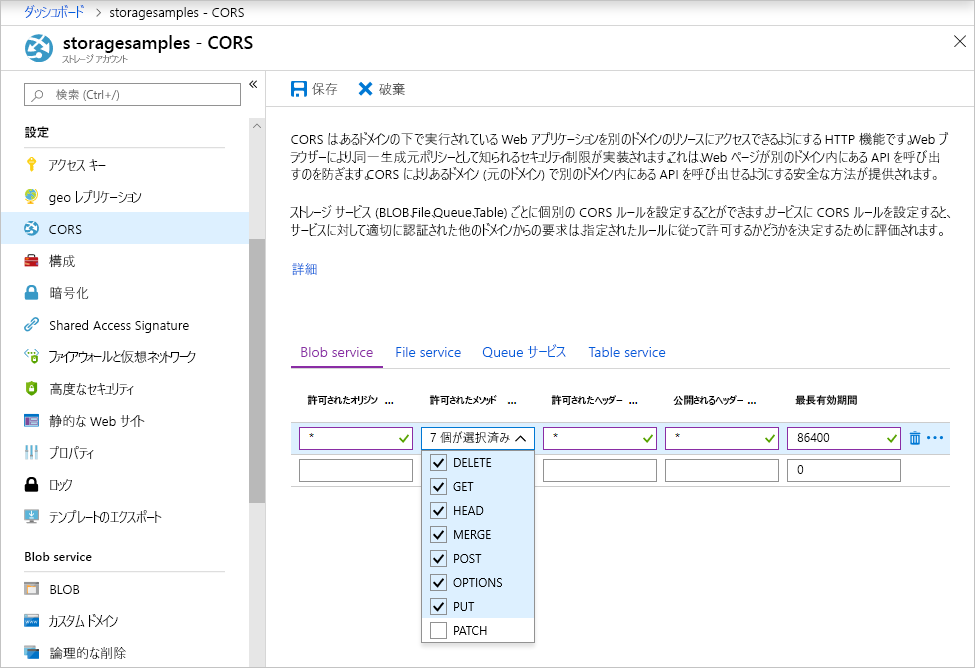

<!-- Customer intent: As a web application developer I want to interface with Azure Blob storage entirely on the client so that I can build a SPA application that is able to upload and delete files on blob storage. -->

# <a name="quickstart-upload-list-and-delete-blobs-using-javascripthtml-in-the-browser"></a>クイック スタート: ブラウザーで JavaScript と HTML を使用して BLOB をアップロード、一覧表示、および削除する
このクイック スタートでは、すべてブラウザー内で実行されるコードを使用して BLOB を管理する方法を示します。 ここで使用されている方法は、必要なセキュリティ対策を使用して BLOB ストレージ アカウントへの保護されたアクセスを確保する方法を示しています。 このクイック スタートを完了するには、[Azure サブスクリプション](https://azure.microsoft.com/free/?WT.mc_id=A261C142F)が必要です。

[!INCLUDE [storage-quickstart-tutorial-create-account-portal](../../../includes/storage-quickstart-tutorial-create-account-portal.md)]

## <a name="setting-up-storage-account-cors-rules"></a>ストレージ アカウントの CORS ルールの設定 
Web アプリケーションがクライアントから BLOB ストレージにアクセスできるようにするには、[クロス オリジン リソース共有](https://docs.microsoft.com/rest/api/storageservices/cross-origin-resource-sharing--cors--support-for-the-azure-storage-services) (CORS) を有効にするようにアカウントを構成する必要があります。 

Azure Portal に戻り、ストレージ アカウントを選択します。 新しい CORS ルールを定義するには、**[設定]** セクションに戻り、**[CORS]** リンクをクリックします。 次に、**[追加]** ボタンをクリックして、**[CORS ルールの追加]** ウィンドウを開きます。 このクイック スタートでは、オープン CORS ルールを作成します。



次の表は、各 CORS 設定の説明と、ルールを定義するために使用する値を示しています。

|Setting  |値  | [説明] |
|---------|---------|---------|
| 許可されるオリジン | * | 許容されるオリジンとして設定されるドメインの、コンマ区切りの一覧を受け入れます。 値を `*` に設定すると、すべてのドメインがストレージ アカウントにアクセスできるようになります。 |
| 許可される動詞     | delete、get、head、merge、post、options、および put | ストレージ アカウントに対して実行できる HTTP 動詞の一覧です。 このクイック スタートの目的に合わせて、利用可能なすべてのオプションを選択します。 |
| 許可されるヘッダー | * | ストレージ アカウントによって許可される要求ヘッダー (プレフィックス付きヘッダーを含む) の一覧を定義します。 値を `*` に設定すると、すべてのヘッダーがアクセスできるようになります。 |
| 公開されるヘッダー | * | アカウントによって許可される応答ヘッダーの一覧です。 値を `*` に設定すると、アカウントは任意のヘッダーを送信できるようになります。  |
| 最大期間 (秒) | 86400 | ブラウザーがプレフライト OPTIONS 要求をキャッシュする最大時間。 値を *86,400* にすると、キャッシュが丸 1 日保持されます。 |

> [!IMPORTANT]
> 運用環境で使用するすべての設定で、安全なアクセスを維持するためにストレージ アカウントが必要とする最小限の量のアクセスだけを公開します。 ここで説明されている CORS 設定は、緩やかなセキュリティ ポリシーを定義するため、クイック スタートに適しています。 ただし、これらの設定は、現実的なコンテキストには推奨しません。

次に、Azure Cloud Shell を使用して、セキュリティ トークンを作成します。

[!INCLUDE [Open the Azure cloud shell](../../../includes/cloud-shell-try-it.md)]

## <a name="create-a-shared-access-signature"></a>Shared Access Signature を作成する
Shared Access Signature (SAS) は、ブラウザーで実行されているコードによって、BLOB ストレージへの要求を認証するために使用されます。 SAS を使用すると、クライアントはアカウント アクセス キーまたは接続文字列がなくても、認証を受けることができます。 SAS の詳細については、「[Shared Access Signatures (SAS) の使用](../common/storage-dotnet-shared-access-signature-part-1.md)」を参照してください。

Azure Cloud Shell を介して Azure CLI を使用するか、Azure Storage Explorer を使用して、SAS を作成することができます。 次の表は、CLI を使用して SAS を生成するために値を指定する必要があるパラメーターを示しています。

| パラメーター      |[説明]  | Placeholder |
|----------------|-------------|-------------|
| *expiry*       | YYYY-MM-DD の形式の、アクセス トークンの有効期限。 このクイック スタートで使用する場合は、翌日の日付を入力します。 | *FUTURE_DATE* |
| *account-name* | ストレージ アカウント名。 前の手順で控えておいた名前を使用します。 | *YOUR_STORAGE_ACCOUNT_NAME* |
| *account-key*  | ストレージ アカウント キー。 前の手順で控えておいたキーを使用します。 | *YOUR_STORAGE_ACCOUNT_KEY* |

次のスクリプトは、Azure CLI を使用して、JavaScript の BLOB サービスに渡すことができる SAS を作成します。

> [!NOTE]
> 最良の結果を得るには、コマンドを Azure Cloud Shell に貼り付ける前に、パラメーター間の余分なスペースを削除します。

```bash
az storage account generate-sas
                    --permissions racwdl
                    --resource-types sco
                    --services b
                    --expiry FUTURE_DATE
                    --account-name YOUR_STORAGE_ACCOUNT_NAME
                    --account-key YOUR_STORAGE_ACCOUNT_KEY
```
各パラメーターの後の一連の値が、少しわかりにくいかもしれません。 これらのパラメーター値は、各アクセス許可の頭文字です。 次の表は、値が何の頭文字であるかを示しています。 

| パラメーター        | 値   | [説明]  |
|------------------|---------|---------|
| *アクセス許可*    | racwdl  | この SAS は、*read (読み取り)*、*append (追加)*、*create (作成)*、*write (書き込み)*、*delete (削除)*、および *list (一覧表示)* 機能を許可します。 |
| *resource-types* | sco     | SAS の影響を受けるリソースは、*service (サービス)*、*container (コンテナー)*、および *object (オブジェクト)* です。 |
| *services*       | b       | SAS の影響を受けるサービスは、*BLOB* サービスです。 |

これで SAS が生成されたので、コンソールに返された値をテキスト エディターにコピーします。 後の手順で、この値を使用します。

> [!IMPORTANT]
> 運用環境では、常に SSL を使用して SAS トークンを渡します。 また、SAS トークンはサーバーで生成され、HTML ページに送信されて、Azure Blob Storage に戻される必要があります。 考えられる 1 つのアプローチとして、サーバーレス機能を使用して SAS トークンを生成する方法があります。 Azure Portal には、JavaScript 関数を使用して SAS を生成する機能を備えた関数テンプレートが含まれています。

## <a name="implement-the-html-page"></a>HTML ページを実装する

### <a name="set-up-the-web-application"></a>Web アプリケーションをセットアップする
Azure Storage JavaScript クライアント ライブラリは、ファイル システムからは直接操作できず、Web サーバーからサービスを受ける必要があります。 そのため、以降の手順では、Node.js で単純なローカル Web サーバーを使用する方法を説明します。

> [!NOTE]
> このセクションでは、マシンに Node.js がインストールされている必要があるローカル Web サーバーを作成する方法を説明します。 Node.js をインストールしない場合は、他の任意の方法でローカル Web サーバーを実行することができます。

まず、プロジェクト用の新しいフォルダーを作成し、*azure-blobs-javascript* という名前を付けます。 次に、*azure-blobs-javascript* フォルダー内でコマンド プロンプトを開き、次のコマンドを入力して、Web サーバー モジュールをインストールするようにアプリケーションを準備します。

```bash
npm init -y
```
*init* を実行すると、Web サーバー モジュールのインストールを支援するために必要なファイルが追加されます。 モジュールをインストールするには、次のコマンドを入力します。

```bash
npm i http-server
```
次に、*package.json* ファイルを編集し、既存の *scripts* 定義を次のコード スニペットに置き換えます。

```javascript
"scripts": {
    "start": "http-server"
}
```
最後に、コマンド プロンプトで `npm start` と入力して、Web サーバーを起動します。

```bash
npm start
```

### <a name="get-the-blob-storage-client-library"></a>BLOB ストレージ クライアント ライブラリを取得する
[JavaScript クライアント ライブラリをダウンロード](https://aka.ms/downloadazurestoragejs)し、zip の内容を展開して、*bundle* フォルダー内のスクリプト ファイルを *scripts* という名前のフォルダーに配置します。

### <a name="add-the-client-script-reference-to-the-page"></a>クライアント スクリプト参照をページに追加する
*azure-blobs-javascript* フォルダーのルートに HTML ページを作成し、*index.html* という名前を付けます。 ページが作成されたら、ページに次のマークアップを追加します。

```html
<!DOCTYPE html>
<html>
    <body>
        <button id="create-button">Create Container</button>

        <input type="file" id="fileinput" />
        <button id="upload-button">Upload</button>

        <button id="list-button">List</button>
        
        <button id="delete-button">Delete</button>
    </body>
    <script src="scripts/azure-storage.blob.min.js"></script>
    <script>
        // Blob-related code goes here
    </script>
</html>
```
このマークアップは、ページに以下のものを追加します。

- *scripts/azure-storage.blob.js* への参照
- コンテナーの作成、BLOB のアップロード、一覧表示、および削除に使用されるボタン
- ファイルをアップロードするために使用される *INPUT* 要素
- ストレージ固有のコードのためのプレースホルダー

### <a name="create-an-instance-of-blobservice"></a>BlobService のインスタンスを作成する 
[BlobService](https://azure.github.io/azure-storage-node/BlobService.html) は、Azure Blob Storage へのインターフェイスを提供します。 サービスのインスタンスを作成するには、ストレージ アカウント名と、前の手順で生成された SAS を指定する必要があります。

```javascript
const account = {
    name: YOUR_STORAGE_ACCOUNT_NAME,
    sas:  YOUR_SAS
};

const blobUri = 'https://' + account.name + '.blob.core.windows.net';
const blobService = AzureStorage.Blob.createBlobServiceWithSas(blobUri, account.sas);
```

### <a name="create-a-blob-container"></a>BLOB コンテナーを作成する
BLOB サービスを作成できたので、次に、アップロードした BLOB を保持する新しいコンテナーを作成できます。 [createContainerIfNotExists](https://azure.github.io/azure-storage-node/BlobService.html#createContainerIfNotExists__anchor) メソッドは、新しいコンテナーを作成し、コンテナーが既に存在する場合もエラーは返しません。

```javascript
document.getElementById('create-button').addEventListener('click', () => {

    blobService.createContainerIfNotExists('mycontainer',  (error, container) => {
        if (error) {
            // Handle create container error
        } else {
            console.log(container.name);
        }
    });

});
```

### <a name="upload-a-blob"></a>BLOB をアップロードする
HTML フォームから BLOB をアップロードするには、選択されたファイルへの参照を *INPUT* 要素から取得します。 選択されたファイルは、要素の *type* が *file* に設定されているときに `files` 配列を介して取得できます。

スクリプトから HTML 要素を参照し、選択したファイルを BLOB サービスに渡すことができます。

```javascript
document.getElementById('upload-button').addEventListener('click', () => {

    const file = document.getElementById('fileinput').files[0];

    blobService.createBlockBlobFromBrowserFile('mycontainer', 
                                                file.name, 
                                                file, 
                                                (error, result) => {
                                                    if(error) {
                                                        // Handle blob error
                                                    } else {
                                                        console.log('Upload is successful');
                                                    }
                                                });

});
```

メソッド [createBlockBlobFromBrowserFile](https://azure.github.io/azure-storage-node/BlobService.html#createBlockBlobFromBrowserFile__anchor) は、BLOB コンテナーへのアップロードに、ブラウザー ファイルを直接使用します。

### <a name="list-blobs"></a>BLOB を一覧表示する
ファイルを BLOB コンテナーにアップロードしたら、[listBlobsSegmented](https://azure.github.io/azure-storage-node/BlobService.html#listBlobsSegmented__anchor) メソッドを使用して、コンテナー内の BLOB の一覧にアクセスします。

```javascript
document.getElementById('list-button').addEventListener('click', () => {

    blobService.listBlobsSegmented('mycontainer', null, (error, results) => {
        if (error) {
            // Handle list blobs error
        } else {
            results.entries.forEach(blob => {
                console.log(blob.name);
            });
        }
    });
    
});
```

*listBlobsSegmented* メソッドは、BLOB のコレクションを返します。 既定のコレクションの数量は 5,000 BLOB ですが、必要に応じてこの値を調整することができます。 [継続のサンプル](https://github.com/Azure/azure-storage-node/blob/master/examples/samples/continuationsample.js#L132)に、多数の BLOB を処理する方法と、クライアント ライブラリでページングがサポートされる方法が示されています。 


### <a name="delete-blobs"></a>BLOB を削除する
[deleteBlobIfExists](https://azure.github.io/azure-storage-node/BlobService.html#deleteBlobIfExists__anchor) を呼び出して、アップロードした BLOB を削除できます。

```javascript
document.getElementById('delete-button').addEventListener('click', () => {

    var blobName = YOUR_BLOB_NAME;
    blobService.deleteBlobIfExists('mycontainer', blobName, (error, result) => {
        if (error) {
            // Handle delete blob error
        } else {
            console.log('Blob deleted successfully');
        }
    });
    
});
```
> [!WARNING]
> このコード サンプルを動作させるには、*blobName* に文字列値を指定する必要があります。

## <a name="clean-up-resources"></a>リソースのクリーンアップ
このクイック スタートで作成したリソースをクリーンアップするには、[Azure Portal](https://portal.azure.com) に戻り、ストレージ アカウントを選択します。 選択後、**[概要] > [ストレージ アカウントの削除]** の順に移動して、ストレージ アカウントを削除することができます。

## <a name="next-steps"></a>次の手順
サンプルを調べて、BLOB をダウンロードする方法と、ファイルのアップロード中に進行状況を報告する方法について学習します。

> [!div class="nextstepaction"]
> [BLOB ストレージ クライアント ライブラリ](https://github.com/Azure/azure-storage-node/tree/master/browser)
