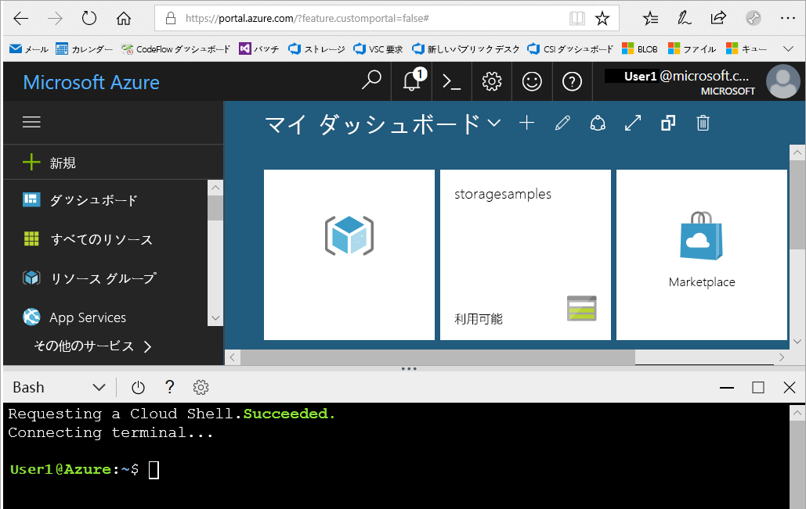

# <a name="create-a-storage-account"></a>ストレージ アカウントの作成

Azure ストレージ アカウントには、すべての Azure Storage データ オブジェクト (BLOB、ファイル、キュー、テーブル、およびディスク) が含まれます。 ストレージ アカウントでは、世界中のどこからでも HTTP または HTTPS 経由でアクセスできる Azure Storage データ用の一意の名前空間が提供されます。 Azure ストレージ アカウント内のデータは、持続性があり、高可用性で、セキュリティ保護されており、非常にスケーラブルです。

このハウツー記事では、[Azure portal](https://portal.azure.com/)、[Azure PowerShell](https://docs.microsoft.com/powershell/azure/overview)、[Azure CLI](https://docs.microsoft.com/cli/azure?view=azure-cli-latest)、または [Azure Resource Manager テンプレート](../../azure-resource-manager/resource-group-overview.md)を使ってストレージ アカウントを作成する方法を説明します。  

[!INCLUDE [updated-for-az](../../../includes/updated-for-az.md)]

## <a name="prerequisites"></a>前提条件

Azure サブスクリプションをお持ちでない場合は、開始する前に [無料アカウント](https://azure.microsoft.com/free/) を作成してください。

# <a name="portaltabazure-portal"></a>[ポータル](#tab/azure-portal)

なし。

# <a name="powershelltabazure-powershell"></a>[PowerShell](#tab/azure-powershell)

このハウツー記事には、Azure PowerShell モジュール Az バージョン 0.7 以降が必要です。 現在のバージョンを調べるには、`Get-Module -ListAvailable Az` を実行します。 インストールまたはアップグレードする必要がある場合は、[Azure PowerShell モジュールのインストール](/powershell/azure/install-Az-ps)に関するページを参照してください。

# <a name="azure-clitabazure-cli"></a>[Azure CLI](#tab/azure-cli)

次の 2 つの方法のいずれかで Azure にサインインし、Azure CLI コマンドを実行できます。

- Azure portal 内から、Azure Cloud Shell で CLI コマンドを実行できます。
- CLI をインストールして、CLI コマンドをローカルで実行できます。

### <a name="use-azure-cloud-shell"></a>Azure Cloud Shell を使用する

Azure Cloud Shell は、Azure Portal 内で直接実行できる無料の Bash シェルです。 Azure CLI は、アカウントで使用できるように事前にインストールおよび構成されています。 Azure portal の右上のセクションのメニューで **[Cloud Shell]** ボタンをクリックします。

[](https://portal.azure.com)

このボタンによって対話型のシェルが起動されます。このハウツー記事で説明する手順は、これを使って実行できます。

[](https://portal.azure.com)

### <a name="install-the-cli-locally"></a>CLI をローカルにインストールする

Azure CLI はローカルにインストールして使用することもできます。 このハウツー記事では、Azure CLI バージョン 2.0.4 以降を実行している必要があります。 バージョンを確認するには、`az --version` を実行します。 インストールまたはアップグレードが必要な場合は、[Azure CLI のインストール](/cli/azure/install-azure-cli)に関するページを参照してください。 

# <a name="templatetabtemplate"></a>[テンプレート](#tab/template)

なし。

---

## <a name="sign-in-to-azure"></a>Azure へのサインイン

# <a name="portaltabazure-portal"></a>[ポータル](#tab/azure-portal)

[Azure Portal](https://portal.azure.com) にサインインします。

# <a name="powershelltabazure-powershell"></a>[PowerShell](#tab/azure-powershell)

`Connect-AzAccount` コマンドで Azure サブスクリプションにサインインし、画面上の指示に従って認証を行います。

```powershell
Connect-AzAccount
```

# <a name="azure-clitabazure-cli"></a>[Azure CLI](#tab/azure-cli)

Azure Cloud Shell を起動するには、[Azure portal](https://portal.azure.com) にサインインします。

CLI のローカル インストールにログインするには、[az login](/cli/azure/reference-index#az-login) コマンドを実行します。

```cli
az login
```

# <a name="templatetabtemplate"></a>[テンプレート](#tab/template)

該当なし

---

## <a name="create-a-storage-account"></a>ストレージ アカウントの作成

ここまでで、ストレージ アカウントを作成する準備ができました。

すべてのストレージ アカウントは、Azure リソース グループに属している必要があります。 リソース グループは、Azure サービスをグループ化するための論理コンテナーです。 ストレージ アカウントを作成するときに、新しいリソース グループを作成するか、既存のリソース グループを使用するかを選択できます。 この記事では、新しいリソース グループを作成する方法を示します。

**汎用 v2** ストレージ アカウントでは、すべての Azure Storage サービス (BLOB、ファイル、キュー、テーブル、ディスク) へのアクセスが提供されます。 ここで説明する手順では汎用 v2 ストレージ アカウントを作成しますが、作成手順はどの種類のストレージ アカウントでも似ています。

# <a name="portaltabazure-portal"></a>[ポータル](#tab/azure-portal)

[!INCLUDE [storage-create-account-portal-include](../../../includes/storage-create-account-portal-include.md)]

# <a name="powershelltabazure-powershell"></a>[PowerShell](#tab/azure-powershell)

まず、PowerShell で [New-AzResourceGroup](/powershell/module/az.resources/new-azresourcegroup) コマンドを使用して新しいリソース グループを作成します。

```powershell
# put resource group in a variable so you can use the same group name going forward,
# without hard-coding it repeatedly
$resourceGroup = "storage-resource-group"
New-AzResourceGroup -Name $resourceGroup -Location $location
```

`-Location` パラメーターに指定するリージョンがわからない場合は、[Get-AzLocation](/powershell/module/az.resources/get-azlocation) コマンドを使用して、サブスクリプションに対してサポートされているリージョンの一覧を取得できます。

```powershell
Get-AzLocation | select Location
$location = "westus"
```

次に、[New-AzStorageAccount](/powershell/module/az.storage/New-azStorageAccount) コマンドを使って、読み取りアクセス geo 冗長ストレージ (RA-GRS) で汎用 v2 ストレージ アカウントを作成します。 ストレージ アカウントの名前は Azure 全体で一意である必要があるため、角かっこ内のプレースホルダーの値を独自の一意の値に置き換えることを忘れないでください。

```powershell
New-AzStorageAccount -ResourceGroupName $resourceGroup `
  -Name <account-name> `
  -Location $location `
  -SkuName Standard_RAGRS `
  -Kind StorageV2 
```

別のレプリケーション オプションで汎用 v2 ストレージ アカウントを作成するには、**SkuName** パラメーターを次の表の目的の値で置き換えます。

|レプリケーション オプション  |SkuName パラメーター  |
|---------|---------|
|ローカル冗長ストレージ (LRS)     |Standard_LRS         |
|ゾーン冗長ストレージ (ZRS)     |Standard_ZRS         |
|geo 冗長ストレージ (GRS)     |Standard_GRS         |
|読み取りアクセス geo 冗長ストレージ (GRS)     |Standard_RAGRS         |

# <a name="azure-clitabazure-cli"></a>[Azure CLI](#tab/azure-cli)

まず、Azure CLI の [az group create](/cli/azure/group#az_group_create) コマンドを使用して新しいリソース グループを作成します。

```azurecli-interactive
az group create \
    --name storage-resource-group \
    --location westus
```

`--location` パラメーターに指定するリージョンがわからない場合は、[az account list-locations](/cli/azure/account#az_account_list) コマンドで、サブスクリプションに対してサポートされているリージョンの一覧を取得できます。

```azurecli-interactive
az account list-locations \
    --query "[].{Region:name}" \
    --out table
```

次に、[az storage account create](/cli/azure/storage/account#az_storage_account_create) コマンドを使って、読み取りアクセス geo 冗長ストレージで汎用 v2 ストレージ アカウントを作成します。 ストレージ アカウントの名前は Azure 全体で一意である必要があるため、角かっこ内のプレースホルダーの値を独自の一意の値に置き換えることを忘れないでください。

```azurecli-interactive
az storage account create \
    --name <account-name> \
    --resource-group storage-resource-group \
    --location westus \
    --sku Standard_RAGRS \
    --kind StorageV2
```

別のレプリケーション オプションで汎用 v2 ストレージ アカウントを作成するには、**sku** パラメーターを次の表の目的の値で置き換えます。

|レプリケーション オプション  |sku パラメーター  |
|---------|---------|
|ローカル冗長ストレージ (LRS)     |Standard_LRS         |
|ゾーン冗長ストレージ (ZRS)     |Standard_ZRS         |
|geo 冗長ストレージ (GRS)     |Standard_GRS         |
|読み取りアクセス geo 冗長ストレージ (GRS)     |Standard_RAGRS         |

# <a name="templatetabtemplate"></a>[テンプレート](#tab/template)

Azure PowerShell または Azure CLI を使用して Resource Manager テンプレートをデプロイし、ストレージ アカウントを作成できます。 このハウツー記事で使うテンプレートは、[Azure Resource Manager クイックスタートのテンプレート](https://azure.microsoft.com/resources/templates/101-storage-account-create/)に関する記事からのものです。 スクリプトを実行するには、 **[使ってみる]** を選択して、Azure Cloud Shell を開きます。 スクリプトを貼り付けるには、シェルを右クリックし、 **[貼り付け]** を選択します。

```azurepowershell-interactive
$resourceGroupName = Read-Host -Prompt "Enter the Resource Group name"
$location = Read-Host -Prompt "Enter the location (i.e. centralus)"

New-AzResourceGroup -Name $resourceGroupName -Location "$location"
New-AzResourceGroupDeployment -ResourceGroupName $resourceGroupName -TemplateUri "https://raw.githubusercontent.com/Azure/azure-quickstart-templates/master/101-storage-account-create/azuredeploy.json"
```

```azurecli-interactive
echo "Enter the Resource Group name:" &&
read resourceGroupName &&
echo "Enter the location (i.e. centralus):" &&
read location &&
az group create --name $resourceGroupName --location "$location" &&
az group deployment create --resource-group $resourceGroupName --template-file "https://raw.githubusercontent.com/Azure/azure-quickstart-templates/master/101-storage-account-create/azuredeploy.json"
```

テンプレートを作成する方法を学習するには、以下をご覧ください。

- [Azure Resource Manager のドキュメント](/azure/azure-resource-manager/)。
- [ストレージ アカウント テンプレート リファレンス](/azure/templates/microsoft.storage/allversions)。
- [その他のストレージ アカウント テンプレート サンプル](https://azure.microsoft.com/resources/templates/?resourceType=Microsoft.Storage)。

---

利用可能なレプリケーション オプションの詳細については、[ストレージのレプリケーション オプション](storage-redundancy.md)に関するページを参照してください。

## <a name="clean-up-resources"></a>リソースのクリーンアップ

このハウツー記事で作成したリソースをクリーンアップする場合は、リソース グループを削除できます。 リソース グループを削除すると、関連付けられているストレージ アカウント、およびリソース グループに関連付けられているその他のリソースも削除されます。

# <a name="portaltabazure-portal"></a>[ポータル](#tab/azure-portal)

Azure Portal を使用してリソース グループを削除するには:

1. Azure Portal で左側のメニューを展開してサービスのメニューを開き、 **[リソース グループ]** を選択して、リソース グループの一覧を表示します。
2. 削除するリソース グループを見つけて、一覧の右側にある **[詳細]** ボタン ( **...** ) を右クリックします。
3. **[リソース グループの削除]** を選択し、確認します。

# <a name="powershelltabazure-powershell"></a>[PowerShell](#tab/azure-powershell)

リソース グループとそれに関連付けられているリソース (新しいストレージ アカウントを含む) を削除するには、[Remove-AzResourceGroup](/powershell/module/az.resources/remove-azresourcegroup) コマンドを使用します。

```powershell
Remove-AzResourceGroup -Name $resourceGroup
```

# <a name="azure-clitabazure-cli"></a>[Azure CLI](#tab/azure-cli)

リソース グループと関連付けられているリソース (新しいストレージ アカウントを含む) を削除するには、[az group delete](/cli/azure/group#az_group_delete) コマンドを使用します。

```azurecli-interactive
az group delete --name storage-resource-group
```

# <a name="templatetabtemplate"></a>[テンプレート](#tab/template)

リソース グループとそれに関連付けられているリソース (新しいストレージ アカウントを含む) を削除するには、Azure PowerShell または Azure CLI を使用します。

```azurepowershell-interactive
$resourceGroupName = Read-Host -Prompt "Enter the Resource Group name"
Remove-AzResourceGroup -Name $resourceGroupName
```

```azurecli-interactive
echo "Enter the Resource Group name:" &&
read resourceGroupName &&
az group delete --name $resourceGroupName
```

---

## <a name="next-steps"></a>次の手順

このハウツー記事では、汎用 v2 標準ストレージ アカウントを作成しました。 ストレージ アカウントとの間で BLOB をアップロードおよびダウンロードする方法を学習するには、Blob Storage のクイックスタートのいずれかに進みます。

# <a name="portaltabazure-portal"></a>[ポータル](#tab/azure-portal)

> [!div class="nextstepaction"]
> [Azure portal を使用して BLOB を操作する](../blobs/storage-quickstart-blobs-portal.md)

# <a name="powershelltabazure-powershell"></a>[PowerShell](#tab/azure-powershell)

> [!div class="nextstepaction"]
> [PowerShell を使用して BLOB を操作する](../blobs/storage-quickstart-blobs-powershell.md)

# <a name="azure-clitabazure-cli"></a>[Azure CLI](#tab/azure-cli)

> [!div class="nextstepaction"]
> [Azure CLI を使用して BLOB を操作する](../blobs/storage-quickstart-blobs-cli.md)

# <a name="templatetabtemplate"></a>[テンプレート](#tab/template)

> [!div class="nextstepaction"]
> [Azure portal を使用して BLOB を操作する](../blobs/storage-quickstart-blobs-portal.md)

---
