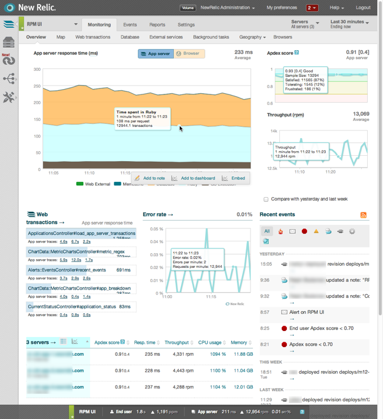

<properties urlDisplayName="New Relic App Performance Management" pageTitle="Azure の New Relic によるアプリケーション パフォーマンス管理" metaKeywords="new relic Azure, performance azure" description="Learn how to use New Relic's performance monitoring on Azure." metaCanonical="" services="web-sites" documentationCenter=".NET" title="New Relic Application Performance Management on Azure Websites" authors="new relic" solutions="" manager="carolz" editor="" />

<tags ms.service="web-sites" ms.workload="web" ms.tgt_pltfrm="na" ms.devlang="dotnet" ms.topic="article" ms.date="11/25/2014" ms.author="stepsic" />

#Azure Web サイトの New Relic によるアプリケーション パフォーマンス管理

このガイドでは、New Relic による世界クラスのパフォーマンスの監視を Azure Web サイトに追加する方法について説明します。アプリケーションに New Relic をすぐに追加できる簡単なプロセスについて説明し、New Relic の機能をいくつか紹介します。New Relic の使い方の詳細については、「[New Relic の使用](#using-new-relic)」を参照してください。

New Relic とは
--

New Relic は、実稼働アプリケーションを監視してそのパフォーマンスと信頼性を詳しく把握できるようにする開発者向けのツールです。パフォーマンス上の問題を特定して診断する時間を短縮できるように設計されており、その問題の解決に必要な情報をすぐに確認できます。

New Relic は、Web トランザクションの読み込み時間とスループットを、サーバーとユーザーのブラウザーの両方から追跡します。データベースでの処理にかかった時間の表示、時間がかかったクエリと Web 要求の分析、アップ タイムの監視と通知、アプリケーションの例外の追跡など、多数の処理を実行します。

Azure ストアの New Relic 特別料金
--

New Relic Standard は、Azure ユーザーであれば無料でご利用いただけます。
New Relic Pro は、使用している Web サイト モード (および占有モードを使用している場合はインスタンス サイズ) に基づいて複数のパッケージで提供されます。

料金情報については、[Azure ストアの New Relic のページ](http://www.windowsazure.com/ja-jp/gallery/store/new-relic/new-relic/)」を参照してください。

 
<strong>注:</strong>

コンピューティング インスタンス 10 個までについてのみ、料金を表示しています。10 を超える場合は、ボリューム ディスカウント料金について New Relic (sales@newrelic.com) までお問い合わせください。

Azure ユーザーは、New Relic エージェントのデプロイ時に、New Relic Pro の 2 週間の試用サブスクリプションをご利用になれます。

Azure ストアを使用して New Relic にサインアップする
--

New Relic は、Azure の Web ロール、Worker ロール、および Web サイトとシームレスに統合されます。

Azure ストアから New Relic に直接サインアップするには、次の簡単な 4 つの手順を実行します。

### 手順 1. Azure ストアからサインアップする

1. [Azure の管理ポータル](https://manage.windowsazure.com)にログインします。
2. 管理ポータルの下のウィンドウの **[新規]** をクリックします。
3. **[ストア]** をクリックします。
4. **[サービスの選択]** ダイアログで、**[New Relic]** をクリックし、**[次へ]** をクリックします。
5. **[個人用サービス]** ダイアログで、希望の New Relic プランを選択します。
7. Azure の設定における New Relic サービスの表示名を入力するか、既定値 **NewRelic** を使用します。この名前は、Azure ストアのサブスクライブ項目の一覧で一意になっている必要があります。
8. リージョンの値を選択します (たとえば **[米国西部]**)。
9. **[次へ]** をクリックします。
10. **[購入の確認]** ダイアログで、プランと料金情報を確認し、法律条項を確認します。条項に同意したら、**[購入]** をクリックします。
11. **[購入]** をクリックすると、New Relic アカウントの作成プロセスが開始されます。その状態は、Azure 管理ポータルで監視できます。
12. New Relic ライセンス キーを取得するには、前の手順で作成したアドオンをクリックし、**[出力値]** をクリックします。 
13. 表示されたライセンス キーをコピーします。このキーは、New Relic NuGet パッケージのインストール時に入力する必要があります。

### 手順 2.New Relic パッケージをインストールする

New Relic Web サイト エージェントは、NuGet パッケージとして配布され、Visual Studio または WebMatrix を使用して Web サイトに追加できます。Azure Web サイトで Visual Studio や WebMatrix を使用する方法については、「[ASP.NET Web アプリケーションを Azure の Web サイトにデプロイする][vswebsite]」または「[Microsoft WebMatrix を使用して Web サイトを開発してデプロイする][webmatrixwebsite]」を参照してください。

使用している開発環境に応じて次の手順を実行します。

**Visual Studio**

1. Visual Studio の Web サイト ソリューションを開きます。

2. **[ツール]、[ライブラリ パッケージ マネージャー]、[パッケージ マネージャー コンソール]** の順に選択し、パッケージ マネージャー コンソールを開きます。プロジェクトをパッケージ マネージャー コンソール ウィンドウの一番上に表示される既定のプロジェクトに設定します。

	

3. パッケージ マネージャーのコマンド プロンプトで、次のコマンドを使用してパッケージをインストールします。

		Install-Package NewRelic.Azure.WebSites

4. ライセンス キーのダイアログで、Azure ストアから受け取ったライセンス キーを入力します。

	![enter license key][vslicensekey]

<!--5. Optional: At the application name prompt, enter your app's name as it will
   appear in New Relic's dashboard. Or, use your solution name as the default.

	-->

**WebMatrix**

1. WebMatrix を使用して Web サイトを開きます。

2. リボンの **[ホーム]** タブで、**[NuGet]** を選択します。

	![nuget buton on home tab][wmnugetbutton]

3. NuGet ギャラリーで、ソースを **NuGet 公式パッケージのソース**に設定し、NewRelic.Azure.WebSites を探します。

	![nuget gallery searching for NewRelic.Azure.WebSites][wmnugetgallery]

4. **[Azure の Web サイトの New Relic]** エントリを選択し、**[インストール]** をクリックします。

5. パッケージをインストールすると、サイトに **newrelic** というフォルダーが追加されます。このフォルダーを展開し、**newrelic.config** ファイルを開きます。このファイルで、値 **REPLACE\_WITH\_LICENSE_KEY** を、Azure ストアから受け取ったライセンス キーに置き換えます。

	![newrelic folder expanded with newrelic.conf selected][newrelicconf]

	ライセンス キー情報を追加したら、**newrelic.config** ファイルへの変更を保存します。

### 手順 3.Web サイトを構成して、アプリケーションを発行する

前の手順でアプリケーションに追加した New Relic パッケージの構成は、Azure Web サイトに**アプリケーション設定**を追加することで行います。これらの設定を追加するには、次の手順を実行します。

1. [Azure 管理ポータル]にサインインします。(https://manage.windowsazure.com) Web サイトに移動します。

2. Web サイトから、**[構成]** を選択します。**[開発者分析]** セクションで、**[アドオン]** または **[カスタム]** を選択します。どちらの方法でも、出力は同じです。ただし、必要とされる入力はわずかに異なります。**[アドオン]** では、現在の New-Relic ライセンスが一覧に表示され、その中から 1 つを選択します。これに対して **[カスタム]** では、手動でライセンス キーを指定する必要があります。

	**[アドオン]** を選択した場合は、**[アドオンの選択]** で New-Relic ライセンスを選択します。

	![Image of the add-on fields][add-on]

	**[カスタム]** を選択した場合は、**[プロバイダー]** で New-Relic を選択し、**[プロバイダー キー]** にライセンスを入力します。

	![Image of the custom fields][custom]

3. **[開発者分析]** でライセンスを指定したら、**[保存]** をクリックします。保存が完了すると、ページの **[アプリケーション設定]** セクションに次の値が追加され、New-Relic がサポートされます。

	<table border="1">
	<thead>
	<tr>
	<td>キー</td>
	<td>値</td>
	</tr>
	</thead>
	<tbody>
	<tr>
	<td>COR\_ENABLE\_PROFILING</td><td>1</td>
	</tr>
	<tr>
	<td>COR\_PROFILER</td><td>{71DA0A04-7777-4EC6-9643-7D28B46A8A41}</td>
	</tr>
	<tr>
	<td>COR\_PROFILER\_PATH</td><td>C:\Home\site\wwwroot\newrelic\NewRelic.Profiler.dll</td>
	</tr>
	<tr>
	<td>NEWRELIC\_HOME</td><td>C:\Home\site\wwwroot\newrelic</td>
	</tr>
	<tr>
	<td>NEWRELIC\_LICENSEKEY</td><td>ライセンス キー</td>
	</tr>
	</tbody>
	</table> 

	
 
	<strong>注</strong> 
	
新しい <strong>アプリケーション設定</strong> が反映されるまで最大 30 秒かかる場合があります。設定をすぐに強制適用するには、Web サイトを再起動します。
 
	

4. Visual Studio または WebMatrix を使用して、アプリケーションを発行します。

### 手順 4.New Relic でアプリケーションのパフォーマンスをチェックする

New Relic のダッシュボードを表示するには、次の手順を実行します。

1. Azure ポータルで、**[管理]** をクリックします。
2. New Relic アカウントの電子メールとパスワードを使用してサインインします。
3. New Relic のメニュー バーで、**[アプリケーション]、(アプリケーションの名前)** の順にクリックします。

	**[監視] の [概要]** ダッシュボードが自動的に表示されます。

	

	**[アプリケーション]** メニューの一覧からアプリを選択すると、**[概要]** ダッシュボードに、現在のアプリ サーバーとブラウザーの情報が表示されます。

### New Relic の使用

[アプリケーション] メニューの一覧からアプリケーションを選択すると、[概要] ダッシュボードに、現在のアプリ サーバーとブラウザーの情報が表示されます。2 つのビューを切り替えるには、**[アプリ サーバー]** または **[ブラウザー]** をクリックします。

 <a href="https://newrelic.com/docs/site/the-new-relic-ui#functions">標準の New Relic UI</a> と <a href="https://newrelic.com/docs/site/the-new-relic-ui#drilldown">ダッシュボードのドリルダウン</a> の機能以外に、アプリケーションの [概要] ダッシュボードには追加の機能があります。

<table border="1">
  <thead>
    <tr>
      <th><b>目的操作</b></th>
      <th><b>これを行うには、次の手順を実行します。</b></th>
    </tr>
  </thead>
  <tbody>
    <tr>
       <td>選択したアプリケーションのサーバーまたはブラウザーのダッシュボード情報を表示する</td>
       <td> <b>[アプリ サーバー] </b> または <b> [ブラウザー]</b>  をクリックします。</td>
    </tr>
     <tr>
       <td>アプリケーションの  <a href="https://newrelic.com/docs/site/apdex" target="_blank">Apdex</a>  スコアのしきい値レベルを表示する</td>
       <td>[Apdex スコア] の  <b>[?]<b> アイコンをポイントします。</b></b></td>
    </tr>
    <tr>
       <td>世界規模の Apdex の詳細を表示する</td>
       <td>[概要] の  <b>ブラウザー</b>  ビューで、グローバル Apdex マップの任意の場所をポイントします。 <b>ヒント:</b> 選択したアプリケーションの <a href="https://newrelic.com/docs/site/geography" target="_blank">[地理]</a>ダッシュボードに直接移動するには、 <b>グローバル Apdex </b> のタイトルをクリックするか、グローバル Apdex マップの任意の場所をクリックします。</td>
    </tr>
    <tr>
       <td> <a href="https://docs.newrelic.com/docs/applications-menu/transactions-dashboard" target="_blank">[Web トランザクション] </a> ダッシュボードを表示する</td>
       <td>アプリケーションの [概要] ダッシュボードの [Web トランザクション] テーブルをクリックします。または、特定の Web トランザクションに関する詳細 ( <a href="https://newrelic.com/docs/site/key-transactions" target="_blank">主要トランザクション</a>など) を表示するには、その名前をクリックします。</td>
    </tr>
    <tr>
       <td> <a href="https://newrelic.com/docs/site/errors" target="_blank">[エラー] </a> ダッシュボードを表示する</td>
       <td>アプリケーションの [概要] ダッシュボードの [エラー率] グラフのタイトルをクリックします。 <b>ヒント:</b> [エラー] ダッシュボードは、 <b>[アプリケーション]</b> 、(アプリ)、[イベント]、[エラー] の順にクリックして表示することもできます。</td>
    </tr>
    <tr>
       <td>アプリケーションのサーバーの詳細を表示する</td>
       <td>
次のいずれかを実行します。

        <ul>
          <li>ホストのテーブル ビューと各ホストのメトリックの詳細内訳を切り替えます。</li>
          <li>個々のサーバーの名前をクリックします。</li>
          <li>個々のサーバーの Apdex スコアをポイントします。</li>
          <li>個々のサーバーの CPU 使用率またはメモリをクリックします。</li>
        </ul>
       

</td>
    </tr>
  </tbody>
</table>

以下に、ブラウザー ビューを選択したときのアプリケーションの [概要] ダッシュボードの例を示します。

## 次のステップ

詳細については、次に示すその他のリソースを参照してください。

 * [Installing the .NET Agent for Azure Web Sites (Azure の Web サイト用の .NET エージェントのインストール)](https://newrelic.com/docs/dotnet/azure-web-sites-beta#manual_install)。New Relic の .NET エージェントのインストール手順 
 * [The New Relic User Interface (New Relic ユーザー インターフェイス)](https://newrelic.com/docs/site/the-new-relic-ui)。 
New Relic UI の概要、ユーザー権限とプロファイルの設定、標準機能の使用、およびダッシュボードのドリルダウンの詳細
 * [Applications Overview (アプリケーションの概要)](https://newrelic.com/docs/site/applications-overview)。New Relic のアプリケーションの [概要] ダッシュボードを使用する際の機能
 * [Apdex](https://newrelic.com/docs/site/apdex)。Apdex によってエンド ユーザーのアプリケーションに対する満足度がどのように測定されるかに関する概要
 * [Real User Monitoring](https://newrelic.com/docs/features/real-user-monitoring)。RUM を使用して、ユーザーのブラウザーで Web ページの読み込みにかかった時間、アクセス元の地域、 
および使用しているブラウザーに関する詳細を確認する方法の概要
 * [Finding Help (ヘルプの利用)](https://newrelic.com/docs/site/finding-help):New Relic のオンライン ヘルプ センターで利用できるリソース

[webmatrixwebsite]: http://www.windowsazure.com/ja-jp/develop/net/tutorials/website-with-webmatrix/
[vswebsite]: http://www.windowsazure.com/ja-jp/develop/net/tutorials/get-started/

[wmnugetbutton]: ./media/store-new-relic-web-sites-dotnet-application-performce-management/nrwmnugetbutton.png
[wmnugetgallery]: ./media/store-new-relic-web-sites-dotnet-application-performce-management/nrwmnugetgallery.png

[newrelicconf]: ./media/store-new-relic-web-sites-dotnet-application-performce-management/nrwmlicensekey.png
[vslicensekey]: ./media/store-new-relic-web-sites-dotnet-application-performce-management/nrvslicensekey.png
[add-on]: ./media/store-new-relic-web-sites-dotnet-application-performce-management/nraddon.png
[custom]: ./media/store-new-relic-web-sites-dotnet-application-performce-management/nrcustom.png

<!--HONumber=35.1-->
