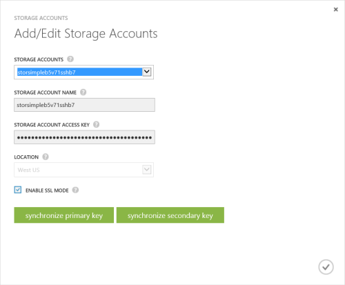

<properties 
   pageTitle="StorSimple ストレージ アカウントの管理"
   description="[構成] ページを使用してストレージ アカウントを追加、編集、または削除する方法や、ストレージ アカウントのセキュリティ キーのローテーションを行う方法について説明します。"
   services="storsimple"
   documentationCenter="NA"
   authors="SharS"
   manager="adinah"
   editor="tysonn" />
<tags 
   ms.service="storsimple"
   ms.devlang="NA"
   ms.topic="article"
   ms.tgt_pltfrm="NA"
   ms.workload="TBD"
   ms.date="04/27/2015"
   ms.author="v-sharos" />

# StorSimple ストレージ アカウントの管理

## 概要

**\[構成\]** ページには、StorSimple Manager サービスで作成できるすべてのグローバル サービス パラメーターが表示されます。これらのパラメーターはこのサービスに接続されているすべてのデバイスに適用でき、次のものが含まれます。

- ストレージ アカウント 
- 帯域幅テンプレート 
- アクセス制御レコード 

このチュートリアルでは、**\[構成\]** ページを使用してストレージ アカウントを追加、編集、または削除する方法や、ストレージ アカウントのセキュリティ キーのローテーションを行う方法について説明します。

 ![\[構成\] ページ](./media/storsimple-manage-storage-accounts/HCS_ConfigureService.png)

ストレージ アカウントには、クラウド サービス プロバイダーを使用してストレージ アカウントにアクセスするためにデバイスで使用される資格情報が含まれます。Microsoft Azure ストレージ アカウントの場合、これらはアカウント名やプライマリ アクセス キーなどの資格情報です。

 **\[構成\]** ページには、課金サブスクリプションに対して作成されるすべてのストレージ アカウントが、次の情報を含む表形式で表示されます。

- **\[名前\]** - アカウントの作成時に割り当てられた一意の名前。
- **\[SSL が有効\]** - SSL が有効で、デバイスとクラウドの間の通信がセキュア チャネル経由かどうか。
- **\[使用元\]** - ストレージ アカウントを使用しているボリュームの数。

**\[構成\]** ページで実行できるストレージ アカウント関連の最も一般的なタスクは、次のとおりです。

- ストレージ アカウントの追加 
- ストレージ アカウントの編集 
- ストレージ アカウントの削除 
- ストレージ アカウントのキー ローテーション 

## ストレージ アカウントの種類

StorSimple デバイスで使用できるストレージ アカウントには、次の 3 つの種類があります。

- **自動生成されたストレージ アカウント** - 名前のとおり、このストレージ アカウントは、サービスが最初に作成されるときに自動的に生成されます。このストレージ アカウントの作成方法の詳細については、「[オンプレミスの StorSimple デバイスのデプロイ](storsimple-deployment-walkthrough.md)」の「手順 1. 新しいサービスを作成する」を参照してください。 
- **サービス サブスクリプションのストレージ アカウント** - サービスと同じサブスクリプションに関連付けられている Azure ストレージ アカウントです。このストレージ アカウントの作成方法の詳細については、[Azure ストレージ アカウント](storage-create-storage-account.md)に関するページを参照してください。 
- **サービス サブスクリプションの外部のストレージ アカウント** - これらは、サービスに関連付けられていない、サービスが作成される前に存在していた可能性のある Azure ストレージ アカウントです。

## ストレージ アカウントの追加

ストレージ アカウントを追加するには、一意の表示名と、\(指定されたクラウド サービス プロバイダーによって\) ストレージ アカウントにリンクされているアクセス資格情報を指定します。SSL \(Secure Sockets Layer\) モードを有効にして、デバイスとクラウド間のネットワーク通信用にセキュリティで保護されたチャネルを作成することもできます。

特定のクラウド サービス プロバイダーに対して複数のアカウントを作成できます。ただし、ストレージ アカウントを作成した後はクラウド サービス プロバイダーを変更できないことに注意してください。

ストレージ アカウントの保存中、サービスは、クラウド サービス プロバイダーとの通信を試みます。この時点で、資格情報と指定したアクセス マテリアルが認証されます。ストレージ アカウントは、認証が成功した場合にのみ作成されます。認証に失敗した場合は、適切なエラー メッセージが表示されます。

### ストレージ アカウントを追加するには

1. サービスのランディング ページでサービスを選択し、ダブルクリックします。この操作により、**\[クイック スタート\]** ページが表示されます。 
2. **\[構成\]** ページにアクセスします。
3. **\[ストレージ アカウントの追加/編集\]** をクリックします。
4.  **\[ストレージ アカウントの追加/編集\]** ダイアログ ボックスで、次の操作を行います。
  1. **\[新規追加\]** をクリックします。
  2. ストレージ アカウントの名前を入力します。
  3. Microsoft Azure ストレージ アカウントのプライマリ **ストレージ アカウント アクセス キー**を入力します。
  4. デバイスとクラウド間のネットワーク通信用にセキュリティで保護されたチャネルを作成するために、**\[SSL モードを有効にする\]** チェック ボックスをオンにします。プライベート クラウド内で運用している場合にのみ、**\[SSL モードを有効にする\]** チェック ボックスをオフにします。
  5. チェック マーク アイコン  をクリックします。ストレージ アカウントが正常に作成されると通知されます。

    

5. 新しく作成されたストレージ アカウントは、**\[構成\]** ページの **\[ストレージ アカウント\]** に表示されます。**\[保存\]** をクリックして、新しく作成されたストレージ アカウントを保存します。確認を求められたら、**\[OK\]** をクリックします。

## ストレージ アカウントの編集

ボリューム コンテナーで使用されるストレージ アカウントを編集できます。現在使用中のストレージ アカウントを編集する場合、変更できるフィールドは、ストレージ アカウントのアクセス キーに限られます。新しいストレージ アクセス キーを指定し、更新された設定を保存できます。

### ストレージ アカウントを編集するには

1. サービスのランディング ページでサービスを選択し、サービス名をダブルクリックします。**\[構成\]** をクリックします。

2. **\[ストレージ アカウントの追加/編集\]** をクリックします。

3. **\[ストレージ アカウントの追加/編集\]** ダイアログ ボックスで、次の操作を行います。

  1. **\[ストレージ アカウント\]** ボックスの一覧で、変更する既存のアカウントを選択します。これには、サービスを最初に作成したときに自動的に生成されたストレージ アカウントも含まれます。
  2. 必要に応じて、**\[SSL モードを有効にする\]** の設定を変更できます。
  3. ストレージ アカウント アクセス キーのローテーションを行うことを選択できます。キーのローテーションを行う方法の詳細については、「[ストレージ アカウントのキー ローテーション](#key-rotation-of-storage-accounts)」を参照してください。
  4. チェック マーク アイコン  をクリックして、設定を保存します。**\[構成\]** ページの設定が更新されます。**\[保存\]** をクリックして、新しく更新された設定を保存します。

    
  
## ストレージ アカウントの削除

> [AZURE.IMPORTANT]ストレージ アカウントは、ボリューム コンテナーで使用されていない場合にのみ削除できます。ストレージ アカウントがボリューム コンテナーで使用されている場合は、最初にボリューム コンテナーを削除し、次に関連するストレージ アカウントを削除します。

### ストレージ アカウントを削除するには

1. StorSimple Manager サービスのランディング ページでサービスを選択し、サービス名をダブルクリックします。**\[構成\]** をクリックします。

2. ストレージ アカウントの表形式のリストで、削除するアカウントにマウス ポインターを合わせます。

3. そのストレージ アカウントの右端の列に削除アイコン \(\* \*\[ x \]\* \*\) が表示されます。資格情報を削除するために、**\[x\]** アイコンをクリックします。

4. 確認を求めるメッセージが表示されたら、**\[はい\]** をクリックして削除操作を続行します。表形式のリストが更新され、変更が反映されます。

## ストレージ アカウントのキー ローテーション

セキュリティ上の理由から、データ センターではキー ローテーションが必要になることがよくあります。

ストレージ アカウントは、各 Microsoft Azure サブスクリプションにつき 1 つまたは複数作成できます。これらのアカウントへのアクセスは、各ストレージ アカウントのサブスクリプションとアクセス キーによって制御されます。

ストレージ アカウントを作成するときに、Microsoft Azure によって 2 つの 512 ビット ストレージ アクセス キーが生成されます。これらは、ストレージ アカウントにアクセスするときに認証の目的で使用されます。2 つのストレージ アクセス キーがあると、ストレージ サービスまたはそのサービスへのアクセスを中断することなくキーを再生成できます。現在使用されているキーは *プライマリ* キーと呼ばれ、バックアップ キーは*セカンダリ* キーと呼ばれます。Microsoft Azure StorSimple デバイスがクラウド ストレージ サービス プロバイダーにアクセスするときは、これら 2 つのキーのどちらかを指定する必要があります。

## キーのローテーションとは

通常、アプリケーションは、キーの 1 つだけを使用してデータにアクセスします。一定の期間が経過した後、アプリケーションで使用するキーを 2 番目のキーに切り替えることができます。アプリケーションを 2 番目のキーに切り替えた後、最初のキーを廃棄して新しいキーを生成できます。2 つのキーをこの方法で使用することにより、アプリケーションはダウンタイムなしでデータにアクセスできます。

ストレージ アカウント キーは、常に、暗号化された形式でサービスに格納されます。ただし、これらは、StorSimple Manager サービスを使用してリセットできます。このサービスは、Storage サービスで作成されたアカウントや、StorSimple Manager サービスが最初に作成されたときに生成された既定のストレージ アカウントなど、同じサブスクリプション内のすべてのストレージ アカウントに対してプライマリ キーとセカンダリ キーを取得できます。StorSimple Manager サービスは常に、管理ポータルからこれらのキーを取得し、暗号化して格納します。

## ローテーションのワークフロー

Microsoft Azure 管理者は、\(Microsoft Azure Storage サービス経由で\) ストレージ アカウントに直接アクセスすることによって、プライマリ キーまたはセカンダリ キーを再生成または変更できます。StorSimple Manager サービスは、この変更を自動的に認識しません。

StorSimple Manager サービスにこの変更を認識させるには、StorSimple Manager サービスにアクセスし、ストレージ アカウントにアクセスし、\(変更されたキーに応じて\) プライマリ キーまたはセカンダリ キーを同期する必要があります。その後、サービスは最新のキーを取得し、キーを暗号化して、デバイスに送信します。

### サービスと同じサブスクリプション内のストレージ アカウントのキーを同期するには

1. **\[サービス\]** ページで、**\[構成\]** タブをクリックします。

2. **\[ストレージ アカウントの追加/編集\]** をクリックします。

3. ダイアログ ボックスで、次の操作を行います。

  1. キーを同期するストレージ アカウントを選択します。ストレージ アカウント キーは表示されるときに暗号化されます。
  2. StorSimple Manager サービスで、Microsoft Azure Storage サービスで以前に変更されたキーを更新する必要があります。プライマリ アクセス キーが変更 \(再生成\) されている場合は、**\[プライマリ キーの同期\]** をクリックします。セカンダリ キーが変更されている場合は、**\[セカンダリ キーの同期\]** をクリックします。

    

### サービス サブスクリプションの外部のストレージ アカウントのキーを同期するには

1. **\[サービス\]** ページで、**\[構成\]** タブをクリックします。

2. **\[ストレージ アカウントの追加/編集\]** をクリックします。

3. ダイアログ ボックスで、次の操作を行います。

  1. アクセス キーを更新するストレージ アカウントを選択します。
  2. ストレージ アクセス キーは、StorSimple Manager サービスで更新する必要があります。この場合は、ストレージ アクセス キーを見ることができます。**\[ストレージ アカウント アクセス キー\]** ボックスに新しいキーを入力します。 
  3. 変更を保存します。ストレージ アカウント アクセス キーが更新されます。

## 次のステップ

[StorSimple のセキュリティ](storsimple-security.md) の詳細を確認する
<!--HONumber=52-->
