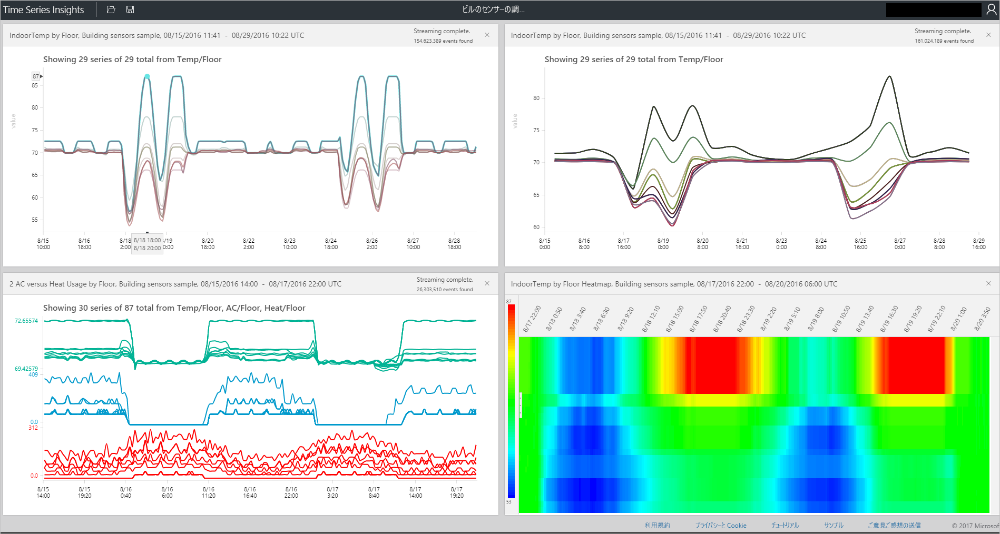

# Azure Time Series Insights エクスプローラー

この記事では、Azure Time Series Insights の[エクスプローラー Web アプリ](https://insights.timeseries.azure.com/)の一般提供版で使用できる機能とオプションについて説明します。 Time Series Insights エクスプローラーは、サービスによって提供される強力なデータ可視化機能を備え、ご利用の環境からアクセスすることができます。

Azure Time Series Insights は、数十億件の IoT イベントを同時に簡単に調査および分析できるようにする、フル マネージドの分析、ストレージ、および視覚化サービスです。 データの全体像が示され、これを使用してすばやく IoT ソリューションを検証したり、ミッション クリティカルなデバイスに発生するコストのかかるダウンタイムを回避したりできます。 ほぼリアルタイムで隠れた傾向を発見したり、異常を特定したり、根本原因分析を実施したりできます。 現在、Time Series Insights エクスプローラーはパブリック プレビュー段階にあります。

> [!TIP]
> デモンストレーション環境を使用したガイド ツアーについては、[Azure Time Series Insights のクイック スタート](time-series-quickstart.md)を参照してください。

## ビデオ

### Time Series Insights エクスプ ローラーを使用したデータのクエリについて説明します。  

> [!VIDEO https://www.youtube.com/embed/SHFPZvrR71s]

>[!NOTE]
>先行するビデオ「<a href="https://www.youtube.com/watch?v=6ehNf6AJkFo">Getting started with TSI using an Azure IoT Solution Accelerator (Azure IoT Solution Accelerator を使用した TSI について)</a>」をご覧ください。

## 前提条件

Time Series Insights エクスプローラーを使用するための前提条件は、以下のとおりです。

- Time Series Insights 環境を作成します。 詳細については、[Time Series Insights の使用を開始する方法](./time-series-insights-get-started.md)に関するページを参照してください。
- 環境内でお使いのアカウントへの[アクセス権を与えます](time-series-insights-data-access.md)。
- そこに [IoT Hub](time-series-insights-how-to-add-an-event-source-iothub.md) または [Event Hub](time-series-insights-how-to-add-an-event-source-eventhub.md) のイベント ソースを追加します。

## データを調査しクエリを実行する

イベント ソースを Time Series Insights 環境に接続してから数分以内に、時系列データを調査し、クエリを実行できます。

1. 開始するには、Web ブラウザーで [Time Series Insights エクスプローラー](https://insights.timeseries.azure.com/)を開き、ウィンドウの左側で環境を選択します。 アクセスできるすべての環境がアルファベット順に一覧表示されます。

1. 環境を選択したら、上部にある **[FROM]\(開始\)** および **[TO]\(終了\)** 構成を使用するか、指定する期間をクリックしてドラッグします。  右上にある虫眼鏡をクリックするか、選択した期間を右クリックして **[検索]** を選択します。  

1. **[Auto On]\(自動 オン\)** ボタンを選択することで、毎分自動的に状態を更新することもできます。 **[Auto-On]\(自動オン\)** ボタンは、メインの視覚化のコンテンツではなく、可用性チャートにのみ適用されます。

1. Azure Cloud アイコンから Azure Portal の環境に移動できます。

   

1. 次に、選択した期間内のすべてのイベントの数を示すグラフが表示されます。  ここでは多くのことを制御できます。

    **[期間編集パネル]**:期間のスペースで環境に対するクエリを実行します。  これは画面左側にあります。
      - **[メジャー]**:このドロップダウンではすべての数値列 (**Double**) が表示されます
      - **[次で分割]**:このドロップダウンではカテゴリ列 (**文字列**) が表示されます
      - [メジャー] の隣にあるコントロール パネルから、ステップ補間の有効化、最小値と最大値の表示、Y 軸の調整を行うことができます。  さらに、表示されるデータが総数であるか、平均値であるか、またはデータの合計であるかを調整できます。
      - 同じ X 軸上に表示する期間を最大 5 つまで追加できます。  **コピー ダウン** ボタンを使用して追加期間を追加するか、**[追加]** ボタンをクリックして新しい期間を追加します。

        

      - **[述語]**:述語を使用すると、次に示す一連のオペランドを使用して、イベントをすばやくフィルター処理できます。 選択/クリックによって検索を実施した場合、述語はその検索に基づいて自動的に更新されます。 サポートされるオペランドの型には以下が含まれます。

         |Operation  |サポートされている型  |メモ  |
         |---------|---------|---------|
         |`<`、`>`、`<=`, `>=`     |  Double、DateTime、TimeSpan       |         |
         |`=`、`!=`、`<>`     | String、Bool、Double、DateTime、TimeSpan、NULL        |         |
         |IN     | String、Bool、Double、DateTime、TimeSpan、NULL        |  すべてのオペランドは同じ型か NULL 定数である必要があります。        |
         |HAS     | String        |  右側で使用できるのは定数文字列リテラルのみです。 空の文字列と NULL は使用できません。       |

      - **クエリの例**

         

1. **[Interval Size]\(間隔のサイズ\)** スライダー ツールを使用して、同じ期間の間隔を拡大または縮小できます。  これにより、緩やかな傾向を示す長期間からミリ秒単位の短期間に至るまで、より細かく動作を制御できます。粒度の細かい、高解像度のデータ片を表示することが可能になります。 スライダーの既定の開始点は、解像度、クエリ速度、および粒度のバランスをとって、選択したデータが最適に表示されるよう設定されます。

1. **タイム ブラシ** ツールを使用すると、簡単に期間と期間の間を移動できます。直感的な UX を中心にして、複数の時間範囲間をシームレスに移動できます。

1. **保存**コマンドを使用すると、現在のクエリを保存し、環境の他のユーザーと共有できます。 **開く**を使用すると、保存したすべてのクエリと、アクセスできる環境内の他のユーザーのすべての共有クエリを表示できます。

   

## データの視覚化

1. **パースペクティブ ビュー** ツールを使用すると、同時に 4 つまでの固有のクエリを表示できます。 パースペクティブ ビュー ボタンはグラフの右上隅にあります。  

   

1. **[グラフ]** を使用すると、データを視覚的に調査できます。 グラフ ツールには次のものが含まれます。

    - **選択/クリック**によって、特定の期間や単一のデータ系列を選択できます。  
    - 選択した期間の中で、ズームしたりイベントを調査したりできます。  
    - データ系列の中で、系列を別の列で分割したり、系列を新しい期間として追加したり、選択した系列だけを表示したり、選択した系列を除外したり、その系列をピン留めしたり、選択した系列からイベントを調査したりできます。
    - グラフの左側のフィルター領域では表示されるすべてのデータ系列を確認できます。また、値または名前の順に並び替えたり、すべてのデータ系列を表示したり、ピン留めされたデータ系列またはピン留めされていないデータ系列だけを表示したりできます。  また、単一のデータ系列を選択して、系列を別の列で分割したり、系列を新しい期間として追加したり、選択した系列だけを表示したり、選択した系列を除外したり、その系列をピン留めしたり、選択した系列からイベントを調査したりできます。
    - 複数の期間を同時に表示する場合は、グラフの右上隅にあるボタンを使用して、期間を等間隔に配置したり、重ねたり、データ系列に関する追加データを表示したり、すべての期間で同じ Y 軸を使用したりできます。

    

1. **ヒートマップ**を使用して、特定のクエリで固有の、または異常なデータ系列をすばやく見分けることができます。 ヒートマップとして視覚化できるのは 1 つの検索期間だけです。

    

1. **イベント**:選択または右クリックして [Explore Events]\(イベントの探索\) を選択すると、イベント パネルが利用可能になります。  ここでは、すべての未加工のイベントを表示したり、イベントを JSON または CSV ファイルとしてエクスポートしたりできます。 Time Series Insights により、すべての生データが格納されます。

    

1. イベントを調査した後、**[統計]** タブをクリックしてパターンと列の統計を公開します。  

    - **[パターン]**: この機能では、選択されたデータ領域の中の統計的に最も有意なパターンが積極的に表示されます。 これによって、時間とエネルギーを保証する最適なパターンを理解するために何千ものイベントを確認する必要がなくなります。 さらに、Time Series Insights ではこれらの統計的に有意なパターンに直接取りかかって、分析の実施を続けられます。 この機能は、履歴データの事後分析にも役立ちます。

    - **[列の統計]**:列の統計では、選択された期間の選択されたデータ系列の各列のデータを分解する、グラフ作成とテーブルが提供されます。  

      

ここまでで、Time Series Insights エクスプローラー Web アプリ内で使用できるさまざまな機能とオプションが確認できました。

## 次の手順

- Time Series Insights 環境の[問題を診断して解決する方法](time-series-insights-diagnose-and-solve-problems.md)について学習します。

- [Azure Time Series Insights クイック スタート](time-series-quickstart.md)のガイド ツアーを参照します。
