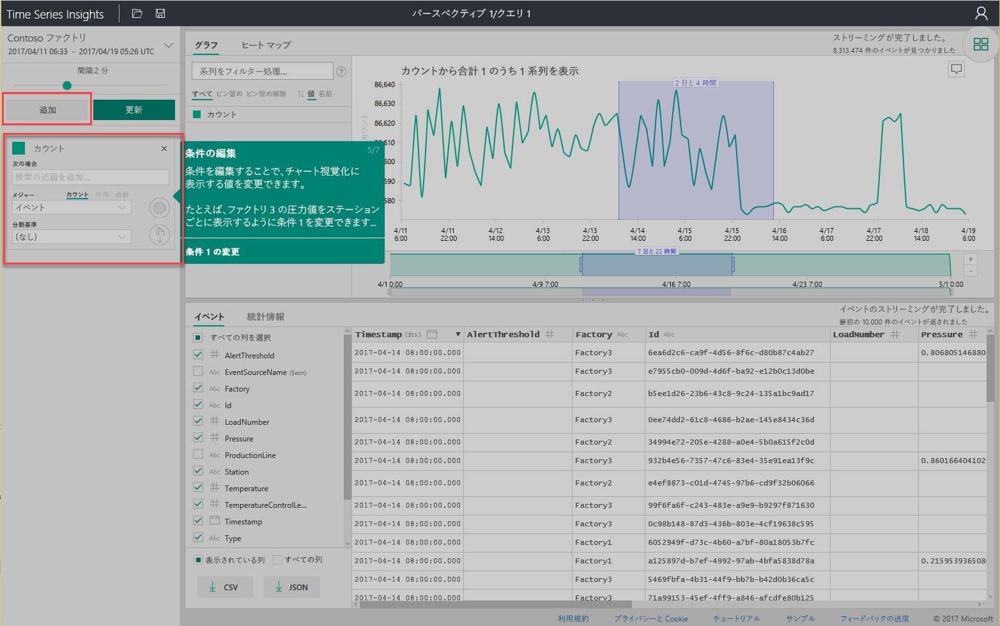

# クイック スタート: Azure Time Series Insights の探索
このクイック スタートでは、無料のデモンストレーション環境で Azure Time Series Insights エクスプローラーの使用を開始する方法を示します。 Web ブラウザーを使用して大量の IoT データを視覚化する方法について説明した後、Time Series Insights エクスプローラーの主な機能について説明します。 

Azure Time Series Insights は、数十億件の IoT イベントを同時に簡単に調査および分析できるようにする、完全管理型の分析、ストレージ、および視覚化サービスです。 データのグローバルなビューが表示され、隠れた傾向の発見、異常の特定、および根本原因の分析をほぼリアルタイムで実行できるようになるため、IoT ソリューションをすばやく検証して、ミッション クリティカルなデバイスのコストのかかるダウンタイムを回避できます。  時系列データを格納またはクエリする必要のあるアプリケーションを構築している場合は、Time Series Insights の REST API を使用して開発できます。

Azure サブスクリプションをお持ちでない場合は、開始する前に[無料の Azure アカウント](https://azure.microsoft.com/free/?ref=microsoft.com&utm_source=microsoft.com&utm_medium=docs&utm_campaign=visualstudio)を作成してください。

## デモ環境で Time Series Insights エクスプローラーを探索する

1. ブラウザーで [https://insights.timeseries.azure.com/demo](https://insights.timeseries.azure.com/demo) にアクセスします。 

2. メッセージが表示されたら、Azure アカウントの資格情報を使用して Time Series Insights エクスプローラーにログインします。 
 
3. Time Series Insights のクイック ツアー ページが表示されます。 **[次へ]** をクリックしてクイック ツアーを開始します。

   ![[Next]\(次へ\) をクリックします](media/quickstart/quickstart1.png)

4. **日時選択パネル**が表示されます。 このパネルを使用して、視覚化する期間を選択します。

   

5. リージョン内をクリックしてドラッグしてから、**[検索]** ボタンをクリックします。
 
    

   Time Series Insights には、指定した期間のグラフが表示されます。 折れ線グラフを使用して、フィルター処理、ピン留め、並べ替え、積み重ねなどのさまざまなアクションを実行できます。 

   **日時選択パネル**に戻るには、次に示すように下矢印をクリックします。

   

6. 新しい検索用語を追加するには、**[用語] パネル**で **[追加]** をクリックします。

   

7. グラフでは、リージョンを選択し、そのリージョンを右クリックして **[Explore Events] \(イベントの探索)** を選択できます。
 
   ![[Explore Events] (イベントの探索)](media/quickstart/quickstart6.png)

   探索しているリージョンの生データのグリッドが表示されます。

   

8. 用語を編集してグラフ内の値を変更し、別の用語を追加して異なる型の値を相互に関連付けます。

   

9. アドホックのシリーズ フィルター処理を行うには、**[Filter series...] \(シリーズのフィルター処理...)** ボックスにフィルター用語を入力します。 クイック スタートの場合は、「**Station5**」と入力して、そのステーションの温度と圧力を相互に関連付けます。
 
   ![[Filter series] (シリーズのフィルター処理)](media/quickstart/quickstart9.png)

クイック スタートを完了したら、別の視覚化を作成するためにサンプル データ セットを試してみることができます。 

### 次の手順
独自の Time Series Insights 環境を作成する準備ができました。
> [!div class="nextstepaction"]
> [Time Series Insights 環境の計画](time-series-insights-environment-planning.md)
