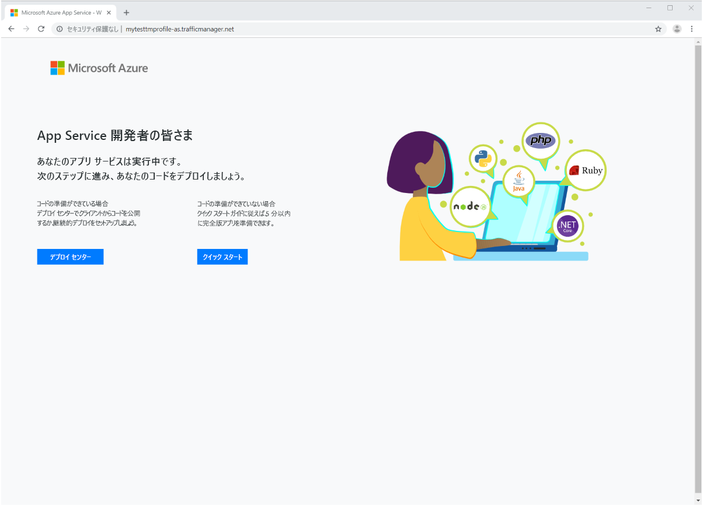

# クイック スタート: Web アプリケーションの高可用性を実現する Traffic Manager プロファイルの作成

このクイック スタートでは、Web アプリケーションの高可用性を実現する Traffic Manager プロファイルの作成方法について説明します。 

このクイック スタートで取り上げるシナリオでは、それぞれ異なる Azure リージョンで稼働する 2 つの Web アプリケーション インスタンスを使用します。 [エンドポイントの優先度](traffic-manager-routing-methods.md#priority)に基づく Traffic Manager プロファイルを作成することによって、対象アプリケーションが実行されているプライマリ サイトにユーザー トラフィックを誘導できるようにします。 Web アプリケーションは Traffic Manager によって常時監視されており、プライマリ サイトが利用できない状態になると、バックアップ サイトへの自動フェールオーバーが行われます。

Azure サブスクリプションをお持ちでない場合は、開始する前に [無料アカウント](https://azure.microsoft.com/free/?WT.mc_id=A261C142F) を作成してください。

## Azure へのサインイン 
Azure Portal ( https://portal.azure.com ) にサインインします。

## 前提条件
このクイック スタートは、それぞれ異なる Azure リージョン ("*米国東部*" と "*西ヨーロッパ*") で稼働する 2 つの Web アプリケーション インスタンスがデプロイされていることを前提としています。 この 2 つの Web アプリケーション インスタンスが、Traffic Manager のプライマリ エンドポイントとバックアップ エンドポイントとして機能します。

1. 画面の左上で、**[リソースの作成]** > **[Web]** > **[Web アプリ]** > **[作成]** の順に選択します。
2. **[Web アプリ]** で、次の情報を入力または選択します。指定がない箇所には、既定の設定を入力してください。

     | Setting         | 値     |
     | ---              | ---  |
     | Name           | Web アプリの一意の名前を入力します。  |
     | リソース グループ          | **[新規]** を選択し、「*myResourceGroupTM1*」と入力します。 |
     | App Service プラン/場所         | **[新規]** を選択します。  [App Service プラン] に「*myAppServicePlanEastUS*」と入力し、**[OK]** を選択します。 
     |      Location  |   米国東部        |
    |||

3. **作成**を選択します。
4. Web アプリが正常にデプロイされると、既定の Web サイトが作成されます。
5. 手順 1. から手順 3. を繰り返して、別の Azure リージョンに次の設定で 2 つ目の Web サイトを作成します。

     | Setting         | 値     |
     | ---              | ---  |
     | Name           | Web アプリの一意の名前を入力します。  |
     | リソース グループ          | **[新規]** を選択し、「*myResourceGroupTM2*」と入力します。 |
     | App Service プラン/場所         | **[新規]** を選択します。  [App Service プラン] に「*myAppServicePlanWestEurope*」と入力し、**[OK]** を選択します。 
     |      Location  |   西ヨーロッパ      |
    |||

## Traffic Manager プロファイルの作成
エンドポイントの優先度に基づいてユーザー トラフィックを誘導する Traffic Manager プロファイルを作成します。

1. 画面の左上で、**[リソースの作成]** > **[ネットワーク]** > **[Traffic Manager プロファイル]** > **[作成]** の順に選択します。
2. **[Traffic Manager プロファイルの作成]** で、次の情報を入力するか選択し、それ以外の設定では既定値をそのまま使用して、**[作成]** を選択します。
    
    | Setting                 | 値                                              |
    | ---                     | ---                                                |
    | Name                   | この名前は trafficmanager.net ゾーン内で一意である必要があります。結果的に、Traffic Manager プロファイルへのアクセスに使用される DNS 名 **trafficmanager.net** になるためです。|
    | ルーティング方法          | **優先順位**によるルーティング方法を選択します。|
    | サブスクリプション            | サブスクリプションを選択します。|
    | リソース グループ          | **[既存]** を選択し、*[myResourceGroupTM1]* を選択します。|
    |Location |これはリソース グループの場所を指定する設定であり、グローバルにデプロイされる Traffic Manager プロファイルには影響しません。|
    |||
    
    
   

## Traffic Manager エンドポイントの追加

すべてのユーザー トラフィックのルーティング先となるプライマリ エンドポイントとして、"*米国東部*" に Web サイトを追加します。 "*西ヨーロッパ*" に、バックアップ エンドポイントとして Web サイトを追加します。 プライマリ エンドポイントが使用できない場合、トラフィックは自動的にセカンダリ エンドポイントにルーティングされます。

1. ポータルの検索バーで、前のセクションで作成した Traffic Manager プロファイルの名前を検索し、表示された結果からそのプロファイルを選択します。
2. **[Traffic Manager プロファイル]** の **[設定]** セクションで **[エンドポイント]** をクリックし、**[追加]** をクリックします。
3. 次の情報を入力するか選択し、それ以外の設定では既定値をそのまま使用して、**[OK]** を選択します。

    | Setting                 | 値                                              |
    | ---                     | ---                                                |
    | type                    | Azure エンドポイント                                   |
    | Name           | myPrimaryEndpoint                                        |
    | ターゲット リソースの種類           | App Service                          |
    | ターゲット リソース          | **[アプリ サービスの選択]** で、同じサブスクリプションにある Web Apps の一覧を表示します。 **[リソース]** で、最初のエンドポイントとして追加する App Service を選択します。 |
    | 優先順位               | **[1]** を選択します。 この結果、このエンドポイント正常な状態である場合、すべてのトラフィックがここに送信されます。    |
    
4. 次の Web Apps エンドポイントに対して手順 2. と 3. を繰り返します。 必ず **[優先順位]** の値を **[2]** に設定してこのエンドポイント追加してください。
5.  両方のエンドポイントは、追加が完了すると、**[Traffic Manager プロファイル]** に、監視ステータスが **[オンライン]** の状態で表示されます。

    

## Traffic Manager プロファイルのテスト
このセクションではまず、Traffic Manager プロファイルのドメイン名を決め、プライマリ エンドポイントがダウンしたときに Traffic Manager がセカンダリ エンドポイントに対してフェールオーバーするようすを確認します。
### DNS 名の決定
1.  ポータルの検索バーで、前のセクションで作成した **Traffic Manager プロファイル**の名前を検索します。 表示された結果で、Traffic Manager プロファイルをクリックします。
2. **[Overview]** をクリックします。
3. **[Traffic Manager プロファイル]** に、新しく作成した Traffic Manager プロファイルの DNS 名が表示されます。
  
   

### Traffic Manager の動作確認

1. Web ブラウザーで、Traffic Manager プロファイルの DNS 名を入力して、Web アプリの既定の Web サイトを確認します。 このクイック スタート シナリオでは、**優先度 1** に設定されたプライマリ エンドポイントにすべての要求がルーティングされます。

2. Traffic Manager のフェールオーバー動作を確認するために、次の手順でプライマリ サイトを無効にします。
    1. [Traffic Manager プロファイル] ページで **[設定]**>**[エンドポイント]**>*[MyPrimaryEndpoint]* を選択します。
    2. *[MyPrimaryEndpoint]* で **[無効]** を選択します。 
    3. プライマリ エンドポイント *MyPrimaryEndpoint* の状態が **[無効]** として表示されます。
3. Web ブラウザーで確実に Web サイトを表示するために、Traffic Manager プロファイルの DNS 名を前の手順からコピーします。 プライマリ エンドポイントが無効になると、ユーザー トラフィックがセカンダリ エンドポイントにルーティングされます。

## リソースのクリーンアップ
必要がなくなったら、リソース グループ、Web アプリケーション、およびすべての関連リソースを削除します。 そのためには、リソース グループ (*myResourceGroupTM1* および*myResourceGroupTM2*) を選択し、**[削除]** をクリックします。

## 次の手順
このクイック スタートでは、ユーザー トラフィックを誘導することによって Web アプリケーションの高可用性を実現する Traffic Manager プロファイルを作成しました。 トラフィックのルーティングについて理解を深めるために、引き続き Traffic Manager のチュートリアルをご覧ください。

> [!div class="nextstepaction"]
> [Traffic Manager のチュートリアル](traffic-manager-configure-performance-routing-method.md)

