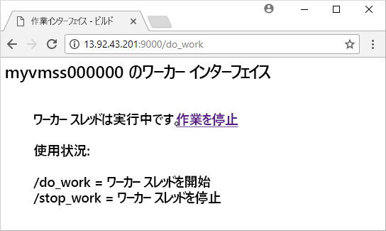
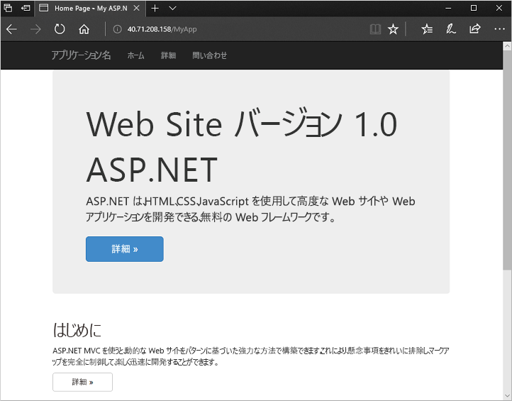

# <a name="create-a-virtual-machine-scale-set-with-the-azure-cli-20"></a>Azure CLI 2.0 を使用して仮想マシン スケール セットを作成する
仮想マシン スケール セットを使用すると、同一の自動スケールの仮想マシンのセットをデプロイおよび管理できます。 スケール セット内の VM の数を手動で拡張したり、CPU などのリソースの使用率、メモリの需要、またはネットワーク トラフィックに基づいて自動的にスケーリングするルールを定義したりできます。 この入門記事では、Azure Resource Manager テンプレートを使用して仮想マシン スケール セットを作成します。 スケール セットは、[Azure CLI 2.0](virtual-machine-scale-sets-create-cli.md)、[Azure PowerShell](virtual-machine-scale-sets-create-powershell.md)、または [Azure ポータル](virtual-machine-scale-sets-create-portal.md)を使用して作成することもできます。


## <a name="overview-of-templates"></a>テンプレートの概要
Azure Resource Manager テンプレートを使用して、関連するリソースのグループをデプロイできます。 テンプレートは JavaScript Object Notation (JSON) で記述され、アプリケーションの Azure インフラストラクチャ環境全体を定義します。 1 つのテンプレートで、仮想マシン スケール セットの作成、アプリケーションのインストール、および自動スケール ルールの構成を実行できます。 変数やパラメーターを使用してこのテンプレートを再利用することで、既存のスケール セットを更新したり、追加のスケール セットを作成したりできます。 テンプレートは、Azure ポータル、Azure CLI 2.0、Azure PowerShell を介してデプロイすることも、継続的インテグレーション/継続的配信 (CI/CD) パイプラインから呼び出すこともできます。

テンプレートの詳細については、「[Azure Resource Manager の概要](https://docs.microsoft.com/azure/azure-resource-manager/resource-group-overview#template-deployment)」を参照してください。


## <a name="define-a-scale-set"></a>スケール セットを定義する
テンプレートは、各リソースの種類の構成を定義します。 仮想マシン スケール セットのリソースの種類は、個々の VM に似ています。 仮想マシン スケール セットのリソースの種類のコア部分は次のとおりです。

| プロパティ                     | プロパティの説明                                  | テンプレート値の例                    |
|------------------------------|----------------------------------------------------------|-------------------------------------------|
| 型                         | 作成する Azure リソースの種類                            | Microsoft.Compute/virtualMachineScaleSets |
| name                         | スケール セットの名前                                       | myScaleSet                                |
| location                     | スケール セットを作成する場所                     | 米国東部                                   |
| sku.name                     | 各スケール セット インスタンスの VM サイズ                  | Standard_A1                               |
| sku.capacity                 | 最初に作成する VM インスタンスの数           | 2                                         |
| upgradePolicy.mode           | 変更が発生した場合の VM インスタンスのアップグレード モード              | 自動                                 |
| imageReference               | VM インスタンスに使用するプラットフォームまたはカスタム イメージ | Canonical Ubuntu Server 16.04-LTS         |
| osProfile.computerNamePrefix | 各 VM インスタンス名のプレフィックス                     | myvmss                                    |
| osProfile.adminUsername      | 各 VM インスタンスのユーザー名                        | azureuser                                 |
| osProfile.adminPassword      | 各 VM インスタンスのパスワード                        | P@ssw0rd!                                 |

 次のスニペットは、テンプレート内のコア スケール セットのリソース定義を示しています。 サンプルを短くするために、仮想ネットワーク インターフェイス カード (NIC) の構成は示されていません。 スケール セット テンプレートをカスタマイズするために、VM サイズや初期容量を変更したり、別のプラットフォームやカスタム イメージを使用したりできます。

```json
{
  "type": "Microsoft.Compute/virtualMachineScaleSets",
  "name": "myScaleSet",
  "location": "East US",
  "apiVersion": "2016-04-30-preview",
  "sku": {
    "name": "Standard_A1",
    "capacity": "2"
  },
  "properties": {
    "upgradePolicy": {
      "mode": "Automatic"
    },
    "virtualMachineProfile": {
      "storageProfile": {
        "osDisk": {
          "caching": "ReadWrite",
          "createOption": "FromImage"
        },
        "imageReference":  {
          "publisher": "Canonical",
          "offer": "UbuntuServer",
          "sku": "16.04-LTS",
          "version": "latest"
        }
      },
      "osProfile": {
        "computerNamePrefix": "myvmss",
        "adminUsername": "azureuser",
        "adminPassword": "P@ssw0rd!"
      }
    }
  }
}
```


## <a name="install-an-application"></a>アプリケーションをインストールする
スケール セットをデプロイするとき、VM 拡張機能によって、デプロイ後の構成とオートメーション タスク (アプリのインストールなど) を提供できます。 スクリプトは、Azure ストレージや GitHub からダウンロードできます。また、拡張機能の実行時に Azure Portal に提供することもできます。 拡張機能をスケール セットに適用するには、上記のリソース例に *extensionProfile* セクションを追加します。 拡張機能プロファイルは、通常、次のプロパティを定義します。

- 拡張機能の種類
- 拡張機能の発行元
- 拡張機能のバージョン
- 構成またはインストール スクリプトの場所
- VM インスタンスで実行するコマンド

拡張機能を使用してアプリケーションをインストールする 2 つの方法を見てみましょう。カスタム スクリプト拡張機能を使用して Python アプリを Linux にインストールするか、PowerShell DSC 拡張機能を使用して ASP.NET アプリを Windows にインストールします。

### <a name="python-http-server-on-linux"></a>Linux 上の Python HTTP サーバー
[Linux 上の Python HTTP サーバー](https://github.com/Azure/azure-quickstart-templates/tree/master/201-vmss-bottle-autoscale)では、カスタム スクリプト拡張機能を使用して、[Bottle](http://bottlepy.org/docs/dev/)、Python Web フレームワーク、および単純な HTTP サーバーをインストールします。 

*fileUris* には 2 つのスクリプト  - *installserver.sh*と *workserver.py*が定義されます。 これらのファイルが GitHub からダウンロードされた後、*commandToExecute*によって、インストールと構成が行われるアプリの `bash installserver.sh` が定義されます。

```json
"extensionProfile": {
  "extensions": [
    {
      "name": "AppInstall",
      "properties": {
        "publisher": "Microsoft.Azure.Extensions",
        "type": "CustomScript",
        "typeHandlerVersion": "2.0",
        "autoUpgradeMinorVersion": true,
        "settings": {
          "fileUris": [
            "https://raw.githubusercontent.com/Azure/azure-quickstart-templates/master/201-vmss-bottle-autoscale/installserver.sh",
            "https://raw.githubusercontent.com/Azure/azure-quickstart-templates/master/201-vmss-bottle-autoscale/workserver.py"
          ],
          "commandToExecute": "bash installserver.sh"
        }
      }
    }
  ]
}
```

### <a name="aspnet-application-on-windows"></a>Windows 上の ASP.NET アプリケーション
[Windows 上の ASP.NET アプリケーション](https://github.com/Azure/azure-quickstart-templates/tree/master/201-vmss-windows-webapp-dsc-autoscale) サンプル テンプレートでは、PowerShell DSC 拡張機能を使用して、IIS で実行される ASP.NET MVC アプリをインストールします。 

インストール スクリプトは、GitHub からダウンロードされます。これは *url* として定義されます。 次に、拡張機能は、*IISInstall.ps1* スクリプトの *InstallIIS* を実行します。これらは *Script*と *function* として定義されます。 ASP.NET アプリ自体は Web 配置パッケージとして提供され、GitHub からダウンロードされます。これは、*WebDeployPackagePath* として定義されます。

```json
"extensionProfile": {
  "extensions": [
    {
      "name": "Microsoft.Powershell.DSC",
      "properties": {
        "publisher": "Microsoft.Powershell",
        "type": "DSC",
        "typeHandlerVersion": "2.9",
        "autoUpgradeMinorVersion": true,
        "forceUpdateTag": "1.0",
        "settings": {
          "configuration": {
            "url": "https://raw.githubusercontent.com/Azure/azure-quickstart-templates/master/201-vmss-windows-webapp-dsc-autoscale/DSC/IISInstall.ps1.zip",
            "script": "IISInstall.ps1",
            "function": "InstallIIS"
          },
          "configurationArguments": {
            "nodeName": "localhost",
            "WebDeployPackagePath": "https://raw.githubusercontent.com/Azure/azure-quickstart-templates/master/201-vmss-windows-webapp-dsc-autoscale/WebDeploy/DefaultASPWebApp.v1.0.zip"
          }
        }
      }
    }
  ]
}
```

## <a name="deploy-the-template"></a>テンプレートのデプロイ
[Linux 上の Python HTTP サーバー](https://github.com/Azure/azure-quickstart-templates/tree/master/201-vmss-bottle-autoscale)または [Windows 上の ASP.NET MVC アプリケーション](https://github.com/Azure/azure-quickstart-templates/tree/master/201-vmss-windows-webapp-dsc-autoscale) テンプレートをデプロイする最も簡単な方法は、GitHub の readme ファイルにある **[Deploy to Azure]** ボタンを使用することです。  サンプル テンプレートは、PowerShell または Azure CLI を使用してデプロイすることもできます。

### <a name="azure-cli-20"></a>Azure CLI 2.0
次のように Azure CLI 2.0 を使用して、Linux に Python HTTP サーバーをインストールできます。

```azurecli-interactive
# Create a resource group
az group create --name myResourceGroup --location EastUS

# Deploy template into resource group
az group deployment create \
    --resource-group myResourceGroup \
    --template-uri https://raw.githubusercontent.com/Azure/azure-quickstart-templates/master/201-vmss-bottle-autoscale/azuredeploy.json
```

アプリが動いていることを確認するには、次のように [az network public-ip show](/cli/azure/network/public-ip#az_network_public_ip_show) を使用してロード バランサーのパブリック IP アドレスを取得します。

```azurecli-interactive
az network public-ip list \
    --resource-group myResourceGroup \
    --query [*].ipAddress -o tsv
```

ロード バランサーのパブリック IP アドレスを *http://<publicIpAddress>: 9000/do_work* 形式で Web ブラウザーに入力します。 ロード バランサーは、次の例に示すように、VM インスタンスのいずれかにトラフィックを配分します。




### <a name="azure-powershell"></a>Azure PowerShell
次のように Azure PowerShell を使用して、ASP.NET アプリケーションを Windows にインストールできます。

```azurepowershell-interactive
# Create a resource group
New-AzureRmResourceGroup -Name myResourceGroup -Location EastUS

# Deploy template into resource group
New-AzureRmResourceGroupDeployment `
    -ResourceGroupName myResourceGroup `
    -TemplateFile https://raw.githubusercontent.com/Azure/azure-quickstart-templates/master/201-vmss-windows-webapp-dsc-autoscale/azuredeploy.json
```

アプリが動いているのを確認するには、[Get-AzureRmPublicIpAddress](/powershell/module/azurerm.network/get-azurermpublicipaddress) を使用してロード バランサーのパブリック IP アドレスを取得します。

```azurepowershell-interactive
Get-AzureRmPublicIpAddress -ResourceGroupName myResourceGroup | Select IpAddress
```

ロード バランサーのパブリック IP アドレスを *http://<publicIpAddress>: /MyApp* 形式で Web ブラウザーに入力します。 ロード バランサーは、次の例に示すように、VM インスタンスのいずれかにトラフィックを配分します。




## <a name="clean-up-resources"></a>リソースのクリーンアップ
必要がなくなったら、次のように [az group delete](/cli/azure/group#az_group_delete) を使用して、リソース グループ、スケール セット、およびすべての関連リソースを削除できます。

```azurecli-interactive 
az group delete --name myResourceGroup
```


## <a name="next-steps"></a>次の手順
