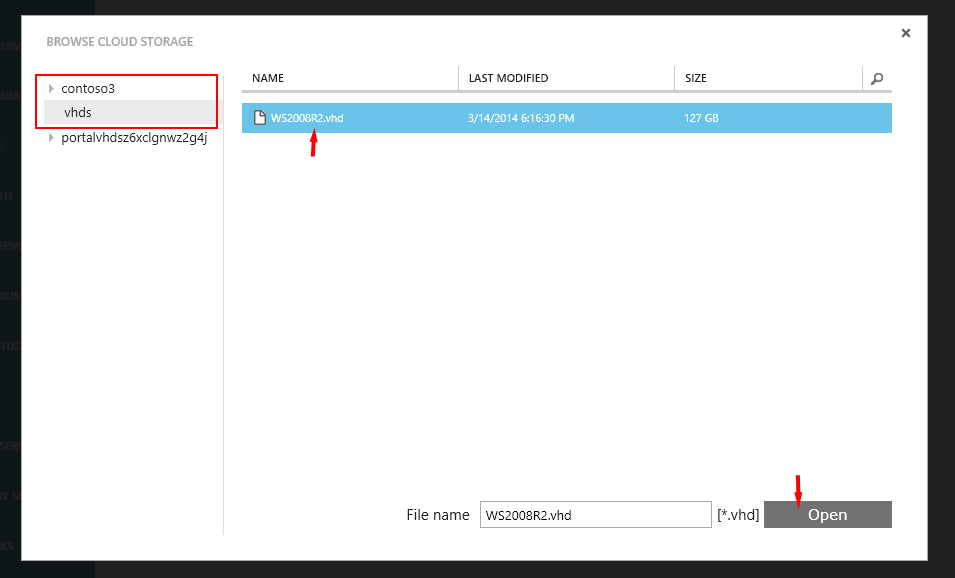

<properties pageTitle="Windows Server VHD の作成と Azure へのアップロード" description="Windows Server オペレーティング システムを格納した仮想ハード ディスク (VHD) を作成して Azure にアップロードする方法について説明します。" services="virtual-machines" documentationCenter="" authors="KBDAzure" manager="timlt" editor="tysonn"/>

<tags ms.service="virtual-machines" ms.workload="infrastructure-services" ms.tgt_pltfrm="vm-windows" ms.devlang="na" ms.topic="article" ms.date="01/19/2015" ms.author="kathydav"/>

#Windows Server VHD の作成と Azure へのアップロード#

この記事では、イメージを使用してそのイメージを基にした仮想マシンを作成するための、オペレーティング システムの仮想ハード ディスク (VHD) をアップロードする方法について説明します。Microsoft Azure でのディスクとイメージの詳細については、「[Azure でのディスクおよびイメージについて](http://msdn.microsoft.com/ja-jp/library/windowsazure/jj672979.aspx)」を参照してください。

> [AZURE.NOTE] イメージに基づいて仮想マシンを作成する場合は、その仮想マシンで実行する予定のアプリケーションに合わせてオペレーティング システムの設定をカスタマイズできます。この構成はその仮想マシン用に保存され、イメージには影響しません。手順については、「[カスタム仮想マシンの作成方法](http://www.windowsazure.com/ja-jp/documentation/articles/virtual-machines-windows-tutorial/)」を参照してください。

##前提条件##
この記事では、次の項目があることを前提としています。

1. **Azure サブスクリプション** - アカウントがない場合は、無料の試用アカウントを数分で作成することができます。詳細については、[Azure アカウントの作成に関するページ](http://www.windowsazure.com/ja-jp/develop/php/tutorials/create-a-windows-azure-account/)を参照してください。  

2. **Microsoft Azure PowerShell** - Microsoft Azure PowerShell モジュールをインストールし、サブスクリプションを使用するように構成しておきます。このモジュールをダウンロードするには、[Microsoft Azure のダウンロード ページ](http://www.windowsazure.com/ja-jp/downloads/)にアクセスしてください。モジュールをインストールして構成するためのチュートリアルは、[こちら](http://www.windowsazure.com/ja-jp/documentation/articles/install-configure-powershell/)で入手できます。[Add-AzureVHD](http://msdn.microsoft.com/ja-jp/library/azure/dn495173.aspx) コマンドレットを使用して VHD をアップロードできます。

3. **.vhd ファイルに格納された、サポートされている Windows オペレーティング システム** - サポートされている Windows Server オペレーティング システムを仮想ハード ディスクにインストールしておきます。.vhd ファイルを作成するツールはいくつかあります。Hyper-V などの仮想化ソリューションを使用して仮想マシンを作成し、オペレーティング システムをインストールすることができます。詳細については、「[Hyper-V の役割のインストールと仮想マシンの構成](http://technet.microsoft.com/ja-jp/library/hh846766.aspx)」を参照してください。

> [AZURE.NOTE] VHDX 形式は、Microsoft Azure ではサポートされていません。Hyper-V マネージャーまたは [Convert-VHD コマンドレット](http://technet.microsoft.com/ja-jp/library/hh848454.aspx)を使用して、ディスクを VHD 形式に変換できます。変換についてのチュートリアルは、[こちら](http://blogs.msdn.com/b/virtual_pc_guy/archive/2012/10/03/using-powershell-to-convert-a-vhd-to-a-vhdx.aspx)をご覧ください。
 
 次の Windows Server のバージョンがサポートされています。

  <TABLE BORDER="1" WIDTH="600">
  <TR BGCOLOR="#E9E7E7">
    <TH>OS</TH>
    <TH>SKU</TH>
    <TH>Service Pack</TH>
    <TH>アーキテクチャ</TH>
  </TR>
  <TR>
    <TD>Windows Server 2012 R2</TD>
    <TD>すべてのエディション</TD>
    <TD>該当なし</TD>
    <TD>x64</TD>
  </TR>
  <TR>
    <TD>Windows Server 2012</TD>
    <TD>すべてのエディション</TD>
    <TD>該当なし</TD>
    <TD>x64</TD>
  </TR>
  <TR>
    <TD>Windows Server 2008 R2</TD>
    <TD>すべてのエディション</TD>
    <TD>SP1</TD>
    <TD>x64</TD>
  </TR>
  </TABLE>

このタスクの手順は次のとおりです。

- [手順 1.アップロードするイメージを準備する] []
- [手順 2.Azure にストレージ アカウントを作成する] []
- [手順 3.Azure への接続を準備する] []
- [手順 4..vhd ファイルをアップロードする] []

## 手順 1.アップロードするイメージを準備する ##

イメージを Azure にアップロードする前に、Sysprep コマンドを使用してイメージを一般化する必要があります。Sysprep の使い方の詳細については、「[Sysprep の使用方法:紹介](http://technet.microsoft.com/ja-jp/library/bb457073.aspx)」を参照してください。

オペレーティング システムがインストールされている仮想マシンから、次の手順を実行します。

1. オペレーティング システムにログインします。

2. 管理者としてコマンド プロンプト ウィンドウを開きます。ディレクトリを **%windir%\system32\sysprep** に変更し、 `sysprep.exe` を実行します。

	

3.	**[システム準備ツール]** ダイアログ ボックスが表示されます。

	

4.  **[システム準備ツール]** で **[システムの OOBE (Out-of-Box Experience) に入る]** を選択し、[一般化する] チェック ボックスがオンになっていることを確認します。

5.  **[シャットダウン オプション]** の **[シャットダウン]** を選択します。

6.  **[OK]** をクリックします。 

## 手順 2.Azure でストレージ アカウントを作成する ##

仮想マシンを作成するために Azure で使用できる .vhd ファイルをアップロードするには、Azure のストレージ アカウントが必要です。Azure の管理ポータルを使用して、ストレージ アカウントを作成できます。

1. Azure 管理ポータルにサインインします。

2. コマンド バーで、**[新規]** をクリックします。

3. **[データ サービス]**、**[ストレージ]**、**[簡易作成]** の順にクリックします。

	

4. 次のようにフィールドを指定します。
	
	- **[URL]** で、ストレージ アカウントの URL で使用するサブドメイン名を入力します。文字数は 3 ～ 24 文字で、アルファベット小文字と数字を使用できます。この名前は、対応するサブスクリプションの BLOB リソース、キュー リソース、またはテーブル リソースのアドレス指定に使用される URL のホスト名になります。
			
	- ストレージ アカウントの**場所またはアフィニティ グループ**を選択します。アフィニティ·グループを使用すると、クラウド サービスとストレージを同じデータセンターに配置できます。
		 
	- ストレージ アカウントの **Geo レプリケーション**を使用するかどうかを決定します。Geo レプリケーションは既定で有効です。このオプションでは、ユーザーのコスト負担なしで、データが 2 次拠点にコピーされるため、1 次拠点で大規模な障害が発生した場合に、2 次拠点にストレージをフェールオーバーすることができます。2 次拠点は自動的に割り当てられ、変更することはできません。法律上の要件または組織のポリシー上、クラウド方式のストレージの場所を厳格に管理する必要がある場合は、Geo レプリケーションを無効にすることができます。ただし、後で Geo レプリケーションを有効に戻すと、既存データを 2 次拠点にコピーするためのデータ転送料金が 1 回だけ発生することに注意してください。Geo レプリケーションなしのストレージ サービスも割引価格で提供されています。ストレージ アカウントの Geo レプリケーションの管理の詳細については、「[ストレージ アカウントの作成、管理、削除](../storage-create-storage-account/#replication-options)。

	

5. **[ストレージ アカウントの作成]** をクリックします。作成したアカウントが **[ストレージ]** に表示されます。

	

6. 次に、アップロードした VHD のコンテナーを作成します。ストレージ アカウント名をクリックし、次に **[コンテナー]** をクリックします。

	

7. **[コンテナーを作成する]** をクリックします。

	

8. **[名前]** にコンテナーの名前を入力し、**[アクセス ポリシー]** を選択します。

	

	> [AZURE.NOTE] 既定では、コンテナーはプライベートであり、アカウント所有者のみがアクセスできます。コンテナー内の BLOB にはパブリック読み取りアクセスを許可し、コンテナーのプロパティやメタデータにはアクセスを許可しない場合は、[パブリック BLOB] オプションを使用します。コンテナーと BLOB に完全パブリック読み取りアクセスを許可するには、[パブリック コンテナー] オプションを使用します。

## 手順 3.Microsoft Azure への接続を準備する ##

.vhd ファイルをアップロードする前に、コンピューターと Azure のサブスクリプションの間にセキュリティで保護された接続を確立する必要があります。接続の確立には、Microsoft Azure Active Directory 方式または証明書方式を使用できます。

<h3>Microsoft Azure AD 方式を使用する</h3>

1. Azure PowerShell コンソール ウィンドウを開きます。手順については、「[方法:Microsoft Azure PowerShell のインストール](#Install)」。

2. 次のコマンドを入力します。  
	`Add-AzureAccount`
	
	このコマンドによりサインイン ウィンドウが開きますので、職場や学校のアカウントを使用してサインインできます。

	

3. Azure により資格情報が認証および保存され、ウィンドウが閉じます。

<h3>証明書方式を使用する</h3> 

1. Azure PowerShell コンソールを開きます。 

2.	次のコマンドを入力します。 
	`Get-AzurePublishSettingsFile`。

3. ブラウザー ウィンドウが開き、.publishsettings ファイルをダウンロードするよう求められます。これには、Microsoft Azure のサブスクリプションについての情報と証明書が含まれています。

	

3. .publishsettings ファイルを保存します。 

4. 次のコマンドを入力します。 
	`Import-AzurePublishSettingsFile <PathToFile>`

	ここで、`<PathToFile>` は .publishsettings ファイルへの完全なパスです。 

	詳細については、「[Microsoft Azure コマンドレットの概要](http://msdn.microsoft.com/ja-jp/library/windowsazure/jj554332.aspx)」を参照してください 
	
	PowerShell のインストールと構成についての詳細は、「[Microsoft Azure PowerShell のインストールおよび構成方法](http://www.windowsazure.com/ja-jp/documentation/articles/install-configure-powershell/)」を参照してください 

## 手順 4..vhd ファイルをアップロードする ##

.vhd ファイルをアップロードするときは、BLOB ストレージ内であればどこにでも .vhd ファイルを置くことができます。以下のコマンドの例では、**BlobStorageURL** は手順 2 で作成したストレージ アカウントの URL であり、**YourImagesFolder** は BLOB ストレージ内でイメージを格納するコンテナーです。**VHDName** は、仮想ハード ディスクを識別するために管理ポータルに表示されるラベルです。**PathToVHDFile** は、.vhd ファイルの完全なパスとファイル名です。 

1. 前の手順で使用した Azure PowerShell ウィンドウで、次のように入力します。

	`Add-AzureVhd -Destination "<BlobStorageURL>/<YourImagesFolder>/<VHDName>.vhd" -LocalFilePath <PathToVHDFile>`
	
	

	Add-AzureVhd コマンドレットの詳細については、[Add-AzureVhd に関するページ](http://msdn.microsoft.com/ja-jp/library/dn495173.aspx)を参照してください。

##手順 5.カスタム イメージの一覧にイメージを追加する ##
.vhd をアップロードしたら、サブスクリプションに関連付けられたカスタム イメージの一覧に、その .vhd をイメージとして追加します。

1. 管理ポータルで、**[すべてのアイテム]** の **[仮想マシン]** をクリックします。

2. [仮想マシン] で、**[イメージ]** をクリックします。

3. 次に、**[イメージの作成]** をクリックします。

	

4. **[VHD からのイメージの作成]** で、以下の手順を実行します。
 	

	- **[名前]** を指定します
	- **[説明]** を指定します
	- **[VHD の URL]** を指定するには、フォルダー ボタンをクリックして、次の次のウィンドウを開きます
 
	

	- VHD があるストレージ アカウントを選択し、**[開く]** をクリックします。これにより、**[VHD からのイメージの作成]** ウィンドウに戻ります。
	- **[VHD からのイメージの作成]** ウィンドウに戻ったら、[オペレーティング システム ファミリ] を選択します。
	- **[この VHD に関連付けられた仮想マシンで Sysprep を実行しました]** をクリックして、手順 1. でオペレーティング システムを一般化したことを確認し、**[OK]** をクリックします。 

	

5. **オプション:** 管理ポータルの代わりに Add-azurevmimage コマンドレットを使用して、VHD をイメージとして追加できます。	Azure PowerShell コンソールで、次のように入力します。

	`Add-AzureVMImage -ImageName <Your Image's Name> -MediaLocation <location of the VHD> -OS <Type of the OS on the VHD>`
	
	

6. ここまでの手順を完了すると、**[イメージ]** タブを選択したときに、新しいイメージが一覧に表示されます。 

	

	これで、仮想マシンを作成する際に **[マイ イメージ]** で新しいイメージが使用可能になりました。手順については、「[Windows Server を実行する仮想マシンの作成](http://www.windowsazure.com/ja-jp/documentation/articles/virtual-machines-windows-tutorial/)」を参照してください。

	

	> [AZURE.TIP] VM を作成しようとするときにエラーが発生し、「VHD https://XXXXX... は YYYY バイトの仮想サイズをサポートしていません。このサイズは整数 (MB 単位) でなければなりません。」というエラー メッセージが表示される場合は、VHD が整数の MB ではないことを意味します。VHD のサイズを修正する必要があります。管理ポータルの代わりに Add-azurevmimage PowerShell コマンドレットを使用してイメージを追加してください (上記の手順 5 を参照)。Azure コマンドレットは、VHD が Azure 要件を満たしていることを確認します。
	
## 次のステップ ##
 

仮想マシンを作成したら、SQL Server 仮想マシンを作成してみてください。手順については、「[Microsoft Azure での SQL Server 仮想マシンのプロビジョニング](http://www.windowsazure.com/ja-jp/documentation/articles/virtual-machines-provision-sql-server/)」を参照してください。 

[手順 1.アップロードするイメージを準備する]: #prepimage
[手順 2.Azure にストレージ アカウントを作成する]: #createstorage
[手順 3.Azure への接続を準備する]: #prepAzure
[手順 4..vhd ファイルをアップロードする]: #upload

<!--HONumber=42-->
