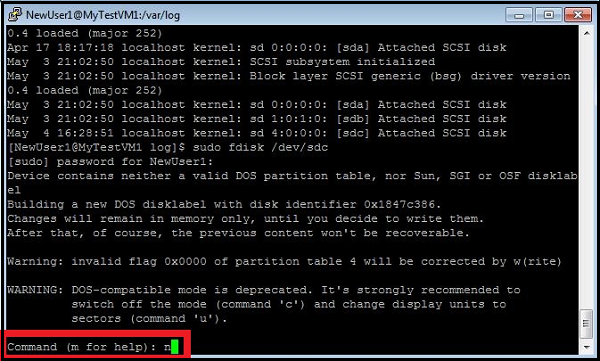
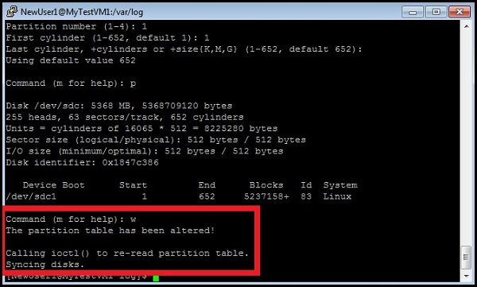

<properties 
	pageTitle="Azure 上で Linux を実行する仮想マシンへのディスクの接続" 
	description="データ ディスクを Azure 仮想マシンに接続し、初期化して、使用できる状態にする方法について説明します。" 
	services="virtual-machines" 
	documentationCenter="" 
	authors="KBDAzure" 
	manager="timlt" 
	editor="tysonn"/>

<tags 
	ms.service="virtual-machines" 
	ms.workload="infrastructure-services" 
	ms.tgt_pltfrm="vm-linux" 
	ms.devlang="na" 
	ms.topic="article" 
	ms.date="1/26/2015" 
	ms.author="kathydav"/>

#データ ディスクを Linux 仮想マシンに接続する方法

空のディスクと、データが含まれているディスクのどちらも接続できます。どちらの場合も、ディスクは、実際には、Azure ストレージ アカウントに配置されている .vhd ファイルです。また、ディスクを接続した後に、初期化して、使用できる状態にする必要があります。 

> [AZURE.NOTE] 仮想マシンのデータを格納するには、1 つ以上の個別のディスクを使用することをお勧めします。Azure の仮想マシンを作成するとき、オペレーティング システム ディスクと一時ディスクが表示されます。**データの格納に一時ディスクを使用しないでください。**名前が示すとおり、D ドライブは一時的なストレージのみを提供します。Azure Storage に配置されていないため、冗長性やバックアップは提供しません。 
> 一時ディスクは通常、Azure Linux Agent によって管理され、**/mnt/resource** (または Ubuntu イメージでは **/mnt**) に自動的にマウントされます。一方、Linux では、データ ディスクはカーネルによって `/dev/sdc` という名前が付けられる場合があります。その場合、ユーザーはこのリソースをパーティション分割し、フォーマットした上でマウントする必要があります。詳細については、[Azure Linux エージェント ユーザー ガイド](http://azure.microsoft.com/manage/linux/how-to-guides/linux-agent-guide/)を参照してください。

- [方法:空のディスクの接続](#attachempty)
- [方法:既存のディスクの接続](#attachexisting)
- [方法:Linux での新しいデータ ディスクの初期化](#initializeinlinux)

[WACOM.INCLUDE [howto-attach-disk-windows-linux](../includes/howto-attach-disk-windows-linux.md)]

##方法:Linux での新しいデータ ディスクの初期化

1. 「[Linux を実行する仮想マシンにログオンする方法][logonlinux]」に示された手順に従って仮想マシンに接続します。

2. SSH のウィンドウで、次のコマンドを入力し、仮想マシンを管理するために作成したアカウントのパスワードを入力します。

		# sudo grep SCSI /var/log/messages

	>[AZURE.NOTE] 最新の Ubuntu ディストリビューションの場合は、`/var/log/messages` へのログ記録が既定で無効になっていることがあるため、`sudo grep SCSI /var/log/syslog` の使用が必要になる場合があります。 

	表示されたメッセージで、最後に追加されたデータ ディスクの識別子を確認できます。

	

3. SSH のウィンドウで、次のコマンドを入力して新しいデバイスを作成し、アカウントのパスワードを入力します。

		# sudo fdisk /dev/sdc

	>[AZURE.NOTE] この例では、/sbin または /usr/sbin が `$PATH` にない場合、一部のディストリビューションで `sudo -i` の使用が必要になる場合があります。

4. 「**n**」を入力すると、新しいパーティションが作成されます。

	

5. パーティションをプライマリ パーティションにするには「**p**」を、最初のパーティションにするには「**1**」を、シリンダーの既定値をそのまま使用するには Enter キーを押します。

	

6. 「**p**」を入力すると、パーティション分割されたディスクに関する詳細情報が表示されます。

	

7. 「**w**」と入力すると、ディスクの設定が書き込まれます。

	

8. 新しいパーティションにファイル システムを作成します。たとえば、次のコマンドを入力し、アカウントのパスワードを入力します。

		# sudo mkfs -t ext4 /dev/sdc1

	

	>[AZURE.NOTE] SUSE Linux Enterprise 11 では、ext4 ファイル システムへのアクセスは読み取り専用のみサポートされていることに注意してください。これらのシステムには ext4 ではなく ext3 として新しいファイル システムの書式設定することをお勧めします。

9. 新しいファイル システムをマウントするディレクトリを作成します。たとえば、次のコマンドを入力し、アカウントのパスワードを入力します。

		# sudo mkdir /datadrive

10. 次のコマンドを入力してドライブをマウントします。

		# sudo mount /dev/sdc1 /datadrive

	これで、データ ディスクを **/datadrive** として使用する準備ができました。

11. 新しいドライブを /etc/fstab に追加します。

	再起動後にドライブを自動的に再マウントするために、そのドライブを /etc/fstab ファイルに追加する必要があります。また、ドライブを参照する際に、デバイス名 (つまり /dev/sdc1) だけではなく、UUID (汎用一意識別子) を /etc/fstab で使用することもお勧めします。新しいドライブの UUID を確認するには、**blkid** ユーティリティを次のように使用します。
	
		# sudo -i blkid

	次のような出力が表示されます。

		/dev/sda1: UUID="11111111-1b1b-1c1c-1d1d-1e1e1e1e1e1e" TYPE="ext4"
		/dev/sdb1: UUID="22222222-2b2b-2c2c-2d2d-2e2e2e2e2e2e" TYPE="ext4"
		/dev/sdc1: UUID="33333333-3b3b-3c3c-3d3d-3e3e3e3e3e3e" TYPE="ext4"

	>[AZURE.NOTE] **/etc/fstab** ファイルを不適切に編集すると、システムが起動できなくなる可能性があります。編集方法がはっきりわからない場合は、このファイルを適切に編集する方法について、ディストリビューションのドキュメントを参照してください。編集する前に、/etc/fstab ファイルのバックアップを作成することもお勧めします。

	次に、テキスト エディターで **/etc/fstab** ファイルを開きます。/etc/fstab はシステム ファイルです。したがってこのファイルを編集するには `sudo` を使用する必要があります。たとえば、次のようになります。

		# sudo vi /etc/fstab

	この例では、前の手順で作成した新しい **/dev/sdc1** デバイスに対して UUID 値を使用し、マウント ポイントとして **/datadrive** を使用します。次の行を **/etc/fstab** ファイルの末尾に追加します。

		UUID=33333333-3b3b-3c3c-3d3d-3e3e3e3e3e3e   /datadrive   ext4   defaults   1   2

	または、SUSE Linux に基づいたシステムでは、わずかに異なる形式を使用する必要がある場合があります。

		/dev/disk/by-uuid/33333333-3b3b-3c3c-3d3d-3e3e3e3e3e3e   /   ext3   defaults   1   2

	これで、ファイル システムが正しくマウントされるかどうかをテストできます。そのためには、ファイル システムをマウント解除してから、再度マウントします。つまり、前の手順で作成したサンプルのマウント ポイント `/datadrive` を使用します。 

		# sudo umount /datadrive
		# sudo mount /datadrive

	`mount` コマンドでエラーが発生した場合、/etc/fstab ファイルの構文が正しいかどうかを確認してください。追加のデータ ドライブやパーティションを作成する場合、それらも /etc/fstab に個別に入力する必要があります。

	>[AZURE.NOTE] この後、fstab を編集せずにデータ ディスクを削除すると VM は起動できません。これが頻繁に発生する場合、大部分のディストリビューションでは `nofail` と `nobootwait` fstab オプションのどちらか (またはその両方) が提供されます。これによって、起動時にディスクのマウントが失敗してもシステムを起動することができます。これらのパラメーターの詳細については、使用しているディストリビューションのドキュメントを参照してください。

[logonlinux]: ../virtual-machines-linux-how-to-log-on/

<!--HONumber=45--> 
