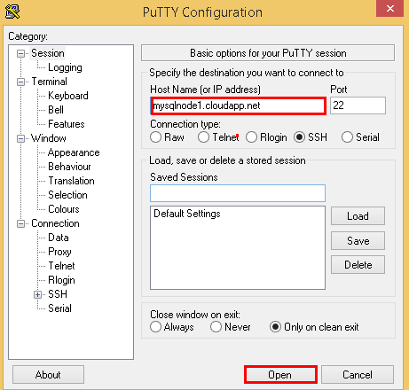
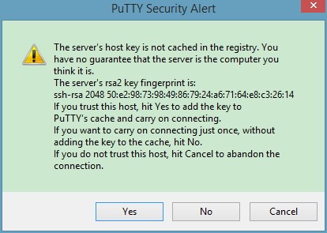

<properties
	pageTitle="MySQL を Azure でインストールする方法"
	description="Azure 上の Linux 仮想マシン (VM) に MySQL スタックをインストールする方法について説明します。Ubuntu または CentOS 上でインストールできます。"
	services="virtual-machines"
	documentationCenter=""
	authors="SuperScottz"
	manager="timlt"
	editor=""/>

<tags
	ms.service="virtual-machines"
	ms.workload="infrastructure-services"
	ms.tgt_pltfrm="vm-linux"
	ms.devlang="na"
	ms.topic="article"
	ms.date="03/12/2015"
	ms.author="mingzhan"/>

# MySQL を Azure でインストールする方法

このトピックでは、読者が既に Azure アカウントを所有していることを前提にしています。所有していない場合は、[Azure](http://azure.microsoft.com) にアクセスしてサインアップすることをお勧めします。

## Microsoft Azure に VM イメージを作成する
ここでは、Microsoft Azure の管理ポータルから新しい VM を作成します。
### "SSH 認証キー" の生成
Azure ポータルにアクセスするには SSH キーが必要になります。

- puttygen を[こちら](http://www.chiark.greenend.org.uk/~sgtatham/putty/download.html)からダウンロードおよびインストールします。 
- puttygen.exe を実行します。
- \[生成\] をクリックしてキーを生成します。

 
 
- キーの生成後は、次のように表示されます。 
 
 

- 公開キーをコピーし、"publicKey.key" という名前のファイルに保存します。保存された公開キーの形式は必要な公開キーの形式と異なるため、\[公開キーの保存\] を単に押さないようにしてください。
- \[秘密キーの保存\] をクリックし、"privateKey.ppk" として保存します。 

### Azure ポータルへのログイン

https://portal.azure.com/ に移動してログインします。

### Linux VM の作成

左下にある \[新規\] をクリックし、次の手順でイメージを作成します。必要に応じて Linux イメージを選択してください。ここでは、例として Ubuntu 14.04 を選択します。

  

### ホスト名のセットアップ

\[ホスト名\]: 仮想マシンへのアクセスに使用できる URL です。ここでは、"mysqlnode1" のように DNS 名を指定するだけでかまいません。こうすると、URL が "mysqlnode1.cloudapp.net" として生成されます。\[SSH 認証キー\]: puttygen で生成される公開キーです。このキーは "publicKey.key" ファイルのコンテンツからコピーする必要があります。

  
  

## MySQL の既定のポートを開く
Microsoft Azure のエンドポイントは、パブリックおよびプライベート ポートとプロトコルで構成されます。プライベート ポートは、ローカル コンピューターでサービスがリッスンするポートです。パブリック ポートとは、サービスが外部でリッスンするポートです。ポート 3306 は、MySQL によってリッスンされる既定のポート番号です。\[参照\]、\[Virtual Machines\] の順にクリックし、作成したイメージをクリックします。
 
   

## 作成したイメージへの接続
任意の SSH ツールを選んで仮想マシンに接続できます。ここでは、例として Putty を使用します。
 

- まず Putty をダウンロードします。Putty のダウンロード URL はこちらです。
- Putty のダウンロード後、実行可能ファイル "PUTTY.EXE" をクリックします。次のように設定します。

     The “Host Name (or IP address)” is the URL as “DNS NAME” when you create an image.
     
     The “Port” we can chose 22.  This is default port of SSH services.

   
 
- \[開く\] を選択する前に、\[接続\]、\[SSH\]、\[認証\] タブの順にクリックして、Puttygen で生成されたファイルを見つけて秘密キーを格納します。入力するフィールドについては、下図を参照してください。

   
 
- \[開く\] をクリックします。ここで、接続先のコンピューターは目的のコンピューターではない可能性があるとメッセージ ボックスで警告される場合があります。DNS 名とポート番号を正しく構成してある場合は、\[はい\] をクリックします。
  
 

- その後、次のように表示されます。 
 
 

## 仮想マシンに MySQL をインストールする
MySQL のインストール方法として、バイナリ パッケージ、rpm パッケージ、ソース パッケージの 3 とおりの方法がサポートされています。パフォーマンスに関する考慮事項により、この記事では MySQL 5.6 の rpm パッケージを例として使用します。MySQL 5.6 は、MySQL 5.5 よりもパフォーマンスが大幅に向上しています。詳細については、[こちら](http://www.mysqlperformanceblog.com/2013/02/18/is-mysql-5-6-slower-than-mysql-5-5/)で確認できます。

### Ubuntu または Debian で MySQL 5.6 をインストールする方法
この記事では、例として Ubuntu 14.04 LTS を使用します。

- 手順 1. MySQL Server 5.6 をインストールする

    apt-get コマンドで mysql-server 5.6 をインストールします。

              # azureuser@mysqlnode1:~$ sudo apt-get update
              # azureuser@mysqlnode1:~$ sudo apt-get -y install mysql-server-5.6

    インストール中に、MySQL ルート パスワードを設定するよう求めるポップアップ ダイアログが表示されます。新しい MySQL ユーザーのルート パスワードを指定する必要があります。スクリーン ショットを以下に示します。

 

    Confirm the password again when it is asked.

 
 
- 手順 2. MySQL Server にログインする

    MySQL Server のインストールが完了したら、MySQL サービスが自動的に開始されます。MySQL Server にはルート ユーザーとしてログインできます。MySQL Server にログインするには、次のコマンドを使用します。MySQL Server のインストール時に設定した mysql ルート パスワードが求められます。

             # azureuser@mysqlnode1:~$ mysql -uroot -p

- 手順 3. VM で MySQL サービスを確認する
    
    ログオンした後で、MySQL サービスが実行されていることを確認します。サービスの開始または再起動には、次のコマンドを使用できます。

    \(a\) MySQL サービスの状態を取得するには

             #sudo service mysql status

    \(b\) MySQL サービスを開始するには

             #sudo service mysql start

    \(c\) MySQL サービスを停止するには

             #sudo service mysql stop

    \(d\) MySQL サービスを再起動するには

             #sudo service mysql restart

### Red Hat の OS のファミリまたは Oracle Linux に MySQL をインストールする方法
- 手順 1. MySQL Yum リポジトリの追加。ルート アクセス許可を取得するには、次のコマンドを実行します。 

            #sudo su -
            #[root@azureuser ~]# wget http://repo.mysql.com/mysql-community-release-el6-5.noarch.rpm 
            #[root@azureuser ~]# yum localinstall -y mysql-community-release-el6-5.noarch.rpm 

- 手順 2. リリース シリーズの選択
 
            #[root@azureuser ~]# vim /etc/yum.repos.d/mysql-community.repo

    これは、ファイル内の、リリース シリーズのサブリポジトリに対する一般的なエントリです。

        \# *Enable to use MySQL 5.6*

        [mysql56-community]
        name=MySQL 5.6 Community Server

        baseurl=http://repo.mysql.com/yum/mysql-5.6-community/el/6/$basearch/

        enabled=1

        gpgcheck=1

        gpgkey=file:/etc/pki/rpm-gpg/RPM-GPG-KEY-mysql

- 手順 3. Yum での MySQL のインストール。次のコマンドを実行して MySQL をインストールします。

           #[root@azureuser ~]#yum install mysql-community-server 

    これで、他の必要なパッケージと共に MySQL Server のパッケージがインストールされます。

- 手順 4. MySQL の実行状態の確認

    MySQL Server の状態を次のコマンドで確認することができます。
   
           #[root@azureuser ~]#service mysqld status

    MySQL Server の既定のポートが実行されているかどうかを確認できます。

           #[root@azureuser ~]#netstat  –tunlp|grep 3306

- 手順 5. MySQL Server の開始と停止

    MySQL Server を次のコマンドで開始します。

           #[root@azureuser ~]#service mysqld start

    MySQL Server を次のコマンドで停止します。

           #[root@azureuser ~]#service mysqld stop

    システムの起動時に MySQL が開始するように設定するには、次のコマンドを実行します。

           #[root@azureuser ~]#chkconfig mysqld on

### MySQL を Suse LinuX にインストールする方法

- 手順 1. MySQL Server のインストール

    アクセス許可を昇格させるために、次のコマンドを実行します。

           #sudo su -

    次のコマンドを実行して MySQL をインストールします。

           #mysql-test:~ # zypper update

           #mysql-test:~ # zypper install mysql-server mysql-devel mysql

- 手順 2. MySQL の実行状態の確認

    MySQL Server の状態を次のコマンドで確認することができます。

           #mysql-test:~ # rcmysql status

    MySQL Server の既定のポートが実行されているかどうかを確認できます。

           #mysql-test:~ # netstat  –tunlp|grep 3306

- 手順 3. MySQL Server の開始と停止

    MySQL Server を次のコマンドで開始します。

           #mysql-test:~ # rcmysql start

    MySQL Server を次のコマンドで停止します。

           #mysql-test:~ # rcmysql stop

    システムの起動時に MySQL が開始するように設定するには、次のコマンドを実行します。

           #mysql-test:~ # insserv mysql
<!--HONumber=52-->
