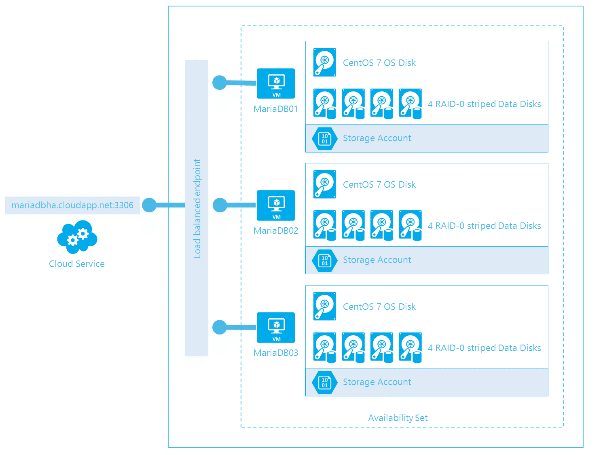
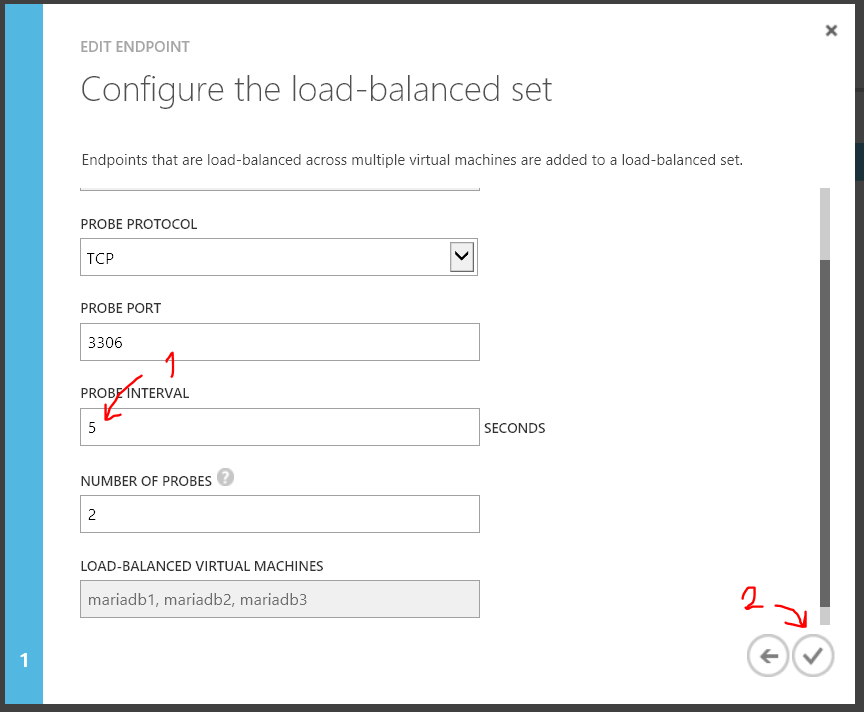

<properties 
	pageTitle="Azure での MariaDB (MySQL) クラスターの実行" 
	description="Azure の仮想マシン上に MariaDB + Galera MySQL クラスターを作成する" 
	services="virtual-machines" 
	documentationCenter="" 
	authors="sabbour" 
	manager="timlt" 
	editor=""/>

<tags 
	ms.service="virtual-machines" 
	ms.devlang="multiple" 
	ms.topic="article" 
	ms.tgt_pltfrm="vm-linux" 
	ms.workload="infrastructure-services" 
	ms.date="12/3/2014" 
	ms.author="v-ahsab" 
	ms.prod="azure"/>

<!--The next line, with one pound sign at the beginning, is the page title--> 
# MariaDB (MySQL) クラスター - Azure チュートリアル

ここでは、[MariaDB](https://mariadb.org/en/about/) のマルチマスター [Galera](http://galeracluster.com/products/) クラスターを作成します。これを Azure の仮想マシン上の高可用性環境で稼働することで、MySQL の堅牢でスケーラブル、かつ信頼性の高い代替製品として実行するためです。

<!--Table of contents for topic, the words in brackets must match the heading wording exactly-->

+ [アーキテクチャの概要] 
+ [テンプレートの作成]
+ [クラスターの作成]
+ [クラスターの負荷分散]
+ [クラスターの検証]

## アーキテクチャの概要

このトピックの手順は次のとおりです。

1. 3 ノード クラスターを作成します。
2. OS ディスクからのデータ ディスクを分離します。
3. RAID 0/ストライプ化設定でデータ ディスクを作成し、IOPS を増やします。
4. Azure ロード バランサーを使用して、3 つのノードの負荷を分散します。
5. 繰り返し作業を最小限に抑えるには、MariaDB + Galera を含む VM イメージを作成し、他のクラスター VM の作成に使用します。

> [AZURE.NOTE]  このトピックでは、[Azure CLI] ツールを使用します。ダウンロードして、指示に従って Azure サブスクリプションに接続してください。Azure CLI で使用できるコマンドのリファレンスが必要な場合は、「[Azure CLI command reference (Azure CLI コマンド リファレンス)]」を参照してください。また、[認証用に SSH キーを作成]し、**.pem ファイルの場所**をメモしておく必要があります。

## テンプレートの作成

### インフラストラクチャ

1. リソースをまとめて保持するためにアフィニティ グループを作成します。

		azure account affinity-group create mariadbcluster --location "North Europe" --label "MariaDB Cluster"
        
2. 仮想ネットワークの作成

		azure network vnet create --address-space 10.0.0.0 --cidr 8 --subnet-name mariadb --subnet-start-ip 10.0.0.0 --subnet-cidr 24 --affinity-group mariadbcluster mariadbvnet

3. すべてのディスクをホストするストレージ アカウントを作成します。ストレージ アカウントの 20,000 IOPS の制限に達することを避けるため、同じストレージ アカウント上での、使用頻度の高いディスクの作成は 40 台までにしてください。このチュートリアルでは、わかりやすくするために、この数値よりもかなり小さな値を使用して、同じアカウントですべてを格納しています。

		azure storage account create mariadbstorage --label mariadbstorage --affinity-group mariadbcluster

3. CentOS 7 仮想マシン イメージの名前を検索します。

		azure vm image list | findstr CentOS        
this will output something like `5112500ae3b842c8b9c604889f8753c3__OpenLogic-CentOS-70-20140926`この名前を次の手順で使用します。

4. 生成した .pem SSH キーを格納した場所のパスで **/path/to/key.pem** を置き換える VM テンプレートを作成します。

		azure vm create --virtual-network-name mariadbvnet --subnet-names mariadb --blob-url "http://mariadbstorage.blob.core.windows.net/vhds/mariadbhatemplate-os.vhd"  --vm-size Medium --ssh 22 --ssh-cert "/path/to/key.pem" --no-ssh-password mariadbtemplate 5112500ae3b842c8b9c604889f8753c3__OpenLogic-CentOS-70-20140926 azureuser
        
5. RAID 構成に使用するために、4 x 500 GB のデータ ディスクを VM に接続します。

		FOR /L %d IN (1,1,4) DO azure vm disk attach-new mariadbhatemplate 512 http://mariadbstorage.blob.core.windows.net/vhds/mariadbhatemplate-data-%d.vhd        

6. **mariadbhatemplate.cloudapp.net:22** で作成したテンプレート VM に SSH 接続し、接続に新しい秘密鍵を使用します。

### ソフトウェア

1. ルートを取得します。

        sudo su
        
2. RAID サポートをインストールします。

     - Mdadm をインストールします。
        
        		yum install mdadm
                
     - EXT4 ファイル システムでの RAID 0/ストライプ構成を作成します。
        
				mdadm --create --verbose /dev/md0 --level=stripe --raid-devices=4 /dev/sdc /dev/sdd /dev/sde /dev/sdf
				mdadm --detail --scan >> /etc/mdadm.conf
				mkfs -t ext4 /dev/md0
         
     - マウント ポイントのディレクトリを作成します。
         
				mkdir /mnt/data
                
     - 新しく作成された RAID デバイスの UUID を取得します。
        
				blkid | grep /dev/md0
    
     - /Etc/fstab を編集します。
        
        		vi /etc/fstab
        
     - デバイスを追加して 再起動時に UUID を **blkid** コマンドから取得して値と置き換える自動マウントを有効にします。
        
        		UUID=<UUID FROM PREVIOUS>   /mnt/data ext4   defaults,noatime   1 2
        	
     - 新しいパーティションをマウントします。
        
        		mount /mnt/data
            
3. MariaDB をインストールします。    
		
     - MariaDB.repo ファイルを作成します。 
        
              	vi /etc/yum.repos.d/MariaDB.repo
        
     - 以下のコンテンツを入力します      
        
				[mariadb]
				name = MariaDB
				baseurl = http://yum.mariadb.org/10.0/centos7-amd64
				gpgkey=https://yum.mariadb.org/RPM-GPG-KEY-MariaDB
				gpgcheck=1
    
     - 既存の接尾語と mariadb-libs を削除して競合を回避します。
    
    		yum remove postfix mariadb-libs-*
            
     - MariaDB Galera インストールします。
    
    		yum install MariaDB-Galera-server MariaDB-client galera
   
4. MySQL のデータ ディレクトリを、RAID ブロック デバイスに移動します。

     - 新しい場所に現在の MySQL のディレクトリをコピーし、古いディレクトリを削除します
    
    		cp -avr /var/lib/mysql /mnt/data  
    		rm -rf /var/lib/mysql
      
     - それに応じて、新しいディレクトリに対する権限を設定します。
        
        	chown -R mysql:mysql /mnt/data && chmod -R 755 /mnt/data/  
            
     - RAID のパーティションの新しい場所への古いディレクトリを指すシンボリック リンクを作成します。
    
    		ln -s /mnt/data/mysql /var/lib/mysql   

5. [SELinux はクラスターのオペレーションに干渉する](http://galeracluster.com/documentation-webpages/configuration.html#selinux)ので、現在のセッションに対して無効にする必要があります (互換性のあるバージョンが登場するまで)。後の再起動のために `/etc/selinux/config` を編集して無効にします。
    	
	        setenforce 0
    
       次に `/etc/selinux/config` を編集して `SELINUX=permissive` を設定します。
       
6. MySQL の実行を検証します。

    - MySQL を開始します。
    
    		service mysql start
            
    - MySQL のインストールをセキュリティで保護し、ルート パスワードを設定、匿名ユーザーを削除し、リモート ルート ログインを無効にして、テスト データベースを削除します。
    		
            mysql_secure_installation
            
    - クラスター操作、および必要に応じて、アプリケーションのためにデータベースにユーザーを作成します。
   
			mysql -u root -p
			GRANT ALL PRIVILEGES ON *.* TO 'cluster'@'%' IDENTIFIED BY 'p@ssw0rd' WITH GRANT OPTION; FLUSH PRIVILEGES;
            exit
   
   - MySQL を停止します。
   
			service mysql stop
            
7. 構成プレースホルダーを作成します。

	- MySQL の構成を編集して、クラスター設定のプレースホルダーを作成します。ここでは、**`<Vairables>`** を置き換えたり、コメントを解除したりしないでください。それらの処理は、このテンプレートから VM を作成した後で行います。
	
			vi /etc/my.cnf.d/server.cnf
			
	- **[galera]** セクションを編集して空にします。
	
	- **[mariadb]** セクションを編集します。
	
			wsrep_provider=/usr/lib64/galera/libgalera_smm.so 
            binlog_format=ROW
            wsrep_sst_method=rsync
			bind-address=0.0.0.0 # When set to 0.0.0.0, the server listens to remote connections
			default_storage_engine=InnoDB
            innodb_autoinc_lock_mode=2
			
            wsrep_sst_auth=cluster:p@ssw0rd # CHANGE: Username and password you created for the SST cluster MySQL user
            #wsrep_cluster_name='mariadbcluster' # CHANGE: Uncomment and set your desired cluster name
            #wsrep_cluster_address="gcomm://mariadb1,mariadb2,mariadb3" # CHANGE: Uncomment and Add all your servers
            #wsrep_node_address='<ServerIP>' # CHANGE: Uncomment and set IP address of this server
			#wsrep_node_name='<NodeName>' # CHANGE: Uncomment and set the node name of this server

8. ファイアウォールで必要なポートを開きます (CentOS 7 で FirewallD を使用)。
	
	- MySQL: `firewall-cmd --zone=public --add-port=3306/tcp --permanent`
    - GALERA: `firewall-cmd --zone=public --add-port=4567/tcp --permanent`
    - GALERA IST: `firewall-cmd --zone=public --add-port=4568/tcp --permanent`
    - RSYNC: `firewall-cmd --zone=public --add-port=4444/tcp --permanent`
    - ファイアウォールを再読み込みします: `firewall-cmd --reload`
	
9.  パフォーマンスにシステムを最適化します。詳細については、[パフォーマンス チューニング戦略] のこの記事を参照してください。

	- 再度、MySQL の構成ファイルを編集します。
	
			vi /etc/my.cnf.d/server.cnf
		
	- **[mariadb]** セクションを編集し、以下を追加します。
	
	> [AZURE.NOTE] **innodb\_buffer\_pool_size** を、お使いの仮想マシンのメモリの 70% にすることをお勧めします。ここでは、3.5 GB の RAM を持つ中の Medium Azure VM に、2.45 GB を設定しています。
	
	        innodb_buffer_pool_size = 2508M # The buffer pool contains buffered data and the index. This is usually set to 70% of physical memory.
            innodb_log_file_size = 512M #  Redo logs ensure that write operations are fast, reliable, and recoverable after a crash
            max_connections = 5000 # A larger value will give the server more time to recycle idled connections
            innodb_file_per_table = 1 # Speed up the table space transmission and optimize the debris management performance
            innodb_log_buffer_size = 128M # The log buffer allows transactions to run without having to flush the log to disk before the transactions commit
            innodb_flush_log_at_trx_commit = 2 # The setting of 2 enables the most data integrity and is suitable for Master in MySQL cluster
			query_cache_size = 0
			
10. MySQL を停止し、新しいノードの追加時のクラスターの障害を避けるために起動時の MySQL サービスの動作を無効にし、マシンのプロビジョニングを解除します。

		service mysql stop
        chkconfig mysql off
		waagent -deprovision	
		
11. ポータルで VM をキャプチャします。(現在、[Azure CLI ツールの issue #1268] には、xplat-cli ツールでキャプチャしたイメージで、接続されているデータ ディスクがキャプチャされていないという問題が記載されています)。

	- ポータルでマシンをシャットダウンします。
    - [キャプチャ] をクリックし、イメージの名前に「**mariadb-galera-image**」を指定し説明を適切に入力して、[waagent を実行しました] をチェックします。
	
	
	
## クラスターの作成
 
先ほど作成したテンプレートから 3 台の VM を作成してから、クラスターを構成、起動します。

1. **mariadb-galera-image** イメージから 1 台目の CentOS 7 VM を作成し、仮想ネットワーク名を **mariadbvnet** 、サブネットを **mariadb**、マシンのサイズを **Medium** として、クラウド サービス名を渡して名前を **mariadbha** (または mariadbha.cloudapp.net 経由でアクセスする任意の名前) とし、マシン名を **mariadb1**、ユーザー名を **azureuser** にし、SSH アクセスを有効にして、SSH 証明書 .pem ファイルを渡し、**/path/to/key.pem** を、生成された .pem SSH キーを格納するパスに置き換えます。

	> [AZURE.NOTE] 次のコマンドは、わかりやすいように複数の行に分割しますが、それぞれ 1 つの行として入力する必要があります。

		azure vm create 
        --virtual-network-name mariadbvnet
        --subnet-names mariadb 
        --availability-set clusteravset
		--vm-size Medium 
		--ssh-cert "/path/to/key.pem" 
		--no-ssh-password 
		--ssh 22 
		--vm-name mariadb1 
		mariadbha mariadb-galera-image azureuser 

2. 現時点で作成済みの **mariadbha** クラウド サービスに_接続_し、同じクラウド サービス内の他の VM と競合しない一意のポートになるように **VM 名**および **SSH ポート**を変更して、他の 2 台の仮想マシンを作成します。

		azure vm create		
        --virtual-network-name mariadbvnet
        --subnet-names mariadb 
        --availability-set clusteravset
		--vm-size Medium
		--ssh-cert "/path/to/key.pem"
		--no-ssh-password
		--ssh 23
		--vm-name mariadb2
        --connect mariadbha mariadb-galera-image azureuser
and for MariaDB3

		azure vm create
        --virtual-network-name mariadbvnet
        --subnet-names mariadb 
        --availability-set clusteravset
		--vm-size Medium
		--ssh-cert "/path/to/key.pem"
		--no-ssh-password
		--ssh 24
		--vm-name mariadb3
        --connect mariadbha mariadb-galera-image azureuser
		
3. 次の手順で使用するために、3 台の VM のそれぞれの内部 IP アドレスを取得する必要があります。

	

4. 3 台の VM に SSH で接続し、各 VM 上の構成ファイルを編集します。

		sudo vi /etc/my.cnf.d/server.cnf
		
	開始位置の **#** を削除して **`wsrep_cluster_name`** と **`wsrep_cluster_address`** をコメント解除し、実際に必要な値になっているかどうか検証します。
    また、**`wsrep_node_address`** の **`<ServerIP>`** と **`wsrep_node_name`** の **`<NodeName>`** を、それぞれ VM の IP アドレスと名前で置き換え、それらの行もコメント解除します。
	
5. MariaDB1 でクラスターを起動し、起動時に実行されるようにします。

		sudo service mysql bootstrap
        chkconfig mysql on
	
6. MariaDB2 および MariaDB3 で MySQL を起動し、起動時に実行されるようにします。

		sudo service mysql start
        chkconfig mysql on
		
## クラスターの負荷分散
クラスター化された VM を作成した場合には、それらの VM を **clusteravset** という名前の可用性セットに追加し、それの VM が異なる障害ドメインとアップグレード ドメインに確実に配置され、Azure がすべてのマシンを同時にメンテナンスすることがないようにしています。この構成は、Azure サービス レベル アグリーメント (SLA) によってサポートされる要件を満たしています。

ここでは、Azure ロード バランサーを使用して、3 つのノードに要求を分散します。

Azure CLI を使用して、マシン上で次のコマンドを実行します。
コマンドのパラメーター構造は次のとおりです。 `azure vm endpoint create-multiple <MachineName> <PublicPort>:<VMPort>:<Protocol>:<EnableDirectServerReturn>:<Load Balanced Set Name>:<ProbeProtocol>:<ProbePort>`

	azure vm endpoint create-multiple mariadb1 3306:3306:tcp:false:MySQL:tcp:3306
    azure vm endpoint create-multiple mariadb2 3306:3306:tcp:false:MySQL:tcp:3306
    azure vm endpoint create-multiple mariadb3 3306:3306:tcp:false:MySQL:tcp:3306
	
CLI でロード バランサー プローブ間隔が 15 秒 (少し長すぎる場合があります) に設定されているので、最後に、すべての VM のロード バランサー プローブ間隔を、ポータルの **[エンドポイント]** で変更します。

[負荷分散セットの再構成] をクリックし、次画面に進みます。

[プローブ間隔] を 5 秒に変更し、保存します。

## クラスターの検証

設定作業は完了しました。ロード バランサーにヒットし、円滑かつ効率的に 3 台の VM に要求をルーティングする `mariadbha.cloudapp.net:3306` でクラスターにアクセスできます。

お好みの MySQL クライアントを使用して接続するか、いずれかの VM から接続して、このクラスターの動作を検証します。

	 mysql -u cluster -h mariadbha.cloudapp.net -p
	 
新しいデータベースを作成し、データをいくつか追加します。

	CREATE DATABASE TestDB;
    USE TestDB;
    CREATE TABLE TestTable (id INT NOT NULL AUTO_INCREMENT PRIMARY KEY, value VARCHAR(255));
	INSERT INTO TestTable (value)  VALUES ('Value1');
	INSERT INTO TestTable (value)  VALUES ('Value2');
    SELECT * FROM TestTable;
	
次のようなテーブルが作成されます。

	+----+--------+
	| id | value  |
	+----+--------+
	|  1 | Value1 |
	|  4 | Value2 |
	+----+--------+
	2 rows in set (0.00 sec)	
	
<!--Every topic should have next steps and links to the next logical set of content to keep the customer engaged-->
## 次のステップ

この記事では、CentOS 7 を実行している Azure の仮想マシン上に、3 ノードの MariaDB + Galera の可用性の高いクラスターを作成しました。VM には、Azure ロード バランサーで、負荷分散が行われます。

必要に応じて、[Linux 上で MySQL をクラスター化する別の方法]および [Azure Linux VM 上で MySQL のパフォーマンスを最適化およびテストする]方法を参照してください。

<!--Anchors-->
[アーキテクチャの概要]: #architecture-overview
[テンプレートの作成]: #creating-the-template
[クラスターの作成]: #creating-the-cluster
[クラスターの負荷分散]: #load-balancing-the-cluster
[クラスターの検証]: #validating-the-cluster
[次のステップ]: #next-steps

<!--Image references-->

<!--Link references-->
[Azure CLI]: http://azure.microsoft.com/documentation/articles/xplat-cli/
[Azure CLI コマンド リファレンス]: http://azure.microsoft.com/documentation/articles/command-line-tools/
[認証用 SSH キーの作成]:http://www.jeff.wilcox.name/2013/06/secure-linux-vms-with-ssh-certificates/
[パフォーマンス チューニング戦略]: http://azure.microsoft.com/sv-se/documentation/articles/virtual-machines-linux-optimize-mysql-perf/
[Azure Linux VM 上で MySQL のパフォーマンスを最適化およびテストする方法]:http://azure.microsoft.com/sv-se/documentation/articles/virtual-machines-linux-optimize-mysql-perf/
[Azure CLI の問題 #1268]:https://github.com/Azure/azure-xplat-cli/issues/1268
[Linux 上で MySQL をクラスター化する別の方法]: http://azure.microsoft.com/documentation/articles/virtual-machines-linux-mysql-cluster/
<!--HONumber=45--> 
