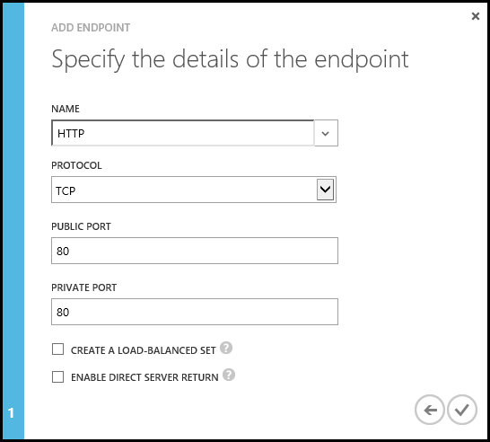

<properties linkid="develop-python-web-app-with-django-mac" UrlDisplayName="Django を使用した Web" pageTitle="Mac で Django を使用した Python Web アプリケーション - Windows Azure チュートリアル" MetaKeywords="" description="Linux 仮想マシンを使用して Windows Azure で Django ベースの Web サイトをホストする方法について説明するチュートリアルです。" metaCanonical="" services="virtual-machines" documentationCenter="Python" title="Django Hello World Web アプリケーション (mac-linux)" authors=""  solutions="" writer="" manager="" editor=""  />

# Django Hello World Web アプリケーション (mac-linux)

<a href="/en-us/develop/python/tutorials/web-app-with-django/" Title="Windows">Windows</a><a href="/en-us/develop/python/tutorials/django-hello-world-(maclinux)/" Title="Mac/Linux" class="current">Mac/Linux</a>

このチュートリアルでは、Linux 仮想マシンを使用して Windows Azure で
Django ベースの Web サイトをホストする方法について説明します。このチュートリアルは、Windows Azure を使用した経験がない読者を対象に作成されています。このチュートリアルを完了すると、クラウドで動作する Django ベースのアプリケーションが完成します。

学習内容: 

* Django をホストするように Windows Azure の仮想マシンを設定します。このチュートリアルでは **Linux** でこの設定を行う方法を説明しますが、Windows Azure でホストされている Windows Server VM でも基本的な手順は同じです。
* 新しい Django アプリケーションを Linux から作成します。

このチュートリアルを実行して、単純な Hello World Web アプリケーションを
作成します。このアプリケーションは Windows Azure の仮想マシンでホストされます。

完成したアプリケーションのスクリーンショットは次のようになります。

[WACOM.INCLUDE [create-account-and-vms-note](../includes/create-account-and-vms-note.md)]

## Django をホストする Windows Azure の仮想マシンの作成と構成

1.[ここ][portal-vm]に記載されている手順に従って、*Ubuntu Server 12.04* ディストリビューションの Windows Azure の仮想マシンを作成します。

  **注:** 仮想マシンの*作成だけ*を行う必要があります。「*仮想マシンを作成後、ログオンする方法*」というセクションの前まで学習してください。

1.Windows Azure で、ポート **80** トラフィックを Web から仮想マシン上のポート **80** に転送します。
	* Windows Azure ポータルで新しく作成した仮想マシンに移動し、*[エンドポイント]* タブをクリックします。
	* 画面の下部にある *[エンドポイントの追加]* ボタンをクリックします。
	
	* *TCP* プロトコルの*パブリック ポート 80* を*プライベート ポート 80* として開きます。
	

## 開発環境の設定

**注:** Python をインストールする場合またはクライアント ライブラリを使用する場合は、「[Python Installation Guide (Python インストール ガイド)](../python-how-to-install/)」を参照してください。

Ubuntu Linux VM はプレインストールされている Python 2.7 に付属していますが、Apache または Django はインストールされません。VM に接続し、Apache および Django をインストールするには、次の手順に従います。

1.新しい**ターミナル** ウィンドウを起動します。
    
1.次のコマンドを入力して、Windows Azure VM に接続します。

		$ ssh yourusername@yourVmUrl

1.次のコマンドを入力して、Django をインストールします。

		$ sudo apt-get install python-setuptools
		$ sudo easy_install django

1.次のコマンドを入力して、Apache と mod-wsgi をインストールします。

		$ sudo apt-get install apache2 libapache2-mod-wsgi

## 新しい Django アプリケーションの作成

1.上のセクションで使用した**ターミナル** ウィンドウを開き、SSH キーを使用して仮想マシンにログインします。
    
1.次のコマンドを入力して、新しい Django プロジェクトを作成します。

    

    **django-admin.py** スクリプトによって、Django ベースの Web サイトの基本的な構造が生成されます。
    -   **manage.py** を使用すると、Django ベースの Web サイトに対するホスティングの開始や停止を実行できます。
    -   **helloworld\settings.py** には、アプリケーションの Django 設定が含まれます。
    -   **helloworld\urls.py** には、各 URL とそのビューとの間のマッピング コードが含まれています。

1.*django\helloworld* のサブディレクトリ *helloworld* に、**views.py** という名前の新しいファイルを作成します。このファイルは **urls.py** と兄弟関係にあります。このファイルには、"Hello World" ページをレンダリングするビューが含まれます。エディターを起動し、以下のコードを入力します。
		
		from django.http import HttpResponse
		def hello(request):
    		html = "<html><body>Hello World!</body></html>"
    		return HttpResponse(html)

1.次に、**urls.py** ファイルの内容を次のコードに置き換えます。

		from django.conf.urls.defaults import patterns, include, url
		from helloworld.views import hello
		urlpatterns = patterns('',
			(r'^$',hello),
		)

## Django Web サイトのデプロイと実行

1.Apache 構成ファイル **/etc/apache2/httpd.conf** を編集し、以下のコードを追加します。*username* は、VM の作成時に指定したユーザー名に置き換えてください。

		WSGIScriptAlias / /home/*username*/django/helloworld/helloworld/wsgi.py
		WSGIPythonPath /home/*username*/django/helloworld

		<Directory /home/*username*/django/helloworld/helloworld>
		<Files wsgi.py>
		Order deny,allow
		Allow from all
		</Files>
		</Directory>

1.次のコマンドで Apache を再起動します。

$ sudo apachectl restart

1.最後に、ブラウザーで Web ページを読み込みます。

	

## Windows Azure の仮想マシンのシャットダウン

このチュートリアルが終了したら、新しく作成した Windows Azure の仮想マシンをシャットダウンまたは削除して、他のチュートリアル用にリソースを解放し、Windows Azure に対する利用料金の発生を回避します。

[portal-vm]: /en-us/manage/linux/tutorials/virtual-machine-from-gallery/

