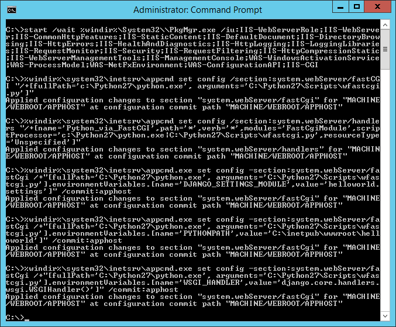

<properties 
	pageTitle="Django を使用した Python Web アプリケーション - Azure チュートリアル" 
	description="Windows Server 2012 R2 Datacenter 仮想マシンを使用して Azure で Django ベースの Web サイトをホストする方法について説明するチュートリアルです。" 
	services="virtual-machines" 
	documentationCenter="python" 
	authors="huguesv" 
	manager="wpickett" 
	editor=""/>

<tags 
	ms.service="virtual-machines" 
	ms.workload="web" 
	ms.tgt_pltfrm="vm-windows" 
	ms.devlang="python" 
	ms.topic="article" 
	ms.date="02/05/2015" 
	ms.author="huvalo"/>

# Django Hello World Web アプリケーション

<a href="/ja-jp/develop/python/tutorials/web-app-with-django/" title="Windows" class="current">Windows</a><a href="/ja-jp/develop/python/tutorials/django-hello-world-(maclinux)/" title="MacLinux">Mac/Linux</a>

このチュートリアルでは、Windows Server 仮想マシンを使用して Microsoft 
Azure で Django ベースの Web サイトをホストする方法について説明します。このチュートリアルは、Azure を使用した経験がない読者を対象に作成されています。このチュートリアルを完了すると、クラウドで動作する Django ベースのアプリケーションが完成します。

学習内容:

* Django をホストするように Azure の仮想マシンを設定します。このチュートリアルでは **Windows Server** で Azure の仮想マシンを設定する方法について説明しますが、Azure でホストされている Linux VM の場合も基本的な手順は同じです。 
* 新しい Django アプリケーションを Windows から作成します。

このチュートリアルを実行して、単純な Hello World Web
アプリケーションを作成します。このアプリケーションは Azure の仮想マシンでホストされます。

完成したアプリケーションのスクリーンショットは次のようになります。

![A browser window displaying the hello world page on Azure][1]

[AZURE.INCLUDE [create-account-and-vms-note](../includes/create-account-and-vms-note.md)]

## Django をホストする Azure の仮想マシンの作成と構成

1. [ここ][portal-vm]に記載されている手順に従って *Windows Server 2012 R2 Datacenter* ディストリビューションの Azure 仮想マシンを作成します。

1. Azure で、ポート **80** トラフィックを Web から仮想マシン上のポート **80** に転送します。
 - Azure ポータルで新しく作成した仮想マシンに移動し、[*ENDPOINTS*] タブをクリックします。
 - 画面の下部にある [*ADD*] をクリックします。
	

 - *TCP* プロトコルの *PUBLIC PORT 80* を *PRIVATE PORT 80* として開きます。
![][port80]
1. [*DASHBOARD*] タブで [*CONNECT*] をクリックし、新たに作成した Azure 仮想マシンに*Remote Desktop*を使ってリモートでログインします。  

**重要:** 次に示しているすべての手順では、仮想マシンに正しくログインしており、ローカル コンピューターではなく仮想マシンでコマンドを発行することを前提としています。 

## Python と Django の設定

**注:** Internet Explorer を使ってダウンロードするには、IE ESC 設定の構成が必要になる場合があります。具体的には、[スタート]、[管理ツール]、[サーバー マネージャー]、[ローカル サーバー] の順にクリックしてから、**[IE セキュリティ強化の構成]** をクリックし、[オフ] に設定します。

1. [Web Platform Installer][] をインストールします。
1. Web Platform Installer を使用して、Python と WFastCGI をインストールします。これにより、wfastcgi.py が Python スクリプト フォルダーにインストールされます。
	1. Web Platform Installer を起動します。
	1. 検索バーに「WFastCGI」と入力します。 
	1. 使用する Python のバージョン (2.7 または 3.4) に対応した WFactCGI エントリを選択します。これにより、Python が WFastCGI の依存コンポーネントとしてインストールされます。 
1. pip を使用して Django をインストールします。

    Python 2.7:

        c:\python27\scripts\pip install django

    Python 3.4:

        c:\python34\scripts\pip install django

## FastCGI での IIS の設定

1. FastCGI のサポートを利用して IIS をインストールします。この操作には数分かかる可能性があります。

		start /wait %windir%\System32\\PkgMgr.exe /iu:IIS-WebServerRole;IIS-WebServer;IIS-CommonHttpFeatures;IIS-StaticContent;IIS-DefaultDocument;IIS-DirectoryBrowsing;IIS-HttpErrors;IIS-HealthAndDiagnostics;IIS-HttpLogging;IIS-LoggingLibraries;IIS-RequestMonitor;IIS-Security;IIS-RequestFiltering;IIS-HttpCompressionStatic;IIS-WebServerManagementTools;IIS-ManagementConsole;WAS-WindowsActivationService;WAS-ProcessModel;WAS-NetFxEnvironment;WAS-ConfigurationAPI;IIS-CGI

### Python 2.7

Python 2.7 を使用している場合に限り、これらのコマンドを実行してください。

1. Python FastCGI ハンドラーを設定します。

		%windir%\system32\inetsrv\appcmd set config /section:system.webServer/fastCGI "/+[fullPath='c:\Python27\python.exe', arguments='C:\Python27\Scripts\wfastcgi.py']"

1. このサイトのハンドラーを登録します。

		%windir%\system32\inetsrv\appcmd set config /section:system.webServer/handlers "/+[name='Python_via_FastCGI',path='*',verb='*',modules='FastCgiModule',scriptProcessor='c:\Python27\python.exe|C:\Python27\Scripts\wfastcgi.py',resourceType='Unspecified']"

1. Django アプリケーションを実行するようにハンドラーを構成します。

		%windir%\system32\inetsrv\appcmd.exe set config -section:system.webServer/fastCgi /+"[fullPath='C:\Python27\python.exe', arguments='C:\Python27\Scripts\wfastcgi.py'].environmentVariables.[name='DJANGO_SETTINGS_MODULE',value='helloworld.settings']" /commit:apphost

1. Python インタープリターで Django アプリケーションを検索できるように PYTHONPATH を構成します。

		%windir%\system32\inetsrv\appcmd.exe set config -section:system.webServer/fastCgi /+"[fullPath='C:\Python27\python.exe', arguments='C:\Python27\Scripts\wfastcgi.py'].environmentVariables.[name='PYTHONPATH',value='C:\inetpub\wwwroot\helloworld']" /commit:apphost

1. FastCGI から WSGI へのゲートウェイに、使用する WSGI ハンドラーを指定します。

		%windir%\system32\inetsrv\appcmd.exe set config -section:system.webServer/fastCgi /+"[fullPath='C:\Python27\python.exe', arguments='C:\Python27\Scripts\wfastcgi.py'].environmentVariables.[name='WSGI_HANDLER',value='django.core.handlers.wsgi.WSGIHandler()']" /commit:apphost

1. 次のように表示されます。

	 

### Python 3.4

Python 3.4 を使用している場合に限り、これらのコマンドを実行してください。

1. Python FastCGI ハンドラーを設定します。

		%windir%\system32\inetsrv\appcmd set config /section:system.webServer/fastCGI "/+[fullPath='c:\Python34\python.exe', arguments='C:\Python34\Scripts\wfastcgi.py']"

1. このサイトのハンドラーを登録します。

		%windir%\system32\inetsrv\appcmd set config /section:system.webServer/handlers "/+[name='Python_via_FastCGI',path='*',verb='*',modules='FastCgiModule',scriptProcessor='c:\Python34\python.exe|C:\Python34\Scripts\wfastcgi.py',resourceType='Unspecified']"

1. Django アプリケーションを実行するようにハンドラーを構成します。

		%windir%\system32\inetsrv\appcmd.exe set config -section:system.webServer/fastCgi /+"[fullPath='C:\Python34\python.exe', arguments='C:\Python34\Scripts\wfastcgi.py'].environmentVariables.[name='DJANGO_SETTINGS_MODULE',value='helloworld.settings']" /commit:apphost

1. Python インタープリターで Django アプリケーションを検索できるように PYTHONPATH を構成します。

		%windir%\system32\inetsrv\appcmd.exe set config -section:system.webServer/fastCgi /+"[fullPath='C:\Python34\python.exe', arguments='C:\Python34\Scripts\wfastcgi.py'].environmentVariables.[name='PYTHONPATH',value='C:\inetpub\wwwroot\helloworld']" /commit:apphost

1. FastCGI から WSGI へのゲートウェイに、使用する WSGI ハンドラーを指定します。

		%windir%\system32\inetsrv\appcmd.exe set config -section:system.webServer/fastCgi /+"[fullPath='C:\Python34\python.exe', arguments='C:\Python34\Scripts\wfastcgi.py'].environmentVariables.[name='WSGI_HANDLER',value='django.core.handlers.wsgi.WSGIHandler()']" /commit:apphost

1. 次のように表示されます。

	 

## 新しい Django アプリケーションの作成

1.   *C:\inetpub\wwwroot* から、次のコマンドを入力して、新しい Django プロジェクトを作成します。

    Python 2.7:

		C:\Python27\Scripts\django-admin.exe startproject helloworld

    Python 3.4:

		C:\Python34\Scripts\django-admin.exe startproject helloworld
    
	

1.  **django-admin** コマンドによって、Django ベースの Web サイトの基本構造が生成されます。
    
  -   **helloworld\manage.py** を使用すると、Django ベースの Web サイトに対するホスティングの開始や停止を実行できます。
  -   **helloworld\helloworld\settings.py** には、アプリケーション向けの Django の設定が含まれています。
  -   **helloworld\helloworld\urls.py** には、各 URL とそのビューとの間のマッピング コードが含まれています。

1.  *C:\inetpub\wwwroot\helloworld\helloworld* ディレクトリで、**views.py** という名前の新しいファイルを作成します。このファイルには、"Hello World" ページをレンダリングするビューが含まれます。エディターを起動し、次のコードを入力します。
		
		from django.http import HttpResponse
		def home(request):
    		html = "<html><body>Hello World!</body></html>"
    		return HttpResponse(html)

1.  **urls.py** ファイルの内容を次のコードに置き換えます。

		from django.conf.urls import patterns, url
		urlpatterns = patterns('',
			url(r'^$', 'helloworld.views.home', name='home'),
		)

1. 最後に、ブラウザーで Web ページを読み込みます。

![A browser window displaying the hello world page on Azure][1]

## Azure の仮想マシンのシャットダウン

このチュートリアルが終了したら、新しく作成した Azure の仮想マシンをシャットダウンまたは削除して、他のチュートリアル用にリソースを解放し、Azure に対する利用料金の発生を回避します。

[1]: ./media/virtual-machines-python-django-web-app-windows-server/django-helloworld-browser-azure.png

[port80]: ./media/virtual-machines-python-django-web-app-windows-server/django-helloworld-port80.png

[portal-vm]: /ja-jp/manage/windows/tutorials/virtual-machine-from-gallery/

[Web Platform Installer]: http://www.microsoft.com/web/downloads/platform.aspx

<!--HONumber=45--> 
