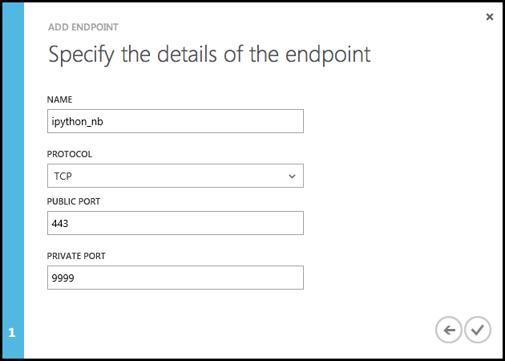
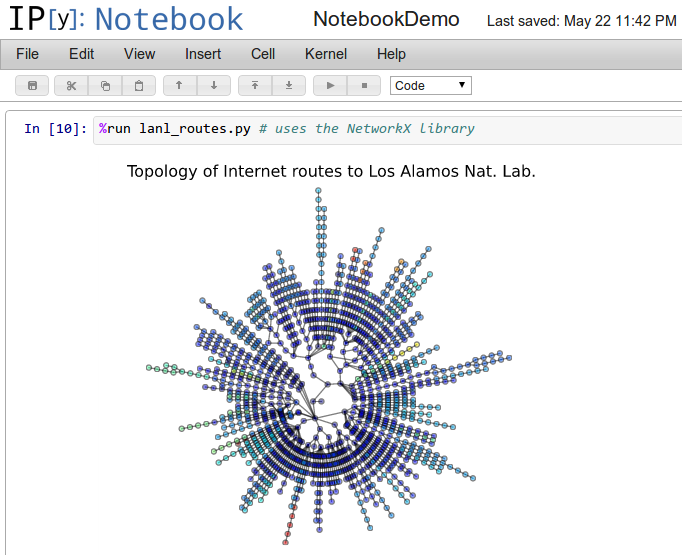

<properties linkid="develop-python-ipython-notebook" UrlDisplayName="IPython Notebook" pageTitle="IPython Notebook - Windows Azure チュートリアル" MetaKeywords="" description="Linux または Windows の仮想マシン (VM) を使用して Windows Azure 上に IPython Notebook をデプロイする方法について説明するチュートリアルです。" metaCanonical="" services="virtual-machines" documentationCenter="Python" title="Windows Azure での IPython Notebook" authors=""  solutions="" writer="" manager="" editor=""  />

# Windows Azure での IPython Notebook

<a href="http://ipython.org">IPython プロジェクト</a>には、科学技術計算用ツールのコレクションが用意されています。このコレクションには、強力な対話型のシェル、高いパフォーマンスを実現する使いやすい並列ライブラリ、および IPython Notebook と呼ばれる Web ベースの環境が含まれています。この Notebook よって、コードの実行とリアルタイムなコンピューティング ドキュメントの作成を統合した、対話型コンピューティング向けの作業環境が実現されます。作成されるノートブック ファイルには、任意のテキスト、数式、入力コード、結果、グラフィックス、ビデオ、その他の種類のメディアなど、最新の Web ブラウザーで表示できるデータを含めることができます。

<a href="http://go.microsoft.com/fwlink/?LinkID=254535&amp;clcid=0x409" target="_blank" class="label">チュートリアルを見る</a> <a style="background-image: url('/media/devcenter/python/ipy-youtube2.png') !important;" href="http://go.microsoft.com/fwlink/?LinkID=254535&amp;clcid=0x409" target="_blank" class="dev-onpage-video">ビデオを再生する</a> 5:22

Python を初めて利用し、対話形式の環境で楽しく Python を学習する場合でも、
本格的な並列計算や技術計算をする場合でも、IPython Notebook は適切な選択
です。機能を説明するために、
次のスクリーンショットでは、IPython Notebook を SciPy および matplotlib パッケージと
組み合わせて使用し、録音物の構造を分析する方法を
示します。

このドキュメントでは、Linux または Windows の仮想マシンを使用して Windows
Azure 上に IPython Notebook をデプロイする方法について説明します。Windows Azure で
IPython Notebook を使用すると、Web 経由でアクセスできるインターフェイスを
拡張性の高いコンピューティング リソースに提供できます。これにより、Python と
その多くのライブラリが持つ機能をすべて利用することができます。すべてのインストールはクラウド内で完了しているため、ユーザーは
最新の Web ブラウザーでローカルに構成しなくても、これらのリソースに
アクセスできます。

[WACOM.INCLUDE [create-account-and-vms-note](../includes/create-account-and-vms-note.md)]

## Windows Azure での VM の作成と構成

最初の手順は Windows Azure で動作する仮想マシン (VM) を作成することです。
この VM は、クラウド内の完全なオペレーティング システムであり、
IPython Notebook を実行するために使用されます。Windows Azure では Linux と Windows のどちらの仮想マシンも
実行できます。また、これらの種類の仮想マシン上に IPython を設定することもできます。

### Linux VM

[ここ][portal-vm-linux]に記載されている手順に従って、*OpenSUSE* または *Ubuntu* ディストリビューションの仮想マシンを作成します。このチュートリアルでは、OpenSUSE 12.3 と Ubuntu Server 13.04 を使用します。既定のユーザー名が *azureuser* であると想定しています。

### Windows VM

[ここ][portal-vm-windows]に記載されている手順に従って、*Windows Server 2012 Datacenter* ディストリビューションの仮想マシンを作成します。このチュートリアルでは、ユーザー名が *azureuser* であると想定しています。

## IPython Notebook 用のエンドポイントの作成

この手順は Linux と Windows の両方の VM に適用されます。後で、IPython の Notebook
サーバーがポート 9999 で実行するように IPython を構成します。このポートが
パブリックに利用できるように、Windows Azure の管理ポータルでエンドポイントを作成する必要があります。このエンドポイントは
Windows Azure ファイアウォールでポートを開き、パブリック ポート (HTTPS、443) を
VM のプライベート ポート (9999) にマップします。

エンドポイントを作成するには、VM ダッシュボードに移動し、[エンドポイント]、
[エンドポイントの追加] の順にクリックして、新しいエンドポイント (この例では ipython_nb) を作成します。プロトコルに TCP を選択し、
パブリック ポートには 443、プライベート ポートには 9999 を指定します。

この順が完了すると、ダッシュボードの [エンドポイント] タブが次のように表示されます。

## VM への必要なソフトウェアのインストール

VM で IPython Notebook を実行するには、最初に、IPython とその依存する
ソフトウェアをインストールする必要があります。

### Linux (OpenSUSE)

IPython とその依存するソフトウェアをインストールするには、最初に、SSH を
使用して Linux VM に接続し、次の手順を実行します。

次のコマンドを実行して、[NumPy][numpy]、[Matplotlib][matplotlib]、[Tornado][tornado]、および IPython が依存するその他のモジュールをインストールします。

sudo zypper install python-matplotlib
    sudo zypper install python-tornado
    sudo zypper install ipython

### Linux (Ubuntu)

IPython とその依存するソフトウェアをインストールするには、最初に、SSH を
使用して Linux VM に接続し、次の手順を実行します。

次のコマンドを実行して、[NumPy][numpy]、[Matplotlib][matplotlib]、[Tornado][tornado]、および IPython が依存するその他のモジュールをインストールします。

sudo apt-get install python-matplotlib
    sudo apt-get install python-tornado
    sudo apt-get install ipython
    sudo apt-get install ipython-notebook

### Windows

IPython とその依存モジュールを Windows VM にインストールするには、リモート デスクトップから VM に接続します。その後で、Windows PowerShell を
使用して次の手順を実行し、すべてのコマンド ラインのアクションを実行します。

**注:** Internet Explorer を使用してダウンロードするには、セキュリティの設定を変更する必要があります。**サーバー マネージャー**で、**[ローカル サーバー]**、**[IE セキュリティ強化の構成]** の順にクリックし、Administrators に対して IE セキュリティ強化の構成を無効にします。IPython のインストールが完了したら、その設定を再度有効にできます。

1.[python.org](http://www.python.org/download) から Python 2.7.5 (32 ビット) をインストールします。
    C:\Python27 と C:\Python27\Scripts を PATH 環境変数に追加する必要も
    あります。

1.[python-distribute.org](http://python-distribute.org/) から
    ファイル **distribute_setup.py** をダウンロードし、次のコマンドを実行して、
    配布されたファイルをインストールします。

python distribute_setup.py

1.次のコマンドを実行して、[Tornado][tornado] と [PyZMQ][pyzmq] をインストールします。

easy_install tornado
        easy_install pyzmq

1.[NumPy][numpy] をダウンロードし、NumPy の Web
    サイトで入手できる ".exe" バイナリ インストーラーを使って
    インストールします。この記事の執筆時点で最新バージョンは **numpy-1.7.1-win32-superpack-python2.7.exe** です。

1.[Matplotlib][matplotlib] をダウンロードし、Matplotlib の
    Web サイトで入手できる ".exe" バイナリ インストーラーを使ってインストールします。この記事の執筆時点で最新バージョンは **matplotlib-1.2.1.win32-py2.7.exe** です。

1.OpenSSL をダウンロードしインストールします。**Win32 OpenSSL v1.0.1e Light** と
    **Visual C++ 2008 再頒布可能パッケージ**の両方を、[http://slproweb.com/products/
    Win32OpenSSL.html](http://slproweb.com/products/Win32OpenSSL.html) からインストールする必要があります。C:\OpenSSL-Win32\bin を
    PATH 環境変数に追加する必要もあります。

1.次のコマンドを使用して IPython をインストールします。

easy_install ipython

1.Windows ファイアウォールでポートを開きます。Windows Server 2012 では、ファイアウォールにより、着信接続が既定でブロックされます。ポート 9999 を開くには、次の手順に従います。

    - スタート画面から **[セキュリティが強化された Windows ファイアウォール]** を開きます。

    - 左側のパネルで **[受信の規則]** をクリックします。

	- [操作] パネルで **[新しい規則]** をクリックします。

	- 新規の受信の規則ウイザードで **[ポート]** を選択します。

	- 次の画面で、**[TCP]** を選択し、**[特定のローカル ポート]** に「**9999**」と入力します。

	- 既定値をそのまま使用し、規則の名前を指定して、[完了] をクリックします。

### IPython Notebook の構成

次に、IPython Notebook を構成します。最初の手順では、カスタムの IPython
構成プロファイルを作成して、構成情報をカプセル化します。

ipython profile create nbserver

次に、プロファイル ディレクトリに移動して (cd コマンドの使用)、
SSL 証明書を作成し、プロファイルの構成ファイルを編集します。

Linux (OpenSUSE):

cd ~/.config/ipython/profile_nbserver/

Linux (Ubuntu):

cd ~/.ipython/profile_nbserver/

Windows:

cd \users\azureuser\.ipython\profile_nbserver

どちらのプラットフォームの場合も、次のようにして SSL 証明書を作成します。

openssl req -x509 -nodes -days 365 -newkey rsa:1024 -keyout mycert.pem -out mycert.pem

ここでは自己署名 SSL 証明書を作成しているので、ノートブックに接続するときに、
ブラウザーでセキュリティに関する警告が表示されます。長期間にわたって
製品を使用するには、組織に関連付けられている適切に署名された証明書を使用する
必要があります。証明書の管理はこのデモの範囲を越えているので、
ここでは自己署名証明書を引き続き使用します。

証明書を使用するだけでなく、許可されていない使用からノートブックを保護するために
パスワードを指定する必要もあります。セキュリティ上の理由から、IPython は
暗号化されたパスワードを構成ファイルで使用するため、最初にパスワードを
暗号化する必要があります。IPython には暗号化のためのユーティリティが用意されています。コマンド プロンプトで次を実行してください。

python -c "import IPython;print IPython.lib.passwd()"

このコマンドでは、パスワードとその確認が要求され、次のようにパスワードが
出力されます。

    Enter password: 
    Verify password: 
    sha1:b86e933199ad:a02e9592e59723da722..(elided the rest for security)
    
次に、プロファイルの構成ファイルを編集します。このファイルは、
現在のプロファイル ディレクトリにある ipython_notebook_config.py ファイルで、
多くのフィールドを含んでおり、既定ではすべてのフィールドがコメント アウトされています。このファイルは、
よく使用するテキスト エディターで開くことができます。少なくとも次の内容が
含まれていることを確認してください。

c = get_config()

    # これにより、常に matplotlib を使用してプロットのサポートが開始されます。
c.IPKernelApp.pylab = 'inline'

    # 証明書ファイルのパスを指定する必要があります。
    
    # Linux VM (OpenSUSE) を使用する場合:
c.NotebookApp.certfile = u'/home/azureuser/.config/ipython/profile_nbserver/mycert.pem'

    # Linux VM (Ubuntu) を使用する場合:
c.NotebookApp.certfile = u'/home/azureuser/.ipython/profile_nbserver/mycert.pem'
    
    # Windows VM を使用する場合:
c.NotebookApp.certfile = r'C:\Users\azureuser\.ipython\profile_nbserver\mycert.pem'
    
    # 前に説明した方法で独自のパスワードを作成します。
c.NotebookApp.password = u'sha1:b86e933199ad:a02e9592e5 etc... '
    
    # ネットワークとブラウザーの詳細です。固定ポート (9999) を使用するため、
    # Windows Azure の設定と同じになります。この設定ではこのポートで許可するトラフィックを指定しています。
    
c.NotebookApp.ip = '*'
    c.NotebookApp.port = 9999
    c.NotebookApp.open_browser = False

### IPython Notebook の実行

この時点で、IPython Notebook を開始する準備が整っています。IPython Notebook を
開始するには、ノートブックを保存するディレクトリに移動して、
IPython Notebook サーバーを起動します。

ipython notebook --profile=nbserver

これで、アドレス https://[選択した名前].cloudapp.net で IPython Notebook に
アクセスできるようになります。

ノートブックに初めてアクセスするとき、ログイン ページでパスワードが要求されます。

ログインすると、"IPython Notebook ダッシュボード" が表示されます。これは、
ノートブックに関するすべての操作のコントロール センターとなります。このページから、新しいノートブックを作成する、
既存のノートブックを開くなどの操作を実行できます。

[New Notebook] ボタンをクリックすると、次のようにページが
開きます。

"In []:" プロンプトがある領域に適切な Python コードを入力します。Shift キーを
押しながら Enter キーを押すか、[実行] アイコン (ツール バーにある右向き三角形) を
クリックすると、ここに入力したコードが実行されます。

NumPy と matplotlib のサポートで自動的に開始されるようにノートブックを構成して
あるので、次の例のように、図を作成できます。

## 強力なパラダイム: リッチ メディアを含んだリアルタイムなコンピューティング ドキュメント

ノートブック自体は、Python とワード プロセッサを使用したことがあるユーザーに
とっては違和感のないドキュメントです。これは、Python とワード プロセッサの両方の
特徴を持っているためです。ノートブックでは、Python コードのブロックを実行できます。
また、ツール バーのドロップダウン メニューでセルの形式を [Code] から [Markdown] に
変更して、メモなどのテキストを保存することもできます。

IPython Notebook はワード プロセッサよりも優れています。IPython Notebook では、
計算処理とリッチ メディア (テキスト、グラフィックス、ビデオなど、
最新の Web ブラウザーで表示できるほとんどのデータ) を混在させることができます。たとえば、教育用に説明ビデオと
計算処理を混在させることができます。

また、ノートブック ファイル内に外部の Web サイトを埋め込んで、リアルタイムに
表示し利用することができます。

Python に関連する多数の優れた科学技術計算用ライブラリを使用することで、
1 つの環境で、複雑なネットワーク分析も単純な計算も同じように簡単に実行する
ことができます。

最新の Web の機能とリアルタイムな計算処理を混在させるというパラダイムは、
多くの可能性を示すものです。このパラダイムは、クラウドに適した理想的な
パラダイムです。Notebook の用途には次のようなものがあります。

* 問題に対する調査作業を記録するためのコンピューティング スクラッチパッドとして使用。

* "リアルタイムな" コンピューティング フォームまたはハードコピーの形式
  (HTML や PDF) で、同僚と作業結果を共有するために使用。

* 計算処理を含んだライブ教材の配布や提示のために使用。これにより、生徒は
  実際のコードの試行、コードの変更、対話形式によるコードの再実行をすぐに
  行うことができます。

* 直ちに再現したり、検証したり、他のユーザーが拡張したりできる方法で調査結果を
  示す "実行可能な用紙" を提供するために使用。

* コラボレーション コンピューティング用のプラットフォームとして使用。複数の
  ユーザーが同じ Notebook サーバーにログインして、ライブのコンピューティング
  セッションを共有できます。

* その他にも用途はあります。

IPython のソース コード リポジトリにアクセスすると、[ノートブックのサンプル
](https://github.com/ipython/ipython/tree/master/examples/notebooks)が保存
されているディレクトリ全体を確認できます。これらのサンプルをダウンロードして、ユーザー独自の Windows Azure IPython VM で試用することができます。
このサイトから .ipynb ファイルをダウンロードし、それらのファイルをユーザーの
ノートブックに関する Windows Azure VM のダッシュボードにアップロードするだけです (または VM に直接ダウンロードします)。

## まとめ

IPython Notebook には、Windows Azure 上で Python エコシステムの機能に
対話的にアクセスするための強力なインターフェイスが用意されています。このインターフェイスは
幅広い用途 (簡単な調査、Python の学習、データの分析と表示、シミュレーション、
並列コンピューティングなど) に対応しています。作成される Notebook の
ドキュメントには実行された計算処理の完全な記録が含まれており、このドキュメントは
他の IPython ユーザーと共有できます。IPython Notebook はローカル アプリケーション
として使用できますが、Windows Azure でのクラウドのデプロイに最適です。

IPython の主要機能は、[Python Tools for Visual Studio](http://pytools.codeplex.com) (PTVS) を介して Visual Studio 内部で使用することもできます。PTVS は、Microsoft が提供する無料の
オープン ソース プラグインです。このプラグインによって、Visual Studio を Python の
高度な開発環境として利用することができます。この開発環境には、IntelliSense を備えた
高度なエディター、デバッグ、プロファイル、並列コンピューティング統合の機能が含まれています。

[tornado]:      http://www.tornadoweb.org/          "Tornado"
[PyZMQ]:        https://github.com/zeromq/pyzmq     "PyZMQ"
[NumPy]:        http://www.numpy.org/               "NumPy"
[Matplotlib]:   http://matplotlib.sourceforge.net/  "Matplotlib"

[portal-vm-windows]: /en-us/manage/windows/tutorials/virtual-machine-from-gallery/
[portal-vm-linux]: /en-us/manage/linux/tutorials/virtual-machine-from-gallery/

