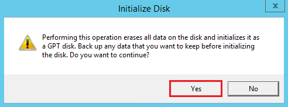

<properties 
	pageTitle="Azure 上で Windows を実行する仮想マシンの作成" 
	description="Azure で Windows 仮想マシン (VM) を作成し、ログオンしてデータ ディスクを接続する方法について説明します" 
	services="virtual-machines" 
	documentationCenter="" 
	authors="KBDAzure" 
	manager="timlt" 
	editor="tysonn"/>

<tags 
	ms.service="virtual-machines" 
	ms.workload="infrastructure-services" 
	ms.tgt_pltfrm="vm-windows" 
	ms.devlang="na" 
	ms.topic="article" 
	ms.date="03/04/2015" 
	ms.author="kathydav"/>

# Windows を実行する仮想マシンの作成

<a href="/documentation/articles/virtual-machines-windows-tutorial/" title="Azure Portal" class="current">Azure ポータル</a><a href="/documentation/articles/virtual-machines-windows-tutorial-azure-preview/" title="Azure Preview Portal">Azure プレビュー ポータル</a>

このチュートリアルでは、Azure 仮想マシン (VM) を簡単に作成する方法を示します。このチュートリアルでは Windows Server イメージを使用しますが、Azure では他にも使用可能なイメージが多数あります。使用可能なイメージには、Windows オペレーティング システム、Linux ベースのオペレーティング システム、プレインストールされているアプリケーションのイメージなどがあります。選択できるイメージは、ご利用のサブスクリプションの種類によって異なります。たとえば、デスクトップ イメージは MSDN サブスクリプション会員のみが使用できますです。

また、「[独自のイメージをテンプレートとして](../virtual-machines-create-upload-vhd-windows-server/)」使用して Windows VＭ を作成できます。Azure VM についての詳細は、「[Azure 仮想マシンの概要](http://msdn.microsoft.com/library/azure/jj156143.aspx)」をご覧ください。

[AZURE.INCLUDE [free-trial-note](../includes/free-trial-note.md)]

## 仮想マシンの作成方法

このセクションでは、管理ポータルの **[ギャラリーから]** オプションを使用して仮想マシンを作成する方法について説明します。このオプションは、**[簡易作成]** オプションよりも多数の構成の選択肢があります。たとえば、仮想マシンを仮想ネットワークに参加させる場合は、**[ギャラリーから]** オプションを使用する必要があります。

> [AZURE.NOTE] さらに、より機能が豊富でカスタマイズも可能な [Azure プレビュー ポータル](https://portal.azure.com)を使用すれば、仮想マシンの作成、複数の仮想マシンのアプリケーション テンプレートのデプロイの自動化、VM の強化された監視や診断の機能の使用など、さまざまな操作を試すことができます。この 2 つのポータルにある利用可能な VM の構成オプションには、性質上、重複するものもありますが、まったく同じではありません。  

[AZURE.INCLUDE [virtual-machines-create-WindowsVM](../includes/virtual-machines-create-WindowsVM.md)]

## 仮想マシンを作成後、ログオンする方法 

このセクションでは、仮想マシンにログオンする方法について説明します。ログオンすると、仮想マシン上で実行する設定とアプリケーションを管理できます。

[AZURE.INCLUDE [virtual-machines-log-on-win-server](../includes/virtual-machines-log-on-win-server.md)]

## 新しい仮想マシンにデータ ディスクを接続する方法 

このセクションでは、空のデータ ディスクを仮想マシンに接続する方法について説明します。既存のディスクの接続方法など、詳細については、[データ ディスクを仮想マシンに接続する方法](http://azure.microsoft.com/documentation/articles/storage-windows-attach-disk/)に関するページをご覧ください。

1. [Azure 管理ポータル](http://manage.windowsazure.com)にサインインします。

2. **[仮想マシン]** をクリックし、次に **[MyTestVM]** 仮想マシンを選択します。

	
	
3. 最初にクイック スタート ページが表示される場合があります。その場合は、上部にある **[ダッシュボード]** を選択します。

	

4. コマンド バーで、**[ディスクの接続]** をクリックし、表示される **[空のディスクの接続]** をクリックします。

		

5. **[仮想マシン名]**、**[ストレージの場所]**、**[ファイル名]**、**[ホスト キャッシュの設定]** の値は既に定義されています。指定する必要があるのは、ディスクのサイズです。たとえば、**[サイズ]** ボックスに「**5**」と入力します。チェック マークをクリックして、ディスクを接続します。

	>[AZURE.NOTE] ディスクはすべて、.vhd ファイルから Azure ストレージに作成されます。**ファイル名 ** を、ディスクが使用している .vhd ファイルの名前にはできますが、ディスク名にはできません。ディスク名は Azure が自動的に割り当てます。 

		
	
	>[AZURE.NOTE] .Vhd ファイルは、Azure ストレージにページ blob として格納されます。Azure 以外では、仮想ハード ディスクには VHD フォーマットまたは VHDX フォーマットを使用でき、固定、動的拡張、差分にも対応しています。Azure は VHD フォーマットの固定ディスクをサポートしています。詳細については、「[Azure の VHD について](http://msdn.microsoft.com/library/azure/dn790344.aspx)」をご覧ください。  

6. ダッシュボードに戻り、空のデータ ディスクが仮想マシンに正常に接続されたことを確認します。OS ディスクの後に **[ディスク]** リストに表示されます。

	

	データ ディスクを接続するときは、ディスクはオフラインになり初期化されません。データ ディスクを使ってデータを保存する前に、仮想マシンにログオンして、ディスクを初期化する必要があります。

7. 仮想マシンに接続してログオンするには、前のセクション「[仮想マシンを作成後、ログオンする方法]」の手順を使用します (#logon)。

8. 仮想マシンにログオンした後、**サーバー マネージャー**を開きます。左側のウィンドウで、**[ファイル サービスと記憶域サービス]** を選択します。

	

9. 展開したメニューの **[ディスク]** を選択します。

		
	
10.	**[ディスク]** セクションには、disk 0、disk 1、disk 2 が一覧表示されます。disk 0 は OS ディスク、disk 1 は一時リソース ディスク (データ ストレージとして使用しないでください) です。disk 2 は、仮想マシンに接続したデータ ディスクです。データ ディスクの容量は、ディスクに指定したものやディスクを接続したタイミングに基づいて、5 GB になります。ディスク 2 を右クリックし、  **[初期化]** を選択します。

	

11. **[はい]** をクリックします。

	

12. もう一度、disk 2 を右クリックし、**[新しいボリューム]** を選択します。 

	

13. 既定の値を使用してウィザードを完了します。ウィザードが終了すると、**[ボリューム]** セクションに新しいボリュームが表示されます。ディスクがオンラインになり、データを格納できるようになります。 

	
	
## 次のステップ 

Azure での Windows 仮想マシンの構成に関する詳細については、次の記事をご覧ください。

[仮想マシンを仮想ネットワークまたはクラウド サービスと接続する方法](../cloud-services-connect-virtual-machine/)

[Windows Server VHD の作成と Azure へのアップロード](../virtual-machines-create-upload-vhd-windows-server/)

[仮想マシンの可用性管理](../manage-availability-virtual-machines/)

[Azure VM 構成設定について](http://msdn.microsoft.com/library/azure/dn763935.aspx)

[ビデオ:Getting Started with VHDs - What's Really Happening (VHD の概要 - その実際)](http://azure.microsoft.com/documentation/videos/getting-started-with-azure-virtual-machines)

[ビデオ:FFAQ with Mark Russinovich - Does Azure run Windows? (Mark Russinovich への質問と回答 - Azure で Windows を実行できるか)](http://azure.microsoft.com/documentation/videos/mark-russinovich-windows-on-azure)

[ビデオ:Adding a new virtual machine to a Web Farm by making reusable images (再利用可能なイメージを作成して、新しい仮想マシンを Web ファームに追加する)](http://azure.microsoft.com/documentation/videos/adding-virtual-machines-web-farm)

[ビデオ:Adding Virtual Hard Drives, Storage Accounts, and Scaling Virtual Machines (仮想ハード ドライブの追加、ストレージ アカウント、仮想マシンのスケーリング)](http://azure.microsoft.com/documentation/videos/adding-drives-scaling-virtual-machines)

[ビデオ:Scott Guthrie starts with Virtual Machines (Scott Guthrie による仮想マシンの解説)](http://azure.microsoft.com/documentation/videos/virtual-machines-scottgu)

[ビデオ:Storage and Disk Basics with Azure Virtual Machines (Azure Virtual Machines のストレージとディスクの基本)](http://azure.microsoft.com/documentation/videos/storage-and-disks-virtual-machines)

[Azure での仮想マシンについて]: #virtualmachine
[仮想マシンの作成方法]: #custommachine
[仮想マシンを作成後、ログオンする方法]: #logon
[新しい仮想マシンにデータ ディスクを接続する方法]: #attachdisk
[仮想マシン間の通信をセットアップする方法]: #endpoints

<!--HONumber=47-->
