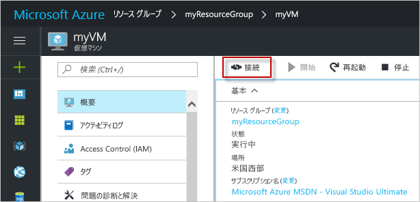

# <a name="create-a-linux-virtual-machine-with-the-azure-portal"></a>Azure Portal で Linux 仮想マシンを作成する

Azure 仮想マシンは、Azure Portal で作成できます。 この方法では、ブラウザーベースのユーザー インターフェイスで仮想マシンとそれに関連するすべてのリソースを作成して構成できます。 このクイック スタートでは、Azure Portal を使用して仮想マシンを作成する方法について説明しています。

Azure サブスクリプションをお持ちでない場合は、開始する前に [無料アカウント](https://azure.microsoft.com/en-us/free/?WT.mc_id=A261C142F) を作成してください。

## <a name="create-ssh-key-pair"></a>SSH キー ペアの作成

このクイック スタートの作業には SSH キー ペアが必要です。 既存の SSH キー ペアがある場合は、この手順はスキップしてかまいません。 Windows コンピューターを使っている場合は、[こちら](ssh-from-windows.md)のインストラクションに従ってください。 

Bash シェルから次のコマンドを実行して画面の指示に従います。 コマンド出力に公開キー ファイルの名前が表示されます。 このファイルの内容は、仮想マシンを作成するときに必要となります。

```bash
ssh-keygen -t rsa -b 2048
```

## <a name="log-in-to-azure"></a>Azure へのログイン 

Azure Portal (http://portal.azure.com) にログインします。

## <a name="create-virtual-machine"></a>仮想マシンの作成

1. Azure Portal の左上隅にある **[新規]** ボタンをクリックします。

2. **[新規]** ブレードの **[Compute]** を選択し、**[Compute]** ブレードの **[Ubuntu Server 16.04 LTS]** を選択して、**[作成]** ボタンをクリックします。

3. 仮想マシンの **[基本]** フォームに入力します。 **[Authentication Type]** として **[SSH]** を選択します。 **[SSH 公開キー]** にキーを貼り付けるときに、先頭と末尾の空白は削除するように注意してください。 **[リソース グループ]** では、新しいグループを作成します。 リソース グループとは、Azure リソースの作成と一括管理に使用する論理コンテナーです。 完了したら、**[OK]** をクリックします。

      

4. VM のサイズを選択します。 その他のサイズも表示するには、**[すべて表示]** を選択するか、**[Supported disk type (サポートされているディスクの種類)]** フィルターを変更します。 

      

5. 設定ブレードの **[管理ディスクを使用]** で **[はい]** を選択し、他の設定は既定のままにして、**[OK]** をクリックします。

6. 概要ページで **[OK]** をクリックして、仮想マシンのデプロイを開始します。

7. デプロイの状態を監視するには、仮想マシンをクリックします。 VM は、Azure Portal ダッシュボードに表示されます。または、左側のメニューで **[Virtual Machines]** を選択すると表示されます。 VM が作成されると、状態は **[デプロイ中]** から **[実行中]** に変わります。


## <a name="open-port-80-for-web-traffic"></a>Web トラフィック用にポート 80 を開く 

Azure にデプロイされている Linux 仮想マシンに対しては、既定で SSH 接続のみが許可されます。 この VM を Web サーバーとして使用する場合は、Web トラフィック用にポート 80 を開く必要があります。 次の手順でネットワーク セキュリティ グループ (NSG) の規則を作成し、ポート 80 で受信接続を許可してみましょう。

1. 仮想マシンのブレードの **[要点]** セクションで、**リソース グループ**の名前をクリックします。
2. リソース グループのブレードで、リソースの一覧の **[ネットワーク セキュリティ グループ]** をクリックします。 NSG 名は、VM 名の末尾に -nsg が付加された形式になります。
3. 見出しの **[セキュリティ規則の受信]** をクリックして、受信規則の一覧を開きます。 一覧には既に RDP の規則が表示されています。
4. **[+ 追加]** をクリックして **[受信セキュリティ規則の追加]** ブレードを開きます。
5. **[名前]** で「**nginx**」と入力します。 **[ポート範囲]** が 80 に設定されていることと、**[アクション]** が **[許可]** に設定されていることを確認します。 **[OK]**をクリックします。


## <a name="connect-to-virtual-machine"></a>仮想マシンへの接続

デプロイが完了したら、仮想マシンとの SSH 接続を作成します。

1. 仮想マシンのブレードで、**[接続]** ボタンをクリックします。 仮想マシンへの接続に使用できる SSH 接続文字列が表示されます。

     

2. 次のコマンドを実行して、SSH セッションを作成します。 接続文字列を、Azure Portal からコピーしたものに置き換えます。

```bash 
ssh <replace with IP address>
```

## <a name="install-nginx"></a>NGINX のインストール

次の bash スクリプトを使用して、パッケージのソースを更新し、最新の NGINX パッケージをインストールします。 

```bash 
#!/bin/bash

# update package source
apt-get -y update

# install NGINX
apt-get -y install nginx
```

## <a name="view-the-ngix-welcome-page"></a>NGIX のようこそページの表示

NGINX をインストールし、VM のポート 80 をインターネットから開いたら、任意の Web ブラウザーを使用して NGINX の既定のようこそページを表示することができます。 指定した `publicIpAddress` を使用して、既定のページにアクセスします。 

 
## <a name="delete-virtual-machine"></a>仮想マシンの削除

必要がなくなったら、リソース グループ、仮想マシン、すべての関連リソースを削除します。 そのためには、仮想マシン ブレードでリソース グループを選択し、**[削除]** をクリックします。

## <a name="next-steps"></a>次のステップ

[可用性が高い仮想マシンの作成のチュートリアル](create-cli-complete.md?toc=%2fazure%2fvirtual-machines%2flinux%2ftoc.json)

[VM デプロイ CLI サンプルを探索する](../windows/cli-samples.md?toc=%2fazure%2fvirtual-machines%2flinux%2ftoc.json)

