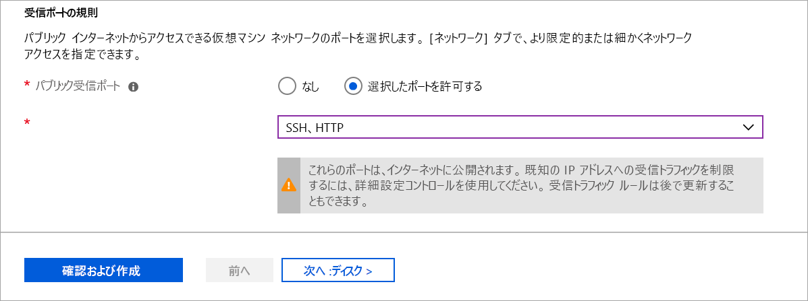

# <a name="quickstart-create-a-linux-virtual-machine-in-the-azure-portal"></a>クイック スタート: Azure portal で Linux 仮想マシンを作成する

Azure 仮想マシン (VM) は、Azure portal で作成できます。 この方法では、ブラウザー ベースのユーザー インターフェイスを使用して、VM とその関連リソースを作成できます。 このクイック スタートでは、Azure portal を使用して、Ubuntu を実行する Linux 仮想マシン (VM) を Azure にデプロイする方法を示します。 次に、VM の動作を確認するために、VM に SSH 接続し、NGINX Web サーバーをインストールします。

Azure サブスクリプションをお持ちでない場合は、開始する前に [無料アカウント](https://azure.microsoft.com/free/?WT.mc_id=A261C142F) を作成してください。

## <a name="create-ssh-key-pair"></a>SSH キー ペアの作成

このクイック スタートを完了するには、SSH キー ペアが必要です。 既存の SSH キー ペアがある場合は、この手順はスキップしてかまいません。

SSH キー ペアを作成して Linux VM にログインするには、Bash シェルから次のコマンドを実行し、画面の指示に従います。 たとえば、[Azure Cloud Shell](../../cloud-shell/overview.md) または [Linux 用 Windows サブシステム](/windows/wsl/install-win10)を使用できます。 コマンド出力に公開キー ファイルの名前が表示されます。 公開キー ファイル (`cat ~/.ssh/id_rsa.pub`) の内容をクリップボードにコピーします。

```bash
ssh-keygen -t rsa -b 2048
```

PuTTy の使用を含む SSH キー ペアの作成方法の詳細については、[Windows で SSH キーを使用する方法](ssh-from-windows.md)に関するページを参照してください。

## <a name="log-in-to-azure"></a>Azure にログインする

Azure Portal (http://portal.azure.com) にログインします

## <a name="create-virtual-machine"></a>仮想マシンの作成

1. Azure portal の左上隅にある **[リソースの作成]** を選択します。

1. Azure Marketplace リソースの一覧の上にある検索ボックスで Canonical の **Ubuntu Server 16.04 LTS** を検索して選択し、**[作成]** を選択します。

1. **[基本]** タブの **[Project details] (プロジェクトの詳細)** で、正しいサブスクリプションが選択されていることを確認し、**[リソース グループ]** で **[新規作成]** を選択します。 ポップアップで、リソース グループの名前として「*myResourceGroup*」と入力し、**[OK]* を選択します。 

    

1. **[Instance details] (インスタンスの詳細)** で、**[仮想マシン名]** として「*myVM*」と入力し、**[リージョン]** として *[米国東部]* を選択します。 他の既定値はそのままにします。

    ![[Instance details] (インスタンスの詳細) セクション](./media/quick-create-portal/instance-details.png)

1. **[Administrator account] (管理者アカウント)** で、**[SSH Public Key] (SSH 公開キー)** を選択し、ユーザー名を入力して公開キーをテキスト ボックスに貼り付けます。 公開キーの先頭または末尾の空白はすべて削除します。

    ![[Administrator account] (管理者アカウント)](./media/quick-create-portal/administrator-account.png)

1. **[受信ポートの規則]** > **[Public inbound ports] (パブリック受信ポート)** で、**[Allow selected ports] (選択されたポートを許可する)** を選択してから、ドロップダウンから **[SSH (22)]** と **[HTTP (80)]** を選択します。 

    

1. 残りの既定値はそのままにして、ページの一番下にある **[Review + create] (確認および作成)** ボタンを選択します。

    
## <a name="connect-to-virtual-machine"></a>仮想マシンへの接続

VM との SSH 接続を作成します。

1. VM の概要ページの **[接続]** ボタンを選択します。 

    

2. **[Connect to virtual machine]\(仮想マシンへの接続\)** ページで、ポート 22 を介して DNS 名で接続する既定のオプションをそのまま使用します。 **[VM ローカル アカウントを使用してログインする]** に、接続コマンドが表示されます。 ボタンをクリックしてこのコマンドをコピーします。 SSH 接続コマンドの例を次に示します。

    ```bash
    ssh azureuser@myvm-123abc.eastus.cloudapp.azure.com
    ```

3. Azure Cloud Shell や Bash on Ubuntu on Windows などのシェルに SSH 接続コマンドを貼り付けて、接続を作成します。 

## <a name="install-web-server"></a>Web サーバーのインストール

VM の動作を確認するために、NGINX Web サーバーをインストールします。 パッケージ ソースを更新して最新の NGINX パッケージをインストールするには、SSH セッションから次のコマンドを実行します。

```bash
# update packages
sudo apt-get -y update

# install NGINX
sudo apt-get -y install nginx
```

完了したら SSH セッションを `exit` し、Azure portal の VM のプロパティに戻ります。


## <a name="view-the-web-server-in-action"></a>動作中の Web サーバーを表示する

NGINX がインストールされ、VM に対しポート 80 が開かれると、Web サーバーにインターネットからアクセスできるようになります。 Web ブラウザーを開いて、VM のパブリック IP アドレスを入力します。 パブリック IP アドレスは、VM の概要ページ、または受信ポート規則を追加する *[ネットワーキング]* ページの上部に表示されます。


## <a name="clean-up-resources"></a>リソースのクリーンアップ

必要がなくなったら、リソース グループ、仮想マシン、およびすべての関連リソースを削除できます。 これを行うには、仮想マシンのリソース グループを選択し、**[削除]** を選択して、削除するリソース グループの名前を確認します。

## <a name="next-steps"></a>次の手順

このクイック スタートでは、単純な仮想マシンをデプロイし、ネットワーク セキュリティ グループと規則を作成し、基本的な Web サーバーをインストールしました。 Azure 仮想マシンの詳細については、Linux VM のチュートリアルを参照してください。

> [!div class="nextstepaction"]
> [Azure Linux 仮想マシンのチュートリアル](./tutorial-manage-vm.md)
