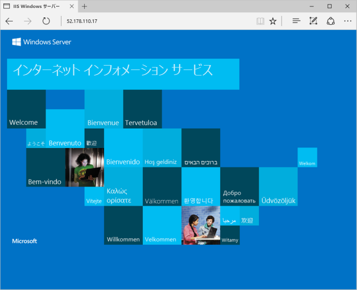

# <a name="create-a-windows-virtual-machine-with-the-azure-portal"></a>Azure Portal で Windows 仮想マシンを作成する

Azure 仮想マシンは、Azure Portal で作成できます。 この方法では、ブラウザーベースのユーザー インターフェイスで仮想マシンとそれに関連するすべてのリソースを作成して構成できます。 このクイック スタートでは、仮想マシンを作成してそこに Web サーバーをインストールする手順を紹介します。

Azure サブスクリプションをお持ちでない場合は、開始する前に [無料アカウント](https://azure.microsoft.com/free/?WT.mc_id=A261C142F) を作成してください。

## <a name="log-in-to-azure"></a>Azure にログインする

Azure Portal (http://portal.azure.com) にログインします。

## <a name="create-virtual-machine"></a>仮想マシンの作成

1. Azure Portal の左上隅にある **[リソースの作成]** をクリックします。

2. **[コンピューティング]**、**[Windows Server 2016 Datacenter]** の順に選択します。 

3. 仮想マシンの情報を入力します。 ここに入力したユーザー名とパスワードが、仮想マシンへのログインに使用されます。 パスワードは 12 文字以上で、[定義された複雑さの要件](faq.md#what-are-the-password-requirements-when-creating-a-vm)を満たす必要があります。 完了したら、**[OK]** をクリックします。

      

4. VM のサイズを選択します。 その他のサイズも表示するには、**[すべて表示]** を選択するか、**[Supported disk type (サポートされているディスクの種類)]** フィルターを変更します。 

      

5. **[設定]** は既定値のままにして、**[OK]** をクリックします。 

6. 概要ページで **[OK]** をクリックして、仮想マシンの展開を開始します。

7. 対応する VM が、Azure Portal のダッシュボードにピン留めされます。 デプロイが完了すると、VM の概要が自動的に表示されます。


## <a name="connect-to-virtual-machine"></a>仮想マシンへの接続

仮想マシンへのリモート デスクトップ接続を作成します。

1. 仮想マシンのプロパティで、**[接続]** ボタンをクリックします。 リモート デスクトップ プロトコル ファイル (.rdp ファイル) が作成されてダウンロードされます。

     

2. VM に接続するには、ダウンロードした RDP ファイルを開きます。 メッセージが表示されたら、**[接続]** をクリックします。 Mac では、この[リモート デスクトップ クライアント](https://itunes.apple.com/us/app/microsoft-remote-desktop/id715768417?mt=12)のような RDP クライアントを Mac App Store から入手する必要があります。

3. 仮想マシンの作成時に指定したユーザー名とパスワードを入力し、**[OK]** をクリックします。

4. サインイン処理中に証明書の警告が表示される場合があります。 **[はい]** または **[続行]** をクリックして接続処理を続行します。


## <a name="install-iis-using-powershell"></a>PowerShell を使用した IIS のインストール

仮想マシンで PowerShell セッションを開始し、次のコマンドを実行して IIS をインストールします。

```powershell
Install-WindowsFeature -name Web-Server -IncludeManagementTools
```

完了したら RDP セッションを終了し、Azure Portal の VM のプロパティに戻ります。

## <a name="open-port-80-for-web-traffic"></a>Web トラフィック用にポート 80 を開く 

受信トラフィックと送信トラフィックのセキュリティは、ネットワーク セキュリティ グループ (NSG) で確保します。 Azure Portal から VM を作成すると、RDP 接続用のポート 3389 に対する受信の規則が作成されます。 この VM は Web サーバーのホストとなるため、ポート 80 に対する NSG 規則を作成する必要があります。

1. 仮想マシンで **[リソース グループ]** の名前をクリックします。
2. **[ネットワーク セキュリティ グループ]** を選択します。 NSG は **[種類]** 列で確認できます。 
3. 左側のメニューの設定で、**[受信セキュリティ規則]** をクリックします。
4. **[追加]** をクリックします。
5. **[名前]** で「**http**」と入力します。 **[ポート範囲]** が 80 に設定されていることと、**[アクション]** が **[許可]** に設定されていることを確認します。 
6. Click **OK**.


## <a name="view-the-iis-welcome-page"></a>IIS のようこそページの表示

IIS がインストールされ、ご利用の VM に対してポート 80 が開放されると、Web サーバーにインターネットからアクセスできるようになります。 Web ブラウザーを開いて、VM のパブリック IP アドレスを入力します。 パブリック IP アドレスは、Azure Portal の *[Virtual Machines]* で確認できます。

 

## <a name="clean-up-resources"></a>リソースのクリーンアップ

必要がなくなったら、リソース グループ、仮想マシン、すべての関連リソースを削除します。 そのためには、VM のリソース グループを選択し、**[削除]** をクリックします。

## <a name="next-steps"></a>次の手順

このクイック スタートでは、単純な仮想マシンとネットワーク セキュリティ グループの規則をデプロイし、Web サーバーをインストールしました。 Azure 仮想マシンの詳細については、Windows VM のチュートリアルを参照してください。

> [!div class="nextstepaction"]
> [Azure Windows 仮想マシンのチュートリアル](./tutorial-manage-vm.md)
