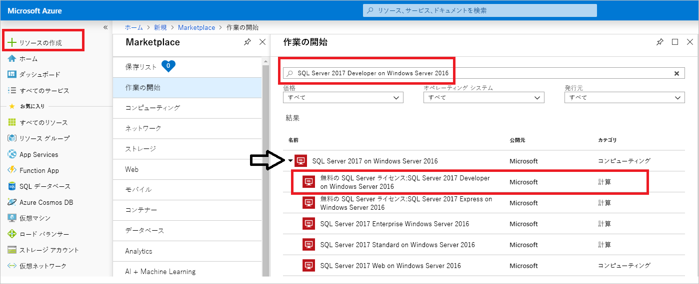
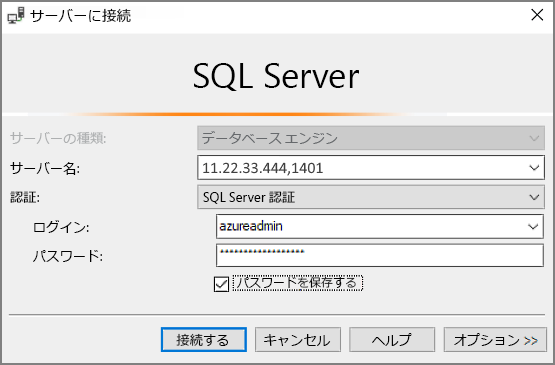

# クイック スタート: Azure Portal で SQL Server 2017 Windows 仮想マシンを作成する

> [!div class="op_single_selector"]
> * [Windows](quickstart-sql-vm-create-portal.md)
> * [Linux](../../linux/sql/provision-sql-server-linux-virtual-machine.md)

このクイック スタートでは、Azure ポータルで SQL Server 仮想マシンを作成する方法について説明しています。

> [!TIP]
> このクイック スタートでは、SQL VM を迅速にプロビジョニングしてそこに接続する方法について説明します。 その他の SQL VM プロビジョニング オプションについては、[Azure Portal での Windows SQL Server VM のプロビジョニング ガイド](virtual-machines-windows-portal-sql-server-provision.md)を参照してください。

> [!TIP]
> SQL Server の仮想マシンに関するご質問については、[よくあるご質問](virtual-machines-windows-sql-server-iaas-faq.md)に関するページをご覧ください。

## Azure サブスクリプションを取得する

Azure サブスクリプションをお持ちでない場合は、開始する前に [無料アカウント](https://azure.microsoft.com/free/?WT.mc_id=A261C142F) を作成してください。

## SQL Server VM イメージを選択する

1. アカウントを使用して [Azure Portal](https://portal.azure.com) にログインします。

1. Azure Portal で、**[リソースの作成]** をクリックします。 

1. 検索フィールドに「**SQL Server 2017 Developer on Windows Server 2016**」と入力し、Enter キーを押します。

1. **Free SQL Server License: SQL Server 2017 Developer on Windows Server 2016** イメージを選択します。

   

   > [!TIP]
   > このチュートリアルで Developer エディションを使用するのは、このエディションが SQL Server の完全版であり、開発テストを無料で実行できるためです。 ユーザーは VM を実行するコストに対してのみ課金されます。 料金に関する考慮事項については、「[SQL Server Azure VM の料金ガイダンス](virtual-machines-windows-sql-server-pricing-guidance.md)」を参照してください。

1. **Create** をクリックしてください。

## 基本的な詳細を指定する

**[基本]** ウィンドウで、次の情報を指定します。

1. **[名前]** フィールドに、一意の仮想マシン名を入力します。 

1. **[ユーザー名]** フィールドに、VM のローカル管理者アカウントの名前を入力します。

1. 強力な **パスワード**を指定します。

1. 新しい **[リソース グループ]** の名前を入力します。 このグループは、仮想マシンに関連付けられているすべてのリソースを管理するのに役立ちます。

1. 他の既定の設定を確認し、**[OK]** クリックして続行します。

   ![SQL の [基本] ウィンドウ](./media/quickstart-sql-vm-create-portal/azure-sql-basic.png)

## 仮想マシンのサイズを選択する

1. この**サイズ**設定の手順では、**[サイズの選択]** ウィンドウで仮想マシンのサイズを選択します。

   このクイック スタートでは、**[D2S_V3]** を選択します。 ポータルには、継続使用時の推定の月間マシン コストが表示されます (SQL Server のライセンス コストは含まれません)。 Developer Edition では SQL Server に対する追加のライセンス コストは発生しないことに注意してください。 詳細については、 [料金に関するページ](https://azure.microsoft.com/pricing/details/virtual-machines/windows/)を参照してください。

   > [!TIP]
   > **D2S_V3** というマシンのサイズは、テスト中のコストを削減します。 ただし、運用時のワークロードについては、「[Azure Virtual Machines における SQL Server のパフォーマンスに関するベスト プラクティス](virtual-machines-windows-sql-performance.md)」のマシンのサイズと構成に関する推奨事項を参照してください。

1. **[選択]** をクリックして続行します。

## オプション機能を構成する

1. VM にリモート デスクトップ接続する場合は、**[設定]** ウィンドウの **[Select public inbound ports]\(パブリック受信ポートの選択\)** 一覧で **[RDP (3389)]** ポートを選択します。

   

   > [!NOTE]
   > **[MS SQL (1433)]** ポートを選択すると、SQL Server にリモート アクセスできます。 ただし、「**SQL Server の設定**」の手順でもこのオプションが提供されるため、これは必要ありません。 この手順でポート 1433 を選択した場合、「**SQL Server の設定**」の手順での選択に関係なく、このポートが開かれます。

1. **[OK]** をクリックして変更を保存し、続行します。

## SQL Server の設定

**[SQL Server の設定]** ウィンドウで、次のオプションを構成します。

1. **[SQL 接続]** ドロップダウン リストで、**[パブリック (インターネット)]** を選択します。 これは、インターネット経由での SQL Server の接続を許可します。

1. パブリック シナリオでよく知られているポート名の使用を避けるために、**[ポート]** を **[1401]** に変更します。

1. **[SQL 認証]** で **[有効]** をクリックします。 VM 用に構成したのと同じユーザー名と パスワードが SQL ログインに設定されます。

1. 必要に応じてその他の設定を変更し、**[OK]** をクリックして SQL Server VM の構成を完了します。

   

## SQL Server VM を作成する

**[概要]** ウィンドウで概要を確認し、**[購入]** をクリックして、この VM に対して指定した SQL Server、リソース グループ、およびリソースを作成します。

Azure Portal でデプロイを監視できます。 画面の上部にある **[通知]** ボタンをクリックすると、デプロイの基本的な状態が表示されます。

> [!TIP]
> Windows SQL Server VM をデプロイするには数分かかる可能性があります。

## SQL Server への接続

1. ポータルで、仮想マシンのプロパティの **[概要]** セクションで、VM の **[パブック IP アドレス]** を見つけます。

1. インターネットに接続された別のコンピューターで、SQL Server Management Studio (SSMS) を開きます。

   > [!TIP]
   > SQL Server Management Studio を保有していない場合は、[ここ](https://docs.microsoft.com/sql/ssms/download-sql-server-management-studio-ssms)からダウンロードできます。

1. **[サーバーへの接続]** または **[データベース エンジンへの接続]** ダイアログ ボックスで、**[サーバー名]** の値を編集します。 VM のパブリック IP アドレスを入力します。 コンマを追加し、新しい VM を構成するときに指定したカスタム ポートの **1401** を追加します。 たとえば、「`11.22.33.444,1401`」のように入力します。

1. **[認証]** ボックスで、**[SQL Server 認証]** を選択します。

1. **[ログイン]** ボックスに、有効な SQL ログインの名前を入力します。

1. **[パスワード]** ボックスに、ログインのパスワードを入力します。

1. **[接続]** をクリックします。

    

## VM にリモート ログインする

リモート デスクトップを使用して SQL Server 仮想マシンに接続するには、次の手順に従います。

[!INCLUDE [Connect to SQL Server VM with remote desktop](../../../../includes/virtual-machines-sql-server-remote-desktop-connect.md)]

SQL Server 仮想マシンに接続した後は、SQL Server Management Studio を起動し、ローカル管理者の資格情報を使用して Windows 認証で接続できます。 SQL Server 認証を有効にした場合は、プロビジョニングの間に構成した SQL のログインとパスワードを使用して SQL 認証で接続することもできます。

マシンにアクセスすると、要件に基づいてマシンと SQL Server の設定を直接変更することができます。 たとえば、ファイアウォールの設定を構成したり、SQL Server の構成設定を変更したりできます。

## リソースのクリーンアップ

SQL VM を継続的に実行する必要がない場合は、使用中でないときに停止することで、不要な料金の発生を回避できます。 仮想マシンに関連付けらているすべてのリソースは、関連付けられているリソース グループをポータルで削除することで完全に削除することもできます。 これを行うと仮想マシンも完全に削除されるため、このコマンドは注意して使用してください。 詳細については、「 [ポータルを使用した Azure リソースの管理](../../../azure-resource-manager/resource-group-portal.md)」を参照してください。

## 次の手順

このクイック スタートでは、Azure Portal で SQL Server 2017 仮想マシンを作成しました。 新しい SQL Server にデータを移行する方法の詳細については、次の記事を参照してください。

> [!div class="nextstepaction"]
> [SQL VM にデータベースを移行する](virtual-machines-windows-migrate-sql.md)
