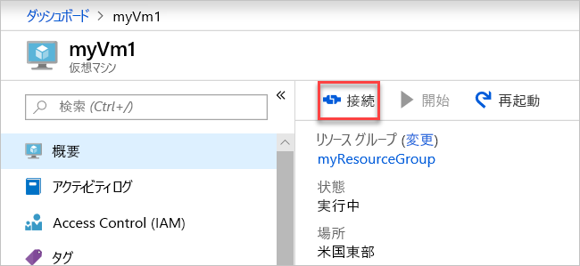

# <a name="quickstart-create-a-virtual-network-using-the-azure-portal"></a>クイック スタート: Azure Portal を使用した仮想ネットワークの作成

仮想ネットワークによって、仮想マシン (VM) などの Azure リソースが互いにプライベートな通信を行ったりインターネットと通信したりできるようになります。 このクイック スタートでは、仮想ネットワークの作成方法について説明します。 仮想ネットワークを作成したら、2 つの VM を仮想ネットワークにデプロイします。 その後、インターネットから 1 つの VM に接続し、2 つの VM の間でプライベートに通信します。

Azure サブスクリプションをお持ちでない場合は、開始する前に [無料アカウント](https://azure.microsoft.com/free/?WT.mc_id=A261C142F) を作成してください。

## <a name="log-in-to-azure"></a>Azure にログインする 

Azure Portal (https://portal.azure.com) にログインします。

## <a name="create-a-virtual-network"></a>仮想ネットワークの作成

1. Azure Portal の左上隅にある **[+ リソースの作成]** を選択します。
2. **[ネットワーク]** を選択してから、**[仮想ネットワーク]** を選択します。
3. 次の情報を入力するか選択し、それ以外の設定では既定値をそのまま使用して、**[作成]** を選択します。

    |Setting|値|
    |---|---|
    |Name|myVirtualNetwork|
    |[サブスクリプション]| サブスクリプションを選択します。|
    |リソース グループ| **[新規作成]** を選択し、「*myResourceGroup*と入力します。|
    |場所| **[米国東部]** を選択します。|

    

## <a name="create-virtual-machines"></a>仮想マシンを作成する

仮想ネットワークに 2 つの VM を作成します。

### <a name="create-the-first-vm"></a>最初の VM を作成する

1. Azure Portal の左上隅にある **[+ リソースの作成]** を選択します。
2. **[コンピューティング]**、**[Windows Server 2016 Datacenter]** の順に選択します。
3. 次の情報を入力するか選択し、それ以外の設定では既定値をそのまま使用して、**[OK]** を選択します。

    |Setting|値|
    |---|---|
    |Name|myVm1|
    |ユーザー名| 任意のユーザー名を入力します。|
    |パスワード| 任意のパスワードを入力します。 パスワードは 12 文字以上で、[定義された複雑さの要件](../virtual-machines/windows/faq.md?toc=%2fazure%2fvirtual-network%2ftoc.json#what-are-the-password-requirements-when-creating-a-vm)を満たす必要があります。|
    |[サブスクリプション]| サブスクリプションを選択します。|
    |リソース グループ| **[既存のものを使用]** を選択し、**[myResourceGroup]** を選択します。|
    |場所| **[米国東部]** を選択します。|

    

4. VM のサイズを選択して、**[選択]** を選択します。
5. **[設定]** で、すべての既定値をそのままにして、**[OK]** を選択します。

    

6. **[概要]** の **[作成]** で **[作成]** を選択して、VM のデプロイを開始します。 VM のデプロイには数分かかります。 

### <a name="create-the-second-vm"></a>2 つ目の VM を作成する

手順 1 -6 をもう一度実行します。ただし、手順 3 では、VM の名前を *myVm2* にします。

## <a name="connect-to-a-vm-from-the-internet"></a>インターネットから VM に接続する

1. *myVm1* が作成されたら接続します。 Azure Portal の上部で、「*myVm1*」と入力します。 検索結果に **myVm1** が表示されたら、それを選択します。 **[接続]** を選択します。

    

2. **[接続]** ボタンを選択した後、リモート デスクトップ プロトコル (.rdp) ファイルが作成され、お使いのコンピューターにダウンロードされます。  
3. ダウンロードされた rdp ファイルを開きます。 メッセージが表示されたら、**[Connect]** を選択します。 VM の作成時に指定したユーザー名とパスワードを入力します。 場合によっては、**[その他]**、**[別のアカウントを使用する]** を選択して、VM の作成時に入力した資格情報を指定する必要があります。 
4. **[OK]** を選択します。
5. サインイン処理中に証明書の警告が表示される場合があります。 警告を受け取ったら、**[はい]** または **[続行]** を選択して接続処理を続行します。

## <a name="communicate-between-vms"></a>VM 間の通信

1. PowerShell に `ping myvm2` と入力します。 ping はインターネット制御メッセージ プロトコル (ICMP) を使用します。既定では ICMP は Windows ファイアウォールで許可されないため、ping は失敗します。
2. 後の手順で *myVm2* が *myVm1* に ping できるようにするには、PowerShell から次のコマンドを入力します。これで、Windows ファイアウォールからの ICMP インバウンドが許可されます。

    ```powershell
    New-NetFirewallRule –DisplayName “Allow ICMPv4-In” –Protocol ICMPv4
    ```

3. *myVm1* へのリモート デスクトップ接続を閉じます。 

4. 「[インターネットから VM に接続する](#connect-to-a-vm-from-the-internet)」の手順をもう一度実行します。ただし、ここでは *myVm2* に接続します。 コマンド プロンプトに `ping myvm1` と入力します。

    *myVm1* から応答を受信します。これは、前の手順で *myVm1* VM での Windows ファイアウォール経由の ICMP を許可したためです。

5. *myVm2* へのリモート デスクトップ接続を閉じます。

## <a name="clean-up-resources"></a>リソースのクリーンアップ

リソース グループとそれに含まれるすべてのリソースが不要になったら、それらを削除します。

1. ポータル上部の **[検索]** ボックスに「*myResourceGroup*」と入力します。 検索結果に **[myResourceGroup]** が表示されたら、それを選択します。
2. **[リソース グループの削除]** を選択します。
3. **[TYPE THE RESOURCE GROUP NAME:]\(リソース グループ名を入力してください:\)** に「*myResourceGroup*」と入力し、**[削除]** を選択します。

## <a name="next-steps"></a>次の手順

このクイック スタートでは、既定の仮想ネットワークと 2 つの VM を作成しました。 インターネットから 1 つの VM に接続し、その VM ともう 1 つの VM のプライベート通信を行いました。 仮想ネットワーク設定について詳しくは、[仮想ネットワークの管理](manage-virtual-network.md)に関する記事をご覧ください。

既定で、Azure では仮想マシン間の無制限のプライベート通信が許可されますが、インターネットから Windows VM へは受信リモート デスクトップ接続のみが許可されます。 VM との間のさまざまな種類のネットワーク通信を許可または制限する方法については、[ネットワーク トラフィックのフィルター処理](tutorial-filter-network-traffic.md)に関するチュートリアルに進んでください。