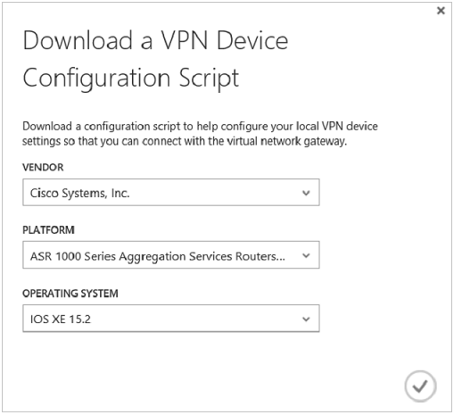

<properties linkid="manage-services-cross-premises-connectivity" urlDisplayName="クロスプレミス接続" pageTitle="クロスプレミス接続用の仮想ネットワークの作成 - Azure" metaKeywords="" description="クロスプレミス接続が可能な Azure の仮想ネットワークを作成する方法について説明します。" metaCanonical="" services="virtual-network" documentationCenter="" title="サイト間クロスプレミス接続用の仮想ネットワークの作成" authors=""  solutions="" writer="" manager="" editor=""  />

<h1 id="vnettut1">サイト間クロスプレミス接続用の仮想ネットワークの作成</h1>

このチュートリアルでは、クロスプレミス仮想ネットワークを作成する手順について説明します。作成する接続の種類はサイト間接続です。証明書と VPN クライアントを使用してポイント対サイト VPN を作成する場合は、「[管理ポータル ウィザードを使用したポイント対サイト VPN の構成](http://go.microsoft.com/fwlink/?LinkId=296653)」を参照してください。

このチュートリアルは、Azure を使用した経験がない読者を対象に作成されています。目的は、読者がサイト間仮想ネットワークの作成に必要な手順を習得できるようにすることです。仮想ネットワークのデザイン シナリオや詳細情報については、「[仮想ネットワーク](http://msdn.microsoft.com/ja-jp/library/windowsazure/jj156007.aspx)」を参照してください。

このチュートリアルを完了すると、Azure サービスと仮想マシンを展開できる仮想ネットワークが作成され、会社のネットワークと直接通信できます。

仮想マシンを追加し、内部設置型の Active Directory を Azure の仮想ネットワークに拡張する方法については、次のページを参照してください。

-  [カスタム仮想マシンを作成する方法](http://go.microsoft.com/fwlink/?LinkID=294356)

-  [Azure の仮想ネットワークでのレプリカ Active Directory ドメイン コントローラーのインストール](http://go.microsoft.com/fwlink/?LinkId=299877)

AD DS を Azure の仮想マシンに展開する方法に関するガイダンスについては、「[Azure の仮想マシンでの Windows Server Active Directory の展開ガイドライン](http://msdn.microsoft.com/ja-jp/library/windowsazure/jj156090.aspx)」を参照してください。

仮想ネットワーク構成のその他の手順と設定については、「[Azure の仮想ネットワークの構成タスク](http://go.microsoft.com/fwlink/?LinkId=296652)」を参照してください。

##  目標

このチュートリアルでは、次の事項について説明します。

-  Azure サービスを追加できる基本的な Azure の仮想ネットワークを設定する方法

-  会社のネットワークと通信するように仮想ネットワークを構成する方法

##  前提条件

-  少なくとも 1 つのサブスクリプションが有効でアクティブな Windows Live アカウント。

-  仮想ネットワークおよびサブネットに使用されるアドレス空間 (CIDR 表記)。

-  DNS サーバーの名前と IP アドレス (内部設置型の DNS サーバーを名前解決に使用する場合)。

-  パブリック IPv4 アドレスを持つ VPN デバイス。このウィザードを完了するには、IP アドレスが必要です。VPN デバイスは NAT の背後に配置することはできず、最低のデバイス標準を満たしている必要があります。詳細については、「[仮想ネットワークに使用する VPN デバイスについて](http://go.microsoft.com/fwlink/?LinkID=248098)」を参照してください。

	注: VPN ソリューションの一部として RRAS を使用できます。ただし、このチュートリアルでは RRAS の構成手順については説明しません。

	RRAS の構成情報については、「[ルーティングとリモート アクセス サービス用テンプレート](http://msdn.microsoft.com/library/windowsazure/dn133801.aspx)」を参照してください。

-  ルーターの構成経験、または構成時に補助する人。

-  ローカル ネットワーク (内部設置型のネットワーク) のアドレス空間。

## 手順概要

1.	[仮想ネットワークの作成](#CreateVN)

2.	[ゲートウェイの起動とネットワーク管理者用の情報の収集](#StartGateway)

3. [VPN デバイスの構成](#ConfigVPN)

##  <a name="CreateVN">仮想ネットワークの作成</a>

**会社のネットワークに接続する仮想ネットワークを作成するには: **

1.	[Azure の管理ポータル](http://manage.windowsazure.com/)にログインします。

2.	画面の左下隅で **[新規]** をクリックします。ナビゲーション ウィンドウで、**[ネットワーク]**、**[仮想ネットワーク]** の順にクリックします。**[カスタム作成]** をクリックして、構成ウィザードを開始します。

	

3.	**[仮想ネットワークの詳細]** ページで、次の情報を入力し、右下にある次へ進む矢印をクリックします。詳細ページの設定の詳細については、「[管理ポータルでの仮想ネットワークの構成について](http://go.microsoft.com/fwlink/?LinkID=248092)」の「**[仮想ネットワークの詳細]**」セクションを参照してください。

-  **[名前]:** 仮想ネットワークの名前を指定します。「*YourVirtualNetwork*」と入力します。

-  **[アフィニティ グループ]:** ドロップダウン リストから **[新しいアフィニティ グループの作成]** を選択します。アフィニティ グループでは、Azure サービスを同じデータ センターに物理的にグループ化してパフォーマンスを向上させます。1 つのアフィニティ グループに割り当てることができる仮想ネットワークは 1 つのみです。

-  **[リージョン]:** ドロップダウン リストからリージョンを選択します。仮想ネットワークは、指定したリージョンにあるデータ センターに作成されます。

-  **[アフィニティ グループ名]:** 新しいアフィニティ グループの名前を指定します。「*YourAffinityGroup*」と入力します。

	

4.	**[DNS サーバーおよび VPN 接続]** ページで、次の情報を入力し、右下にある次へ進む矢印をクリックします。

	
 
	<b>注</b>
	
このページでは、**Point-To-Site** 構成と **Site-To-Site** 構成の両方を同時に選択できます。このチュートリアルでは、**[サイト間]** 構成だけを選択します。このページの設定の詳細については、「<a href="http://go.microsoft.com/fwlink/?LinkID=248092">管理ポータルでの仮想ネットワークの構成について</a>」の **[DNS サーバーおよび VPN 接続]** ページを参照してください。

	

-  **[DNS サーバー]:** 名前解決に使用する DNS サーバー名と IP アドレスを入力します。通常、これは内部設置型の名前解決に使用する DNS サーバーです。この設定で、DNS サーバーは作成されません。名前に「*YourDNS*」、IP アドレスに「*10.1.0.4*」と入力します。
-  **[ポイント対サイト VPN の構成]:** このフィールドの値を空にします。
-  **[サイト対サイト VPN の構成]:** チェックボックスをオンにします。
-  **[ローカル ネットワーク]**: ドロップダウン リストから **[新しいローカル ネットワークを指定する]** を選択します。
 
	

5.	**[サイト間接続]** ページで、次の情報を入力し、ページの右下にあるチェックマークをクリックにします。このページの設定の詳細については、「[管理ポータルでの仮想ネットワークの構成について](http://go.microsoft.com/fwlink/?LinkID=248092)」の **[サイト間接続]** ページ セクションを参照してください。

-  **[名前]:** 「*YourCorpHQ*」と入力します。

-  **[VPN デバイスの IP アドレス]:** VPN デバイスのパブリック IP アドレスを入力します。この情報がない場合は、ウィザードの次の手順に進む前にそれを取得する必要があります。VPN デバイスは NAT の背後に配置することはできません。VPN デバイスの詳細については、「[仮想ネットワークに使用する VPN デバイスについて](http://msdn.microsoft.com/ja-jp/library/windowsazure/jj156075.aspx)」を参照してください。

-  **[アドレス空間]:** 「*10.1.0.0/16*」と入力します。
-  **[アドレス空間の追加]:** このチュートリアルでは、追加のアドレス空間は必要ありません。

	

6. **[仮想ネットワーク アドレス空間]** ページで、次の情報を入力し、右下にあるチェックマークをクリックしてネットワークを構成します。

	アドレス空間は、RFC 1918 で定義されたプライベート アドレスの範囲 (CIDR 表記では 10.0.0.0/8、172.16.0.0/12、または 192.168.0.0/16) 内にあることが必要です。このページの設定の詳細については、「[管理ポータルでの仮想ネットワークの構成について](http://go.microsoft.com/fwlink/?LinkID=248092)」の「**[仮想ネットワーク アドレス空間] ページ**」を参照してください。

-  **[アドレス空間]:** 右上隅にある **[CIDR]** をクリックし、次の情報を入力します。
	-  **[開始 IP]:** 10.4.0.0
	-  **[CIDR]:** /16
-  **[サブネットの追加]:** 次の情報を入力します。
	-  **[Subnet-1]** を「*FrontEndSubnet*」に変更して、開始 IP を「*10.4.2.0/24*」に設定し、**[サブネットの追加]** をクリックします。
	-  ****サブネット「*BackEndSubnet*」を開始 IP「*10.4.3.0/24*」で追加します。
	-  ****サブネット「*ADDNSSubnet*」を開始 IP「*10.4.4.0/24*」で追加します。
	-  ****ゲートウェイ サブネットを開始 IP「*10.4.1.0/24*」で追加します。
	-  3 つのサブネットと 1 つのゲートウェイ サブネットが作成されたことを**確認**し、右下にあるチェックマークをクリックして仮想ネットワークを作成します。

	

7.	チェックマークをクリックすると、仮想ネットワークの作成が開始されます。仮想ネットワークが作成されると、管理ポータルのネットワーク ページの [状態] に [作成済み] と表示されます。

	

##  <a name="StartGateway">ゲートウェイの起動</a>

Azure の仮想ネットワークを作成した後、サイト間 VPN を作成するために、次の手順で仮想ネットワーク ゲートウェイを構成します。この手順では、最小要件を満たす VPN デバイスが必要です。VPN デバイスとデバイスの構成の詳細については、「[仮想ネットワークに使用する VPN デバイスについて](http://go.microsoft.com/fwlink/?LinkID=248098)」を参照してください。

**ゲートウェイを起動するには: **

1.	仮想ネットワークが作成されると、仮想ネットワークの状態として **[ネットワーク]** ページに **[作成済み]** と表示されます。

	**[名前]** 列で **[YourVirtualNetwork]** をクリックして、ダッシュボードを開きます。
 
	

2.	ページの上部にある **[ダッシュボード]** をクリックします。[ダッシュボード] ページで、ページの下部にある **[ゲートウェイの作成]** をクリックします。作成するゲートウェイの種類として、**[動的ルーティング]** または **[静的ルーティング]** を選択します。

	この仮想ネットワークを、サイト間接続だけでなくポイント対サイト接続にも使用する場合は、ゲートウェイの種類として [動的ルーティング] を選択する必要があります。ゲートウェイを作成する前に、VPN デバイスが作成するゲートウェイをサポートすることを確認してください。「[仮想ネットワークに使用する VPN デバイスについて](http://go.microsoft.com/fwlink/?LinkID=248098)」を参照してください。ゲートウェイを作成するかどうかを確認するように求められたら、**[はい]** をクリックします。

	

3.	ゲートウェイの作成が開始されると、ゲートウェイが開始されたことを知らせるメッセージが表示されます。

	ゲートウェイの作成には最大 15 分かかる場合があります。

4.	ゲートウェイの作成後、VPN デバイスの構成で使用する以下の情報を収集する必要があります。

-  ゲートウェイ IP アドレス
-  共有キー
-  VPN デバイス構成スクリプトのテンプレート

	次の手順では、このプロセスについて説明します。

5.	ゲートウェイ IP アドレスを見つけるには – ゲートウェイ IP アドレスは、仮想ネットワークの **[ダッシュボード]** ページにあります。

	

6.	共有キーを取得するには – 共有キーは、仮想ネットワークの **[ダッシュボード]** ページにあります。画面の下部にある [キーの管理] をクリックし、ダイアログ ボックスに表示されたキーをコピーします。

	

7.	VPN デバイス構成スクリプトのテンプレートをダウンロードします。ダッシュボードで **[VPN デバイス スクリプトのダウンロード]** をクリックします。

8.	**[VPN デバイス構成スクリプトのダウンロード]** ダイアログ ボックスで、会社の VPN デバイスのベンダー、プラットフォーム、オペレーティング システムを選択します。チェックマークをクリックして、ファイルを保存します。

	

使用する VPN デバイスがドロップダウン リストに表示されない場合、その他のスクリプト テンプレートについては、MSDN ライブラリの「[仮想ネットワークに使用する VPN デバイスについて](http://go.microsoft.com/fwlink/?LinkID=248098)」を参照してください。

##  <a name="ConfigVPN">VPN デバイスの構成 (ネットワーク管理者)</a>

VPN デバイスごとに異なるため、ここでは大まかな手順を示します。この手順はネットワーク管理者が行う必要があります。

管理ポータルまたは「[仮想ネットワークに使用する VPN デバイスについて](http://go.microsoft.com/fwlink/?LinkId=248098)」から VPN 構成スクリプトを入手できます。これには、使用するルーティング構成と互換性のあるルーティングの種類とデバイスに関する説明も含まれます。

仮想ネットワーク ゲートウェイの構成の詳細については、「[管理ポータルでの仮想ネットワーク ゲートウェイの構成](http://go.microsoft.com/fwlink/?LinkId=299878)」と VPN デバイスのドキュメントを参照してください。

次の前提条件はこの手順で必要になります。

-  VPN デバイスを構成する人は、選択されたデバイスの構成について詳しく知っている。仮想ネットワークと互換性があるデバイスの数と各デバイス ファミリに固有の構成の数が多いので、以下の手順ではデバイス構成について細かく説明しません。そのため、デバイスを構成する人はデバイスとその構成について詳しいことが重要です。

-  選択したデバイスは、仮想ネットワークと互換性がある。デバイスの互換性については、[ここ](http://go.microsoft.com/fwlink/?LinkID=248098)で確認してください。

**VPN デバイスを構成するには: **

1.	VPN 構成スクリプトを変更します。次の項目を構成します。

	a.	セキュリティ ポリシー

	b.	受信トンネル

	c.	送信トンネル

2.	変更した VPN 構成スクリプトを実行して VPN デバイスを構成します。

3.	次のいずれかのコマンドを実行して接続をテストします。

	<table border="1">
	<tr>
	<th>-</th>
	<th>Cisco ASA</th>
	<th>Cisco ISR/ASR</th>
	<th>Juniper SSG/ISG</th>
	<th>Juniper SRX/J</th>
	</tr>
	
	<tr>
	<td><b>メイン モード SA の確認</b></td>
	<td>show crypto isakmp sa</td>
	<td>show crypto isakmp sa</td>
	<td>get ike cookie</td>
	<td>show security ike security-association</td>
	</tr>
	
	<tr>
	<td><b>クイック モード SA の確認</b></td>
	<td>show crypto ipsec sa</td>
	<td>show crypto ipsec sa</td>
	<td>get sa</td>
	<td>show security ipsec security-association</td>
	</tr>
	</table>

##  次のステップ
内部設置型の Active Directory を、ここで作成した仮想ネットワークに拡張するには、次に示しているチュートリアルに進みます。

-  [カスタム仮想マシンを作成する方法](http://go.microsoft.com/fwlink/?LinkID=294356)

-  [Azure の仮想ネットワークでのレプリカ Active Directory ドメイン コントローラーのインストール](http://go.microsoft.com/fwlink/?LinkId=299877)

構成をバックアップしたりテンプレートとして使用したりするために、仮想ネットワークの設定をネットワーク構成ファイルにエクスポートする場合は、「[ネットワーク構成ファイルへの仮想ネットワーク設定のエクスポート](http://go.microsoft.com/fwlink/?LinkID=299880)」を参照してください。

## 関連項目

-  [Azure の仮想ネットワーク](http://msdn.microsoft.com/ja-jp/library/windowsazure/jj156007.aspx)

-  [仮想ネットワーク FAQ](http://msdn.microsoft.com/library/windowsazure/dn133803.aspx)

-  [ネットワーク構成ファイルを使用した仮想ネットワークの構成](http://msdn.microsoft.com/ja-jp/library/windowsazure/jj156097.aspx)

-  [Add a Virtual Machine to a Virtual Network (仮想ネットワークへの仮想マシンの追加)](http://www.windowsazure.com/ja-jp/manage/services/networking/add-a-vm-to-a-virtual-network/)

-  [仮想ネットワークの VPN デバイスについて](http://msdn.microsoft.com/ja-jp/library/windowsazure/jj156075.aspx)

-  [名前解決](http://go.microsoft.com/fwlink/?LinkId=248097)

