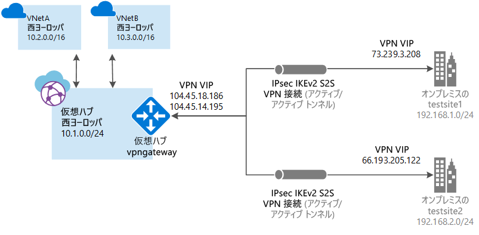

# <a name="tutorial-create-a-site-to-site-connection-using-azure-virtual-wan-preview"></a>チュートリアル: Azure Virtual WAN (プレビュー) を使用してサイト間接続を作成する

このチュートリアルでは、Virtual WAN を使用して IPsec/IKE (IKEv2) VPN 接続経由で Azure のリソースに接続する方法を示します。 この種類の接続では、外部接続用パブリック IP アドレスが割り当てられていてるオンプレミスの VPN デバイスが必要です。 Virtual WAN の詳細については、[Virtual WAN の概要](virtual-wan-about.md)に関するページを参照してください

> [!NOTE]
> 通常、多くのサイトがある場合は、[Virtual WAN パートナー](https://aka.ms.virtualwan)を利用してこの構成を作成します。 ただし、ネットワークに慣れていて、独自の VPN デバイスの構成に熟練している場合は、この構成を自分で作成することができます。
>



このチュートリアルで学習する内容は次のとおりです。

> [!div class="checklist"]
> * WAN を作成する
> * サイトを作成する
> * ハブを作成する
> * ハブをサイトに接続する
> * VNet をハブに接続する
> * VPN デバイス構成をダウンロードして適用する
> * 仮想 WAN を表示する
> * リソースの正常性を表示する
> * 接続を監視する

> [!IMPORTANT]
> Azure Virtual WAN は、現在、マネージド パブリック プレビュー段階です。 Virtual WAN を使用するには、[プレビューに登録する](#enroll)必要があります。
>
> このパブリック プレビュー版はサービス レベル アグリーメントなしで提供されています。運用環境のワークロードに使用することは避けてください。 特定の機能はサポート対象ではなく、機能が制限されることがあるか、Azure の場所によっては利用できない場合があります。 詳しくは、「[Microsoft Azure プレビューの追加使用条件](https://azure.microsoft.com/support/legal/preview-supplemental-terms/)」をご覧ください。

## <a name="before-you-begin"></a>開始する前に

構成を開始する前に、以下の条件を満たしていることを確認します。

* IKEv2 を使用できる互換性のあるルートベースの VPN デバイスがあり、それを構成できる人員がいることを確認します。 Virtual WAN パートナーと連携している場合は、構成設定が自動的に作成されるため、デバイスを手動で構成する方法について心配する必要はありません。
* VPN デバイスの外部接続用パブリック IPv4 アドレスがあることを確認します。 この IP アドレスを NAT の内側に割り当てることはできません。
* 接続する仮想ネットワークが既にある場合は、オンプレミス ネットワークのどのサブネットも接続先の仮想ネットワークと重複していないことを確認します。 仮想ネットワークではゲートウェイ サブネットは必要ありません。仮想ネットワークに仮想ネットワーク ゲートウェイを配置することはできません。 仮想ネットワークがない場合は、この記事の手順を使用して仮想ネットワークを作成できます。
* ハブ リージョンの IP アドレス範囲を取得します。 ハブは仮想ネットワークであり、ハブ リージョンに指定するアドレス範囲が接続先の既存の仮想ネットワークと重複することはできません。 さらに、オンプレミスで接続するアドレス範囲と重複することもできません。 オンプレミス ネットワーク構成の IP アドレス範囲を把握していない場合は、詳細な情報を把握している担当者と協力して作業を行ってください。
* Azure サブスクリプションをお持ちでない場合は、開始する前に [無料アカウント](https://azure.microsoft.com/free/?WT.mc_id=A261C142F) を作成してください。

## <a name="enroll"></a>1.プレビューに登録する

Virtual WAN を構成する前に、まずプレビューにサブスクリプションを登録する必要があります。 これを行わないと、ポータルで Virtual WAN を使用できません。 登録するには、サブスクリプション ID を明記して、**azurevirtualwan@microsoft.com** にメールを送信します。 サブスクリプションが登録されると、メールが届きます。

## <a name="vnet"></a>2.仮想ネットワークの作成

VNet がまだない場合は、PowerShell を使用して簡単に作成できます。 仮想ネットワークは、Azure portal を使用して作成することもできます。

* 作成する VNet のアドレス空間が接続する他の VNet のアドレス範囲やオンプレミス ネットワークのアドレス空間と重複しないことを確認してください。 
* VNet が既にある場合は、VNet が必要な条件を満たしていて、仮想ネットワーク ゲートウェイがないことを確認します。

この記事の [使ってみる] をクリックして PowerShell コンソールを開くと、VNet を簡単に作成することができます。 値を調整し、コマンドをコピーしてコンソール ウィンドウに貼り付けます。

### <a name="create-a-resource-group"></a>リソース グループの作成

PowerShell コマンドを調整した後、リソース グループを作成します。

```azurepowershell-interactive
New-AzureRmResourceGroup -ResourceGroupName WANTestRG -Location WestUS
```

### <a name="create-a-vnet"></a>VNet を作成する

PowerShell コマンドを調整して、ご使用の環境に適した VNet を作成します。

```azurepowershell-interactive
$fesub1 = New-AzureRmVirtualNetworkSubnetConfig -Name FrontEnd -AddressPrefix "10.1.0.0/24"
$vnet   = New-AzureRmVirtualNetwork `
            -Name WANVNet1 `
            -ResourceGroupName WANTestRG `
            -Location WestUS `
            -AddressPrefix "10.1.0.0/16" `
            -Subnet $fesub1
```

## <a name="wan"></a>3.仮想 WAN を作成する

1. ブラウザーから [Azure ポータル](https://portal.azure.com) に移動し、Azure アカウントでサインインします。
2. 現時点では、**[すべてのサービス]** に移動して "Virtual WAN" を検索することで、Virtual WAN を見つけることができます。 または、Azure portal の上部にある検索ボックスで "Virtual WAN" を検索できます。 **[Virtual WAN]** をクリックしてページを開きます。
3. **[作成]** をクリックして **[WAN の作成]** ページを開きます。 ページを利用できない場合は、まだこのプレビューの承認が得られていません。

  
4. [WAN の作成] ページで、次のフィールドに入力します。

  * **[名前]** - WAN に付ける名前を選択します。
  * **[サブスクリプション]** - 使用するサブスクリプションを選択します。
  * **[リソース グループ]** - 新規に作成するか、既存のものを使用します。
  * **[リソースの場所]** - ドロップダウンからリソースの場所を選択します。 WAN はグローバルなリソースであり、特定のリージョンに存在するものではありません。 ただし、作成する WAN リソースをより簡単に管理および検索するために、リージョンを選択する必要があります。
5. **[作成]** をクリックして WAN を作成します。

## <a name="site"></a>4.サイトを作成する

物理的な場所に合わせて必要な数のサイトを作成します。 たとえば、NY、ロンドン、および LA にブランチ オフィスがある場合は、3 つの別個のサイトを作成します。 これらのサイトには、オンプレミス VPN デバイスのエンドポイントが含まれています。 現時点では、サイトに対してプライベート アドレス空間を 1 つだけ指定できます。

1. **[すべてのリソース]** に移動します。
2. 作成した仮想 WAN をクリックします。
3. ページの上部にある **[+ サイトの作成]** をクリックして、**[サイトの作成]** ページを開きます。

  
4. **[サイトの作成]** ページで、次のフィールドに入力します。

  *  **[名前]** - これは、オンプレミスのサイトの呼称です。
  *  **[パブリック IP アドレス]** - これは、オンプレミスのサイトにある VPN デバイスのパブリック IP アドレスです。
  *  **[プライベート アドレス空間]** - これは、オンプレミスのサイトにある IP アドレス空間です。 このアドレス空間宛てのトラフィックは、ローカル サイトにルーティングされます。
  *  **[サブスクリプション]** - サブスクリプションを確認します。
  *  **[リソース グループ]** - 使用するリソース グループ。
5. **[詳細設定の表示]** をクリックして追加の設定を表示します。 **BGP を有効にする**ことができます (オプション フィールド)。Azure のこのサイト用に作成されたすべての接続でこの機能が有効になります。 **[デバイス情報]** (オプション フィールド) に入力することもできます。 これにより、Azure チームがお客様の環境をよりよく理解し、将来の最適化の可能性を追加したり、トラブルシューティングに役立てることができます。

  
6. **[確認]** をクリックしてサイトを作成します。
7. 作成するサイトごとにこれらの手順を繰り返します。

## <a name="hub"></a>5.ハブを作成してサイトを接続する

1. 仮想 WAN のページで、**[サイト]** をクリックします。
2. **[関連付けられていないサイト]** に、まだハブに接続されていないサイトの一覧が表示されます。
3. 関連付けるサイトを選択します。
4. ドロップダウンで、ハブを関連付けるリージョンを選択します。 ハブは、接続する VNet が存在するリージョンに関連付ける必要があります。
5. **[Confirm]\(確認\)** をクリックします。 このリージョンにハブがまだない場合は、仮想ハブ VNet が自動的に作成されます。 その場合、**[地域ハブの作成]** ページが表示されます。
6. **[地域ハブの作成]** ページで、ハブ VNet のアドレス範囲を入力します。 これは、ハブ サービスを含む VNet です。 ここに入力する範囲は、プライベート IP アドレス範囲でなければならず、オンプレミスのアドレス空間または VNet アドレス空間と重複してはいけません。 後続の VPN エンドポイントは、このハブ VNet に作成されます  (ハブとゲートウェイの自動作成はポータルでのみ可能です)。
7. **Create** をクリックしてください。

## <a name="vnet"></a>6.VNet をハブに接続する

この手順では、ハブと VNet の間にピアリング接続を作成します。 接続する VNet ごとにこれらの手順を繰り返します。

1. 仮想 WAN のページで、**[仮想ネットワーク接続]** をクリックします。
2. 仮想ネットワーク接続のページで、**[+ 接続の追加]** をクリックします。
3. **[接続の追加]** ページで、次のフィールドに入力します。

    * **[接続名]** - 接続に名前を付けます。
    * **[ハブ]** - この接続に関連付けるハブを選択します。
    * **[サブスクリプション]** - サブスクリプションを確認します。
    * **[仮想ネットワーク]** - このハブに接続する仮想ネットワークを選択します。 仮想ネットワークに既存の仮想ネットワーク ゲートウェイを設定することはできません。

## <a name="device"></a>7.VPN 構成をダウンロードする

オンプレミス VPN デバイスを構成するには、VPN デバイス構成を使用します。

1. 仮想 WAN のページで、**[概要]** をクリックします。
2. [概要] ページの上部にある **[VPN 構成をダウンロードする]** をクリックします。 Azure により、リソース グループ "microsoft-network-[location]" にストレージ アカウントが作成されます。ここで、location は WAN の場所です。 VPN デバイスに構成を適用した後は、このストレージ アカウントを削除できます。
3. ファイルの作成が完了したら、リンクをクリックしてファイルをダウンロードできます。
4. VPN デバイスに構成を適用します。

### <a name="understanding-the-vpn-device-configuration-file"></a>VPN デバイス構成ファイルについて

デバイス構成ファイルには、オンプレミスの VPN デバイスを構成するときに使用する構成が含まれています。 このファイルを表示すると、次の情報を確認できます。

* **vpnSiteConfiguration -** このセクションは、仮想 WAN に接続するサイトとして設定されたデバイスの詳細を示します。 ブランチ デバイスの名前とパブリック IP アドレスが含まれています。
* **vpnSiteConnections -** このセクションには、次の情報が含まれています。

    * 仮想ハブ VNet の**アドレス空間**<br>例:
 
        ```
        "AddressSpace":"10.1.0.0/24"
        ```
    * ハブに接続されている VNet の**アドレス空間**<br>例:

         ```
        "ConnectedSubnets":["10.2.0.0/16","10.30.0.0/16"]
         ```
    * 仮想ハブ vpngateway の **IP アドレス**。 vpngateway にはアクティブ/アクティブ構成の 2 つのトンネルで構成される接続があるため、このファイルには両方の IP アドレスが示されています。 この例では、サイトごとに "Instance0" と "Instance1" が表示されています。<br>例:

        ``` 
        "Instance0":"104.45.18.186"
        "Instance1":"104.45.13.195"
        ```
    * BGP、事前共有キーなどの、**vpngateway 接続構成の詳細**。PSK は、自動的に生成される事前共有キーです。 カスタム PSK の [概要] ページで接続をいつでも編集できます。
  
### <a name="example-device-configuration-file"></a>デバイス構成ファイルの例

  ```
  { 
      "configurationVersion":{ 
         "LastUpdatedTime":"2018-07-03T18:29:49.8405161Z",
         "Version":"r403583d-9c82-4cb8-8570-1cbbcd9983b5"
      },
      "vpnSiteConfiguration":{ 
         "Name":"testsite1",
         "IPAddress":"73.239.3.208"
      },
      "vpnSiteConnections":[ 
         { 
            "hubConfiguration":{ 
               "AddressSpace":"10.1.0.0/24",
               "Region":"West Europe",
               "ConnectedSubnets":[ 
                  "10.2.0.0/16",
                  "10.30.0.0/16"
               ]
            },
            "gatewayConfiguration":{ 
               "IpAddresses":{ 
                  "Instance0":"104.45.18.186",
                  "Instance1":"104.45.13.195"
               }
            },
            "connectionConfiguration":{ 
               "IsBgpEnabled":false,
               "PSK":"bkOWe5dPPqkx0DfFE3tyuP7y3oYqAEbI",
               "IPsecParameters":{ 
                  "SADataSizeInKilobytes":102400000,
                  "SALifeTimeInSeconds":3600
               }
            }
         }
      ]
   },
   { 
      "configurationVersion":{ 
         "LastUpdatedTime":"2018-07-03T18:29:49.8405161Z",
         "Version":"1f33f891-e1ab-42b8-8d8c-c024d337bcac"
      },
      "vpnSiteConfiguration":{ 
         "Name":" testsite2",
         "IPAddress":"66.193.205.122"
      },
      "vpnSiteConnections":[ 
         { 
            "hubConfiguration":{ 
               "AddressSpace":"10.1.0.0/24",
               "Region":"West Europe"
            },
            "gatewayConfiguration":{ 
               "IpAddresses":{ 
                  "Instance0":"104.45.18.187",
                  "Instance1":"104.45.13.195"
               }
            },
            "connectionConfiguration":{ 
               "IsBgpEnabled":false,
               "PSK":"XzODPyAYQqFs4ai9WzrJour0qLzeg7Qg",
               "IPsecParameters":{ 
                  "SADataSizeInKilobytes":102400000,
                  "SALifeTimeInSeconds":3600
               }
            }
         }
      ]
   },
   { 
      "configurationVersion":{ 
         "LastUpdatedTime":"2018-07-03T18:29:49.8405161Z",
         "Version":"cd1e4a23-96bd-43a9-93b5-b51c2a945c7"
      },
      "vpnSiteConfiguration":{ 
         "Name":" testsite3",
         "IPAddress":"182.71.123.228"
      },
      "vpnSiteConnections":[ 
         { 
            "hubConfiguration":{ 
               "AddressSpace":"10.1.0.0/24",
               "Region":"West Europe"
            },
            "gatewayConfiguration":{ 
               "IpAddresses":{ 
                  "Instance0":"104.45.18.187",
                  "Instance1":"104.45.13.195"
               }
            },
            "connectionConfiguration":{ 
               "IsBgpEnabled":false,
               "PSK":"YLkSdSYd4wjjEThR3aIxaXaqNdxUwSo9",
               "IPsecParameters":{ 
                  "SADataSizeInKilobytes":102400000,
                  "SALifeTimeInSeconds":3600
               }
            }
         }
      ]
   }
  ```

### <a name="configuring-your-vpn-device"></a>VPN デバイスの構成

>[!NOTE]
> Virtual WAN パートナー ソリューションを利用している場合は、VPN デバイス構成が自動的に実行されます。つまり、デバイス コントローラーによって構成ファイルが Azure から取得され、デバイスに適用されて Azure への接続が設定されます。 これは、VPN デバイスを手動で構成する方法を知る必要がないことを意味します。
>

デバイスを構成する手順が必要な場合は、[VPN デバイス構成スクリプトのページ](~/articles/vpn-gateway/vpn-gateway-about-vpn-devices.md#configscripts)の手順を使用できます。このとき、次の点に注意してください。

* VPN デバイスのページに書かれている手順は Virtual WAN 用ではありませんが、構成ファイルの Virtual WAN の値を使用して VPN デバイスを手動で構成することができます。 
* VPN Gateway 用のダウンロード可能なデバイス構成スクリプトは、構成が異なるため、Virtual WAN では機能しません。
* Virtual WAN では IKEv2 のみを使用でき、IKEv1 は使用できません。
* Virtual WAN では、ルートベースの VPN デバイスとデバイスの手順のみを使用できます。

## <a name="viewwan"></a>8.仮想 WAN を表示する

1. 仮想 WAN に移動します。
2. [概要] ページのマップ上の各ポイントは、ハブを表します。 任意のポイントにカーソルを置くと、ハブの正常性の概要が表示されます。
3. ハブと接続のセクションでは、ハブの状態、サイト、リージョン、VPN 接続の状態、および入出力バイト数を表示できます。

## <a name="viewhealth"></a>9.リソースの正常性を表示する

1. WAN に移動します。
2. WAN のページの **[サポート + トラブルシューティング]** セクションで、**[正常性]** をクリックしてリソースを表示します。

## <a name="connectmon"></a>10.接続を監視する

Azure VM とリモート サイト間の通信を監視するための接続を作成します。 接続モニターを設定する方法については、[ネットワーク通信の監視](~/articles/network-watcher/connection-monitor.md)に関するページを参照してください。 ソース フィールドは Azure の VM IP で、宛先 IP はサイト IP です。

## <a name="cleanup"></a>11.リソースのクリーンアップ

これらのリソースが不要になったら、[Remove-AzureRmResourceGroup](/powershell/module/azurerm.resources/remove-azurermresourcegroup) を使用して、リソース グループとその中のすべてのリソースを削除できます。 "myResourceGroup" をリソース グループの名前に置き換えて、次の PowerShell コマンドを実行します。

```azurepowershell-interactive
Remove-AzureRmResourceGroup -Name myResourceGroup -Force
```

## <a name="feedback"></a>プレビューのフィードバック

お客様からのフィードバックをお待ちしています。 Virtual WAN に関する問題を報告したり (肯定的、否定的を問わず) フィードバックを送信するには、<azurevirtualwan@microsoft.com> までメールをお送りください。 件名の “[ ]” には、お客様の会社名を入力してください。 また、問題を報告する場合は、サブスクリプション ID も入力してください。

## <a name="next-steps"></a>次の手順

このチュートリアルで学習した内容は次のとおりです。

> [!div class="checklist"]
> * WAN を作成する
> * サイトを作成する
> * ハブを作成する
> * ハブをサイトに接続する
> * VNet をハブに接続する
> * VPN デバイス構成をダウンロードして適用する
> * 仮想 WAN を表示する
> * リソースの正常性を表示する
> * 接続を監視する

Virtual WAN の詳細については、[Virtual WAN の概要](virtual-wan-about.md)に関するページを参照してください。