<properties pageTitle="メンバーシップ、OAuth、SQL データベースを使用した安全な ASP.NET Web フォーム アプリケーションを Azure の Web サイトにデプロイする"metakeywords ="Azure WebForms Hello World チュートリアル, WebForms チュートリアル付き Azure 入門, Azure C# WebForms Hello World チュートリアル, SQL Azure C# WebForms チュートリアル" description="このチュートリアルでは、SQL Database と連動するセキュリティ保護された ASP.NET 4.5 Web フォームの Web アプリケーションを開発する方法と、このアプリケーションを Azure にデプロイする方法について説明します。" metaCanonical="" services="web-sites" documentationCenter=".NET" title="Deploy a secure ASP.NET 4.5 Web Forms app to an Azure Website" authors="erikre"  solutions="" manager="wpickett" editor="mollybos"  />

<tags ms.service="web-sites" ms.workload="web" ms.tgt_pltfrm="na" ms.devlang="dotnet" ms.topic="article" ms.date="09/25/2014" ms.author="erikre" />

# メンバーシップ、OAuth、SQL データベースを使用した安全な ASP.NET Web フォーム アプリケーションを Azure の Web サイトにデプロイする

このチュートリアルでは、SQL データベースと連動するセキュリティ保護された ASP.NET 4.5 Web フォーム Web アプリケーションを開発する方法と、このアプリケーションを Azure にデプロイする方法について説明します。 

>[WACOM.NOTE] 
このチュートリアルの MVC バージョンを読むには、「[メンバーシップ、OAuth、SQL データベースを使用した安全な ASP.NET MVC 5 アプリケーションを Azure の Web サイトにデプロイする](http://azure.microsoft.com/ja-jp/documentation/articles/web-sites-dotnet-deploy-aspnet-mvc-app-membership-oauth-sql-database/)」を参照してください。

Azure アカウントは無料で開くことができます。また、まだ Visual Studio 2013 を持っていない場合は、SDK によって Visual Studio 2013 for Web Express が自動的にインストールされます。これで、Azure 向けのアプリケーションを無料で開発できます。

このチュートリアルは、Microsoft Azure を使用した経験がない読者を対象に作成されています。このチュートリアルを完了すると、クラウド データベースを使用する Web アプリケーションをクラウドで運用できるようになります。

学習内容:

- ASP.NET 4.5 Web フォーム プロジェクトを作成し、プロジェクトを Azure Web サイトに発行する方法
- OAuth および ASP.NET メンバーシップを使用してアプリケーションを保護する方法
- 1 つのデータベースを使用してメンバーシップとアプリケーション データの両方に対応する方法
- Web フォームのスキャフォールディングを使用して、ユーザーが自分でデータを変更できるような Web ページを作成する方法
- 新しいメンバーシップ API を使用してユーザーおよびロールを追加する方法
- SQL データベースを使用して Azure にデータを保存する方法

今回は、Entity Framework を使用してデータベースにアクセスするシンプルな連絡先リスト Web アプリケーションを、ASP.NET 4.5 Web フォームを基盤に開発します。以下は、データベースへの読み取り/書き込みアクセスを許可する Web フォーム ページの画像です。

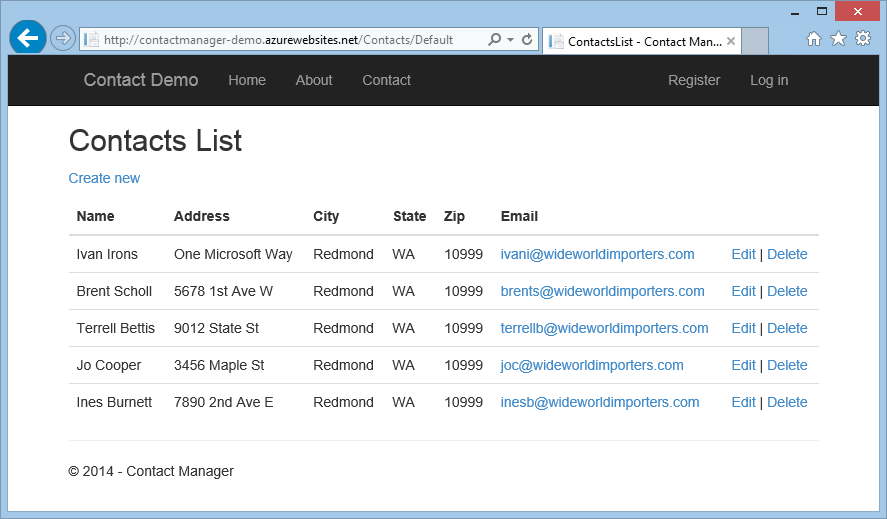

>[WACOM.NOTE] 
このチュートリアルを完了するには、Azure アカウントが必要です。アカウントをお持ちでない場合は、 <a href="/ja-jp/pricing/member-offers/msdn-benefits-details/?WT.mc_id=A261C142F" target="_blank">MSDN サブスクライバーの特典を有効にする、</a> または <a href="/ja-jp/pricing/free-trial/?WT.mc_id=A261C142F" target="_blank">無料評価版にサインアップしてください</a>。アカウントにサインアップする前に、Azure Web サイトの使用を開始する場合は、Azure Web サイト <a href="https://trywebsites.azurewebsites.net/">https://trywebsites.azurewebsites.net</a>で、無料で期間限定の ASP.NET スターター サイト を作成できます。クレジット カードは必要ありません。また、支払いも発生しません。

このチュートリアルで取り上げる内容は次のとおりです。

- [開発環境を設定する](#set-up-the-development-environment)
- [Azure 環境を設定する](#Set-up-the-Azure-environment)
- [ASP.NET Web フォーム アプリケーションを作成する](#Create-an-ASP.NET-Web-Forms-Application)
- [アプリケーションにデータベースを追加する](#Add-a-Database-to-the-Application)
- [プロジェクトに対して SSL を有効にする](#Enable-SSL-for-the-Project)
- [OAuth 2.0 プロバイダーを追加する](#Add-an-OAuth-2.0-Provider)
- [メンバーシップ API を使用してアクセスを制限する](#Use-the-Membership-API-to-Restrict-Access)
- [データベースが関連付けられたアプリケーションを Azure にデプロイする](#Deploy-the-Application-with-the-Database-to-Azure)
- [データベースを確認する](#Review-the-Database)
- [次のステップ](#Next-Steps)

##開発環境を設定する 
最初に、Visual Studio 2013 と Azure SDK for .NET をインストールして開発環境を設定します。

1. まだインストールしていない場合は [Visual Studio 2013](http://go.microsoft.com/fwlink/?LinkId=306566) をインストールします。  
2. [Azure SDK for Visual Studio 2013](http://go.microsoft.com/fwlink/?linkid=324322&clcid=0x409) をインストールします。このチュートリアルでは、Azure SDK for Visual Studio 2013 の前に Visual Studio 2013 をインストールする必要があります。  

	>[WACOM.NOTE]  
	マシンに既にある SDK の依存関係の数に応じて、SDK のインストールには長時間 (数分から 30 分以上) かかる場合があります。  

3. インストール プログラムの実行または保存を求めるメッセージが表示されたら、**[実行]** をクリックします。
4. **Web Platform Installer** のウィンドウで、**[インストール]** をクリックし、インストールの手順を進めます。  
	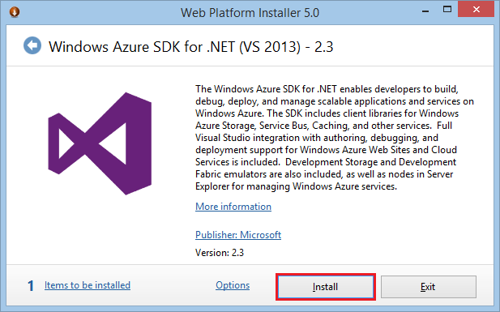  

	>[WACOM.NOTE]  
	この SDK をインストール済みの場合、インストールされる項目の数は 0 になります。インストールされる項目の数は **[Web Platform Installer]** ウィンドウの左下に表示されます。  

5. **Visual Studio Update 2** をインストールしていない場合は、**[Visual Studio 2013 Update 2](http://www.microsoft.com/download/details.aspx?id=42666)** 以降をダウンロードしてインストールします。  

	>[WACOM.NOTE]  
	Goggle OAuth 2.0 を使用するには、また、警告を表示させずに SSL をローカルで使用するには、Visual Studio 2013 Update 2 以降をインストールする必要があります。また、Web フォームのスキャフォールディングを使用するには Update 2 が必要です。  

インストールが完了すると、開発に必要なツールがすべて揃います。

##Azure 環境を設定する
このセクションでは、Azure Web サイトと SQL データベースを Azure 内に作成して、Azure 環境を設定します。

###Azure で Web サイトと SQL データベースを作成する 
このチュートリアルでは、Azure Web サイトが共有ホスティング環境で実行されます。つまり、Azure Web サイトを実行する仮想マシン (VM) がその他の Azure Web サイトと共有されています。共有ホスティング環境は、低コストでクラウドの利用を開始できる方法です。後で Web トラフィックが増加したら、アプリケーションの規模を変更して専用 VM 上で実行するように設定してニーズを満たすことができます。もっと複雑なアーキテクチャが必要な場合は、Azure のクラウド サービスに移行できます。クラウド サービスは専用 VM 上で実行され、ユーザーのニーズに応じて構成できます。 

Azure SQL データベースは、SQL Server テクノロジに基づいて構築されたクラウドベースのリレーショナル データベース サービスです。SQL Server で動作するツールおよびアプリケーションは、SQL データベースでも動作します。

1. [Azure の管理ポータル](https://manage.windowsazure.com/)で、左側のタブにある **[Web サイト]** をクリックし、**[新規]** をクリックします。  
	
2. **[Web サイト]** をクリックし、**[カスタム作成]** をクリックします。  
	  
	**新しい Web サイト - カスタム作成**ウィザードが開きます。  

3. ウィザードの **[Web サイトの作成]** 手順で、アプリケーションの一意の URL として使用する文字列を **[URL]** ボックスに入力します。ここに入力した文字列と、このテキスト ボックスの右側に表示されている文字列を組み合わせたものが実際の URL になります。この図に表示されている URL は既に取得されている可能性が高いため、**別の URL を選択する必要があります**。  
	  
4. [Web ホスティング プラン] ドロップダウン リストで、現在の所在地に最も近いリージョンを選択します。この設定によって、使用する VM が実行されるデータ センターが指定されます。
5. **[データベース]** ボックスの一覧の **[無料の 20 MB SQL データベースの作成]** を選択します。
6. **[DB 接続文字列名]** ボックスは、既定値の *DefaultConnection* をそのまま使用します。
7. ボックスの下部にある矢印をクリックします。 
ウィザードの **[データベースの設定の指定]** 手順に進みます。
8. **[名前]** ボックスに「*`ContactDB`*」と入力します。  
	  
9. **[サーバー]** ボックスで、**[新しい SQL データベース サーバー]** を選択します。
または、以前に SQL Server データベースを作成した場合は、ボックスの一覧からその SQL Server を選択できます。
10. **[リージョン]** は、作成した Web サイトと同じエリアに設定します。
11. 管理者の**ログイン名**と**パスワード**を入力します。 
**[新しい SQL データベース サーバー]** を選択した場合は、既存の名前とパスワードではなく、このデータベースへのアクセス時に使用する新しい名前とパスワードを入力してください。以前に作成した SQL Server を選択した場合は、その SQL Server の作成時に設定したパスワードを入力します。このチュートリアルでは、**[データベースの詳細設定を構成します]** チェック ボックスをオンにしません。
12. 終了したら、ダイアログ ボックスの右下にあるチェック マークをクリックします。

**Azure 管理ポータル**が **[Web サイト]** ページに戻り、**[状態]** 列にサイトが作成中であることが示されます。しばらくすると (通常は 1 分未満)、サイトの作成に成功したことが **[状態]** 列に示されます。左側にあるナビゲーション バーでは、アカウントで所有するサイト数が **[Web サイト]** アイコンの横に表示され、データベース数が **[SQL データベース]** アイコンの横に表示されます。
##ASP.NET Web フォーム アプリケーションを作成する 
Azure の Web サイトを作成しましたが、まだその中にコンテンツがありません。次のステップでは、Azure に発行する Visual Studio Web アプリケーションを作成します。
###プロジェクトを作成する 
1. Visual Studio の **[ファイル]** メニューで **[新しいプロジェクト]** を選択します。  
	  
2. 左側で、**[テンプレート]**、**[Visual C#]**、**[Web]** テンプレート グループの順に選択します。 
3. 中央の列で **[ASP.NET Web アプリケーション]** を選択します。
4. プロジェクトに「*ContactManager*」と名前を付けて、**[OK]** をクリックします。  
	  

	>[WACOM.NOTE]  
	このチュートリアル シリーズでは、プロジェクトの名前を「**ContactManager**」としています。チュートリアル シリーズのさまざまな場面で提供されるコードを説明どおりに動作させるため、まったく同じ名前を使用することをお勧めします。  

5. **[新しい ASP.NET プロジェクト]** ダイアログ ボックスで、**[Web フォーム]** テンプレートを選択します。**[クラウドでのホスト]** チェック ボックスをオフにして (オンになっている場合)、**[OK]** をクリックします。  
	  
	Web フォーム アプリケーションが作成されます。
###マスター ページを更新する
ASP.NET Web フォームでは、マスター ページを使うことで、アプリケーションのページに共通のレイアウトを適用することができます。これには、アプリケーションのすべてのページ (またはページ グループ) に適用する外観、操作性、標準の動作を定義するマスター ページを 1 つ作成します。次に、表示するコンテンツが格納されるコンテンツ ページを個別に作成します。ユーザーがコンテンツ ページを要求すると、ASP.NET はコンテンツ ページとマスター ページをマージします。これによって、マスター ページのレイアウトとコンテンツ ページのコンテンツが組み合わされ、出力されます。
今回の新しいサイトでは、アプリケーションの名前とリンクを更新する必要があります。このリンクは、連絡先の詳細を表示するページを参照するリンクです。これらの変更を実施するには、マスター ページの HTML を変更します。 

1. **ソリューション エクスプローラー**で *Site.Master* ページを見つけて開きます。 
2. ページが **[デザイン]** ビューで表示されている場合は **[ソース]** ビューに切り替えます。
3. 次に示すハイライトされているマークアップで変更するか、マークアップを追加して、マスター ページを更新します。

<pre class="prettyprint">
&lt;%@ Master Language=&quot;C#&quot; AutoEventWireup=&quot;true&quot; CodeBehind=&quot;Site.master.cs&quot; Inherits=&quot;ContactManager.SiteMaster&quot; %&gt;

&lt;!DOCTYPE html&gt;

&lt;html lang=&quot;en&quot;&gt;
&lt;head runat=&quot;server&quot;&gt;
    &lt;meta charset=&quot;utf-8&quot; /&gt;
    &lt;meta name=&quot;viewport&quot; content=&quot;width=device-width, initial-scale=1.0&quot; /&gt;
    &lt;title&gt;&lt;%: Page.Title %&gt; - <mark>Contact Manager</mark>&lt;/title&gt;

    &lt;asp:PlaceHolder runat=&quot;server&quot;&gt;
        &lt;%: Scripts.Render(&quot;~/bundles/modernizr&quot;) %&gt;
    &lt;/asp:PlaceHolder&gt;
    &lt;webopt:bundlereference runat=&quot;server&quot; path=&quot;~/Content/css&quot; /&gt;
    &lt;link href=&quot;~/favicon.ico&quot; rel=&quot;shortcut icon&quot; type=&quot;image/x-icon&quot; /&gt;

&lt;/head&gt;
&lt;body&gt;
    &lt;form runat=&quot;server&quot;&gt;
        &lt;asp:ScriptManager runat=&quot;server&quot;&gt;
            &lt;Scripts&gt;
                &lt;%--To learn more about bundling scripts in ScriptManager see http://go.microsoft.com/fwlink/?LinkID=301884 --%&gt;
                &lt;%--Framework Scripts--%&gt;
                &lt;asp:ScriptReference Name=&quot;MsAjaxBundle&quot; /&gt;
                &lt;asp:ScriptReference Name=&quot;jquery&quot; /&gt;
                &lt;asp:ScriptReference Name=&quot;bootstrap&quot; /&gt;
                &lt;asp:ScriptReference Name=&quot;respond&quot; /&gt;
                &lt;asp:ScriptReference Name=&quot;WebForms.js&quot; Assembly=&quot;System.Web&quot; Path=&quot;~/Scripts/WebForms/WebForms.js&quot; /&gt;
                &lt;asp:ScriptReference Name=&quot;WebUIValidation.js&quot; Assembly=&quot;System.Web&quot; Path=&quot;~/Scripts/WebForms/WebUIValidation.js&quot; /&gt;
                &lt;asp:ScriptReference Name=&quot;MenuStandards.js&quot; Assembly=&quot;System.Web&quot; Path=&quot;~/Scripts/WebForms/MenuStandards.js&quot; /&gt;
                &lt;asp:ScriptReference Name=&quot;GridView.js&quot; Assembly=&quot;System.Web&quot; Path=&quot;~/Scripts/WebForms/GridView.js&quot; /&gt;
                &lt;asp:ScriptReference Name=&quot;DetailsView.js&quot; Assembly=&quot;System.Web&quot; Path=&quot;~/Scripts/WebForms/DetailsView.js&quot; /&gt;
                &lt;asp:ScriptReference Name=&quot;TreeView.js&quot; Assembly=&quot;System.Web&quot; Path=&quot;~/Scripts/WebForms/TreeView.js&quot; /&gt;
                &lt;asp:ScriptReference Name=&quot;WebParts.js&quot; Assembly=&quot;System.Web&quot; Path=&quot;~/Scripts/WebForms/WebParts.js&quot; /&gt;
                &lt;asp:ScriptReference Name=&quot;Focus.js&quot; Assembly=&quot;System.Web&quot; Path=&quot;~/Scripts/WebForms/Focus.js&quot; /&gt;
                &lt;asp:ScriptReference Name=&quot;WebFormsBundle&quot; /&gt;
                &lt;%--Site Scripts--%&gt;
            &lt;/Scripts&gt;
        &lt;/asp:ScriptManager&gt;

        &lt;div class=&quot;navbar navbar-inverse navbar-fixed-top&quot;&gt;
            &lt;div class=&quot;container&quot;&gt;
                &lt;div class=&quot;navbar-header&quot;&gt;
                    &lt;button type=&quot;button&quot; class=&quot;navbar-toggle&quot; data-toggle=&quot;collapse&quot; data-target=&quot;.navbar-collapse&quot;&gt;
                        &lt;span class=&quot;icon-bar&quot;&gt;&lt;/span&gt;
                        &lt;span class=&quot;icon-bar&quot;&gt;&lt;/span&gt;
                        &lt;span class=&quot;icon-bar&quot;&gt;&lt;/span&gt;
                    &lt;/button&gt;
                    &lt;a class=&quot;navbar-brand&quot; runat=&quot;server&quot; <mark>id=&quot;ContactDemoLink&quot;</mark> href=&quot;~/<mark>Contacts/Default.aspx</mark>&quot;&gt;<mark>Contact Demo</mark>&lt;/a&gt;
                &lt;/div&gt;
                &lt;div class=&quot;navbar-collapse collapse&quot;&gt;
                    &lt;ul class=&quot;nav navbar-nav&quot;&gt;
                        &lt;li&gt;&lt;a runat=&quot;server&quot; href=&quot;~/&quot;&gt;Home&lt;/a&gt;&lt;/li&gt;
                        &lt;li&gt;&lt;a runat=&quot;server&quot; href=&quot;~/About&quot;&gt;About&lt;/a&gt;&lt;/li&gt;
                        &lt;li&gt;&lt;a runat=&quot;server&quot; href=&quot;~/Contact&quot;&gt;Contact&lt;/a&gt;&lt;/li&gt;
                    &lt;/ul&gt;
                    &lt;asp:LoginView runat=&quot;server&quot; ViewStateMode=&quot;Disabled&quot;&gt;
                        &lt;AnonymousTemplate&gt;
                            &lt;ul class=&quot;nav navbar-nav navbar-right&quot;&gt;
                                &lt;li&gt;&lt;a runat=&quot;server&quot; href=&quot;~/Account/Register&quot;&gt;Register&lt;/a&gt;&lt;/li&gt;
                                &lt;li&gt;&lt;a runat=&quot;server&quot; href=&quot;~/Account/Login&quot;&gt;Log in&lt;/a&gt;&lt;/li&gt;
                            &lt;/ul&gt;
                        &lt;/AnonymousTemplate&gt;
                        &lt;LoggedInTemplate&gt;
                            &lt;ul class=&quot;nav navbar-nav navbar-right&quot;&gt;
                                &lt;li&gt;&lt;a runat=&quot;server&quot; href=&quot;~/Account/Manage&quot; title=&quot;Manage your account&quot;&gt;Hello, &lt;%: Context.User.Identity.GetUserName()  %&gt; !&lt;/a&gt;&lt;/li&gt;
                                &lt;li&gt;
                                    &lt;asp:LoginStatus runat=&quot;server&quot; LogoutAction=&quot;Redirect&quot; LogoutText=&quot;Log off&quot; LogoutPageUrl=&quot;~/&quot; OnLoggingOut=&quot;Unnamed_LoggingOut&quot; /&gt;
                                &lt;/li&gt;
                            &lt;/ul&gt;
                        &lt;/LoggedInTemplate&gt;
                    &lt;/asp:LoginView&gt;
                &lt;/div&gt;
            &lt;/div&gt;
        &lt;/div&gt;
        &lt;div class=&quot;container body-content&quot;&gt;
            &lt;asp:ContentPlaceHolder ID=&quot;MainContent&quot; runat=&quot;server&quot;&gt;
            &lt;/asp:ContentPlaceHolder&gt;
            &lt;hr /&gt;
            &lt;footer&gt;
                &lt;p&gt;&amp;copy; &lt;%: DateTime.Now.Year %&gt; - <mark>Contact Manager</mark>&lt;/p&gt;
            &lt;/footer&gt;
        &lt;/div&gt;
    &lt;/form&gt;
&lt;/body&gt;
&lt;/html&gt;
</pre>  

このチュートリアルでは、Web フォームのスキャフォールディングを追加します (後述)。スキャフォールディングによって、上記の "Contact Demo" リンクの参照先ページが作成されます。
###ローカルでアプリケーションを実行する 
1. **ソリューション エクスプローラー**で *Default.aspx* ページを右クリックし、**[スタート ページに設定]** を選択します。 
2. **Ctrl キーを押しながら F5 キーを押して**アプリケーションを実行します。  
	アプリケーションの既定のページが、既定のブラウザー ウィンドウに表示されます。
	  

これで、Azure に展開するアプリケーションを作成するために必要な操作が完了しました。データベースの機能と、連絡先データを表示および編集するためのページは、後ほど追加します。
###Azure にアプリケーションをデプロイする
現在、アプリケーションを作成してローカルで実行しています。このアプリケーションを Azure にデプロイします。

1. Visual Studio の**ソリューション エクスプローラー**で、プロジェクトを右クリックし、コンテキスト メニューの **[発行]** をクリックします。  
	  
	**[Web の発行]** ダイアログ ボックスが表示されます。  

2. **[Web の発行]** ダイアログ ボックスの **[プロファイル]** タブで、**[Windows Azure Web Sites]** をクリックします。  
	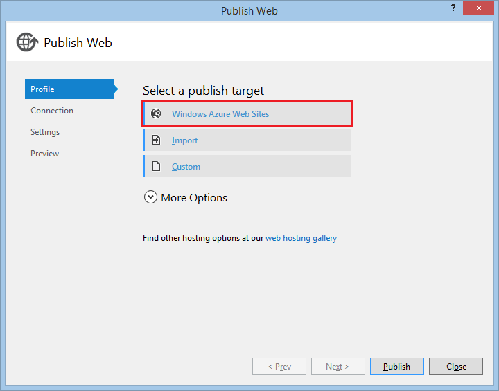  
3. まだサインインしていない場合、**[既存の Web サイトを選択]** ダイアログ ボックスの **[サインイン]** をクリックします。サインインしたら、このチュートリアルの最初に作成した Web サイトを選択します。**[OK]** をクリックして続行します。  
	  
Visual Studio によって発行設定がダウンロードされます。
4. **[Web の発行]** ダイアログ ボックスの **[発行]** をクリックします。  
	  
Visual Studio の **[Web 発行アクティビティ]** ウィンドウに、発行の全体的なステータスが表示されます。  
	  

これで、作成したアプリケーションはクラウドで実行されています。このアプリケーションを次に Visual Studio からデプロイするときは、変更したファイル (または新しいファイル) のみがデプロイされます。  
	  

>[WACOM.NOTE] 
既に存在する Web サイトへの発行でエラーが発生した場合、その発行先を消去してから新しいファイルを追加します。  
その後、アプリケーションをもう一度発行しますが、**[Web の発行]** ダイアログ ボックスで **[設定]** タブを選択します。次に構成に **[デバッグ]** を設定して、**[発行先のその他のファイルを削除]** オプションを選択し、**[発行]** をクリックしてアプリケーションをもう一度デプロイします。  
	  

##アプリケーションにデータベースを追加する 
次に、Web フォーム アプリケーションを更新して、連絡先を表示および更新して既定のデータベースにデータを保存する機能を追加します。Web フォーム プロジェクトを作成した際にデータベースも既定で作成されています。アプリケーションは Entity Framework を使用してこのデータベースにアクセスし、データベース内のデータを更新します。
###データ モデル クラスを追加する 
まず、コードを使ってシンプルなデータ モデルを作成します。このデータ モデルが `Contacts` というクラスに格納されます。`Contacts` というクラス名にした理由は、Web Forms テンプレートが作成した Contact.aspx.cs ファイルに格納されている `Contact` クラスとのクラス名の競合を避けるためです。  

1. **ソリューション エクスプローラー**で *Models* フォルダーを右クリックし、**[追加]**、**[クラス]** の順にクリックします。  
	  
	**[新しい項目の追加]** ダイアログ ボックスが表示されます。  

2. 新しいクラスに「*Contacts.cs*」という名前を付けます。  
	  
3. 既定のコードを以下のコードに置き換えます。  
	<pre class="prettyprint">
	using System.ComponentModel.DataAnnotations;
	using System.Globalization;
	
	namespace ContactManager.Models
	{
	    public class Contacts
	    {
	        [ScaffoldColumn(false)]
	        [Key]
	        public int ContactId { get; set; }
	        public string Name { get; set; }
	        public string Address { get; set; }
	        public string City { get; set; }
	        public string State { get; set; }
	        public string Zip { get; set; }
	        [DataType(DataType.EmailAddress)]
	        public string Email { get; set; }
	    }
	}
	</pre>

**Contacts** クラスでは、各連絡先について保存するデータと、データベースが必要とする主キー (`ContactID`) を定義します。**Contacts** クラスは、表示される連絡先データを表しています。Contacts オブジェクトの各インスタンスはリレーショナル データベース テーブルの各行に相当し、Contacts クラスの各プロパティは、リレーショナル データベース テーブルの各列に関連付けられます。データベースに格納されている連絡先データについては、このチュートリアルで後ほど説明します。

###Web フォームのスキャフォールディング 
現在 **Contacts** モデル クラスが作成されています。次は、このデータの操作に使用される *List*、*Insert*、*Edit*、*Delete* の各ページを、Web Forms Scaffolder を使って生成します。Web Forms Scaffolder は、Entity Framework、ブートストラップ、動的データを使用します。既定では、Web Forms Scaffolder はプロジェクト テンプレートに含まれており、Visual Studio 2013 を使用する際にプロジェクトの拡張機能としてインストールされます。

次の手順を実行することで、Web Forms Scaffolder を使用できるようになります。

1. Visual Studio のメニュー バーで **[ツール]**、**[拡張機能と更新プログラム]** の順に選択します。  
	**[拡張機能と更新プログラム]** ダイアログ ボックスが表示されます。
2. ダイアログ ボックスの左側のウィンドウで、**[オンライン]**、**[Visual Studio ギャラリー]**、**[ツール]**、**[スキャフォールディング]** の順に選択します。
3. 「Web Forms Scaffolding」が一覧に表示されない場合は、ダイアログ ボックス右側の検索ボックスに「Web Forms Scaffolding」と入力します。  
4. Forms Scaffolder がインストールされていない場合は、**[ダウンロード]** を選択して Web Forms Scaffolding をインストールします。必要に応じて Visual Studio を再起動します。確認された場合は、プロジェクトへの変更を必ず保存してください。  
	  
5. プロジェクトをビルドします (**Ctrl + Shift + B**)。  
	プロジェクトは、スキャフォールディング機能を使用する前にビルドする必要があります。  
6. **ソリューション エクスプローラー**で*プロジェクト*を右クリックし、**[追加]**、**[新しいスキャフォールディング項目]** の順に選択します。  
	**[スキャフォールディングの追加]** ダイアログ ボックスが表示されます。
7. 左側のウィンドウで **[Web フォーム]** を選択し、中央のウィンドウで **[Entity Framework を使用している Web フォーム]** を選択して、**[追加]** をクリックします。  
	  
	**[Web フォーム ページの追加]** ダイアログ ボックスが表示されます。  

8. **[Web フォーム ページの追加]** ダイアログ ボックスで、**[モデル クラス]** を `Contact (ContactManager.Models)` に設定します。**[データ コンテキスト クラス]** を `ApplicationDbContext (ContactManager.Models)` に設定します。**[追加]** をクリックします。 
	  

Web Forms Scaffolder によって、*Default.aspx*、*Delete.aspx*、*Edit.aspx*、*Insert.aspx* の各ページを格納する新しいフォルダーが作成されます。また、*DynamicData* フォルダーも作成されます。このフォルダーには *EntityTemplates* フォルダーと *FieldTemplates* フォルダーが格納されています。`ApplicationDbContext` はメンバーシップ データベースと連絡先データの両方に使用されます。

###データ モデルを使用できるようアプリケーションを構成する 
次の作業では、作成したデータ モデルに基づいてデータベースを作成するための Code First Migrations 機能を有効化すると共に、サンプル データとデータ初期化子を追加します。  

1. **[ツール]** メニューの **[NuGet パッケージ マネージャー]**、**[パッケージ マネージャー コンソール]** の順に選択します。  
	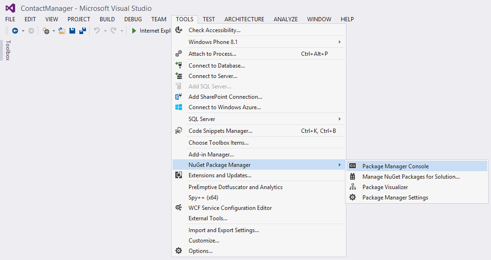  
2. [パッケージ マネージャー コンソール] ウィンドウで、次のコマンドを入力します。  
	<pre class="prettyprint">
	enable-migrations
	</pre>  
	enable-migrations コマンドによって *Migrations* フォルダーが作成され、そのフォルダーに *Configuration.cs* ファイルが格納されます。このファイルを編集して、データベースに初期データを投入し、データ移行を構成します。  
3. **[パッケージ マネージャー コンソール]** ウィンドウで、次のコマンドを入力します。  
	<pre class="prettyprint">
	add-migration Initial
	</pre>  
	`add-migration Initial` コマンドは、データベースを作成する <date_stamp>Initial ファイルを *Migrations* フォルダーに生成します。最初のパラメーター (Initial) は任意です。このパラメーターは、このファイルの名前の作成に使用されます。新しいクラス ファイルは**ソリューション エクスプローラー**で表示できます。`Initial` クラスでは、`Up` メソッドを使用して `Contact` テーブルを作成し、`Down` メソッドを使用してそのテーブルを削除します (前の状態に戻します)。  
4. *Migrations\Configuration.cs* ファイルを開きます。 
5. 次の名前空間を追加します。  
	<pre class="prettyprint">
	using ContactManager.Models;
	</pre>  
6. `Seed` メソッドを次のコードに置き換えます。  
	<pre class="prettyprint">
	protected override void Seed(ContactManager.Models.ApplicationDbContext context)
	{
	    context.Contacts.AddOrUpdate(p => p.Name,
	       new Contacts
	       {
	           ContactId = 1,
	           Name = "Ivan Irons",
	           Address = "One Microsoft Way",
	           City = "Redmond",
	           State = "WA",
	           Zip = "10999",
	           Email = "ivani@wideworldimporters.com",
	       },
	       new Contacts
	        {
	            ContactId = 2,
	            Name = "Brent Scholl",
	            Address = "5678 1st Ave W",
	            City = "Redmond",
	            State = "WA",
	            Zip = "10999",
	            Email = "brents@wideworldimporters.com",
	        },
	        new Contacts
	        {
	            ContactId = 3,
	            Name = "Terrell Bettis",
	            Address = "9012 State St",
	            City = "Redmond",
	            State = "WA",
	            Zip = "10999",
	            Email = "terrellb@wideworldimporters.com",
	        },
	        new Contacts
	        {
	            ContactId = 4,
	            Name = "Jo Cooper",
	            Address = "3456 Maple St",
	            City = "Redmond",
	            State = "WA",
	            Zip = "10999",
	            Email = "joc@wideworldimporters.com",
	        },
	        new Contacts
	        {
	            ContactId = 5,
	            Name = "Ines Burnett",
	            Address = "7890 2nd Ave E",
	            City = "Redmond",
	            State = "WA",
	            Zip = "10999",
	            Email = "inesb@wideworldimporters.com",
	        }
	        );
	}
	</pre>
このコードでは、連絡先情報を使用してデータベースを初期化 (初期データ投入) します。シード データベースの生成の詳細については、「[Seeding and Debugging Entity Framework (EF) DBs (Entity Framework DB のシード化とデバッグ)](http://blogs.msdn.com/b/rickandy/archive/2013/02/12/seeding-and-debugging-entity-framework-ef-dbs.aspx)」を参照してください。  
7. **[パッケージ マネージャー コンソール]** で、次のコマンドを入力します。  
	<pre class="prettyprint">
	update-database
	</pre>  
`update-database` によって、データベースを作成する最初の Migration が実行されます。既定では、データベースは SQL Server Express LocalDB データベースとして作成されます  
	  

###アプリケーションをローカルで実行してデータを表示する 
次に、アプリケーションを実行して連絡先の表示を確認します。

1. 最初にプロジェクトをビルドします (**Ctrl + Shift + B**)。  
2. **Ctrl キーを押しながら F5 キーを押して**アプリケーションを実行します。  
	ブラウザーが開き、*Default.aspx* ページが表示されます。
3. ページ最上部の **Contact Demo** リンクを選択して *Contact List* ページを表示します。  
	  

##プロジェクトに対して SSL を有効にする 
Secure Sockets Layer (SSL) は、Web サーバーと Web クライアント間の通信に定義されたプロトコルで、暗号化によって通信の安全性を強化することができます。SSL を使わないと、クライアントとサーバー間で送信されるデータが、ネットワークに物理的にアクセスできる第三者によるパケット スニッフィングの標的になります。また、プレーンな HTTP を使用すると、いくつかの一般的な認証方式の安全性も低下します。具体的には、基本認証とフォーム認証で送信する資格情報が暗号化されません。安全性を確保するには、これらの認証方式で SSL を使用する必要があります。

1. **ソリューション エクスプローラー**で **ContactManager** プロジェクトをクリックし、**F4** キーを押して **[プロパティ]** ウィンドウを表示します。 
2. **[SSL Enabled]** を `true` に変更します。 
3. 後で使用するための **SSL URL** をコピーします。  
	過去に SSL Web サイトを作成したことがなければ、SSL URL は `https://localhost:44300/` になります (下記参照)。
	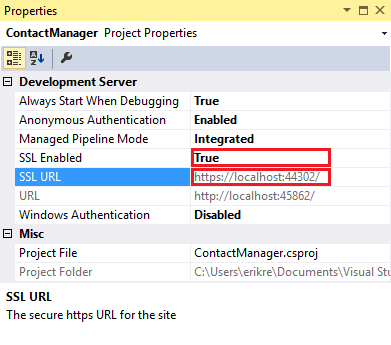  
4. **ソリューション エクスプローラー**で **Contact Manager** プロジェクトを右クリックし、**[プロパティ]** をクリックします。
5. 左側のタブで **[Web]** をクリックします。
6. 先ほど保存した **SSL URL** を使用するように **[Project Url]** を変更します。  
	  
7. **CTRL + S キーを押して**ページを保存します。
8. **Ctrl キーを押しながら F5 キーを押して**アプリケーションを実行します。  
Visual Studio により、SSL の警告を回避するためのオプションが表示されます。  
9. IIS Express SSL 証明書を信頼する場合は **[はい]** をクリックして続行します。  
	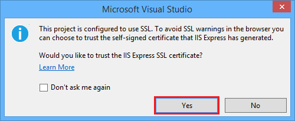  
	セキュリティ警告が表示されます。  

10. **[はい]** をクリックしてローカルホストに証明書をインストールします。  
	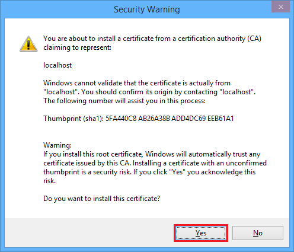  
	ブラウザー ウィンドウが表示されます。  

ローカルで SSL を使用して Web アプリケーションを簡単にテストできるようになりました。

##OAuth 2.0 プロバイダーを追加する 
ASP.NET Web フォームは、メンバーシップと認証のオプションが強化されています。OAuth もこうした強化点の 1 つです。OAuth は、Web、モバイル、およびデスクトップのアプリケーションからシンプルで標準的な方法で安全に認証するためのオープン プロトコルです。ASP.NET MVC インターネット テンプレートは OAuth を使用して、Facebook、Twitter、Google、Microsoft を認証プロバイダーとしてサポートします。このチュートリアルでは Google のみを認証プロバイダーとして使用しますが、コードを少し変更すれば他のプロバイダーも使用できます。他のプロバイダーを実装する手順は、このチュートリアルで説明する手順とほとんど同じです。 

このチュートリアルでは、認証の他にロールを使用して権限を付与します。`canEdit` ロールに追加したユーザーだけが連絡先を変更 (作成、編集、削除) できます。 

次の手順を実行することで、Google 認証プロバイダーを追加できます。

1. *App_Start\Startup.Auth.cs* ファイルを開きます。 
2. `app.UseGoogleAuthentication()` メソッドのコメント文字を削除して、メソッドを次のような記述にします。  
	<pre class="prettyprint">
	            app.UseGoogleAuthentication(new GoogleOAuth2AuthenticationOptions()
	            {
	                ClientId = "",
	                ClientSecret = ""
	            });
	</pre>
3. [Google Developers Console](https://console.developers.google.com/) にアクセスします。Google デベロッパーの電子メール アカウント (gmail.com) でサインインする必要があります。Google アカウントを持っていない場合は、**[Create an account]** リンクを選択します。  
	**Google Developers Console** が表示されます。
	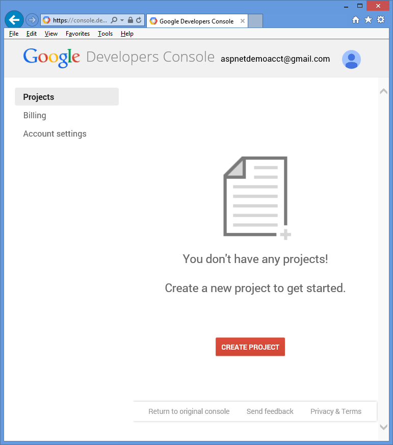  

4. **[Create Project]** ボタンをクリックして、プロジェクトの名前と ID を入力します (既定値を使用できます)。**同意のチェック ボックス**をオンにして、**[Create]** ボタンをクリックします。  
	  
	新しいプロジェクトが数秒で作成され、新しいプロジェクトのページがブラウザーに表示されます。
5. 左側のタブで **[APIs & auth]**、**[Credentials]** の順にクリックします。
6. **[OAuth]** にある **[Create New Client ID]** をクリックします。  
	**[Create Client ID]** ダイアログ ボックスが表示されます。
	  
7. **[Create Client ID]** ダイアログでは、アプリケーションの種類を既定の **[Web application]** のままにします。  
8. **[Authorized JavaScript Origins]** には、このチュートリアルで既に使用した SSL URL (**https://localhost:44300/**) を設定します (その他の SSL プロジェクトを作成している場合を除く)。  
	この URL がアプリケーションのオリジンです。このサンプルではローカルホストのテスト URL を入力するだけですが、アカウントには複数の URL を入力できます (ローカルホストおよび本稼働用)。  

9. **[Authorized Redirect URI]** には次の値を設定します。  
	<pre class="prettyprint">  
	https://localhost:44300/signin-google  
	</pre>  
	この値は、ASP.NET OAuth ユーザーが Google の OAuth サーバーとの通信に使用する URI です。必ず、先ほど使用した URL (**https://localhost:44300/**) を使用してください (その他の SSL プロジェクトを作成している場合を除く)。  
10. **[Create Client ID]** ボタンをクリックします。
11. Visual Studio で、*Startup.Auth.cs* ページの `UseGoogleAuthentication` メソッドを更新します。これは、**アプリケーション ID** と**アプリケーション シークレット**をコピーしてメソッドに貼り付けることで行います。次に示す**アプリケーション ID** と**アプリケーション シークレット**の値はサンプルであり、動作しません。  
	<pre class="prettyprint">  
	using System;
	using Microsoft.AspNet.Identity;
	using Microsoft.AspNet.Identity.EntityFramework;
	using Microsoft.AspNet.Identity.Owin;
	using Microsoft.Owin;
	using Microsoft.Owin.Security.Cookies;
	using Microsoft.Owin.Security.DataProtection;
	using Microsoft.Owin.Security.Google;
	using Owin;
	using ContactManager.Models;
	
	namespace ContactManager
	{
	    public partial class Startup {
	
	        // For more information on configuring authentication, please visit http://go.microsoft.com/fwlink/?LinkId=301883
	        public void ConfigureAuth(IAppBuilder app)
	        {
	            // Configure the db context and user manager to use a single instance per request
	            app.CreatePerOwinContext(ApplicationDbContext.Create);
	            app.CreatePerOwinContext<ApplicationUserManager>(ApplicationUserManager.Create);
	
	            // Enable the application to use a cookie to store information for the signed in user
	            // and to use a cookie to temporarily store information about a user logging in with a third party login provider
	            // Configure the sign in cookie
	            app.UseCookieAuthentication(new CookieAuthenticationOptions
	            {
	                AuthenticationType = DefaultAuthenticationTypes.ApplicationCookie,
	                LoginPath = new PathString("/Account/Login"),
	                Provider = new CookieAuthenticationProvider
	                {
	                    OnValidateIdentity = SecurityStampValidator.OnValidateIdentity<ApplicationUserManager, ApplicationUser>(
	                        validateInterval: TimeSpan.FromMinutes(20),
	                        regenerateIdentity: (manager, user) => user.GenerateUserIdentityAsync(manager))
	                }
	            });
	            // Use a cookie to temporarily store information about a user logging in with a third party login provider
	            app.UseExternalSignInCookie(DefaultAuthenticationTypes.ExternalCookie);
	
	            // Uncomment the following lines to enable logging in with third party login providers
	            //app.UseMicrosoftAccountAuthentication(
	            //    clientId: "",
	            //    clientSecret: "");
	
	            //app.UseTwitterAuthentication(
	            //   consumerKey: "",
	            //   consumerSecret: "");
	
	            //app.UseFacebookAuthentication(
	            //   appId: "",
	            //   appSecret: "");
	
	            app.UseGoogleAuthentication(new GoogleOAuth2AuthenticationOptions()
	            {
	                ClientId = "<mark>000000000000.apps.googleusercontent.com</mark>",
	                ClientSecret = "<mark>00000000000</mark>"
	            });
	        }
	    }
	}
	</pre>  
12. **Ctrl キーを押しながら F5 キーを押して**アプリケーションをビルドし、実行します。**[Log in]** リンクをクリックします。
13. **[Use another service to log in]** の **[Google]** をクリックします。  
	  
14. 資格情報の入力が必要な場合、Google のサイトにリダイレクトされるので、リダイレクト先のサイトで資格情報を入力します。  
	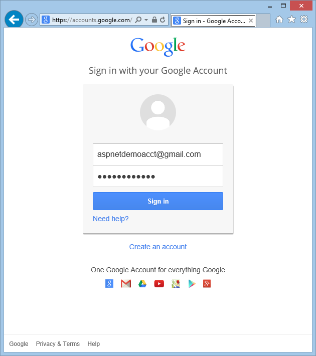  
15. 資格情報を入力すると、先ほど作成した Web アプリケーションへの権限の付与が求められます。  
	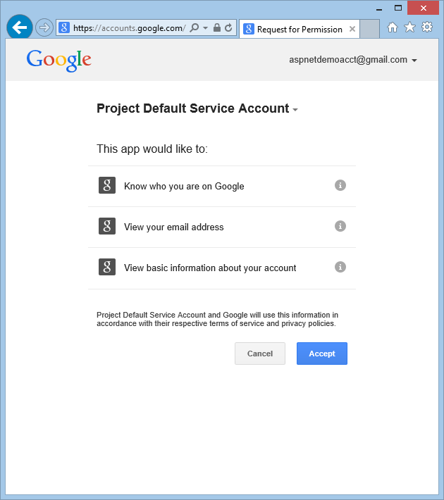  
16. **[Accept]** をクリックします。クリックすると、リダイレクトによって **ContactManager** アプリケーションの **[Register]** ページに戻ります。このページで Google アカウントを登録することができます。
	  
17. Google アカウントに使用するローカルの電子メール登録名を変更できますが、通常は既定の電子メール エイリアス (認証に使用したエイリアス) を変更しません。**[Log in]** をクリックします。

##メンバーシップ API を使用してアクセスを制限する 
ASP.NET アプリケーションの開発では、認証に ASP.NET Identity というメンバーシップ システムを使用できます。ASP.NET Identity によって、ユーザー固有のプロファイル データとアプリケーション データを簡単に統合できるだけでなく、アプリケーションのユーザー プロファイルに永続性を適用することができます。データは、SQL Server データベースやその他のデータ ストア (Azure Storage テーブルなどの *NoSQL* データ ストアを含む) に保存できます。

既定の ASP.NET Web フォーム テンプレートを使用する場合は、あらかじめ組み込まれているメンバーシップ機能をアプリケーション実行時にすぐに使うことができます。ここでは、ASP.NET Identity を使用して管理者ロールを追加し、このロールにユーザーを割り当てます。その後、連絡先データの変更に使用される、管理者用フォルダーおよび同フォルダー内のページへのアクセスを制限する方法について説明します。

###管理者を追加する 
ASP.NET Identity を使用すると、管理者ロールの追加および管理者ロールへのユーザーの割り当てを、コードを使って実行できます。 

1. **ソリューション エクスプローラー**で、Migrations フォルダーの *Configuration.cs* ファイルを開きます。
2. `ContactManger.Migrations` 名前空間内に、次の `using` ステートメントを追加します。  
	<pre class="prettyprint">
	using Microsoft.AspNet.Identity;
	using Microsoft.AspNet.Identity.EntityFramework;
	</pre>
3. `Seed` メソッドの後の`Configuration` クラスに、次の `AddUserAndRole` メソッドを追加します。  
	<pre class="prettyprint">
        public void AddUserAndRole(ContactManager.Models.ApplicationDbContext context)
        {
            IdentityResult IdRoleResult;
            IdentityResult IdUserResult;

            var roleStore = new RoleStore&lt;IdentityRole&gt;(context);
            var roleMgr = new RoleManager&lt;IdentityRole&gt;(roleStore);

            if (!roleMgr.RoleExists(&quot;canEdit&quot;))
            {
                IdRoleResult = roleMgr.Create(new IdentityRole { Name = &quot;canEdit&quot; });
            }

            //var userStore = new UserStore&lt;ApplicationUser&gt;(context);
            //var userMgr = new UserManager&lt;ApplicationUser&gt;(userStore);
            var userMgr = new UserManager&lt;ApplicationUser&gt;(new UserStore&lt;ApplicationUser&gt;(context));

            var appUser = new ApplicationUser
            {
                UserName = &quot;canEditUser@wideworldimporters.com&quot;,
                Email = &quot;canEditUser@wideworldimporters.com&quot;
            };
            IdUserResult = userMgr.Create(appUser, &quot;Pa$$word1&quot;);

            if (!userMgr.IsInRole(userMgr.FindByEmail(&quot;canEditUser@wideworldimporters.com&quot;).Id, &quot;canEdit&quot;))
            {
              //  IdUserResult = userMgr.AddToRole(appUser.Id, &quot;canEdit&quot;);
                IdUserResult = userMgr.AddToRole(userMgr.FindByEmail(&quot;canEditUser@wideworldimporters.com&quot;).Id, &quot;canEdit&quot;);
            }
        }
	</pre>
4. `AddUserAndRole` メソッドの呼び出しを `Seed` メソッドの開始部分に追加します。以下には `Seed` メソッドの開始部分だけが表示されている点に注意してください。  
	<pre class="prettyprint">
        protected override void Seed(ContactManager.Models.ApplicationDbContext context)
        {
            <mark>AddUserAndRole(context);</mark>
	</pre>  
5. すべての変更を保存したら、**パッケージ マネージャー コンソール**で次のコマンドを実行します。  
	<pre class="prettyprint">
	Update-Database
	</pre>
	このコードによって `canEdit` という新しいロールが作成され、canEditUser@wideworldimporters.com の電子メールが割り当てられた新しいローカル ユーザーが作成されます。その後、コードによって canEditUser@wideworldimporters.com が `canEdit` ロールに追加されます。詳細については、「[ASP.NET Identity resource page (ASP.NET Identity リソース ページ)](http://www.asp.net/identity)」を参照してください。  

###管理者用フォルダーへのアクセスを制限する 
現在、サンプル アプリケーション **ContactManager** では、匿名ユーザーとログイン ユーザーの両方が連絡先を表示できますが、このセクションを完了すると、連絡先を追加できるのは canEdit ロールが割り当てられたログイン ユーザーだけになります。

canEdit ロールが割り当てられたユーザーだけがアクセスできる、*Admin* という名前のフォルダーを作成します。

1. **ソリューション エクスプローラー**で、*Contacts* フォルダーにサブフォルダーを追加し、新しいサブフォルダーに「*Admin*」という名前を付けます。
2. 次に示すファイルを *Contacts* フォルダーから *Contacts/Admin* フォルダーに移動します。  
	- *Delete.aspx *および* Delete.aspx.cs*
	- *Edit.aspx *および* Edit.aspx.cs*
	- *Insert.aspx *および* Insert.aspx.cs*
3. *Contacts/Default.aspx* 内のリンク参照を更新します。これには、*Insert.aspx*、*Edit.aspx*、*Delete.aspx* にリンクしているページ参照の前に "Admin/" を追加します。  
	<pre class="prettyprint">
	&lt;%@ Page Title=&quot;ContactsList&quot; Language=&quot;C#&quot; MasterPageFile=&quot;~/Site.Master&quot; CodeBehind=&quot;Default.aspx.cs&quot; Inherits=&quot;ContactManager.Contacts.Default&quot; ViewStateMode=&quot;Disabled&quot; %&gt;
	&lt;%@ Register TagPrefix=&quot;FriendlyUrls&quot; Namespace=&quot;Microsoft.AspNet.FriendlyUrls&quot; %&gt;
	
	&lt;asp:Content runat=&quot;server&quot; ContentPlaceHolderID=&quot;MainContent&quot;&gt;
	    &lt;h2&gt;Contacts List&lt;/h2&gt;
	    &lt;p&gt;
	        &lt;asp:HyperLink runat=&quot;server&quot; NavigateUrl=&quot;<mark>Admin/</mark>Insert.aspx&quot; Text=&quot;Create new&quot; /&gt;
	    &lt;/p&gt;
	    &lt;div&gt;
	        &lt;asp:ListView runat=&quot;server&quot;
	            DataKeyNames=&quot;ContactId&quot; ItemType=&quot;ContactManager.Models.Contacts&quot;
	            AutoGenerateColumns=&quot;false&quot;
	            AllowPaging=&quot;true&quot; AllowSorting=&quot;true&quot;
	            SelectMethod=&quot;GetData&quot;&gt;
	            &lt;EmptyDataTemplate&gt;
	                There are no entries found for Contacts
	            &lt;/EmptyDataTemplate&gt;
	            &lt;LayoutTemplate&gt;
	                &lt;table class=&quot;table&quot;&gt;
	                    &lt;thead&gt;
	                        &lt;tr&gt;
	                            &lt;th&gt;Name&lt;/th&gt;
	                            &lt;th&gt;Address&lt;/th&gt;
	                            &lt;th&gt;City&lt;/th&gt;
	                            &lt;th&gt;State&lt;/th&gt;
	                            &lt;th&gt;Zip&lt;/th&gt;
	                            &lt;th&gt;Email&lt;/th&gt;
	                            &lt;th&gt;&amp;nbsp;&lt;/th&gt;
	                        &lt;/tr&gt;
	                    &lt;/thead&gt;
	                    &lt;tbody&gt;
	                        &lt;tr runat=&quot;server&quot; id=&quot;itemPlaceholder&quot; /&gt;
	                    &lt;/tbody&gt;
	                &lt;/table&gt;
	            &lt;/LayoutTemplate&gt;
	            &lt;ItemTemplate&gt;
	                &lt;tr&gt;
	                    &lt;td&gt;
	                        &lt;asp:DynamicControl runat=&quot;server&quot; DataField=&quot;Name&quot; ID=&quot;Name&quot; Mode=&quot;ReadOnly&quot; /&gt;
	                    &lt;/td&gt;
	                    &lt;td&gt;
	                        &lt;asp:DynamicControl runat=&quot;server&quot; DataField=&quot;Address&quot; ID=&quot;Address&quot; Mode=&quot;ReadOnly&quot; /&gt;
	                    &lt;/td&gt;
	                    &lt;td&gt;
	                        &lt;asp:DynamicControl runat=&quot;server&quot; DataField=&quot;City&quot; ID=&quot;City&quot; Mode=&quot;ReadOnly&quot; /&gt;
	                    &lt;/td&gt;
	                    &lt;td&gt;
	                        &lt;asp:DynamicControl runat=&quot;server&quot; DataField=&quot;State&quot; ID=&quot;State&quot; Mode=&quot;ReadOnly&quot; /&gt;
	                    &lt;/td&gt;
	                    &lt;td&gt;
	                        &lt;asp:DynamicControl runat=&quot;server&quot; DataField=&quot;Zip&quot; ID=&quot;Zip&quot; Mode=&quot;ReadOnly&quot; /&gt;
	                    &lt;/td&gt;
	                    &lt;td&gt;
	                        &lt;asp:DynamicControl runat=&quot;server&quot; DataField=&quot;Email&quot; ID=&quot;Email&quot; Mode=&quot;ReadOnly&quot; /&gt;
	                    &lt;/td&gt;
	                    &lt;td&gt;
	                        &lt;a href=&quot;<mark>Admin/</mark>Edit.aspx?ContactId=&lt;%#: Item.ContactId%&gt;&quot;&gt;Edit&lt;/a&gt; | 
	                        &lt;a href=&quot;<mark>Admin/</mark>Delete.aspx?ContactId=&lt;%#: Item.ContactId%&gt;&quot;&gt;Delete&lt;/a&gt;
	                    &lt;/td&gt;
	                &lt;/tr&gt;
	            &lt;/ItemTemplate&gt;
	        &lt;/asp:ListView&gt;
	    &lt;/div&gt;
	&lt;/asp:Content&gt;
	</pre>
4. `Response.Redirect("Default.aspx")` コードの 6 つの参照を、次の 3 つのファイルの `Response.Redirect("~/Contacts/Default.aspx")` に変更します。  
	- *Delete.aspx.cs*
	- *Edit.aspx.cs*
	- *Insert.aspx.cs*  

	これで、データを表示および更新した際に、すべてのリンクが正常に動作するようになりました。
5. *Admin* フォルダーへのアクセスを制限するには、**ソリューション エクスプローラー**で *Admin* フォルダーを右クリックして、**[新しい項目の追加]** を選択します。
6. Visual C# Web テンプレートの一覧で、中央の一覧にある **[Web 構成ファイル]** を選択し、既定の名前「*Web.config*」のままで **[追加]** を選択します。
7. *Web.config* ファイルの XML の内容を次の内容で置き換えます。
	<pre class="prettyprint">
	&lt;?xml version=&quot;1.0&quot;?&gt;
	&lt;configuration&gt;
	  &lt;system.web&gt;
	    &lt;authorization&gt;
	      &lt;allow roles=&quot;canEdit&quot;/&gt;
	      &lt;deny users=&quot;*&quot;/&gt;
	    &lt;/authorization&gt;
	  &lt;/system.web&gt;
	&lt;/configuration&gt;
	</pre>
8. *Web.config* ファイルを保存します。 
	*Web.config* の指定によって、canEdit ロールが割り当てられたユーザー以外は *Admin* フォルダーに格納されたページにアクセスできなくなりました。 

canEdit ロールが割り当てられていないユーザーがデータを変更しようとすると、[*Log in*] ページにリダイレクトされます。

##データベースが関連付けられたアプリケーションを Azure にデプロイする 
Web アプリケーションが完成したら、Azure に発行することができます。

###アプリケーションを発行する 
1. Visual Studio でプロジェクトをビルドします (**Ctrl + Shift + B**)。
2. **ソリューション エクスプローラー**で、プロジェクトを右クリックして **[発行]** をクリックします。  
	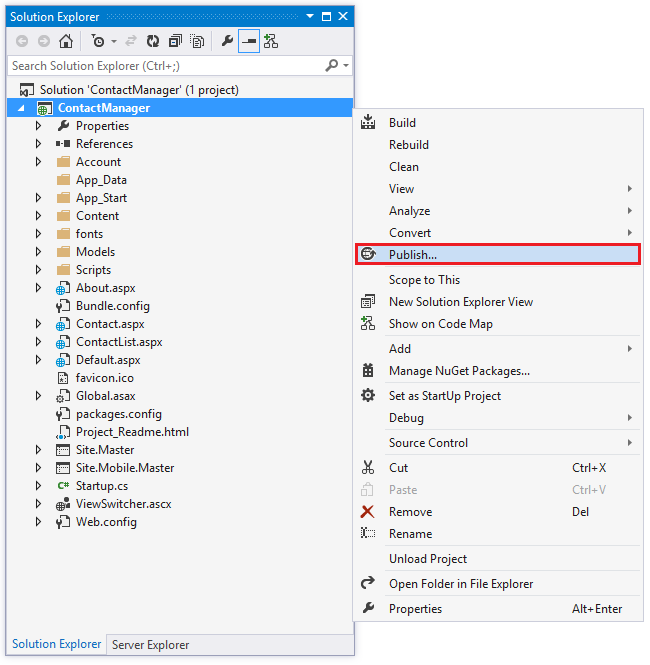  
	**[Web の発行]** ダイアログ ボックスが表示されます。  
	  
3. **[プロファイル]** タブで発行先に **[Windows Azure Web Sites]** をクリックします (選択されていない場合)。  
	  
4. **[サインイン]** をクリックします (サインインしていない場合)。
5. **[既存の Web サイト]** ドロップダウン ボックスで、このチュートリアルで作成した Web サイトを選択し、**[OK]** ボタンをクリックします。  
	  
	プロファイルに対する変更の保存が確認された場合は、**[はい]** を選択します。
6. **[設定]** タブをクリックします。  
	  
7. **[構成]** ドロップダウン ボックスを **[デバッグ]** に設定します。
8. **[ApplicationDbContext]** の**下向き矢印**アイコンをクリックして、**ContactDB** に設定します。
9. **[Code First Migrations を実行]** チェック ボックスをオンにします。  

	>[WACOM.NOTE]  
	この例では、アプリケーションを最初に発行する際にのみ、このチェック ボックスをオンにします。これによって、*Configuration.cs* ファイルの *Seed* メソッドが 1 回だけ呼び出されます。  

10. **[発行]** をクリックします。  
	アプリケーションが Azure に発行されます。

>[WACOM.NOTE]  
発行プロファイルの作成後、Visual Studio を再起動した場合、接続文字列がドロップダウン リストに表示されない場合があります。その場合は、先ほど作成した発行プロファイルを編集する代わりに、先ほどと同じ方法で新しい発行プロファイルを作成し、以降の **[設定]** タブの手順に従ってください。)  

###Azure のアプリケーションを確認する 
1. ブラウザーで **[Contact Demo]** リンクをクリックします。  
	[Contacts List] が表示されます。
	  

2. **[Contacts List]** ページで **[Create New]** を選択します。  
	  
	連絡先の変更が許可されたアカウントでログインしていない場合、**[Login]** ページにリダイレクトされます。  
3. 次の電子メール アドレスとパスワードを入力して **[Log in]** ボタンをクリックします。  
	**電子メール**:`canEditUser@wideworldimporters.com`  
	**パスワード:**:`Pa$$word1`  
	  

4. 各フィールドに新しいデータを入力して **[Insert]** ボタンをクリックします。  
	  
	新しいレコードが追加された *EditContactList.aspx* ページが表示されます。  
	  

5. **[Log off]** リンクを選択します。

###アプリケーションを停止する 
他のユーザーによるサンプル アプリケーションへの登録や、アプリケーションの使用を避けるには、Web サイトを停止します。

1. Visual Studio の **[表示]** メニューで **[サーバー エクスプローラー]** を選択します。 
2. **サーバー エクスプローラー**で **[Web サイト]** に移動します。
3. 各 Web サイトのインスタンスを右クリックし、**[Web サイトの停止]** を選択します。  
	  

	Microsoft Azure の管理ポータルから Web サイトを選択し、ページ下部の **[停止]** アイコンをクリックする方法もあります。  
	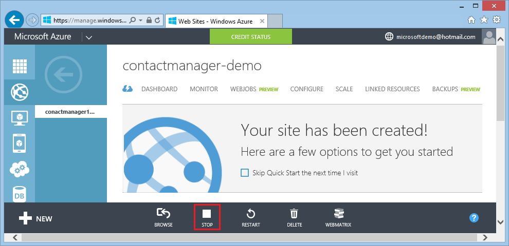  

##データベースを確認する 
データベースを直接表示して変更する方法も理解しておく必要があります。データベースを直接操作する方法を知っておくことで、データベースのデータを確認し、各テーブルにおけるデータの格納方法を把握できるようになります。

###SQL Azure DB を調べる 
1. Visual Studio で**サーバー エクスプローラー**を開き、**[ContactDB]** に移動します。
2. **[ContactDB]** を右クリックし、**[SQL Server オブジェクト エクスプローラーで開く]** を選択します。  
	  
3. **[ファイアウォール ルールの追加]** ダイアログ ボックスが表示されたら、**[ファイアウォール ルールを追加]** をクリックします。  

	>[WACOM.NOTE]  
	**[SQL データベース]** を展開できず、**ContactDB** を Visual Studio で表示できない場合は、手順に従って特定のファイアウォール ポート (またはポート範囲) を開放する必要があります。これには、[MVC チュートリアル](http://azure.microsoft.com/ja-jp/documentation/articles/web-sites-dotnet-deploy-aspnet-mvc-app-membership-oauth-sql-database/)の最後に記載されている「**Azure のファイアウォール ルールを設定する**」の手順を実行します。または、アプリケーションをローカルでビルド、実行し (Visual Studio で **Ctrl キーを押しながら F5 キーを押す**)、データを追加して、ローカル データベースのデータを確認する方法もあります。  

4. **[サーバーへの接続]** ダイアログ ボックスが表示された場合、このチュートリアルの冒頭で作成した**パスワード**を入力して **[接続]** ボタンをクリックします。  

	>[WACOM.NOTE]  
	パスワードを思い出せない場合は、ローカルのプロジェクト ファイルから見つけることができます。これには、**ソリューション エクスプローラー**で *Properties* フォルダー、*PublishProfiles* フォルダーの順に展開し、*contactmanager.pubxml* ファイルを開き (別の名前が付けられている可能性があります)、発行パスワードを検索します。
5. **[contactDB]** データベース、**[テーブル]** の順に展開します。
6. **[dbo.AspNetUsers]** テーブルを右クリックし、**[データの表示]** を選択します。  
	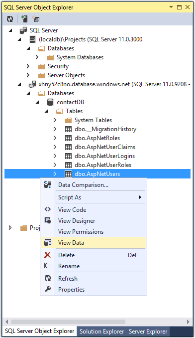  
	canEditUser@contoso.com ユーザーに関連付けられているデータが表示されます。  
	  

###データベースを編集して、管理者ロールにユーザーを追加する 
先ほどは、コードを使用してユーザーを canEdit ロールに追加しました。それ以外にも、メンバーシップ テーブル内のデータを直接操作する方法もあります。以下の手順では、その方法を使用してロールにユーザーを追加します。

1. **SQL Server オブジェクト エクスプローラー**で **[dbo.AspNetUserRoles]** を右クリックし、**[データの表示]** を選択します。
	  
2. *RoleId* をコピーして空の (新しい) 行に貼り付けます。  
	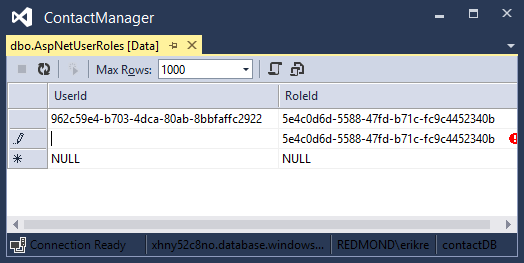  
3. **dbo.AspNetUsers** テーブルで、ロールを割り当てるユーザーを特定し、ユーザーの *ID* をコピーします。
4. コピーした *ID* を、**AspNetUserRoles** テーブルの新しい行の **[UserId]** フィールドに追加します。  

>[WACOM.NOTE]  
もっと簡単にユーザーとロールを管理できるように現在ツールを作成しています。  

##次のステップ
ASP.NET Web フォームの詳細については、ASP.NET Web サイトの「[Learn About ASP.NET Web Forms (ASP.NET Web フォームについて学習する)](http://www.asp.net/web-forms)」や、[Microsoft Azure のチュートリアルとガイド](http://azure.microsoft.com/ja-jp/documentation/services/web-sites/#net)を参照してください。

このチュートリアルは、Rick Anderson (Twitter [@RickAndMSFT](https://twitter.com/RickAndMSFT)) が Tom Dykstra と Barry Dorrans ([@blowdart](https://twitter.com/blowdart)) の協力を得て執筆した「[メンバーシップ、OAuth、SQL データベースを使用した安全な ASP.NET MVC 5 アプリケーションを Azure の Web サイトにデプロイする](http://azure.microsoft.com/ja-jp/documentation/articles/web-sites-dotnet-deploy-aspnet-mvc-app-membership-oauth-sql-database/)」の内容に基づいています。 

役に立った内容や改善点など、皆様からのご意見をお寄せください。このチュートリアルに関してだけでなく、ここで紹介した製品に関するご意見やご要望もお待ちしております。お寄せいただいたご意見は、今後の改善に役立たせていただきます。新しいトピックについては、「[Show Me How With Code (コードの使用方法)](http://aspnet.uservoice.com/forums/228522-show-me-how-with-code)」で要求および投票することもできます。

<!--HONumber=35.2-->
