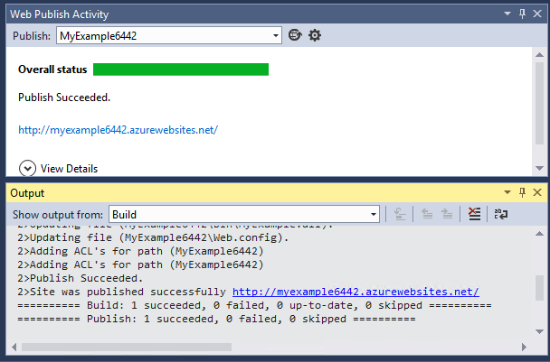

<properties linkid="develop-net-tutorials-get-started-vs2013" urlDisplayName="Windows Azure を使ってみる" pageTitle="Windows Azure for .NET を使ってみる" metaKeywords="" description="このチュートリアルでは、Visual Studio 2013 を使用して ASP.NET Web サイトを Windows Azure に展開する方法を紹介します。15 分未満でアプリケーションをクラウドで稼働状態にすることができます。" metaCanonical="" services="web-sites" documentationCenter=".NET" title="Windows Azure と ASP.NET を使ってみる" authors=""  solutions="" writer="tdykstra" manager="wpickett" editor="mollybos"  />

# Windows Azure と ASP.NET を使ってみる

<a href="/ja-jp/develop/net/tutorials/get-started/" title="Visual Studio 2013" class="current">Visual Studio 2013</a><a href="/ja-jp/develop/net/tutorials/get-started-vs2012/" title="Visual Studio 2012">Visual Studio 2012</a>

このチュートリアルでは、Visual Studio 2013 または Visual Studio 2013 for Web Express の Web の発行ウィザードを使用して、ASP.NET Web アプリケーションを Windows Azure の Web サイトに展開する方法を示します。(Visual Studio 2012 を使用する場合は、[このチュートリアルの前のバージョン](/ja-jp/develop/net/tutorials/get-started-vs2012/) を参照してください。)

Windows Azure アカウントは無料で開くことができます。また、まだ Visual Studio 2013 を持っていない場合は、SDK によって Visual Studio 2013 for Web Express が自動的にインストールされます。これで、Windows Azure 向けの開発を完全に無料で始めることができます。

このチュートリアルは、Windows Azure を使用した経験がない読者を対象に作成されています。このチュートリアルでは、クラウドで動作する単純な Web アプリケーションを作成します。
 
学習内容: 

* Windows Azure SDK をインストールして、Windows Azure 向け開発用にコンピューターを準備する方法
* Visual Studio の ASP.NET MVC 5 プロジェクトを作成して Windows Azure の Web サイトに発行する方法

次の図に、完成したアプリケーションを示します。

<strong>注</strong>
このチュートリアルを完了するには、Windows Azure アカウントが必要です。アカウントを持っていない場合は、<a href="/ja-jp/pricing/member-offers/msdn-benefits-details/?WT.mc_id=A261C142F" target="_blank">MSDN サブスクライバーの特典を有効にする</a>か、<a href="/ja-jp/pricing/free-trial/?WT.mc_id=A261C142F" target="_blank">無料評価版にサインアップ</a>してください。

 
### チュートリアル セグメント

1. [開発環境を設定する](#setupdevenv)
3. [ASP.NET MVC 5 アプリケーションを作成する](#createapp)
4. [Windows Azure にアプリケーションを展開する](#deploytowindowsazure)
5. [次のステップ](#nextsteps)

[WACOM.INCLUDE [install-sdk-2013-only](../includes/install-sdk-2013-only.md)]

<h2>アプリケーションの作成ASP.NET MVC 5 アプリケーションを作成する</h2>

最初の手順では、Windows Azure に発行する Visual Studio Web アプリケーション プロジェクトを作成します。

### プロジェクトを作成する

1. Visual Studio 2013 または Visual Studio 2013 Express for Web を開きます。

2. **[ファイル]** メニューの **[新しいプロジェクト]** をクリックします。

	![[ファイル] メニューの [新しいプロジェクト]](./media/web-sites-dotnet-get-started-vs2013/gs13newproj.png)

3. **[新しいプロジェクト]** ダイアログ ボックスで、**[インストールされているテンプレート]** の下にある **C#** を展開して **[Web]** を選択し、**[ASP.NET Web アプリケーション]** を選択します。

3. ターゲット フレームワークとして **.NET Framework 4.5** が選択されていることを確認します。

4. アプリケーションに「**MyExample**」という名前を付けて、**[OK]** をクリックします。

	![[新しいプロジェクト] ダイアログ ボックス](./media/web-sites-dotnet-get-started-vs2013/GS13newprojdb.png)

5. **[新しい ASP.NET プロジェクト]** ダイアログ ボックスで、**[MVC]** テンプレートを選択し、**[認証の変更]** をクリックします。

	![[新しい ASP.NET プロジェクト] ダイアログ ボックス](./media/web-sites-dotnet-get-started-vs2013/GS13changeauth.png)

6. **[認証の変更]** ダイアログ ボックスで、**[認証なし]** をクリックし、**[OK]** をクリックします。

	![[認証なし]](./media/web-sites-dotnet-get-started-vs2013/GS13noauth.png)

	作成中のサンプル アプリケーションには、ユーザーのログインが必要な機能は実装されません。認証と承認の機能を実装する方法については、このチュートリアルの最後にある「[次のステップ](#nextsteps)」セクションを参照してください。

5. **[新しい ASP.NET プロジェクト]** ダイアログ ボックスで **[OK]** をクリックします。

	![[新しい ASP.NET プロジェクト] ダイアログ ボックス](./media/web-sites-dotnet-get-started-vs2013/GS13newaspnetprojdb.png)

### ローカルでアプリケーションを実行する

1. Ctrl キーを押しながら F5 キーを押してアプリケーションを実行します。

	アプリケーションのホーム ページが既定のブラウザーに表示されます。

	

	URL `http://localhost` は、ローカル コンピューターで実行中であることを示しています。既定では、IIS Express で実行されます。これは、Web アプリケーションの開発での使用を想定した、IIS の軽量バージョンです。

	これで、Windows Azure に展開できる単純なアプリケーションを作成するために必要な操作が完了しました。

<h2>アプリケーションの展開Windows Azure にアプリケーションを展開する</h2>

1. ブラウザーを閉じます。

5. Visual Studio の**ソリューション エクスプローラー**で、プロジェクトを右クリックし、コンテキスト メニューの **[発行]** をクリックします。

	![プロジェクトのコンテキスト メニューの [発行]](./media/web-sites-dotnet-get-started-vs2013/GS13publish.png)

	**Web の発行**ウィザードが開きます。

6. **Web の発行**ウィザードの **[プロファイル]** タブで、**[インポート]** をクリックします。

	

	**[発行プロファイルのインポート]** ダイアログ ボックスが表示されます。

5. 次のいずれかの方法で、Visual Studio から Windows Azure アカウントへの接続を有効にします。

	***[サインイン]** をクリックし、Windows Azure アカウントの資格情報を入力します。

		これはすばやく簡単に実行できる方法ですが、この方法を使用した場合、**[サーバー エクスプローラー]** ウィンドウで Windows Azure SQL データベースやモバイル サービスを確認することができません。

	* アカウントへのアクセスを可能にする管理証明書をインストールするには、**[サブスクリプションの管理]** をクリックします。

		**[Windows Azure サブスクリプションの管理]** ダイアログ ボックスで、**[証明書]** タブをクリックし、**[インポート]** をクリックします。操作手順に従い、Windows Azure アカウント用のサブスクリプション ファイル (*.publishsettings* ファイル) をダウンロードしてインポートします。

		> [WACOM.NOTE] サブスクリプション ファイルをソース コード ディレクトリの外にあるフォルダー (Downloads フォルダーなど) にダウンロードし、インポートが完了したらそのファイルを削除します。これは、悪意のあるユーザーがサブスクリプション ファイルへのアクセス許可を取得すると、Windows Azure サービスを編集、作成、削除できるためです。

		詳細については、「[アカウント、サブスクリプション、管理者ロールを管理する](http://go.microsoft.com/fwlink/?LinkId=324796#BKMK_AccountVCert)」を参照してください。

2. **[発行の設定のインポート]** ダイアログ ボックスで、**[Windows Azure の Web サイトからインポート]**、**[新規]** の順にクリックします。

	

3. **[Windows Azure でのサイトの作成]** ダイアログ ボックスで、アプリケーションの一意の URL として使用する文字列を **[サイト名]** ボックスに入力します。

	ここに入力した文字列と、このテキスト ボックスの右側に表示されている文字列を組み合わせたものが実際の URL になります。入力した URL が既に使用されている場合は、右側に緑色のチェック マークではなく赤色の感嘆符が表示されます。そのため、別の値を入力する必要があります。

4. **[場所]** ドロップダウン リストで、現在の所在地に最も近い場所を選択します。

	この設定によって、使用する Web サイトが実行されるデータ センターが指定されます。

5. データベース フィールドは変更せずそのままにします。

	このチュートリアルでは、データベースは使用しません。このチュートリアルの最後にある「[次のステップ](#nextsteps)」セクションには、データベースの使用方法を示したチュートリアルへのリンクがあります。

6. **[作成]** をクリックします。 

	

	数秒で Web サイトが作成されます。**[発行の設定のインポート]** ダイアログ ボックスに戻ったら、ドロップダウン リストで新しいサイトが選択されています。

6. **[OK]** をクリックします。

	

8. **Web の発行**ウィザードの **[接続]** タブで、**[接続の検証]** をクリックし、設定が正しいことを確認します。

	

	接続が検証されると、**[接続の検証]** ボタンの横に緑色のチェック マークが表示されます。

9. **[次へ]** をクリックします。

	

10. **[設定]** タブの **[次へ]** をクリックします。

	![[設定] タブ](./media/web-sites-dotnet-get-started-vs2013/GS13SettingsTab.png)

	このタブでは、既定の設定をそのまま使用できます。リリース ビルド構成を展開しているため、展開先サーバーでファイルを削除したり、アプリケーションをプリコンパイルしたり、App_Data フォルダーでファイルを除外したりする必要はありません。

11. **[プレビュー]** タブで、**[プレビューの開始]** をクリックします。

	![[プレビュー] タブの [プレビューの開始] ボタン](./media/web-sites-dotnet-get-started-vs2013/GS13Preview.png)

	このタブに、サーバーにコピーされるファイルの一覧が表示されます。プレビューの表示は、アプリケーションの発行に必要ではありませんが、知っておくと便利な機能です。

12. **[発行]** をクリックします。

	

	Windows Azure サーバーにファイルをコピーする処理が開始されます。

13. **出力**ウィンドウでは、実行された展開操作が表示され、展開が問題なく完了したことが報告されます。

	

14. 展開が成功すると、自動的に既定のブラウザーが開き、展開先の Web サイトの URL にアクセスします。

	これで、作成したアプリケーションはクラウドで実行されています。

	

<h2>次のステップ次のステップ</h2>

このチュートリアルでは、Windows Azure の Web サイトに単純な Web アプリケーションを展開する方法について説明しました。サイトを管理、拡張、およびトラブルシューティングする方法、データベース、認証、および承認機能を追加する方法、アプリケーションを Windows Azure の Web サイトではなく Windows Azure のクラウド サービスで実行するかどうかを決定する方法を示すその他のリソースを利用できます。

<h3>Web サイトの管理方法</h3>
[Windows Azure の管理ポータル][Portal]は、すべての Windows Azure サービスを管理および監視できる Web インターフェイスです。

新しい Web サイト、クラウド サービス、仮想マシン、データベースなどを作成できます。ギャラリーからは、オープン ソース アプリケーションを作成できます。作成したサービスの管理もできます。たとえば、次のスクリーン ショットは、管理ポータルの **[ダッシュボード]** タブにある Windows Azure の Web サイトの **[停止]**、**[再起動]**、および **[削除]** ボタンを示しています。**[ダッシュボード]** には、使用された CPU 時間、要求の数、入出力データ、発生した可能性のあるエラーなどのパフォーマンス統計も表示されます。

![管理ポータルの [ダッシュボード] タブ](./media/web-sites-dotnet-get-started-vs2013/MPStopStartDelete.png)

その他多数のサイトの設定は **[構成]** タブで変更できます。詳細については、「[Web サイトの管理方法](/ja-jp/manage/services/web-sites/how-to-manage-websites/)」を参照してください。

Web サイトの管理機能の一部は、Visual Studio の**サーバー エクスプローラー**から実行することもできます。**サーバー エクスプローラー**で実行できる操作については、「[Visual Studio での Windows Azure の Web サイトのトラブルシューティング](/ja-jp/develop/net/tutorials/troubleshoot-web-sites-in-visual-studio/)」を参照してください。

<h3>Web サイトの規模変更方法</h3>
サイトがパブリックの場合、トラフィックが増えると応答時間が遅くなることがあります。これを改善するために、管理ポータルの **[スケール]** タブでサーバー リソースを追加できます。詳細については、「[Web サイトの規模変更方法](/ja-jp/manage/services/web-sites/how-to-scale-websites/)」を参照してください。(サーバー リソースを追加して Web サイトの規模を変更することは無料ではありません。)

<h3>Web サイトのトラブルシューティングの方法</h3>
トラブルシューティングのためにトレースまたはログの出力を参照することもできます。Visual Studio には、リアルタイムで生成される Windows Azure ログの表示を容易にする組み込みツールが用意されています。Windows Azure では、リモートでデバッグ モードを使用して実行することもできます。詳細については、「[Visual Studio での Windows Azure の Web サイトのトラブルシューティング](/ja-jp/develop/net/tutorials/troubleshoot-web-sites-in-visual-studio/)」を参照してください。

<h3>データベースと承認の機能を追加する方法</h3>
ほとんどの運用環境の Web サイトでは、データベースを使用し、一部のサイトの機能を特定の許可されたユーザーだけに制限します。データベース アクセス、認証、および承認の基本的な処理方法を示すチュートリアルについては、「[メンバーシップ、OAuth、SQL データベースを使用した安全な ASP.NET MVC アプリケーションを Windows Azure の Web サイトに展開する](/ja-jp/develop/net/tutorials/web-site-with-sql-database/)」を参照してください。

<h3>アプリケーションをクラウド サービスで実行するかどうかを決定する方法</h3>
一部のシナリオでは、Windows Azure の Web サイトではなく、Windows Azure のクラウド サービスでアプリケーションを実行することもできます。詳細については、「[Windows Azure 実行モデル](/ja-jp/develop/net/fundamentals/compute/)」と「[Windows Azure の Web サイト、クラウド サービス、仮想マシン: いつ、どれを使用するか](http://www.windowsazure.com/ja-jp/manage/services/web-sites/choose-web-app-service/)」を参照してください。多層 ASP.NET Web アプリケーションを作成してクラウド サービスに展開する方法を説明したチュートリアルについては、「[ストレージ テーブル、キュー、および BLOB を使用する .NET 多層アプリケーション](/ja-jp/develop/net/tutorials/multi-tier-web-site/1-overview/)」を参照してください。

[ポータル]: http://manage.windowsazure.com

