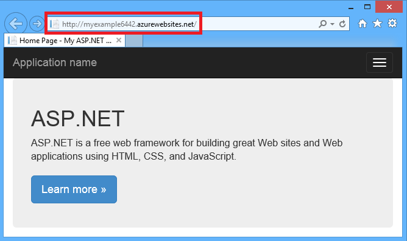
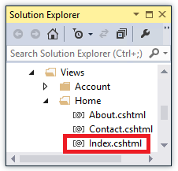

<properties linkid="develop-net-tutorials-get-started-vs2013" urlDisplayName="ASP.NET のための Azure の使用" pageTitle="ASP.NET のための Azure の使用" metaKeywords="" description="このチュートリアルでは、Visual Studio 2013 で ASP.NET Web プロジェクトを作成し、Azure の Web Site に展開する方法を説明します。アプリケーションを 15 分未満で作成して、クラウドで実行することができます。" metaCanonical="" services="web-sites" documentationCenter=".NET" title="Azure と ASP.NET の使用" authors="tdykstra"  solutions="" manager="wpickett" editor="mollybos"  />

# Azure と ASP.NET の使用

<a href="/ja-jp/develop/net/tutorials/get-started/" title="Visual Studio 2013" class="current">Visual Studio 2013</a><a href="/ja-jp/develop/net/tutorials/get-started-vs2012/" title="Visual Studio 2012">Visual Studio 2012</a>

このチュートリアルでは、Visual Studio 2013 または Visual Studio 2013 for Web Express を使用して、ASP.NET Web アプリケーションを作成し、Azure の Web Site に展開する方法を示します。このチュートリアルは、Azure または ASP.NET を使用した経験がない読者を対象に作成されています。このチュートリアルでは、クラウドで動作する単純な Web アプリケーションを作成します。

Azure アカウントは無料で開くことができます。また、まだ Visual Studio 2013 を持っていない場合は、SDK によって Visual Studio 2013 for Web Express が自動的にインストールされます。これで、Azure 向けの開発を完全に無料で始めることができます。
 
学習内容: 

* Azure SDK をインストールして、Azure 向け開発用にコンピューターを準備する方法
* Visual Studio の ASP.NET Web プロジェクトを作成して Azure の Web Site に展開する方法
* プロジェクトに変更を加えて再展開する方法

次の図に、完成したアプリケーションを示します。

>[WACOM.NOTE]このチュートリアルを完了するには、Azure アカウントが必要です。アカウントを持っていない場合は、<a href="/ja-jp/pricing/member-offers/msdn-benefits-details/?WT.mc_id=A261C142F" target="_blank">MSDN サブスクライバーの特典を有効にする</a>か、<a href="/ja-jp/pricing/free-trial/?WT.mc_id=A261C142F" target="_blank">無料評価版にサインアップ</a>してください。
 
### チュートリアル セグメント

* [開発環境を設定する](#set-up-the-development-environment)
* [Visual Studio を使用した ASP.NET Web プロジェクトの作成](#create-an-asp.net-web-project)
* [Azure にアプリケーションを展開する](#deploy-the-application-to-azure)
* [変更を加えて、再展開する](#make-a-change-and-redeploy)
* [次のステップ](#next-steps)

[WACOM.INCLUDE [install-sdk-2013-only](../includes/install-sdk-2013-only.md)]

## ASP.NET Web アプリケーションの作成

最初の手順は、Web アプリケーション プロジェクトを作成することです。Visual Studio は後でプロジェクトを展開する Azure の Web Site を自動的に作成します。

1. Visual Studio 2013 または Visual Studio 2013 Express for Web を開きます。

2. **[ファイル]** メニューの **[新しいプロジェクト]** をクリックします。

	![[ファイル] メニューの [新しいプロジェクト]](./media/web-sites-dotnet-get-started-vs2013/gs13newproj.png)

3. **[新しいプロジェクト]** ダイアログ ボックスで、**[インストールされているテンプレート]** の下にある **[C#**] または **[Visual Basic]** を展開して **[Web]** を選択し、**[ASP.NET Web アプリケーション]** を選択します。

3. ターゲット フレームワークとして **.NET Framework 4.5** が選択されていることを確認します。

4. アプリケーションに「**MyExample**」という名前を付けて、**[OK]** をクリックします。

	![[新しいプロジェクト] ダイアログ ボックス](./media/web-sites-dotnet-get-started-vs2013/GS13newprojdb.png)

5. **[新しい ASP.NET プロジェクト]** ダイアログ ボックスで、**MVC** または **Web Forms** テンプレートを選択し、**[認証の変更]** をクリックします。

	[MVC および Web Forms](http://www.asp.net/get-started/websites) は Web サイトを作成するための ASP.NET のフレームワークです。優先順位も Azure の他のチュートリアルを実行する計画もない場合は、MVC を使用する多くの Azure のチュートリアルがあるため、MVC が適しています。

	![[新しい ASP.NET プロジェクト] ダイアログ ボックス](./media/web-sites-dotnet-get-started-vs2013/GS13changeauth.png)

6. **[認証の変更]** ダイアログ ボックスで、**[認証なし]** をクリックし、**[OK]** をクリックします。

	![[認証なし]](./media/web-sites-dotnet-get-started-vs2013/GS13noauth.png)

	作成中のサンプル アプリケーションには、ユーザーのログインが必要な機能は実装されません。このチュートリアルの最後にある「[次のステップ](#next-steps)」セクションは認証と承認を実装するチュートリアルへのリンクがあります。

5. ダイアログ ボックスの **[Azure]** の下で、チェック ボックスをオンにし、ボックスの一覧で **[Web Site]** を選択します。

	チェック ボックスのキャプションは、**"クラウドでのホスト"** または **"リモート リソースの作成"** です。いずれの場合も効果は同じです。

	これらの設定は、Visual Studio が Web プロジェクトのための Azure の Web Site を作成することを指定します Web プロジェクトを新しく作成された Web サイトに展開します。(代替方法として、ドロップダウン ボックスの選択を変更して Visual Studio が IIS を実行する Azure Virtual Machines を作成するように変更できますが、このチュートリアルではその操作の手順については詳しく説明しません)。

5. **[新しい ASP.NET プロジェクト]** ダイアログ ボックスで **[OK]** をクリックします。

	![[新しい ASP.NET プロジェクト] ダイアログ ボックス](./media/web-sites-dotnet-get-started-vs2013/GS13newaspnetprojdb.png)

	スクリーンショットには選択した MVC テンプレートが表示されます。Web Forms を選択すると、**[Web Forms]** が選択されます。

5. Azure にまだサインインしていない場合は、Visual Studio にサインインを求めるメッセージが表示されます。**[サインイン]** をクリックします。

	

6. Azure サブスクリプションを管理するために使用するアカウントの ID とパスワードを入力します。

	

	サインインすると、**[Azure のサイトの設定を構成する]** ダイアログ ボックスが表示され、作成するリソースが求められます。

	

3. Visual Studio には既定の **サイト名** が用意されており、Azure ではアプリケーションの URL のプレフィックスとして使用されます。必要に応じて、別のサイト名を入力します。

	ここに入力した文字列と、このテキスト ボックスの右側に表示されているドメインを組み合わせたものが実際の URL になります。たとえば、サイト名が `MyExample6442` である場合、URL は `MyExample6442.azurewebsites.net`です。入力した URL が既に使用されている場合は、右側に緑色のチェック マークではなく赤色の感嘆符が表示されます。そのため、別の値を入力する必要があります。

4. **[リージョン]** ボックスの一覧で、現在の所在地に最も近い場所を選択します。

	この設定によって、使用する Web サイトが実行される Azure データ センターが指定されます。

5. データベース フィールドは変更せずそのままにします。

	このチュートリアルでは、データベースは使用しません。このチュートリアルの最後にある「[次のステップ](#next-steps)」セクションには、データベースの使用方法を示したチュートリアルへのリンクがあります。

6. **[OK]** をクリックします。

	数秒で、Visual Studio により、指定したフォルダーに Web プロジェクトが作成され、指定した Azure リージョンに Web サイトが作成されます。

	**[ソリューション エクスプローラー]** ウィンドウには、新しいプロジェクトのファイルとフォルダーが表示されます (スクリーンショットは Web Forms プロジェクトのものです。MVC プロジェクトには別のフォルダーおよびファイルがあります)。

	

	**[Web 発行アクティビティ]** ウィンドウには、サイトが作成されたことが表示されます。

	

## アプリケーションの Azure への展開

7. **[Web 発行アクティビティ]** ウィンドウで、**[今すぐ MyExample をこのサイトに発行する]** をクリックします。

	

	数秒で、**Web の発行**ウィザードが表示されます。このウィザードは新しい*発行プロファイル*を作成し、これにはプロジェクトを Azure に展開するために Visual Studio に必要な Web サイト URL などの設定が含まれます。プロファイルは自動的に保存されるため、後でプロジェクトに変更を加えてから、プロジェクトを同じサイトに簡単に再展開できます。

8. **Web の発行**ウィザードの **[接続]** タブで、**[接続の検証]** をクリックして、Web プロジェクトを展開するために Visual Studio が Azure に接続できることを確認します。

	

	接続が検証されると、**[接続の検証]** ボタンの横に緑色のチェック マークが表示されます。

9. **[次へ]** をクリックします。

	

10. **[設定]** タブの **[次へ]** をクリックします。

	![[設定] タブ](./media/web-sites-dotnet-get-started-vs2013/GS13SettingsTab.png)

	このタブでは、既定の設定をそのまま使用できます。リリース ビルドを展開しているため、展開先サーバーでファイルを削除したり、アプリケーションをプリコンパイルしたり、App_Data フォルダーでファイルを除外したりする必要はありません。このチュートリアルの最後にある「[次のステップ](#next-steps)」セクションには、デバッグ ビルドを展開し、リモートでデバッグ モードを使用して Visual Studio を実行する方法を示すチュートリアルへのリンクがあります。

11. **[プレビュー]** タブで、**[プレビューの開始]** をクリックします。

	![[プレビュー] タブの [プレビューの開始] ボタン](./media/web-sites-dotnet-get-started-vs2013/GS13Preview.png)

	このタブに、サーバーにコピーされるファイルの一覧が表示されます。プレビューの表示は、アプリケーションの発行に必要ではありませんが、知っておくと便利な機能です。

12. **[発行]** をクリックします。

	

	Azure サーバーにファイルをコピーする処理が開始されます。

	**[出力]** ウィンドウと **[Web 発行アクティビティ]** ウィンドウでは、実行された展開操作が表示され、展開が問題なく完了したことが報告されます。

	

	展開が成功すると、自動的に既定のブラウザーが開き、展開先の Web サイトの URL にアクセスします。
	これで、作成したアプリケーションはクラウドで実行されています。ブラウザー アドレス バーの URL は、インターネットから読み込まれているサイトを示します。

	

13. ブラウザーを閉じます。

## 変更を加えて、再展開する

チュートリアルのこの省略可能なセクションでは、Web プロジェクトを変更し、開発用コンピューターでローカルでプロジェクトを実行して変更を確認し、その変更を Azure に展開します。

2. MVC プロジェクトを作成した場合は、**ソリューション エクスプローラー**の *Views/Home/Index.cshtml* ファイルまたは *.vbhtml* ファイルを開き、**h1** 見出しを "ASP.NET" から "ASP.NET および Azure" に変更して、ファイルを保存します。

	

	

1. Web Forms プロジェクトを作成した場合は、**ソリューション エクスプローラー**の *Default.aspx* ファイルを開き、**h1** 見出しを "ASP.NET" から "ASP.NET および Azure" に変更して、ファイルを保存します。

	

	

1. Ctrl キーを押しながら F5 キーを押して、ローカル コンピューターでサイトを実行して変更をテストします。

	

	URL `http://localhost` は、ローカル コンピューターで実行中であることを示しています。既定では、IIS Express で実行されます。これは、Web アプリケーションの開発での使用を想定した、IIS の軽量バージョンです。

1. ブラウザーを閉じます。

1. **ソリューション エクスプローラー**で目的のプロジェクトを右クリックし、**[発行]** を選択します。

	

	**Web の発行**ウィザードの [プレビュー] タブが表示されます。発行設定を変更する必要がある場合、異なるタブを選択できますが、今は同じ設定で再展開します。

2. **Web の発行**ウィザードの **[発行]** をクリックします。

	![[発行] のクリック](./media/web-sites-dotnet-get-started-vs2013/clickpublish.png)

	Visual Studio ではプロジェクトが Azure に展開され、既定のブラウザーでサイトが開きます。

	

発行設定を変更する必要がない場合でも、簡単に再展開するには **Web の 1 クリック発行**ツール バーを使用します。

ツール バーは既定では有効になっていません。**[表示] - [ツール バー]** メニューで有効にします。これを使用して、プロファイルの選択、ボタンをクリックして発行、またはボタンをクリックして **Web の発行**ウィザードを開くことができます。

## 次のステップ

このチュートリアルでは、Azure の Web Site に単純な Web アプリケーションを作成して展開する方法について説明しました。詳細についての関連トピックとリソースがあります。

* Web プロジェクトを展開する他の方法
* サイトを管理、スケール変更、およびトラブルシューティングする方法
* データベースと承認の機能を追加する方法
* Web Sites、Cloud Services、および Web アプリケーション用の VM の違い

### Web プロジェクトを展開する他の方法

このチュートリアルでは、サイトを作成して、オールインワン操作ですべてを展開する最も簡単な方法を説明しました。Visual Studio を使用しての、または[ソース管理システム](http://www.asp.net/aspnet/overview/developing-apps-with-windows-azure/building-real-world-cloud-apps-with-windows-azure/source-control)からの[展開の自動化](http://www.asp.net/aspnet/overview/developing-apps-with-windows-azure/building-real-world-cloud-apps-with-windows-azure/continuous-integration-and-continuous-delivery)による、他の展開方法の概要については、「[How to Deploy an Azure Web Site (Azure の Web Site を展開する方法)](/ja-jp/documentation/articles/web-sites-deploy/")」を参照してください。

展開を自動化する 1 つの方法は、Windows PowerShell スクリプトを使用することです。Visual Studio と Azure では、Visual Studio で実行する展開操作と同じ操作を実行するために使用できる PowerShell スクリプトが生成されてそのタスクが簡単になります。詳細については、「[Automate Everything (Building Real-World Cloud Apps with Azure) (すべてを自動化 - Azure での実際のクラウド アプリケーションのビルド)](http://www.asp.net/aspnet/overview/developing-apps-with-windows-azure/building-real-world-cloud-apps-with-windows-azure/automate-everything)」を参照してください。

### Web サイトの管理方法

[Azure の管理ポータル](ja-jp/services/management-portal/) は、Web Site、Cloud Services、Virtual Machines、データベースなどの Azure サービスを管理および監視できるようにする Web インターフェイスです。ポータルで可能な操作を確認するには、[https://manage.windowsazure.com]() へ移動し、Azure サブスクリプションへの管理者権限のあるアカウントのユーザー名とパスワードでサインインします。詳細については、「[Web サイトの管理方法](/ja-jp/manage/services/web-sites/how-to-manage-websites/)」を参照してください。

Web サイトの管理機能の一部は、Visual Studio の**サーバー エクスプローラー**から実行することもできます。**サーバー エクスプローラー**で実行できる操作については、「[Visual Studio での Azure の Web Sites のトラブルシューティング](/ja-jp/develop/net/tutorials/troubleshoot-web-sites-in-visual-studio/)」を参照してください。

### Web サイトの規模変更方法

サイトがパブリックの場合、トラフィックが増えると応答時間が遅くなることがあります。これを改善するために、管理ポータルの **[スケール]** タブでサーバー リソースを追加できます。詳細については、「[Web サイトの規模変更方法](/ja-jp/manage/services/web-sites/how-to-scale-websites/)」を参照してください。(サーバー リソースを追加して Web サイトの規模を変更することは無料ではありません。)

### Web サイトのトラブルシューティングの方法

トラブルシューティングのためにトレースまたはログの出力を参照することもできます。Visual Studio には、リアルタイムで生成される Azure ログの表示を容易にする組み込みツールが用意されています。Azure では、リモートでデバッグ モードを使用して実行することもできます。詳細については、「[Visual Studio での Azure の Web Sites のトラブルシューティング](/ja-jp/develop/net/tutorials/troubleshoot-web-sites-in-visual-studio/)」を参照してください。

### データベースと承認の機能を追加する方法

ほとんどの運用環境の Web サイトでは、データベースを使用し、一部のサイトの機能を特定の許可されたユーザーだけに制限します。データベース アクセス、認証、および承認の基本的な処理方法を示すチュートリアルについては、「[メンバーシップ、OAuth、SQL Database を使用した安全な ASP.NET MVC アプリケーションを Azure の Web Site に展開する](/ja-jp/develop/net/tutorials/web-site-with-sql-database/)」を参照してください。

### アプリケーションを Cloud Services で実行するかどうかを決定する方法

Azure では、このチュートリアルで示したように Web Sites で、または Cloud Services や Virtual Machines で、Web アプリケーションを実行することができます。詳細については、「[Azure 実行モデル](/ja-jp/develop/net/fundamentals/compute/)」と「[Azure の Web Sites、Cloud Services、Virtual Machines: いつ、どれを使用するか](/ja-jp/manage/services/web-sites/choose-web-app-service/)」を参照してください。

