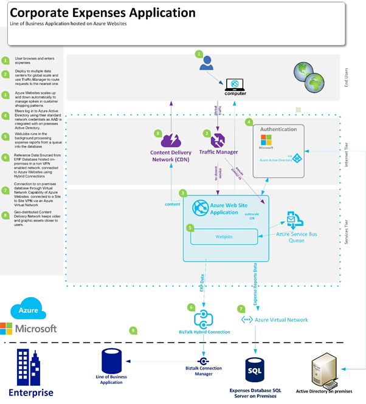

<properties 
	pageTitle="Migration Assistant を使用して IIS Web サイトを Azure Websites へ移行する" 
	description="Azure Websites を使用してビジネス用のエンタープライズ Web サイト ソリューションを作成する方法について説明します。" 
	services="web-sites" 
	documentationCenter="" 
	authors="cephalin" 
	writer="cephalin" 
	manager="wpickett" 
	editor=""/>

<tags 
	ms.service="web-sites" 
	ms.workload="web" 
	ms.tgt_pltfrm="na" 
	ms.devlang="na" 
	ms.topic="article" 
	ms.date="10/20/2014" 
	ms.author="cephalin"/>

# Azure Websites の企業向け製品・サービスに関するホワイトペーパー #

急速に発展を続ける環境において、コスト削減と IT ソリューションのより迅速な提供への必要性は、開発者や IT プロフェッショナル、経営者にとって新たな課題を生み出しています。基幹業務 (Line Of Business: LOB) Web アプリケーションとして、高速で応答性に優れ、どのデバイスからでも利用できるものを探し求めるユーザーが増え続けています。一方で、企業はクラウドやモバイル サービスとの統合によって得られる生産性や効率性の拡大から恩恵を得ようと懸命ですが、これは、Active Directory を使用してシングル サインオンで各デバイスに接続し、Office365 で共同作業を行いながら、会社に導入されている Salesforce から内部の LOB アプリケーションが得たデータを利用する、といったシンプルな統合になるでしょう。[Microsoft Azure Web サイト](http://azure.microsoft.com/services/websites/)は、開発やテスト、Web およびモバイル アプリケーションの運用、Web API、汎用 Web サイトなどに利用できるエンタープライズ クラスのクラウド サービスです。また、企業の Web サイトや業務用アプリケーションの運用、拡張性や可用性に特化したグローバルなデータセンター ネットワークで行うデジタル マーケティング キャンペーン、さらには持続的な統合や最新の DevOps の実践などにも活用できます。 

このホワイト ペーパーでは、Microsoft Azure Websites サービスが持つ機能、特に LOB Web アプリケーションの運用、既存の Web アプリケーションの移行支援、プラットフォームへの新しい Web アプリケーションのデプロイメントに焦点を合わせています。 

## 対象となる読者 ##

IT プロフェッショナル、設計者、および現在オンプレミスで運用中のワークロードを、クラウド Web ワークロードへ移行しようとしている経営者。Web ワークロードの範囲は企業から従業員、または企業からパートナー企業の Web アプリケーションにまで及びます。

## 概要 ##

その理由は、Microsoft Azure Websites は、社外および社内の Web アプリケーションと Web サービスを両方ともホストするための、理想的なプラットフォームです。Microsoft Azure Websites が提供する、コスト効率に優れ高度な拡張性を持つマネージド ソリューションにより、企業にとっては個々の環境の維持やサポートに莫大な時間と金額を費やすのではなく、ユーザーへビジネス価値を届けることに注力できるためです。Microsoft Azure Websites では、企業の Web アプリケーションをデプロイするための柔軟なプラットフォームを提供します。このプラットフォームは、Microsoft Azure Active Directory との統合を通じてオンプレミスの Active Directory に対する認証を持続する能力や、社内の持続的な統合およびデプロイメントの手法を生かした簡単かつ迅速なデプロイメント支援を備え、同時にビジネス ニーズと共に成長すべく自動的にその規模を拡張します。すべてがマネージド プラットフォーム上にあることにより、インフラではなくアプリケーションに集中することが可能になります。 

## 問題の定義 ##

IT 業界の状況は、長いリード タイムにわたり高い資本コストを必要とする従来のサーバーでのホスティングから、負荷に対応するため自動的に規模を拡張するオンデマンド サービスを活用する方向へと急速に変化しています。IT 部門は、資本支出の削減に焦点を当て、インフラのコストや設置面積、メンテナンス費用を削減しつつ、一方で俊敏性は向上させるという課題に直面しています。Windows Server 2003 などといった古き良き インフラストラクチャ プラットフォームの生産終了によって、長期にわたる新たな資本コストを回避するための見込みある手段として、IT 部門はクラウド化を再検討する方向へと傾いています。これまでは、CIO が他部門のために購買決定の判断を下していましたが、予算がどう使われ、どんな投資利益を得るかという点で CMO やその他の部門長がより大きな役割を担うようになってきています。従業員が離れた場所で業務を行い、手間の掛からないシステムへのアクセスを求める顧客とより多くの時間を過ごすような状況にあり、企業にとっては従業員にかつてないほどの機動力を与える必要性が、ますます高まっています。

ビジネス ニーズは月ごとに、週ごとに、日ごとに変化します。企業は、提供元がサード パーティであれ関連企業であれ、定期的な更新があり、様々な新しい機能を備え、すぐに利用できるグローバル規模のサービスを探し求めています。ユーザーは、Office365 など、私生活において利用できるサービスを多く持つことでより大きな期待を抱き、職場においてもそれに似た、最新で、機能豊富なサービスを利用したいと考えています。この要求に対応するため、IT 部門としては、サード パーティ サービスの選択と統合や、ビジネス ニーズに適したプラットフォームの慎重な選択を行うと同時にトータルの所有コスト削減も行うことで、企業がこれを実現できるような支援を試みる必要があります。

開発チームは直接的な利益をもたらすことを目指し、頻繁に新しい機能を生み出します。彼らが求めるのはコスト効率に優れ、既存のツールや開発、テスト、リリースといった手法と一体化する、信頼性のあるプラットフォームです。IT 部門と連携することで、ダウンタイムをゼロにするという目標のもと、デプロイメントや管理、警告を自動化できます。

<a href="highlevel" />
## 高度なソリューション ##

Web プラットフォームと Web フレームワークは、基幹業務アプリケーションの開発、テスト、ホストにますます利用されるようになっています。社内人件費システムのような代表的な基幹業務アプリケーションは、大抵の場合、アプリケーションに関連するデータを格納する補助データベースを備えた Web サイトのみで構成されています。

Microsoft Azure Websites は、拡張性と信頼性に優れ、管理やパッチの適用にも手動介入やダウンタイムがほとんど発生しないインフラストラクチャを備えており、このようなアプリケーションのホスティングにとっては良い選択肢と言えます。Microsoft Azure のプラットフォームでは、拡張性に優れたマネージド リレーショナル DBaas (DataBase as a Service: サービスとしてのデータベース) である Microsoft Azure SQL Database から、ClearDB MySQL Database や MongoDB など弊社パートナー企業による人気のサービスまで、Microsoft Azure Web サイトをホストとする Web アプリケーションの支援を目的に、数多くのデータ ストレージを提供しています。

別のアプローチとしては、オンプレミスへの既存の投資を活用する方法があります。シナリオ例の人件費システムでは、データ ストアを社内のインフラストラクチャ内部に保持したいと思うかもしれません。これは、内部システム (報告書、給与支払簿、請求書の作成など) との統合のため、または IT ガバナンスを満足させるためという可能性もあります。Microsoft Azure Web サイトでは、オンプレミスのインフラストラクチャへの接続を可能にするため、次の 2 つの方法を提供します。

- [ハイブリッド接続](http://aka.ms/hybridconnections) - ハイブリッド接続は Microsoft Azure BizTalk Services の機能で、Azure Web サイトが、たとえば SQL Server、MySQL、Web API、カスタム Web サービスなど、オンプレミスのリソースに安全に接続できるようにします。
- [仮想ネットワークの統合](http://aka.ms/websitesvnet) - Azure Websites Virtual Network Integration によって Web サイトを Azure Virtual Network に接続することが可能になり、同様に Azure Virtual Network を サイト間 VPN 経由でオンプレミスのインフラストラクチャに接続することも可能です。

次の図は、高度なソリューションにオンプレミスのリソースのための接続オプションを加えた例です。

## ビジネス上の利益 ##

Microsoft Azure Websites では、ビジネス上の利益が数多く得られ、それによってビジネス ニーズを果たすための機能がますますコスト効率に優れ、より高速になります。 

### PaaS モデル ###

Azure Websites は、コスト削減や効率性向上の手段を数多く提供する、サービスとしてのプラットフォーム (Platform as a Service: PaaS) モデルを基に構築されています。これからは、VM の管理、OS やフレームワークのパッチに何時間も費やす必要はありません。Azure Web サイトは自動的にパッチが適用される環境であり、これにより VM ではなく Web アプリケーションの管理に集中でき、チームはさらなるビジネス価値を自由に提供できます。

Microsoft Azure Websites を支える PaaS モデルによって、DevOps 手法の実践者は目標を達成できます。ビジネスとしてこれが意味するのは、開発、テスト、リリース、監視、管理、そして支援を含む、アプリケーションのライフ サイクル全体に及ぶ完全な管理と統合です。 

開発チームにとっては、Visual Studio Online、GitHub、TeamCity、Hudson または BitBucket から持続的な統合とデプロイメントのワークフローを構成することが可能であり、これによってビルドやテスト、デプロイメントの自動化が可能になり、さらにはリリース サイクルを短縮しながら既存のインフラストラクチャでのリリースにともなう抵抗を軽減できます。Azure Websites では、リリース ワークフローの複合テストおよびステージング環境の作成についてもサポートしているので、今後はこれらの目的でハードウェアを用意したり、割り当てたりする必要がなくなり、好きなだけ多くの環境を作成することも、ワークフローのリリースのために独自のプロモーションを定義することもできます。企業としては、ソース コントロールからテスト スロットへとリリースし、一連のテストを実施して無事に完了したところでステージ スロットに進み、最終的にダウンタイムなしでプロダクションへとスワップすれば、Azure Web サイトをホストとする Web アプリケーションにあらかじめ組み込まれる付加価値と共に、いつでも最高のカスタマー エクスペリエンスを提供できる状態になります。

運用チームは、すべての Web アプリケーションがビルト インの監視および警告機能を備えた Azure Websites をホストとすることで、あらゆる問題に対応するため、自分達が可能なかぎり最善のポジションにいるという自信を持つことができます。運用チームは既に Microsoft Visual Studio Application Insights の分析および監視ソリューションである New Relic や AppDynamics に予算を投じているはずです。Azure Web サイトでは、これらについてもフル サポートを提供しており、継続性と親しみのある環境で Web アプリケーションが監視できます。

最後に、Azure Websites では、サイトおよびホストされるデータベースを Azure BLOB Storage コンテナーに自動でバック アップする機能を備えています。これにより、災害からの復旧に利用できる簡単かつ極めてコスト効率の高い手段が得られ、複雑なオンプレミスのハードウェアやソフトウェアの必要性も抑えられます。

### 移行のしやすさ ###

ハードウェアと OS のリリース サイクルが加速するなか、ハードウェアのメンテナンスとローテーションは、企業にとって重要な問題です。2015 年にサポートが終了する Windows Server 2003 R2 サーバーを何台かお持ちで、それが重要な Web アプリケーションを未だにホストしていたりしませんか？Azure Websites はそれらの Web アプリケーションをホストし職場のハードウェア資源を合理化できる、優秀な候補です。Azure Websites では、サービスの一部として維持管理されている様々なハードウェア仕様へのアクセスが可能なので、交換および管理コストをインフラストラクチャの予算の一部として計上する必要はありません。移行には、既存のデプロイメントから Azure Websites にコピー アンド ペーストするだけという簡単な方法と、Azure Websites Migration Assistant が付加価値を与える、より複雑な方法があります。移行した Web アプリケーションでは Azure の各種サービスを最大限に活用し、追加のサービスを組み込むこともできます。たとえば、Azure Active Directory を追加すれば、セキュリティ グループへのユーザーの関連性に基づきアプリケーションへのアクセスを制御できます。別の例では、Cache Service を追加してパフォーマンスの向上と待機時間の短縮を行うことで、全体としてより良いユーザー エクスペリエンスを提供できます。 

### エンタープライズ クラス ホスティング ###

Azure Websites では、小規模な社内開発やテスト ワークロードから高度に拡張されたトラフィック負荷の高い Web サイトまで、多岐にわたるビジネス ニーズへの対応力を証明し続ける、安定性と信頼性に優れたプラットフォームを提供します。Azure Websites を使用することで、Microsoft が一企業として高付加価値の Web ワークロード用に使うものと同じ、エンタープライズ クラス ホスティング プラットフォームを活用することになります。Azure Web サイトと Azure プラットフォーム上のあらゆるサービスは、その要素および機能の核となる部分において、ISO (ISO/IEC 27001:2005)、SOC1 および SOC2 SSAE 16/ISAE 3402 Attestations、HIPAA BAA、PCI、Fedramp といった規制要件を含むセキュリティおよびコンプライアンスに基づき構築されています。詳細については、[http://aka.ms/azurecompliance](http://aka.ms/azurecompliance) をご覧ください。 

Microsoft Azure のプラットフォームでは、ロール ベースの承認制御 (Role Based Authorization Control: RBAC) によって、Azure Websites 内部のリソースへのエンタープライズ レベルの制御が可能になります。RBAC によって、企業は Azure 環境にある自社の資産に対し、ユーザーをグループに割り当て、グループには Azure Website のような資源に対して必要な許可を与えることで、独自のアクセス管理ポリシーを実装する能力が得られます。Azure での RBAC に関する詳細については、[http://aka.ms/azurerbac](http://aka.ms/azurerbac) をご覧ください。Azure Websites を活用することで、Web アプリケーションが安全な環境にデプロイされているという確信が持てるうえ、自社の資産がデプロイされている領域を完全に制御できます。 

さらに、Azure Websites は、データ ウェアハウスや SharePoint 環境などの社内リソースへの接続能力を提供することで、オンプレミスの投資を十分に活用できます。[高度なソリューション] で説明したように(#highlevel) ハイブリッド接続や Virtual Network Connectivity を活用すれば、オンプレミスのインフラストラクチャおよびサービスへの接続を確立できます。

### グローバルな規模 ###

Azure Websites はグローバルで拡張性に優れたプラットフォームであり、これによって Web アプリケーションは素早い成長と、増大し続けるビジネス ニーズへの適応が可能になり、同時に長期にわたる計画とコストを最小限に抑えられます。代表的なオンプレミスのインフラストラクチャにおいては、要求の局所的および地理的な拡大と増大により、追加のインフラストラクチャを準備し管理するために膨大な量の管理、計画、および費用が必要になります。Azure Websites では、要求の満ち引きに応じて Web アプリケーションの規模を増減できる能力を提供します。たとえば、経費管理アプリケーションを例にとると、月の大半において、各ユーザーはそのアプリケーションのライト ユーザーですが、毎月の経費報告書の入力期日にはアプリケーションの使用頻度が増加します。Azure Web サイトには、アプリケーション用のインフラストラクチャを自動的により多く用意する能力があり、また使用頻度が低下すれば、定義してある基準値へとインフラストラクチャの規模を縮小できます。

Azure Websites は、世界各地にある 17 のデータ センターでグローバルに利用でき、その数は増加を続けています。最新の地域および所在地の一覧については、[http://aka.ms/azlocations](http://aka.ms/azlocations) をご覧ください。Azure Websites があれば、ビジネスの範囲や規模をグローバル レベルにまで広げることが容易にできます。会社が新たな地域へと進出すると同時に、Azure Web サイトをホストとして使用するレポーティング アプリケーション ダッシュボードは追加のデータセンターへと簡単にデプロイができ、Azure Web サイトと Azure Traffic Manager の組み合わせによってはるかに速くその土地のユーザーに利用してもらえますが、そのすべてが、各支社のニーズの変化に応じてその規模を増減させることが可能な拡張性に優れたインフラストラクチャを底面に備えています。
 
## ソリューションの詳細 ##

アプリケーションの移行シナリオの例に目を向けてみましょう。この例では、Azure Web サイトの各機能が集まり、優れたソリューションとビジネス価値を提供する仕組みの詳細について概説しています。
 
この例の全体にわたり、説明の対象となる基幹業務アプリケーションは、従業員が返済を受けるために経費を提出できるようにする経費報告アプリケーションです。このアプリケーションは IIS6 が稼働する Windows Server 2003 R2 をホストとしており、データベースは SQL Server 2005 データベースです。古いサーバーを選んだ理由は、迫り来る Windows Server 2003 R2 と SQL Server 2005 のサービス終了にあります。また、Azure にワークロードを自動的に移行するための[ツール](http://aka.ms/websitesmigration)および[ガイダンス](http://aka.ms/websitesmigrationresources)を用意しています。これらを考慮に入れれば、この例で使用する形式は様々な移行シナリオに適用できます。 

### 既存アプリケーションの移行 ###

基幹業務アプリケーションを Azure Websites に移動するためのソリューション全体のうち 1 つ目の手順は、既存のアプリケーション資源およびアーキテクチャを特定することです。この記事の例は、次の図に示すように 1 つの IIS Server をホストとする ASP.NET Web アプリケーションと、別の SQL Server をホストとするデータベースです。ユーザー名とパスワードの組み合わせを使用してシステムにログインする Employee、彼らはデータベースに対して経費ごとにその詳細を入力し、領収書をスキャンした画像をアップロードします。 
 

#### 考慮すべき項目 ###

オンプレミスの環境からアプリケーションを移行する場合、Azure Websites には覚えておくべき制約がいくつかあります。次は、Web アプリケーションを Azure Web サイトに移行する場合 ([http://aka.ms/websitesmigrationresources](http://aka.ms/websitesmigrationresources)) に知っておくべきいくつかの重要なトピックです。

-	ポート バインド - Azure Web サイトでは、HTTP 用のポート 80、HTTPS トラフィック用のポート 443 のみがサポートされており、アプリケーションまたはサイトで他のポートが使用されている場合、移行が行われればそのアプリケーションまたはサイトはポート 80 をHTTP に、ポート 443 を HTTPS トラフィックに使用します。多くの場合この問題は無害ですが、その理由は、オンプレミスのデプロイメントにおいて、特にデプロイメントおよびテスト環境内ではドメイン名の使用を避けるために異なるポートを使用するのが一般的だからです。
-	認証 - Azure Web サイトでは、既定では匿名認証がサポートされており、アプリケーションによる識別としてフォーム認証がサポートされています。Azure Web サイトでは、アプリケーションまたはサイトが Azure Active Directory および ADFS のみで統合されている場合、Windows 認証を利用することが可能ですが、この機能の詳細については、[ここ](http://aka.ms/azurebizapp)で説明しています。 
-	GAC ベースのアセンブリ - Azure Websites では、グローバル アセンブリ キャッシュ (Global Assembly Cache: GAC) へのアセンブリのデプロイはできません。そのため、移行するアプリケーションまたはサイトがこの機能をオンプレミスで使用している場合、アセンブリをアプリケーションまたはサイトの bin フォルダーに移動するようにしてください。
-	IIS5 互換モード - Azure Websites では、IIS5 互換モードはサポートされていませんので、親サイトの下の各サイトおよびすべてのアプリケーションは、1 つのアプリケーション プール内部の同じワーカー プロセスで実行されます。
-	COM ライブラリの使用 - Azure Websites では、プラットフォームでの COM コンポーネントの登録はできません。そのため、サイトまたはアプリケーションがいずれかの COM コンポーネントを使用している場合、これらはマネージ コードで記述し直し、サイトまたはアプリケーションでデプロイする必要があります。
-	ISAPI フィルター - ISAPI フィルターは Azure Web サイトでサポートされる場合がありますが、サイトの一部としてデプロイし、サイトまたは Web アプリケーションの web.config ファイル内に登録する必要があります。詳細については、[http://aka.ms/azurewebsitesxdt](http://aka.ms/azurewebsitesxdt) をご覧ください。 

これらのトピックについて検討が終われば、Web アプリケーションのクラウド化の準備は万端です。もし条件に合わないトピックがあっても心配は無用です。移行ツールが可能な限り移行を支援します。 

移行プロセスの次の手順は、Azure Web サイトと Azure SQL データベースの作成です。異なるサイズの Microsoft Azure Web サイト例があり、Web アプリケーションの必要条件に基づいて CPU Core の数や RAM 容量を様々な選択肢から選べます。詳細や価格設定については、[http://aka.ms/azurewebsitesskus](http://aka.ms/azurewebsitesskus) をご覧ください。同様に、Microsoft Azure SQL Database は要求を満たすための様々なサービス層やパフォーマンス レベルによって、ビジネス ニーズに対応します。詳細については、[http://aka.ms/azuresqldbskus](http://aka.ms/azuresqldbskus) をご覧ください。作成が済むと、サイトまたはアプリケーションが FTP または WebDeploy によって Azure Web サイトにアップロードされ、その後データベースへと移動します。

この移行でのソリューションは Azure SQL Database を使用していますが、Azure でサポートされているデータベースは他にもあります。[Azure Store](http://aka.ms/azurestore) から購入できるアドオンによって、MySQL、MongoDB、Azure DocumentDB、その他多くのデータベースが使用できます。 

Azure SQL Database を作成する場合、既存のデータベースをオンプレミスのサーバーからインポートするために、既存のデータベースのスクリプトを生成する方法から、[データ層アプリケーション エクスポートおよびインポート](http://aka.ms/dacpac)を使用する方法まで、多数のオプションが利用できます。 

経費アプリケーション データベースは、新しい Azure SQL Database を作成し、SQL Server Management Studio を使用してこのデータベースに接続した後、スクリプトを実行してデータベース スキーマをビルドし、そこにオンプレミスのデータベースのデータを追加することによって作成されています。

移行の第 1 段階における最後の手順では、アプリケーションのデータベースに対する接続文字列の更新が必要です。更新は Azure の管理ポータルで実施することが可能で、各 Azure Web サイトには独自のダッシュボードに加えて構成画面があり、そこではアプリケーションがデータベースへの接続に使用する接続文字列を含む、アプリケーションに固有の設定が構成できます。

### Azure SQL Database の使用に代わる方法 ###

Azure プラットフォームでは、Web アプリケーションのプライマリ データベースである Azure SQL Database の使用に代わる方法を数多く備えています。これは、異なるワークロード、つまり NoSQL Solution を使えるようにすること、あるいはプラットフォームを企業のデータ ニーズ、たとえばオフ サイトやパブリック クラウド環境に保存することのできないデータを抱えているため、オンプレミスのデータベースを維持しようとしている企業などのニーズに対応することを目的としています。

#### オンプレミスのリソースへの接続性 ###
Azure Websites では、データベースなど、オンプレミスのリソースへの接続方式として 2 種類の方法を用意しており、既存の高付加価値インフラストラクチャの再利用が可能になっています。2 つの方法とは、Azure Websites Virtual Network Integration およびハイブリッド接続です。

- Azure Websites Virtual Network Integration では、Azure Websites と Azure Virtual Network の統合がサポートされており、Virtual Network で稼働中のリソースへのアクセスが可能で、それをサイト間 VPN でオンプレミスのネットワークに接続させれば、オンプレミス システムへの直接接続環境が得られます。
- ハイブリッド接続は、Azure BizTalk Services の機能で、SQL Server、MySQL、HTTP Web API、および大部分のカスタム Web サービスといった個別のオンプレミス リソースへの簡単な接続方法を提供します。

#### 規模と回復性 ###

企業が買収や自然な成長によりその労働力を増大させれば、Web アプリケーションもこれらの新たな要求に対応するためにその規模を増やす必要があります。今日では、たとえば米国やヨーロッパ、アジアにオフィスを持ち、さらに多くの地域に販売員を抱える会社など、チームの同一場所への配置や在宅勤務の大幅な拡大を目にすることは当たり前になっています。Azure Web サイトには、しなやかに変化する規模に無理なく自動的に対応できる能力があります。

Microsoft Azure Websites では、管理ポータルを使用し、スケジュールされた時刻と CPU 使用率という 2 つのベクトルに応じて Web アプリケーションの規模を自動的に構成できます。Microsoft Azure Websites Auto Scaling は、経費報告システムのような Web アプリケーションから、短期間のプロモーション中に急激なトラフィックの増加を経験する Marketing Websites まで、あらゆるビジネス アプリケーションの大幅な使用状況の変化に対応できる、コスト効率に優れた極めて柔軟な方法を提供します。Microsoft Azure Web サイトを使用して Web アプリケーションの規模を変更する方法の詳細やガイダンスについては、「[Web サイトの規模の設定方法](http://azure.microsoft.com/documentation/articles/web-sites-scale/)」をご覧ください。

Microsoft Azure Websites の規模設定の柔軟さに加え、プラットフォーム全体が、複数のデータセンターや地域にわたって Web アプリケーションやその資源を分配できる可能性を持つことで、ビジネスの継続性や回復性が得られます。

## まとめ ##
Microsoft Azure Websites では、急速に発展を続ける環境において動的なビジネス ニーズに対応すべく、柔軟性、効率性、応答性に優れたソリューションを提供します。Azure Web サイトによって、企業は最新の DevOps 機能を備え、細かい操作の必要性を抑えたマネージド プラットフォームを活用することで生産性と効率性を向上させ、同時に拡張性、回復性、安全性、さらにはオンプレミスの資源と統合する能力が得られます。

## 行動への呼び掛け ##
Microsoft Azure Web サイト サービスの詳細については、[http://aka.ms/enterprisewebsites](http://aka.ms/enterprisewebsites) にアクセスすれば情報が得られます。また、[http://aka.ms/azuretrial](http://aka.ms/azuretrial) で無料評価版にサインアップし、このサービスがビジネスにどのように役立つか評価してください。

<!--HONumber=42-->
