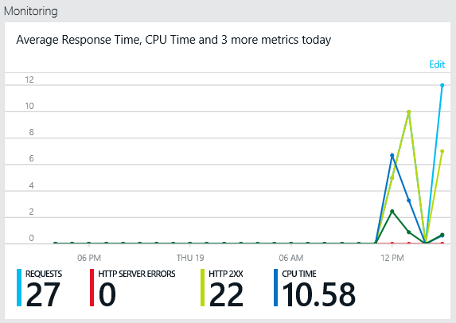
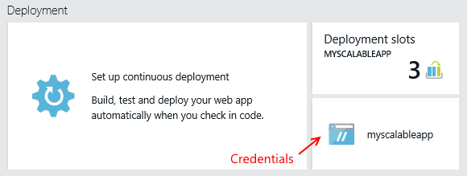

<properties 
	pageTitle="Azure ポータルによる Web アプリの管理" 
	description="Azure ポータルを使用して Microsoft Azure で Web アプリの管理タスクを行う方法を概説します。" 
	services="app-service\web" 
	documentationCenter="" 
	authors="MikeWasson" 
	writer="mwasson" 
	manager="wpickett" 
	editor=""/>

<tags 
	ms.service="app-service-web" 
	ms.workload="web" 
	ms.tgt_pltfrm="na" 
	ms.devlang="na" 
	ms.topic="article" 
	ms.date="03/24/2015" 
	ms.author="mwasson"/>

# Azure ポータルによる Web アプリの管理

[Azure ポータル](https://portal.azure.com)では、一連の *blades*を使用して Web アプリを管理します。ブレードはさまざまなコンポーネントのコンテナーです。(Azure ポータルの概要については、[ポータル](http://go.microsoft.com/fwlink/?LinkId=529715)変更ガイドを参照してください。) 

Web アプリのブレードを表示するには、**[ホーム]** をクリックしてからアプリ名をクリックします。または、**[参照]** をクリックしてすべての Azure リソースを表示します。

ブレードの上部には、以下のようなよく行う操作のためのコントロールがあります。

- **[設定]** はすべての管理設定の一覧を表示します。

- **[参照]** は Web アプリをブラウザー ウィンドウで開きます。

- その他のボタン (アプリの開始または停止、展開スロットの切り替え、アプリの削除など)

**[Essentials]** はアプリの基本的な情報 (URL、場所、[App Service](http://go.microsoft.com/fwlink/?LinkId=529714) プラン、現在の状態 (実行中や停止など) など) を表示します。

**[Essentials]** の下には、アプリの監視、管理、デプロイに使用できるさまざまなパーツが用意されています。ブレードのレイアウトをカスタマイズするには、右クリックして **[カスタマイズ]** または **[Add Parts]** を選択します。このトピックの残りの部分では、既定のレイアウトのパーツについて説明します。

## 監視

**[監視]** には、Web アプリの各種メトリックを示すグラフが表示されます。グラフを設定するには、**[編集]** をクリックします。表示する時間の範囲とメトリックの種類を選択できます。使用可能なメトリックには、要求数、平均応答時間、サーバー エラー、CPU 時間などがあります。   

アラート ルールを追加するには、グラフをクリックし、**[アラートの追加]** をクリックします。アラート ルールを追加することにより、特定のメトリックがしきい値に達したときに通知を受け取ることができます。たとえば、サーバー エラーの個数が 5 分間にわたって一定の数を超えた場合にアラートを生成することができます。 

**[監視]** には、分析の構成、アプリケーション監視の設定、可用性テストの作成を行うパーツも含まれています。詳細については、「[Monitoring basics for Web Apps in Azure App Service (Azure App Service の Web アプリを監視するための基本)](web-sites-monitor.md)」を参照してください。

## 使用状況

- **[ファイル システム ストレージ]** には、アプリが使用しているファイル ストレージの量が表示されます。
- **[クォータ]** には、アプリがリソース使用量クォータをどの程度使用しているかが表示されます。このパーツをクリックすると詳細を表示できます。
- **[規模の設定]** では、インスタンス数を増減したり、自動スケーリングを設定したりすることができます。「[Scale a Web App in Azure App Service (Azure App Service における Web アプリのスケーリング)](how-to-scale-websites.md)」を参照してください。  
- **[予測費用]** は、アプリに予測されるコストを表示します。
- **[料金レベル]** では、料金のレベルを変更できます。

## Operations

- **[イベント]**: クリックするとイベント ログが表示されます。  
- **[アラート ルール]**: クリックするとアラート ルールが表示されます。新しいアラートを追加することもできます。
- **ストリーミング ログ** (A): クリックするとアプリケーション ログが表示されます。ログ記録を有効にするには、**[設定]** に移動し、**[Diagnostics logs]** ブレードを開きます。 
- **[コンソール]**: クリックすると、ポータル内で実行されるコマンド ラインが開かれます。これを使用して、 `mkdir` および  `dir` などのコマンドを実行できます。  
- **プロセス エクスプローラー** (B): クリックすると、アプリで実行されているプロセスが、ワーキング セットやスレッド数などと共に表示されます。

## デプロイ
 

- 継続的なデプロイを設定します。「[Using Git to deploy Web Apps in Azure App Service (Git を使用して Web アプリを Azure App Service にデプロイする)](web-sites-publish-source-control.md)」を参照してください。
- 展開スロット: 「[Deploy to Staging Environments for Web Apps in Azure App Service (Azure App Service の Web アプリのステージング環境へのデプロイ)](web-sites-staged-publishing.md)」を参照してください。
- Git または FTP 用のデプロイ資格情報を設定します。 

## ネットワーク

- アプリを仮想ネットワークに接続します。
- ハイブリッド接続を追加します。

>[AZURE.NOTE] Azure アカウントにサインアップする前に Azure App Service を実際に使ってみるには、「[App Service を試す](http://go.microsoft.com/fwlink/?LinkId=523751)」にアクセスしてください。App Service で、有効期限付きのスターター Web アプリをすぐに作成できます。このサービスの利用にあたり、クレジット カードは必要ありません。契約も必要ありません。

## 次のステップ

- [Azure App Service の Web アプリをスケーリングする](how-to-scale-websites.md)
- [Web ジョブでバックグラウンド タスクを実行する](web-sites-create-web-jobs.md)
- [Azure Web Apps のバックアップ](web-sites-backup.md)と[復元](web-sites-restore.md)
- [Azure App Service の Web アプリを監視するための基本](web-sites-monitor.md)

## 変更点
* Websites から App Service への変更に関するガイドについては、以下を参照してください。[Azure App Service and Its Impact on Existing Azure Services (Azure App Service についてと既存の Azure サービスへの影響)](http://go.microsoft.com/fwlink/?LinkId=529714)
* 旧ポータルから新ポータルへの変更に関するガイドについては、以下を参照してください。[Reference for navigating the preview portal (プレビュー ポータルを操作するためのリファレンス)](http://go.microsoft.com/fwlink/?LinkId=529715)

<!--HONumber=49-->