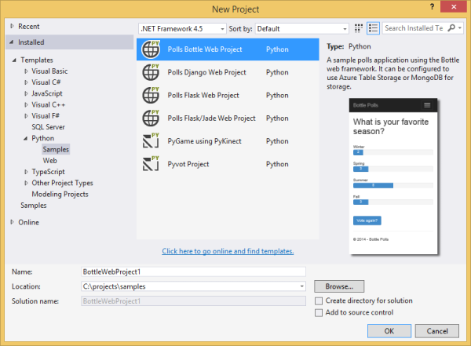
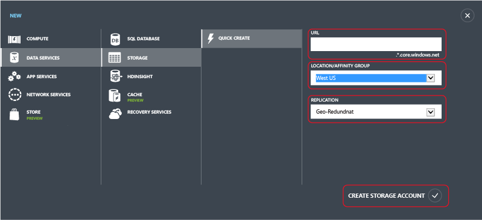

<properties 
	pageTitle="Azure における Bottle と Azure テーブル ストレージ (Python Tools 2.1 for Visual Studio の使用方法)" 
	description="Python Tools for Visual Studio を使って、Azure テーブル ストレージにデータを保存する Bottle アプリケーションを作成し、それを Web サイトにデプロイする方法を学習します。" 
	services="app-service\web" 
	tags="python"
	documentationCenter="python" 
	authors="huguesv" 
	manager="wpickett" 
	editor=""/>

<tags 
	ms.service="app-service-web" 
	ms.workload="web" 
	ms.tgt_pltfrm="na" 
	ms.devlang="python" 
	ms.topic="article" 
	ms.date="02/09/2015" 
	ms.author="huguesv"/>

# Azure における Bottle と Azure テーブル ストレージ (Python Tools 2.1 for Visual Studio の使用方法) 

このチュートリアルでは、[Python Tools for Visual Studio][] のサンプル テンプレートを使用して単純な投票アプリケーションを作成します。このチュートリアルは、[ビデオ](https://www.youtube.com/watch?v=GJXDGaEPy94)でもご覧いただけます。

リポジトリの種類 (メモリ内、Azure テーブル ストレージ、MongoDB) を簡単に切り替えることができるよう、この投票アプリケーションのリポジトリは抽象化されています。

ここでは、Azure ストレージ アカウントを作成する方法、Azure テーブル ストレージを使用するためのアプリケーションの構成方法、アプリケーションを Azure Websites に発行する方法について説明します。

MongoDB、Azure テーブル ストレージ、MySQL、SQL Database の各サービスに、Bottle、Flask、Django の各 Web フレームワークを組み合わせて行う PTVS での Azure Websites 開発について取り上げたその他の記事については、[Python デベロッパー センター][]をご覧ください。この記事では Azure Websites を重点的に説明していますが、[Azure クラウド サービス][] の開発も同様の手順で行います。

## 前提条件

 - Visual Studio 2012 または 2013
 - [Python Tools 2.1 for Visual Studio][]
 - [Python Tools 2.1 for Visual Studio サンプル VSIX][]
 - [Azure SDK Tools for VS 2013][] または [Azure SDK Tools for VS 2012][]
 - [Python 2.7 32-bit][] または [Python 3.4 32-bit][]

[AZURE.INCLUDE [create-account-and-websites-note](../includes/create-account-and-websites-note.md)]

## プロジェクトを作成する

このセクションでは、サンプル テンプレートを使用して Visual Studio プロジェクトを作成します。まず仮想環境を作成し、必要なパッケージをインストールします。次に、既定のメモリ内リポジトリを使用してアプリケーションをローカルで実行します。

1.  Visual Studio で、**[ファイル]**、**[新しいプロジェクト]** の順にクリックします。

1.  PTVS サンプル VSIX のプロジェクト テンプレートは、**[Python]** の **[サンプル]** にあります。**[Polls Bottle Web Project]** を選択し、[OK] をクリックします。

  	

1.  外部のパッケージをインストールするよう求めるメッセージが表示されます。**[Install into a virtual environment]** を選択します。

  	

1.  **[Python 2.7]** または **[Python 3.4]** をベース インタープリターとして選択します。

  	

1.  <kbd>F5</kbd> キーを押してアプリケーションの動作を確認します既定では、構成作業の一切不要なメモリ内リポジトリが使用されます。Web サーバーが停止すると、すべてのデータが失われます。

1.  **[Create Sample Polls]** をクリックし、投票内容をクリックして投票します。

  	

## Azure のストレージ アカウントの作成

ストレージ操作を行うには、Azure のストレージ アカウントが必要です。ストレージ アカウントを作成するには、次のステップを実行します

1.  [Azure 管理ポータル][]にログインします。

1.  ナビゲーション ウィンドウの下部にある **[+新規]** をクリックします。

  	

1.  **[データ サービス]**、**[ストレージ]**、**[簡易作成]** の順にクリックします。

  	

1.  [URL] で、ストレージ アカウントの URI で使用するサブドメイン名を入力します。文字数は 3 ～ 24 文字で、アルファベット小文字と数字を使用できます。この名前は、対応するサブスクリプションの BLOB リソース、キュー リソース、またはテーブル リソースのアドレス指定に使用される URL のホスト名になります。

1.  ストレージの配置先となるリージョンまたはアフィニティ グループを選択します。Azure アプリケーションからストレージを使用する場合は、アプリケーションを展開するリージョンと同じリージョンを選択します。

1.  必要に応じて、Geo レプリケーションを有効にできます。Geo レプリケーションを有効にすると、常時 2 つの拠点にデータが維持されます。どちらの場所も、正常な状態に保たれた複数のレプリカ データが、Azure Storage によって絶えず管理されます。

1.  **[ストレージ アカウントの作成]** をクリックします。

## プロジェクトを構成する

このセクションでは、先ほど作成したストレージ アカウントを使用するための構成をアプリケーションに対して行います。まず、Azure ポータルから接続設定を取得する方法を見ていきます。その後、アプリケーションをローカルで実行します。

1.  [Azure 管理ポータル][]で、前のセクションで作成したストレージ アカウントをクリックします。

1.  **[アクセス キーの管理]** をクリックします。

  	

1.  Visual Studio のソリューション エクスプローラーでプロジェクト ノードを右クリックし、**[プロパティ]** をクリックします。**[デバッグ]** タブをクリックします。

  	

1.  **[Debug Server Command]** の **[Environment]** で、アプリケーションに必要な環境変数の値を設定します。

        REPOSITORY_NAME=azuretablestorage
        STORAGE_NAME=<storage account name>
        STORAGE_KEY=<primary access key>

    これで、**デバッグを開始**したときに環境変数が設定されます。**デバッグを開始**したときに変数を設定する必要がある場合は、同じ値を **[Run Server Command]** にも設定してください。

    Windows コントロール パネルを使用して環境変数を定義してもかまいません。ソース コードやプロジェクト ファイルに資格情報を保存するのを避ける必要がある場合は、こちらの方法をお勧めします。新しい環境変数の値をアプリケーションから利用するためには、Visual Studio を再起動する必要があります。

1.  Azure テーブル ストレージ リポジトリを実装するコードは、**models/azuretablestorage.py** にあります。Table サービスを Python から使用する方法の詳細については、[こちらのドキュメント] をご覧ください。

1.  <kbd>F5</kbd> キーでアプリケーションを実行します。**[Create Sample Polls]** で作成された投票内容と投票によって送信されたデータが Azure テーブル ストレージにシリアル化されます。

1.  アプリケーションの **[About]** ページに移動して、**Azure テーブル ストレージ** リポジトリが使用されていることを確認します。

  	

## Azure テーブル ストレージを照会する

ストレージ テーブルは、Visual Studio のサーバー エクスプローラーを使用して簡単に表示したり編集したりすることができます。このセクションでは、投票アプリケーションに使用されているテーブルの内容をサーバー エクスプローラーを使用して表示します。

> [AZURE.NOTE] この作業を行うには、Microsoft Azure Tools がインストールされている必要があります。Microsoft Azure Tools は、[Azure SDK for .NET][] に付属します

1.  **[サーバー エクスプローラー]** を開きます。**[Azure]**、**[ストレージ]**、使用ストレージ アカウント、**[テーブル]** の順に展開します。

  	

1.  **polls** テーブルまたは **choices** テーブルをダブルクリックすると、その内容が、エンティティの追加/削除/編集ボタンと共にドキュメント ウィンドウに表示されます。

  	

## Azure Websites に発行する

作成した Web アプリケーションは、PTVS を使用して簡単に Azure Websites にデプロイすることができます。

1.  **[ソリューション エクスプローラー]** で、プロジェクト ノードを右クリックして **[発行]** をクリックします。

  	

1.  **[Microsoft Azure Websites]** をクリックします。

1.  **[新規]** をクリックして新しいサイトを作成します。

1.  **[サイト名]** と **[リージョン]** を選択し、**[作成]** をクリックします。

  	

1.  それ以外はすべて既定値のままにし、**[発行]** をクリックします。

1.  Web ブラウザーが自動的に開いて、発行したサイトが表示されます。[About] ページに移動すると、**Azure テーブル ストレージ**リポジトリではなく**メモリ内**リポジトリが使用されていることを確認できます。

    Azure Web サイト上で環境変数が設定されておらず、**settings.py** で指定された既定値が使用されているためです。

## Azure Websites を構成する

このセクションでは、サイトに使用する環境変数を構成します。

1.  [Azure 管理ポータル][]で、前のセクションで作成したサイトをクリックします。

1.  最上部のメニューの **[構成]** をクリックします。

  	

1.  下へスクロールして **[アプリケーション設定]** セクションに移動し、前のセクションの説明に従って **REPOSITORY\_NAME**、**STORAGE\_NAME**、**STORAGE\_KEY** の値を設定します。

  	

1. 最下部のメニューの **[保存]**、**[再起動]** を順にクリックし、最後に **[参照]** をクリックします。

  	

1.  これでアプリケーションは、**Azure テーブル ストレージ** リポジトリを使用して正しく動作します。

    ご利用ありがとうございます。

  	

## 次のステップ

Python Tools for Visual Studio、Bottle、Azure テーブル ストレージの詳細については、以下のリンクをクリックしてください。

- [Python Tools for Visual Studio のドキュメント][]
  - [Web プロジェクト][]
  - [クラウド サービス プロジェクト][]
  - [Microsoft Azure でのリモート デバッグ][]
- [Bottle のドキュメント][]
- [Azure ストレージ][]
- [Azure SDK for Python][]
- [Python からテーブル ストレージ サービスを使用する方法][]

<!--Link references-->
[Python デベロッパー センター]: /develop/python/
[Azure クラウド サービス]: cloud-services-python-ptvs.md
[ドキュメント]: storage-python-how-to-use-table-storage.md
[Python からテーブル ストレージ サービスを使用する方法]: storage-python-how-to-use-table-storage.md

<!--External Link references-->
[Azure 管理ポータル]: https://manage.windowsazure.com
[Azure SDK for .NET]: http://azure.microsoft.com/downloads/
[Python Tools for Visual Studio]: http://aka.ms/ptvs
[Python Tools 2.1 for Visual Studio]: http://go.microsoft.com/fwlink/?LinkId=517189
[Python Tools 2.1 for Visual Studio サンプル VSIX]: http://go.microsoft.com/fwlink/?LinkId=517189
[Azure SDK Tools for VS 2013]: http://go.microsoft.com/fwlink/?LinkId=323510
[Azure SDK Tools for VS 2012]: http://go.microsoft.com/fwlink/?LinkId=323511
[Python 2.7 32-bit]: http://go.microsoft.com/fwlink/?LinkId=517190 
[Python 3.4 32-bit]: http://go.microsoft.com/fwlink/?LinkId=517191
[Python Tools for Visual Studio のドキュメント]: http://pytools.codeplex.com/documentation
[Bottle のドキュメント]: http://bottlepy.org/docs/dev/index.html
[Microsoft Azure でのリモート デバッグ]: http://pytools.codeplex.com/wikipage?title=Features%20Azure%20Remote%20Debugging
[Web プロジェクト]: http://pytools.codeplex.com/wikipage?title=Features%20Web%20Project
[クラウド サービス プロジェクト]: http://pytools.codeplex.com/wikipage?title=Features%20Cloud%20Project
[Azure ストレージ]: http://azure.microsoft.com/documentation/services/storage/
[Azure SDK for Python]: https://github.com/Azure/azure-sdk-for-python

<!--HONumber=52-->