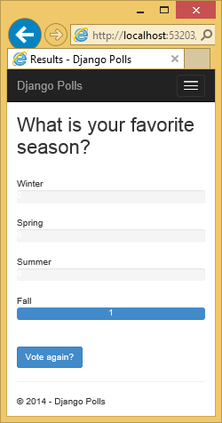

<properties linkid="web-sites-python-ptvs-django-sql" title="Django and SQL Database on Azure with Python Tools 2.1 for Visual Studio" pageTitle="Python Tools 2.1 for Visual Studio を使用した Azure 上の Django と SQL データベース" description="Learn how to use the Python Tools for Visual Studio to create a Django application that stores data in a SQL database instance and can be deployed to a web site." metaKeywords="" services="" solutions="" documentationCenter="Python" authors="huvalo" videoId="" scriptId="" manager="wpickett" editor="" />

<tags ms.service="web-sites" ms.workload="web" ms.tgt_pltfrm="na" ms.devlang="python" ms.topic="article" ms.date="10/10/2014" ms.author="huvalo" />

# Python Tools 2.1 for Visual Studio を使用した Azure 上の Django と SQL データベース 

このチュートリアルでは、PTVS サンプル テンプレートのいずれかを使用して、簡単な投票アプリケーションを作成します。

ここでは、Azure 上でホストされる SQL データベースを使用する方法、アプリケーションが SQL データベースを使用するよう構成する方法、および Azure Web サイトにアプリケーションを発行する方法を学習します。

Bottle、Flask および Django Web フレームワークと MongoDB、Azure テーブル ストレージ、MySQL および SQL Database サービスを使用した、PTVS による Azure Web サイトの開発について説明するその他の記事については、[Python デベロッパー センター][]を参照してください。この記事では Azure Web サイトに焦点を当てますが、手順は [Azure クラウド サービス][]を開発する場合と似ています。

+ [前提条件](#prerequisites)
+ [プロジェクトを作成する](#create-the-project)
+ [SQL データベースの作成](#create-a-sql-database)
+ [プロジェクトを構成する](#configure-the-project)
+ [Azure Web サイトへ発行する](#publish-to-an-azure-website)
+ [次のステップ](#next-steps)

##前提条件

 - Visual Studio 2012 または 2013
 - [Python Tools 2.1 for Visual Studio][]
 - [Python Tools 2.1 for Visual Studio サンプル VSIX][]
 - [Azure SDK Tools for VS 2013][] または [Azure SDK Tools for VS 2012][]
 - [Python 2.7 (32 ビット)][]

[WACOM.INCLUDE [create-account-and-websites-note](../includes/create-account-and-websites-note.md)]

##プロジェクトを作成する

このセクションでは、サンプル テンプレートを使用して、Visual Studio プロジェクトを作成します。仮想環境を作成し、必要なパッケージをインストールします。sqlite を使用して、ローカル データベースを作成します。その後、アプリケーションをローカルで実行します。

1.  Visual Studio で、**[ファイル]**、**[新しいプロジェクト]** を順に選択します。

1.  PTVS サンプル VSIX のテンプレートは、**[Python]**、**[サンプル]** の下にあります。**[投票 Django Web プロジェクト]** を選択し、[OK] をクリックしてプロジェクトを作成します。

  	

1.  外部のパッケージをインストールするように促されます。**[仮想環境にインストールする]** を選択します。

  	

1.  **基になるインタープリターとして **Python 2.7 を選択します。

  	

1.  プロジェクト ノードを右クリックして、**[Python]****[Django Sync DB]** の順に選択します。

  	

1.  これにより、Django 管理コンソールが開きます。表示される手順に従って、ユーザーを作成します。

    これにより、プロジェクト フォルダーに sqlite データベースが作成されます。

  	

1.  <kbd>F5</kbd> キーを押して、アプリケーションが動作することを確認します。

1.  上部にあるナビゲーション バーで、**[ログイン]** をクリックします。

  	

1.  データベースを同期したときに作成したユーザーの資格情報を入力します。

  	

1.  **[サンプル投票の作成]** をクリックします。

  	

1.  投票をクリックして投票します。

  	

##SQL データベースの作成

データベースには、Azure SQL データベースを作成します。

データベースを作成するには、次のステップを実行します

1.  [Azure の管理ポータル][]にログインします。

1.  ナビゲーション ウィンドウの下部にある **[新規]** をクリックします。

  	

1.  **[データ サービス]**、**[SQL データベース]**、**[簡易作成]** の順にクリックします。

  	

1.  新しい SQL データベース サーバーを作成することを選択します。

1.  データベースの配置先となる [リージョン] または [アフィニティ グループ] を選択します。Azure アプリケーションからデータベースを使用する場合は、アプリケーションをデプロイするリージョンと同じリージョンを選択します。

##プロジェクトを構成する

このセクションでは、先ほど作成した SQL データベースを使用するようアプリケーションを構成します。Azure ポータルから接続の設定を取得する方法を見ていきます。Django と SQL データベースを使用するために必要な追加の Python パッケージもインストールします。その後、アプリケーションをローカルで実行します。

1.  [Azure の管理ポータル][]で、**[SQL データベース]** をクリックし、前に作成したデータベースをクリックします。

1.  **[管理]** をクリックします。

  	

1.  ファイアウォール ルールを更新するように求められます。**[はい]** をクリックします。これにより、開発用コンピューターからデータベース サーバーへの接続が許可されます。

  	

1.  **[SQL データベース] **をクリックし、**[サーバー]** をクリックします。データベース用のサーバーをクリックし、**[構成]** をクリックします。

1.  このページでは、データベース サーバーへの接続を許可されているすべてのコンピューターの IP アドレスが表示されます。自分のコンピューターの IP アドレスが表示されます。

    次のように、**[使用できるサービス]** の下で、Azure サービスにサーバーへのアクセスが許可されていることを確認します。Azure Web サイトでアプリケーションが実行中のとき (この点については、このチュートリアルの次のセクションで説明します)、Azure サービスにデータベースへの接続が許可されます。変更を適用するには、**[保存]** をクリックします。

  	

1.  Visual Studio で、*ProjectName* フォルダーから **settings.py** を開きます。`DATABASES` の定義を編集します。

        DATABASES = {
            'default': {
                'ENGINE': 'sql_server.pyodbc',
                'NAME': '<DatabaseName>',
                'USER': '<User>@<ServerName>',
                'PASSWORD': '<Password>',
                'HOST': '<ServerName>.database.windows.net',
                'PORT': '<ServerPort>',
                'OPTIONS': {
                    'driver': 'SQL Server Native Client 11.0',
                    'MARS_Connection': 'True',
                }
            }
        }

    `<DatabaseName>`、`<User>` および `<Password>` は、データベースおよびサーバーを作成したときに指定した値です。

    `<ServerName>` および `<ServerPort>` は、サーバーが作成されるときに Azure によって生成され、**[データベースに接続する]** セクションに表示されます。

1.  ソリューション エクスプローラーで、**[Python 環境]** の下にある仮想環境を右クリックし、**[Python パッケージのインストール]** を選択します。

1.  **easy_install** を使用して、パッケージ `pyodbc` をインストールします。

  	

1.  **pip** を使用して、パッケージ `django-pyodbc-azure` をインストールします。

  	

1.  プロジェクト ノードを右クリックして、**[Python]**、**[Django Sync DB]** の順に選択します。  

    これにより、前のセクションで作成した SQL のデータベースのテーブルが作成されます。表示される手順に従って、ユーザーを作成します。このユーザーは、最初のセクションで作成した sqlite データベース内のユーザーと一致する必要はありません。

  	

1.  <kbd>F5</kbd> キーを使用してアプリケーションを実行します。**[サンプル投票の作成]** で作成された投票と、投票によって送信されたデータは、SQL データベースでシリアル化されます。

##Azure Web サイトへ発行する

PTVS は、Azure の Web サイトに Web アプリケーションをデプロイする簡単な方法を提供します。

1.  **ソリューション エクスプローラー**で、プロジェクト ノードを右クリックして **[発行]** を選択します。

  	

1.  **Microsoft Azure Websites** をクリックします。

1.  **[新規]** をクリックして新しいサイトを作成します。

1.  **[サイト名]** と **[リージョン]** を選択し、**[作成]** をクリックします。

  	

1.  その他のすべての既定値をそのまま使用し、**[発行]** をクリックします。

1.  Web ブラウザーが、発行されたサイトを自動的に開きます。想定どおりにアプリケーションが Azure でホストされている **SQL** データベースを使用して動作していることが確認できます。

    ご利用ありがとうございます。

  	

##次のステップ

Python Tools for Visual Studio、Django および SQL データベースの詳細については、以下のリンクを参照してください。

- [Python Tools for Visual Studio のドキュメント][]
  - [Web プロジェクト][]
  - [クラウド サービス プロジェクト][]
  - [Microsoft Azure でのリモート デバッグ][]
- [Django のドキュメント][]
- [SQL Database][]

<!--Link references-->
[Python デベロッパー センター]: /ja-jp/develop/python/
[Azure Cloud Services (Azure Cloud Services)]: ../cloud-services-python-ptvs/

<!--External Link references-->
[Azure 管理ポータル]: https://manage.windowsazure.com
[Python Tools 2.1 for Visual Studio]: http://go.microsoft.com/fwlink/?LinkId=517189
[Python Tools 2.1 for Visual Studio サンプル VSIX]: http://go.microsoft.com/fwlink/?LinkId=517189
[Azure SDK Tools for VS 2013]: http://go.microsoft.com/fwlink/?LinkId=323510
[Azure SDK Tools for VS 2012]: http://go.microsoft.com/fwlink/?LinkId=323511
[Python 2.7 (32 ビット)]: http://go.microsoft.com/fwlink/?LinkId=517190 
[Python Tools for Visual Studio のドキュメント]: http://pytools.codeplex.com/documentation
[Microsoft Azure でのリモート デバッグ]: http://pytools.codeplex.com/wikipage?title=Features%20Azure%20Remote%20Debugging
[Web プロジェクト]: http://pytools.codeplex.com/wikipage?title=Features%20Web%20Project
[クラウド サービス プロジェクト]: http://pytools.codeplex.com/wikipage?title=Features%20Cloud%20Project
[Django のドキュメント]: https://www.djangoproject.com/
[SQL Database]: /ja-jp/documentation/services/sql-database/
