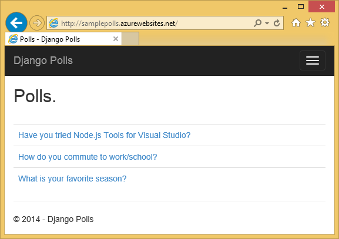

<properties 
	pageTitle="Azure における Django と SQL データベース (Python Tools 2.1 for Visual Studio の使用方法)" 
	description="Python Tools for Visual Studio を使って、SQL データベース インスタンスにデータを保存する Django アプリケーションを作成し、それを Web サイトにデプロイする方法を学習します。" 
	services="app-service\web" 
	tags="python"
	documentationCenter="python" 
	authors="huguesv" 
	manager="wpickett" 
	editor=""/>

<tags 
	ms.service="app-service-web" 
	ms.workload="web" 
	ms.tgt_pltfrm="na" 
	ms.devlang="python" 
	ms.topic="article" 
	ms.date="02/09/2015" 
	ms.author="huguesv"/>

# Azure における Django と SQL データベース (Python Tools 2.1 for Visual Studio の使用方法) 

このチュートリアルでは、[Python Tools for Visual Studio][] のサンプル テンプレートを使用して単純な投票アプリケーションを作成します。このチュートリアルは、[ビデオ](https://www.youtube.com/watch?v=ZwcoGcIeHF4)でもご覧いただけます。

ここでは、Azure でホストされた SQL Database を使用する方法、SQL Database を使用するためのアプリケーションの構成方法、アプリケーションを Azure Websites に発行する方法について説明します。

MongoDB、Azure テーブル ストレージ、MySQL、SQL Database の各サービスに、Bottle、Flask、Django の各 Web フレームワークを組み合わせて行う PTVS での Azure Websites 開発について取り上げたその他の記事については、[Python デベロッパー センター][]をご覧ください。この記事では Azure Websites を重点的に説明していますが、[Azure Cloud Services][] の開発も同様の手順で行います。

## 前提条件

 - Visual Studio 2012 または 2013
 - [Python Tools 2.1 for Visual Studio][]
 - [Python Tools 2.1 for Visual Studio サンプル VSIX][]
 - [Azure SDK Tools for VS 2013][] または [Azure SDK Tools for VS 2012][]
 - [Python 2.7 (32 ビット)][]

[AZURE.INCLUDE [create-account-and-websites-note](../includes/create-account-and-websites-note.md)]

## プロジェクトを作成する

このセクションでは、サンプル テンプレートを使用して Visual Studio プロジェクトを作成します。まず仮想環境を作成し、必要なパッケージをインストールします。sqlite を使用してローカル データベースを作成します。その後、アプリケーションをローカルで実行します。

1.  Visual Studio で、**[ファイル]**、**[新しいプロジェクト]** の順にクリックします。

1.  PTVS サンプル VSIX のプロジェクト テンプレートは、**[Python]** の **[サンプル]** にあります。**[Polls Django Web Project]** を選択し、[OK] をクリックしてプロジェクトを作成します。

  	

1.  外部のパッケージをインストールするよう求めるメッセージが表示されます。**[Install into a virtual environment]** を選択します。

  	

1.  **[Python 2.7]** をベース インタープリターとして選択します。

  	

1.  プロジェクト ノードを右クリックし、**[Python]**、**[Django Sync DB]** の順に選択します。

  	

1.  Django 管理コンソールが表示されます。プロンプトに従ってユーザーを作成します。

    これで、プロジェクト フォルダーに sqlite データベースが作成されます。

  	

1.  <kbd>F5</kbd> キーを押してアプリケーションの動作を確認します

1.  一番上のナビゲーション バーの  **[Log in]** をクリックします。

  	

1.  データベースを同期したときに作成したユーザーの資格情報を入力します。

  	

1.  **[Create Sample Polls]** をクリックします。

  	

1.  投票内容をクリックして投票します。

  	

## SQL データベースの作成

データベースに関しては、Azure SQL Database を作成します。

データベースを作成するには、次のステップを実行します。

1.  [Azure 管理ポータル][]にログインします。

1.  ナビゲーション ウィンドウの下部にある **[+新規]** をクリックします。

  	

1.  **[データ サービス]**、**[SQL Database]**、**[簡易作成]** の順にクリックします。

  	

1.  新しい SQL データベース サーバーの作成を選択します。

1.  データベースの配置先となるリージョンまたはアフィニティ グループを選択します。Azure アプリケーションからデータベースを使用する場合は、アプリケーションのデプロイ先と同じリージョンを選択します。

## プロジェクトを構成する

このセクションでは、先ほど作成した SQL Database を使用するための構成をアプリケーションに 
対して行います。まず、Azure ポータルから接続設定を取得する方法を 
見ていきます。また、Django で SQL Database を使用するために必要な Python パッケージも 
別途インストールします。その後、アプリケーションをローカルで実行します。

1.  [Azure 管理ポータル][]で、**[SQL データベース]** をクリックし、先ほど作成したデータベースをクリックします。

1.  **[管理]** をクリックします。

  	

1.  ファイアウォール ルールの更新を求めるメッセージが表示されます。**[はい]** をクリックします。これで、開発用のコンピューターからデータベース サーバーに接続できるようになります。

  	

1.  **[SQL データベース]** をクリックし、**[サーバー]** をクリックします。データベースに使用するサーバーをクリックし、**[構成]** をクリックします。

1.  このページには、データベース サーバーへの接続が許可されているすべてのコンピューターの IP アドレスが表示されます。ここに、自分のコンピューターの IP アドレスが表示されている必要があります。

    サーバーへのアクセスが Azure サービスに許可されていることを、以下の **[使用できるサービス]** でご確認ください。Azure Web サイトでアプリケーションを実行するときに (このチュートリアルの次のセクションで行います)、データベースへの接続がアプリケーションに許可されます。**[保存]** をクリックして変更を適用します。

  	

1.  Visual Studio で、 *ProjectName* フォルダーの **settings.py** を開きます。 `DATABASES` の定義を編集します。

        DATABASES = {
            'default': {
                'ENGINE': 'sql_server.pyodbc',
                'NAME': '<DatabaseName>',
                'USER': '<User>@<ServerName>',
                'PASSWORD': '<Password>',
                'HOST': '<ServerName>.database.windows.net',
                'PORT': '<ServerPort>',
                'OPTIONS': {
                    'driver': 'SQL Server Native Client 11.0',
                    'MARS_Connection': 'True',
                }
            }
        }

    `<DatabaseName>`、`<User>`、`<Password>` は、データベースとサーバーを作成したときに指定した値です。

    `<ServerName>` と `<ServerPort>` の値は、サーバーの作成時に Azure によって生成されるもので、**[データベースに接続する]** セクションで確認できます。

1.  ソリューション エクスプローラーの **[Python Environments]** で、対象の仮想環境を右クリックし、**[Install Python Package]** をクリックします。

1.  **easy_install** を使用して  `pyodbc` パッケージをインストールします。

  	

1.  **pip** を使用して  `django-pyodbc-azure` パッケージをインストールします。

  	

1.  プロジェクト ノードを右クリックし、**[Python]**、**[Django Sync DB]** の順に選択します。  

    前のセクションで作成した SQL Database のテーブルが作成されます。プロンプトに従ってユーザーを作成してください。最初のセクションで作成した sqlite データベースのユーザーと一致させる必要はありません。

  	

1.  <kbd>F5</kbd> キーでアプリケーションを実行します。**[Create Sample Polls]** で作成された投票内容と投票によって送信されたデータが SQL Database にシリアル化されます。

## Azure Websites に発行する

作成した Web アプリケーションは、PTVS を使用して簡単に Azure Websites にデプロイすることができます。

1.  **[ソリューション エクスプローラー]** で、プロジェクト ノードを右クリックして **[発行]** をクリックします。

  	

1.  **[Microsoft Azure Websites]** をクリックします。

1.  **[新規]** をクリックして新しいサイトを作成します。

1.  **[サイト名]** と **[リージョン]** を選択し、**[作成]** をクリックします。

  	

1.  それ以外はすべて既定値のままにし、**[発行]** をクリックします。

1.  Web ブラウザーが自動的に開いて、発行したサイトが表示されます。これでアプリケーションは、Azure 上にホストされた **SQL** Database を使用して正しく動作します。

    ご利用ありがとうございます。

  	

## 次のステップ

Python Tools for Visual Studio、Django、SQL Database の詳細については、以下のリンクをクリックしてください。

- [Python Tools for Visual Studio のドキュメント][]
  - [Web プロジェクト][]
  - [クラウド サービス プロジェクト][]
  - [Microsoft Azure でのリモート デバッグ][]
- [Django のドキュメント][]
- [SQL データベース][]

<!--Link references-->
[Python デベロッパー センター]: /develop/python/
[Azure Cloud Services]: cloud-services-python-ptvs.md

<!--External Link references-->
[Azure 管理ポータル]: https://manage.windowsazure.com
[Python Tools for Visual Studio]: http://aka.ms/ptvs
[Python Tools 2.1 for Visual Studio]: http://go.microsoft.com/fwlink/?LinkId=517189
[Python Tools 2.1 for Visual Studio サンプル VSIX]: http://go.microsoft.com/fwlink/?LinkId=517189
[Azure SDK Tools for VS 2013]: http://go.microsoft.com/fwlink/?LinkId=323510
[Azure SDK Tools for VS 2012]: http://go.microsoft.com/fwlink/?LinkId=323511
[Python 2.7 (32 ビット)]: http://go.microsoft.com/fwlink/?LinkId=517190 
[Python Tools for Visual Studio のドキュメント]: http://pytools.codeplex.com/documentation
[Microsoft Azure でのリモート デバッグ]: http://pytools.codeplex.com/wikipage?title=Features%20Azure%20Remote%20Debugging
[Web プロジェクト]: http://pytools.codeplex.com/wikipage?title=Features%20Web%20Project
[クラウド サービス プロジェクト]: http://pytools.codeplex.com/wikipage?title=Features%20Cloud%20Project
[Django のドキュメント]: https://www.djangoproject.com/
[SQL データベース]: /documentation/services/sql-database/

<!--HONumber=52-->