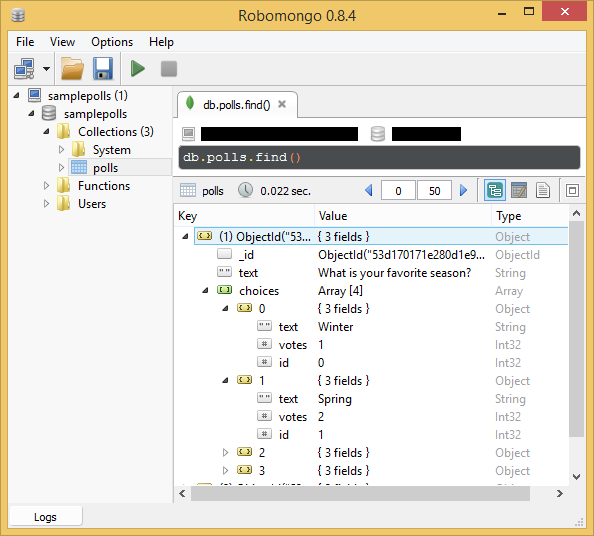

<properties 
	pageTitle="Azure における Flask と MongoDB (Python Tools 2.1 for Visual Studio の使用方法)" 
	description="Python Tools for Visual Studio を使って、MongoDB データベース インスタンスにデータを保存する Flask アプリケーションを作成し、それを Web サイトにデプロイする方法を学習します。" 
	services="app-service\web" 
	tags="python"
	documentationCenter="python" 
	authors="huguesv" 
	manager="wpickett" 
	editor=""/>

<tags 
	ms.service="app-service-web" 
	ms.workload="web" 
	ms.tgt_pltfrm="na" 
	ms.devlang="python" 
	ms.topic="article" 
	ms.date="02/09/2015" 
	ms.author="huguesv"/>

# Azure における Flask と MongoDB (Python Tools 2.1 for Visual Studio の使用方法)

このチュートリアルでは、[Python Tools for Visual Studio][] のサンプル テンプレートを使用して単純な投票アプリケーションを作成します。このチュートリアルは、[ビデオ](https://www.youtube.com/watch?v=eql-crFgrAE)でもご覧いただけます。

リポジトリの種類 (メモリ内、Azure テーブル ストレージ、MongoDB) を簡単に切り替えることができるよう、この投票アプリケーションのリポジトリは抽象化されています。

ここでは、Azure 上のいずれかのホステッド MongoDB サービスを使用する方法、MongoDB を使用するためのアプリケーションの構成方法、アプリケーションを Azure Websites に発行する方法について説明します。

MongoDB、Azure テーブル ストレージ、MySQL、SQL Database の各サービスに、Bottle、Flask、Django の各 Web フレームワークを組み合わせて行う PTVS での Azure Websites 開発について取り上げたその他の記事については、「[Python デベロッパー センター][]」をご覧ください。この記事では Azure Websites を重点的に説明していますが、[Azure Cloud Services][] の開発も同様の手順で行います。

## 前提条件

 - Visual Studio 2012 または 2013
 - [Python Tools 2.1 for Visual Studio][]
 - [Python Tools 2.1 for Visual Studio サンプル VSIX][]
 - [Azure SDK Tools for VS 2013][] または [Azure SDK Tools for VS 2012][]
 - [Python 2.7 32-bit][] または [Python 3.4 32-bit][]
 - [RoboMongo][] (省略可能)

[AZURE.INCLUDE [create-account-and-websites-note](../includes/create-account-and-websites-note.md)]

## プロジェクトを作成する

このセクションでは、サンプル テンプレートを使用して Visual Studio プロジェクトを作成します。まず仮想環境を作成し、必要なパッケージをインストールします。次に、既定のメモリ内リポジトリを使用してアプリケーションをローカルで実行します。

1.  Visual Studio で、**[ファイル]**、**[新しいプロジェクト]** の順にクリックします。 

1.  PTVS サンプル VSIX のプロジェクト テンプレートは、**[Python]** の **[サンプル]** にあります。**[Polls Flask Web Project]** を選択し、[OK] をクリックしてプロジェクトを作成します。

  	

1.  外部のパッケージをインストールするよう求めるメッセージが表示されます。**[Install into a virtual environment]** を選択します。

  	

1.  **[Python 2.7]** または **[Python 3.4]** をベース インタープリターとして選択します。

  	

1.  <kbd>F5</kbd> キーを押してアプリケーションの動作を確認します既定では、構成作業の一切不要なメモリ内リポジトリが使用されます。Web サーバーが停止すると、すべてのデータが失われます。

1.  **[Create Sample Polls]** をクリックし、投票内容をクリックして投票します。

  	

## MongoDB データベースを作成する

データベースに関しては、MongoLab ホステッド データベースを Azure 上に作成します。

Azure 上で動作する独自の仮想マシンを作成し、MongoDB をインストールして自分で管理してもかまいません。

MongoLab で次の手順に従い、無料評価版を作成できます。

1.  [Azure 管理ポータル][]にログインします。

1.  ナビゲーション ウィンドウの下部にある **[+新規]** をクリックします。

  	

1.  **[ストア]** をクリックし、**[MongoLab]** をクリックします。

  	

1.  [名前] に、データベース サービスに使用する名前を入力します。

1.  データベース サービスの配置先となるリージョンまたはアフィニティ グループを選択します。Azure アプリケーションからデータベースを使用する場合は、アプリケーションのデプロイ先と同じリージョンを選択します。

  	

1.  **[購入]** をクリックします。

## プロジェクトを構成する

このセクションでは、先ほど作成した MongoDB データベースを使用するための構成をアプリケーションに対して行います。まず、Azure ポータルから接続設定を取得する方法を見ていきます。その後、アプリケーションをローカルで実行します。

1.  [Azure 管理ポータル][] で、**[アドオン]** をクリックし、先ほど作成した MongoLab サービスをクリックします。

1.  **[接続文字列]** をクリックします。コピーボタンを使用すると、**MONGOLAB_URI** の値をクリップボードに取得できます。

  	

1.  Visual Studio のソリューション エクスプローラーでプロジェクト ノードを右クリックし、**[プロパティ]** をクリックします。**[デバッグ]** タブをクリックします。

  	

1.  **[Debug Server Command]** の **[Environment]** で、アプリケーションに必要な環境変数の値を設定します。

        REPOSITORY_NAME=mongodb
        MONGODB_HOST=<value of MONGOLAB_URI>
        MONGODB_DATABASE=<database name>

    これで、**デバッグを開始**したときに環境変数が設定されます。**デバッグを開始**したときに変数を設定する必要がある場合は、同じ値を **[Run Server Command]** にも設定してください。

    Windows コントロール パネルを使用して環境変数を定義してもかまいません。ソース コードやプロジェクト ファイルに資格情報を保存するのを避ける必要がある場合は、こちらの方法をお勧めします。新しい環境変数の値をアプリケーションから利用するためには、Visual Studio を再起動する必要があります。

1.  MongoDB リポジトリを実装するコードは、**models/mongodb.py** にあります。

1.  <kbd>F5</kbd> キーでアプリケーションを実行します。**[Create Sample Polls]** で作成された投票内容と投票によって送信されたデータが MongoDB にシリアル化されます。

1.  アプリケーションの **[About]** ページに移動して、**MongoDB** リポジトリが使用されていることを確認します。

  	

## MongoDB データベースを照会する

MongoDB データベースの照会と編集には、[RoboMongo][] などのアプリケーションを使用できます。このセクションでは、投票アプリケーションに使用されているデータベースの内容を RoboMongo を使用して表示します。

1.  新しい接続を作成します。前のセクションで取得した **MONGOLAB_URI** が必要となります。

    URI の形式は次のとおりです。 `mongodb://<name>:<password>@<address>:<port>/<name>`

    名前は、Azure でサービスを作成したときに入力した名前と一致します。この名前が、データベース名とユーザー名の両方に使用されます。

1.  接続ページの **[Name]** に、この接続の名前を設定します。**[Address]** フィールドと **[Port]** フィールドにも、**MONGOLAB_URI** に基づく  *address* と  *port* を設定します。

  	

1.  認証ページの **[Database]** と **[User name]** に、**MONGOLAB_URI** に基づく  *name* を設定します。**[Password]** にも、**MONGOLAB_URI** に基づく  *password* を設定します。

  	

1.  保存してデータベースに接続します。これで、投票の収集結果を照会できるようになりました。

  	

## Azure Websites に発行する

作成した Web アプリケーションは、PTVS を使用して簡単に Azure Websites にデプロイすることができます。

1.  **[ソリューション エクスプローラー]** で、プロジェクト ノードを右クリックして **[発行]** をクリックします。

  	

1.  **[Microsoft Azure Websites]** をクリックします。

1.  **[新規]** をクリックして新しいサイトを作成します。

1.  **[サイト名]** と **[リージョン]** を選択し、**[作成]** をクリックします。

  	

1.  それ以外はすべて既定値のままにし、**[発行]** をクリックします。

1.  Web ブラウザーが自動的に開いて、発行したサイトが表示されます。[About] ページに移動すると、**MongoDB** リポジトリではなく、**メモリ内**リポジトリが使用されていることを確認できます。

    Azure Web サイト上で環境変数が設定されておらず、**settings.py** で指定された既定値が使用されているためです。

## Azure Websites を構成する

このセクションでは、サイトに使用する環境変数を構成します。

1.  [Azure 管理ポータル][]で、前のセクションで作成したサイトをクリックします。

1.  最上部のメニューの **[構成]** をクリックします。

  	

1.  下へスクロールして **[アプリケーション設定]** セクションに移動し、前のセクションの説明に従って **REPOSITORY_NAME**、**MONGODB_HOST**、**MONGODB_DATABASE** の値を設定します。

  	

1.  最下部のメニューの **[保存]**、**[再起動]** を順にクリックし、最後に **[参照]** をクリックします。

  	

1.  これでアプリケーションは、**MongoDB** リポジトリを使用して正しく動作します。

    ご利用ありがとうございます。

  	

## 次のステップ

Python Tools for Visual Studio、Flask、MongoDB の詳細については、以下のリンクをクリックしてください。

- [Python Tools for Visual Studio のドキュメント][]
  - [Web プロジェクト][]
  - [クラウド サービス プロジェクト][]
  - [Microsoft Azure でのリモート デバッグ][]
- [Flask のドキュメント][]
- [MongoDB][]
- [PyMongo のドキュメント][]
- [PyMongo][]

<!--Link references-->
[Python デベロッパー センター]: /develop/python/
[Azure Cloud Services]: cloud-services-python-ptvs.md

<!--External Link references-->
[Azure 管理ポータル]: https://manage.windowsazure.com
[RoboMongo]: http://robomongo.org/
[Python Tools for Visual Studio]: http://aka.ms/ptvs
[Python Tools 2.1 for Visual Studio]: http://go.microsoft.com/fwlink/?LinkId=517189
[Python Tools 2.1 for Visual Studio サンプル VSIX]: http://go.microsoft.com/fwlink/?LinkId=517189
[Azure SDK Tools for VS 2013]: http://go.microsoft.com/fwlink/?LinkId=323510
[Azure SDK Tools for VS 2012]: http://go.microsoft.com/fwlink/?LinkId=323511
[Python 2.7 32-bit]: http://go.microsoft.com/fwlink/?LinkId=517190 
[Python 3.4 32-bit]: http://go.microsoft.com/fwlink/?LinkId=517191
[Python Tools for Visual Studio のドキュメント]: http://pytools.codeplex.com/documentation
[Flask のドキュメント]: http://flask.pocoo.org/
[MongoDB]: http://www.mongodb.org/
[PyMongo のドキュメント]: http://api.mongodb.org/python/current/
[PyMongo]: https://github.com/mongodb/mongo-python-driver
[Microsoft Azure でのリモート デバッグ]: http://pytools.codeplex.com/wikipage?title=Features%20Azure%20Remote%20Debugging
[Web プロジェクト]: http://pytools.codeplex.com/wikipage?title=Features%20Web%20Project
[クラウド サービス プロジェクト]: http://pytools.codeplex.com/wikipage?title=Features%20Cloud%20Project

<!--HONumber=52-->