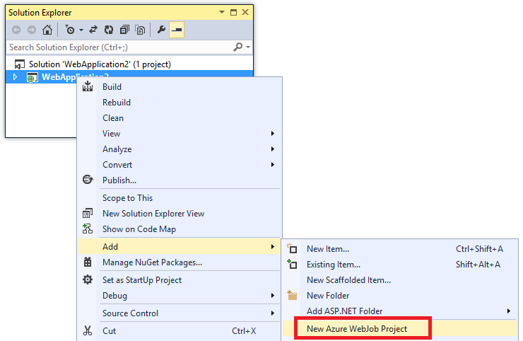

<properties 
	pageTitle="Visual Studio を使用して Web ジョブを展開する" 
	description="Visual Studio を使用して Azure Web ジョブを Azure App Service の Web アプリケーションにデプロイする方法について説明します。" 
	services="app-service\web" 
	documentationCenter="" 
	authors="tdykstra" 
	manager="wpickett" 
	editor="jimbe"/>

<tags 
	ms.service="app-service-web" 
	ms.devlang="dotnet" 
	ms.topic="article" 
	ms.tgt_pltfrm="na" 
	ms.workload="web" 
	ms.date="03/24/2015" 
	ms.author="tdykstra"/>

# Visual Studio を使用して Web ジョブを展開する

## 概要

このトピックでは、Visual Studio を使用して、コンソール アプリケーション プロジェクトを [Azure Web ジョブ](http://go.microsoft.com/fwlink/?LinkId=390226) として [App Service](http://go.microsoft.com/fwlink/?LinkId=529714) の Web アプリケーションに展開する方法を説明します。[Azure ポータル](http://go.microsoft.com/fwlink/?LinkId=529715)を使用して Web ジョブを展開する方法については、[Web ジョブを使用してバックグラウンド タスクを実行する](web-sites-create-web-jobs.md)を参照してください。

Visual Studio では Web ジョブ対応のコンソール アプリケーション プロジェクトをデプロイする場合に、2 つのタスクを実行します。

* ランタイム ファイルを Web アプリケーションの適切なフォルダーにコピーします (継続的な Web ジョブの場合は *App_Data/jobs/continuous*、スケジュールされたオンデマンドの Web ジョブの場合は  *App_Data/jobs/triggered*)。
* 特定の時間に実行するようにスケジュールされる Web ジョブに [Azure Scheduler ジョブ]を(#scheduler) 設定します(これは継続的な Web ジョブでは必要ありません)。

Web ジョブ対応のプロジェクトでは、次の項目が追加されています。

* [Microsoft.Web.WebJobs.Publish](http://www.nuget.org/packages/Microsoft.Web.WebJobs.Publish/) NuGet パッケージ。
* デプロイメントとスケジューラの設定を含む [webjob-publish-settings.json] ファイル(#publishsettings) 。 

これらの項目を既存のコンソール アプリケーション プロジェクトに追加することもできれば、テンプレートを使用して新しい Web ジョブ対応のコンソール アプリケーション プロジェクトを作成することもできます。 

プロジェクト自体を Web ジョブとしてデプロイできます。また、Web プロジェクトをデプロイしたときに常に自動的にデプロイされるように、プロジェクトを Web プロジェクトにリンクすることもできます。プロジェクトをリンクする場合、Visual Studio で、Web プロジェクト内の [webjobs-list.json] (#webjobslist) ファイルに Web ジョブ対応のプロジェクトの名前が含められます。

 

## 前提条件

Web ジョブのデプロイメント機能は、Azure SDK Version 2.4 以降をインストールしている場合に、Visual Studio 2013 で使用できます。

* [Azure SDK for Visual Studio 2013](http://go.microsoft.com/fwlink/p/?linkid=323510&clcid=0x409)。

Web ジョブのデプロイメント機能は、[Visual Studio 2013 Update 3](http://go.microsoft.com/fwlink/?linkid=397827&clcid=0x409) 以降の更新プログラムにも含まれます。

## 既存のコンソール アプリケーション プロジェクトで Web ジョブのデプロイメントを有効にする

2 つのオプションがあります。

* [Web プロジェクトを使用した自動デプロイメントを有効にする](#convertlink)。

	Web プロジェクトをデプロイしたときに自動的に Web ジョブとしてデプロイされるように、既存のコンソール アプリケーション プロジェクトを構成します。Web ジョブを、関連する Web アプリケーションが実行する Web アプリケーションと同じアプリケーションで実行する場合に、このオプションを使用します。

* [Web プロジェクトなしでデプロイメントを有効にする](#convertnolink)。

	Web プロジェクトへリンクせず、既存のコンソール アプリケーション プロジェクトがそれ自身で Web ジョブとしてデプロイされるように構成します。Web アプリケーションで Web アプリケーションを実行せずに、Web ジョブ自身によって Web アプリケーション内で実行されようにする場合に、このオプションを使用します。このオプションは、Web アプリケーション リソースとは関係なく Web ジョブ リソースを拡張する必要がある場合などに使用できます。

### Web プロジェクトを使用した Web ジョブの自動デプロイメントを有効にする
  
1. **ソリューション エクスプローラー**で Web プロジェクトを右クリックし、**[追加]** > **[[既存のプロジェクトを Azure Web ジョブとして]** の順にクリックします。

	
	
	[[Azure Web ジョブの追加]](#configure) ] ダイアログ ボックスが表示されます。

1. **[プロジェクト名]** ボックスの一覧で、コンソール アプリケーション プロジェクトを選択し、Web ジョブとして追加します。

	

2. [[Azure Web ジョブの追加]] (#configure) ダイアログ ボックスに入力し、**[OK]** をクリックします。 

### Web プロジェクトなしで Web ジョブ デプロイメントを有効にする
  	
1. **ソリューション エクスプローラー** でコンソール アプリケーション プロジェクトを右クリックし、**[Azure Web ジョブとして発行]** をクリックします。 

	
	
	[[Azure Web ジョブの追加]] (#configure) ダイアログ ボックスが表示され、**[プロジェクト名]** ボックスに選択されたプロジェクトが示されます。

2.  [[Azure Web ジョブの追加]](#configure) ダイアログ ボックスに入力し、**[OK**] をクリックします。

	**[Web の発行]** ウィザードが表示されます。すぐに発行しない場合は、ウィザードを閉じます。[プロジェクトをデプロイする]ときのために、入力した設定値は保存されます(#deploy)。

## 新しい Web ジョブ対応のプロジェクトを作成する

新しい Web ジョブ対応のプロジェクトを作成するために、[前のセクション]で説明したように、コンソール アプリケーション プロジェクト テンプレートを使用して、Web ジョブのデプロイメントを有効にすることができます(#convert)。または、次のように Web ジョブの新しいプロジェクト テンプレートを使用できます。

* [独立した Web ジョブ用に Web ジョブの新しいプロジェクト テンプレートを使用する](#createnolink)

	プロジェクトを作成し、Web プロジェクトへはリンクせずに、それ自身で Web ジョブとしてデプロイされるように構成します。Web アプリケーションで Web アプリケーションを実行せずに、Web ジョブ自身によって Web アプリケーション内で実行されようにする場合に、このオプションを使用します。このオプションは、Web アプリケーション リソースとは関係なく Web ジョブ リソースを拡張する必要がある場合などに使用できます。

* [Web プロジェクトにリンクされた Web ジョブ用に Web ジョブの新しいプロジェクト テンプレートを使用する](#createlink)

	同じソリューション内の Web プロジェクトがデプロイされたときに Web ジョブとして自動的にデプロイされるように構成して、プロジェクトを作成します。Web ジョブを、関連する Web アプリケーションが実行する Web アプリケーションと同じアプリケーションで実行する場合に、このオプションを使用します。

SDK 2.4 リリースでは、Web ジョブの新しいプロジェクト テンプレートは、コンソール アプリケーション プロジェクトを作成して Web ジョブのデプロイメントを有効にする方法と比較して、それほど簡単ではありません。将来的には、Web ジョブの新しいプロジェクト テンプレートは、自動的に適切な Web ジョブ SDK NuGet パッケージをインストールするようになり、[Web ジョブ SDK](http://www.asp.net/aspnet/overview/developing-apps-with-windows-azure/getting-started-with-windows-azure-webjobs) 開発において今より使いやすくなります。それまでは、[Web ジョブ SDK のチュートリアル](http://www.asp.net/aspnet/overview/developing-apps-with-windows-azure/getting-started-with-windows-azure-webjobs)に示すように、手動でパッケージをインストールすることで Web ジョブ SDK を使用するようプロジェクトを構成できます。 

### 独立した Web ジョブ用に Web ジョブの新しいプロジェクト テンプレートを使用する
  
1. **[ファイル]** > **[新しいプロジェクト]** の順にクリックし、**[新しいプロジェクト]** ダイアログ ボックスで **[クラウド]** > **[Microsoft Azure Web ジョブ]** の順にクリックします。

	
	
2. 前の手順に従って、[コンソール アプリケーション プロジェクトを独立した Web ジョブ プロジェクトにします](#convertnolink)。

### Web プロジェクトにリンクされた Web ジョブ用に Web ジョブの新しいプロジェクト テンプレートを使用する

1. **ソリューション エクスプローラー**で Web プロジェクトを右クリックし、**[追加]** > **[新しい Azure Web ジョブ プロジェクト]** の順にクリックします。

	

	[[Azure Web ジョブの追加]](#configure) ] ダイアログ ボックスが表示されます。

2. [[Azure Web ジョブの追加]](#configure) ダイアログ ボックスに入力し、**[OK**] をクリックします。

## [Azure Web ジョブの追加] ダイアログ

**[Azure Web ジョブの追加]** ダイアログを使用して、Web ジョブの Web ジョブ名とスケジュール設定を入力できます。 

The fields in this dialog correspond to fields on the **New Job** dialog of the Azure Management Portal. For more information, see [Run Background tasks with WebJobs](web-sites-create-web-jobs.md)。

スケジュールされた Web ジョブの場合 (継続的な Web ジョブではなく)、Visual Studio は [Azure Scheduler](/services/scheduler/) ジョブ コレクションが存在しない場合はコレクションを作成し、コレクション内にジョブを作成します。

* スケジューラ ジョブ コレクションには  *WebJobs-{regionname}* という名前が付けられます。ここで、*{regionname}* は Web サイトがホストされているリージョンを指しています。例:WebJobs-WestUS。
* スケジューラ ジョブの名前は *{websitename}-{webjobname}* です。次に例を示します。MyWebSite-MyWebJob。 
 
>[AZURE.NOTE]
> 
>* コマンド ライン デプロイメントについては、「[Enabling Command-line or Continuous Delivery of Azure WebJobs (Azure Web ジョブのコマンド ラインまたは継続的な配信を有効にする)](/blog/2014/08/18/enabling-command-line-or-continuous-delivery-of-azure-webjobs/)」を参照してください。
>* **定期的なジョブ**を構成して、繰り返しの頻度を分単位で設定した場合、Azure Scheduler サービスは無料ではなくなります。その他の頻度 (時間、日など) では無料です。
>* Web ジョブをデプロイし、後から実行モードを継続的から継続的以外、またはその逆に変更した場合、Visual Studio は再デプロイ時に Azure 内に新しい Web ジョブを作成します。その他のスケジュール設定を変更し、実行モードを同じままにするか、または [スケジュール済み] と [オンデマンド] の間で切り替えた場合は、Visual Studio は新しいジョブを作成するのではなく、既存のジョブを更新します。

## webjob-publish-settings.json

Web ジョブ デプロイメントのコンソール アプリケーションを構成すると、Visual Studio によって [Microsoft.Web.WebJobs.Publish](http://www.nuget.org/packages/Microsoft.Web.WebJobs.Publish/) NuGet パッケージがインストールされ、 
スケジュール情報が Web ジョブ プロジェクトの  *Properties* プロジェクト フォルダー内の  *webjob-publish-settings.json* ファイルに格納されます。次にこのファイルの例を示します。

		{
		  "$schema": "http://schemastore.org/schemas/json/webjob-publish-settings.json",
		  "webJobName": "WebJob1",
		  "startTime": "2014-06-23T00:00:00-08:00",
		  "endTime": "2014-06-27T00:00:00-08:00",
		  "jobRecurrenceFrequency": "Minute",
		  "interval": 5,
		  "runMode": "Scheduled"
		}

このファイルは直接編集でき、Visual Studio で IntelliSense を使用できます。ファイル スキーマは [http://schemastore.org](http://schemastore.org/schemas/json/webjob-publish-settings.json) に格納され、そこで表示できます。  

>[AZURE.NOTE]
>
>* **定期的なジョブ**を構成して、繰り返しの頻度を分単位で設定した場合、Azure Scheduler サービスは無料ではなくなります。その他の頻度 (時間、日など) では無料です。

## webjobs-list.json

Web ジョブ対応のプロジェクトを Web プロジェクトにリンクすると、Visual Studio は Web ジョブ プロジェクトの名前を Web プロジェクトの  *Properties* フォルダー内の  *webjobs-list.json* ファイルに格納します。次の例に示すように、一覧には複数の Web ジョブ プロジェクトが含まれる場合があります。

		{
		  "$schema": "http://schemastore.org/schemas/json/webjobs-list.json",
		  "WebJobs": [
		    {
		      "filePath": "../ConsoleApplication1/ConsoleApplication1.csproj"
		    },
		    {
		      "filePath": "../WebJob1/WebJob1.csproj"
		    }
		  ]
		}

このファイルは直接編集でき、Visual Studio で IntelliSense を使用できます。ファイル スキーマは [http://schemastore.org](http://schemastore.org/schemas/json/webjobs-list.json) に格納され、そこで表示できます。
  
## Web ジョブ プロジェクトをデプロイする

Web プロジェクトにリンクされた Web ジョブ プロジェクトは、Web プロジェクトと共に自動的にデプロイされます。Web プロジェクトのデプロイメントの詳細については、「[Web アプリケーションにデプロイする方法](web-sites-deploy.md)」を参照してください。

Web ジョブ プロジェクトがそれ自身でデプロイされるように指定するには、**ソリューション エクスプローラー**でプロジェクトを右クリックし、 **[Azure Web ジョブとして発行]** をクリックします。 

	
独立した Web ジョブの場合は、Web プロジェクトで使用されたウィザードと同じ **Web の発行**ウィザードが表示されますが、変更可能な設定値の数は少なくなります。

>[AZURE.NOTE] Azure アカウントにサインアップする前に Azure App Service を実際に使ってみるには、[App Service の試用](http://go.microsoft.com/fwlink/?LinkId=523751)にアクセスしてください。App Service に有効期限付きのスターター Web アプリケーションを無償ですぐに作成できます。このサービスの利用にあたり、クレジット カードは必要ありません。契約も必要ありません。

## 次のステップ

Visual Studio から Azure Web ジョブをデプロイする方法および継続的な配信プロセスを使用して Azure Web ジョブをデプロイする方法の詳細については、「[Azure WebJobs - Recommended Resources - Deployment (Azure Web ジョブの推奨リソース - デプロイメント)](http://www.asp.net/aspnet/overview/developing-apps-with-windows-azure/azure-webjobs-recommended-resources#deploying)」を参照してください。

## 変更点
* Web サイトから App Service への変更に関するガイド:[Azure App Service と既存の Azure サービスへの影響](http://go.microsoft.com/fwlink/?LinkId=529714)
* 以前のポータルから新しいポータルへの変更に関するガイド:[プレビュー ポータルのナビゲートに関するリファレンス](http://go.microsoft.com/fwlink/?LinkId=529715)

<!--HONumber=49-->