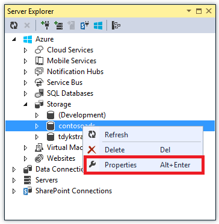
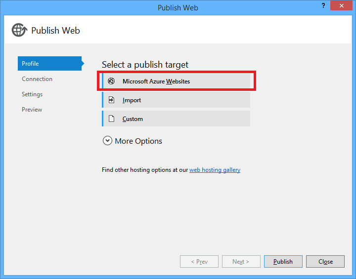
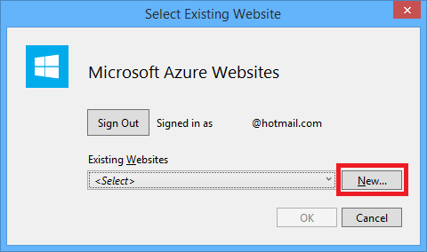
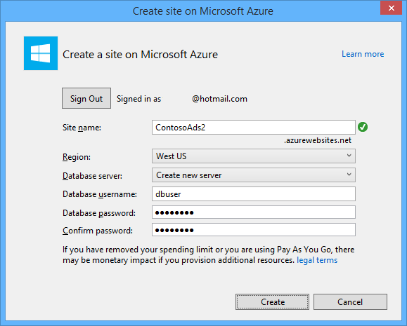
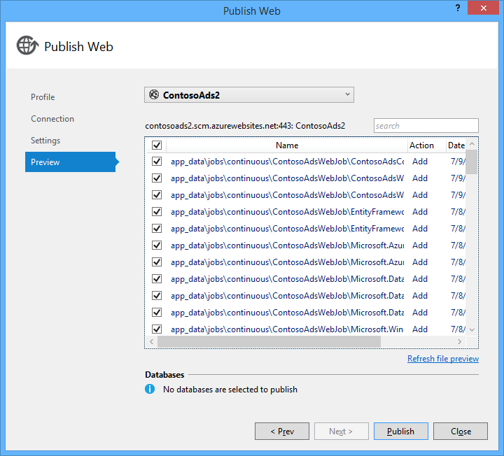
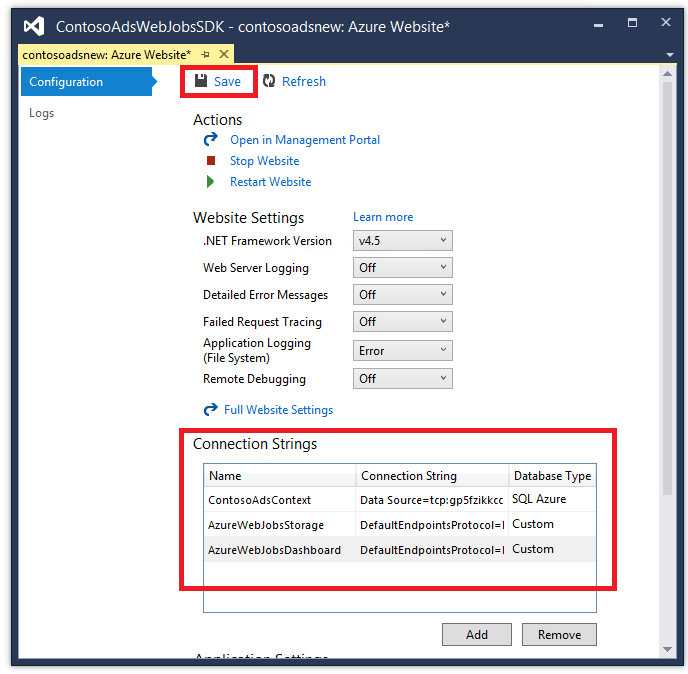
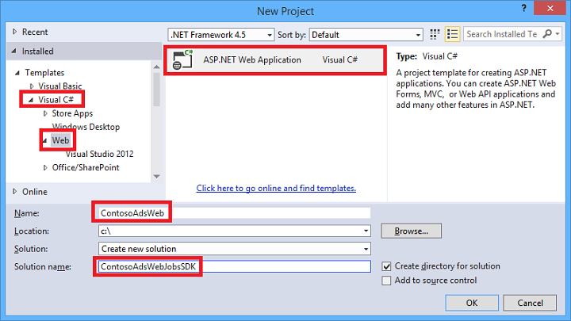
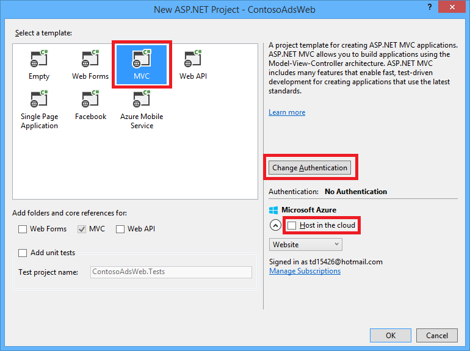

<properties pageTitle="Azure Web ジョブ SDK の使用" metaKeywords="Azure チュートリアル, Azure Web ジョブ チュートリアル, Azure の多層チュートリアル, MVC のチュートリアル, Azure BLOB のチュートリアル, Azure クエリのチュートリアル, Azure Storage のチュートリアル" description="ASP.NET MVC と Azure を使用して多層アプリケーションを作成する方法について説明します。フロントエンドは Web サイトで実行され、バックエンドは Web ジョブとして実行されます。このアプリは、Entity Framework、SQL Database、Azure ストレージ キューおよび BLOB を使用しています。" metaCanonical="" services="web-sites,storage" documentationCenter=".NET" title="Get Started with the Azure WebJobs SDK" authors="tdykstra" solutions="" manager="wpickett" editor="mollybos" />

<tags ms.service="web-sites" ms.workload="web" ms.tgt_pltfrm="na" ms.devlang="na" ms.topic="article" ms.date="10/12/2014" ms.author="tdykstra" />

# Azure Web ジョブ SDK の使用

このチュートリアルは、Web ジョブ SDK を使用して [Azure キュー](http://www.asp.net/aspnet/overview/developing-apps-with-windows-azure/building-real-world-cloud-apps-with-windows-azure/queue-centric-work-pattern)と [Azure BLOB](http://www.asp.net/aspnet/overview/developing-apps-with-windows-azure/building-real-world-cloud-apps-with-windows-azure/unstructured-blob-storage) を [Azure Web サイト](/ja-jp/documentation/services/websites/)内で操作する多層 ASP.NET MVC アプリケーションを作成する方法を示しています。アプリケーションは、[Azure SQL Database](http://msdn.microsoft.com/library/azure/ee336279) も使用します。 

このサンプル アプリケーションは、広告の掲示板です。ユーザーは、テキストを入力し、画像をアップロードして広告を作成します。広告の一覧には縮小表示画像が表示されます。広告を選択すると、フルサイズ画像と詳細が表示されます。スクリーンショットを次に示します。

MSDN コード ギャラリーから、対象の [Visual Studio プロジェクトをダウンロード][download]できます。 

[ダウンロード]: http://code.msdn.microsoft.com/Simple-Azure-Website-with-b4391eeb

## 目次

- [前提条件](#prerequisites)
- [学習内容](#learn)
- [アプリケーションのアーキテクチャ](#contosoads)
- [開発環境を設定する](#setupdevenv)
- [アプリケーションをビルド、実行、およびデプロイする](#storage)
- [アプリケーションを最初から作成する](#create)
- [アプリケーション コードを確認する](#code)
- [次のステップ](#next-steps)

## 前提条件

このチュートリアルは、Visual Studio で [ASP.NET MVC](http://www.asp.net/mvc/tutorials/mvc-5/introduction/getting-started) または [Web フォーム](http://www.asp.net/web-forms/tutorials/aspnet-45/getting-started-with-aspnet-45-web-forms/introduction-and-overview) プロジェクトを操作する方法を理解していることを前提としています。サンプル アプリケーションでは MVC を使用しますが、チュートリアルのほとんどは Web フォームにも当てはまります。 

このチュートリアルの手順は、次のどちらの製品でも使用できます。

* Visual Studio 2013
* Visual Studio 2013 Express for Web

これらの製品をお持ちでない場合、Azure SDK をインストールすると Visual Studio 2013 Express for Web が自動的にインストールされます。

[WACOM.INCLUDE [free-trial-note](../includes/free-trial-note.md)]

## 学習内容

このチュートリアルでは、次のタスクの実行方法を示します。

* Azure SDK をインストールして、Azure 向け開発用にコンピューターを準備する。
* 関連付けられた Web プロジェクトをデプロイしたときに、Azure Web ジョブとして自動的にデプロイするコンソール アプリケーション プロジェクトを作成する。
* 開発コンピューター上で Web ジョブ SDK バックエンドをローカルにテストする。
* Web ジョブ バックエンドと共にアプリケーションを Azure Web サイトに発行する。
* ファイルを Azure BLOB サービスにアップロードして保存する。
* Azure Web ジョブ SDK を使用して Azure ストレージ キューと BLOB を操作する。

## アプリケーションのアーキテクチャ

サンプル アプリケーションでは、[キューを中心とした作業パターン](http://www.asp.net/aspnet/overview/developing-apps-with-windows-azure/building-real-world-cloud-apps-with-windows-azure/queue-centric-work-pattern)を使用して、CPU 負荷の縮小表示の作成をバックエンド プロセスにオフロードします。 

このアプリでは、広告を SQL データベースに格納します。その際、テーブルを作成してデータにアクセスするために Entity Framework Code First を使用します。それぞれの広告に対し、フルサイズ画像用と縮小表示画像用の 2 つの URL がデータベースに格納されます。

ユーザーが画像をアップロードすると、フロントエンド Web サイトによってその画像が [Azure BLOB](http://www.asp.net/aspnet/overview/developing-apps-with-windows-azure/building-real-world-cloud-apps-with-windows-azure/unstructured-blob-storage) に格納され、広告情報がその BLOB を示す URL と共にデータベースに格納されます。同時に、メッセージが Azure キューに書き込まれます。Azure Web ジョブとして実行されるバックエンド プロセスは、新しいメッセージを検出するため、Web ジョブ SDK を使用してキューをポーリングします。新しいメッセージが出現すると、Web ジョブはその画像の縮小表示を作成し、その広告の縮小表示 URL データベース フィールドを更新します。次の図に、アプリケーションの各パーツのやり取りを示します。

### 代替のアーキテクチャ

Web ジョブは Web サイトのコンテキストで実行され、個別に拡大縮小することはできません。たとえば、1 つの標準の Web サイト インスタンスがある場合、バックグラウンド プロセスを実行するインスタンスを 1 つだけ保持できます。それにはサーバー リソース (CPU、メモリなど) の一部が使用され、それ以外のリソースは Web コンテンツを処理するために使用できます。 

トラフィックが時間帯や曜日によって変わる場合、および実行する必要のあるバックエンド処理を待機できる場合は、トラフィックの少ない時間帯に Web ジョブを実行するようにスケジュールできます。そのソリューションでも負荷が引き続き高すぎる場合は、次のような、バックエンド プログラム用の代替の環境を検討できます。

* その目的専用の個別の Web サイトで、Web ジョブとしてプログラムを実行します。その後、フロントエンド Web サイトから独立して、バックエンド Web サイトを拡張します。
* Azure クラウド サービス worker ロールでプログラムを実行します。このオプションを選択した場合は、クラウド サービス Web ロールまたは Web サイトでフロントエンドを実行できます。

このチュートリアルでは、フロントエンドを Web サイトで実行し、バックエンドを Web ジョブとして同じ Web サイトで実行する方法を示しています。自分のシナリオに最適な環境を選択する方法の詳細については、「[Azure Web サイト、クラウド サービス、および仮想マシンの比較](/ja-jp/documentation/articles/choose-web-site-cloud-service-vm/)」を参照してください。

[WACOM.INCLUDE [install-sdk-2013-only](../includes/install-sdk-2013-only.md)]

チュートリアルの手順は、[Visual Studio 2013 Update 4](http://go.microsoft.com/fwlink/?LinkID=510328) の次期プレビュー リリースを使用して記述されています。Visual Studio 2013 Update 3 との唯一の違いは、Web ジョブのプロジェクトを作成する「アプリケーションを最初から作成する」セクションです。Update 4 では、Web ジョブ SDK パッケージは自動的にプロジェクトに含まれます。Update 4 を使用しない場合は、パッケージを手動でインストールする必要があります。

## Azure のストレージ アカウントの作成

Azure Storage アカウントは、キューおよび BLOB データをクラウドに格納するためのリソースを提供します。また、ダッシュボードのログ データを格納するために Web ジョブ SDK によっても使用されます。

現実のアプリケーションでは、通常、アプリケーション データとログ データ、テスト データと運用データに別個のアカウントを作成します。このチュートリアルでは、アカウントを 1 つだけ使用します。

1. Visual Studio で**サーバー エクスプ ローラー** ウィンドウを開きます。

2. **Azure** ノードを右クリックし、**[Microsoft Azure への接続]** をクリックします。

3. Azure の資格情報を使用してサインインします。

5. Azure ノードで、**[ストレージ]** を右クリックし、**[ストレージ アカウントの作成]** をクリックします。

3. **[ストレージ アカウントの作成]** ダイアログ ボックスで、ストレージ アカウントの名前を入力します。 

	名前は一意である必要があります (他の Azure Storage アカウントを同じ名前にすることはできません)。入力した名前が既に使用中の場合は、変更するように求められます。

	Storage アカウントにアクセスするための URL は、*{name}*.core.windows.net 形式になります。 

5. **[リージョンまたはアフィニティ グループ]** ドロップダウン リストから最も近い地域を選択します。

	この設定は、お使いの Storage アカウントをホストしている Azure データ センターを指定します。このチュートリアルでは、選択肢によって顕著な相違は生じませんが、運用サイトの場合は、待ち時間とデータ送信料金を最小限に抑えるために、Web サーバーとストレージ アカウントを同じリージョンに設定することが望まれます。待ち時間を最小限にするには、Web サイト (後で作成する) をサイトにアクセスするブラウザーのできるだけ近くに配置します。

6. **[レプリケーション]** ボックスを **[ローカル冗長]** に設定します。 

	ジオ (主要地域) レプリケーションを Storage アカウントに対して有効にすると、1 次拠点で重大な障害が発生した場合に備えて、保存したコンテンツは 2 次データ センターに複製されて、フェイルオーバーが可能になります。Geo レプリケーションには追加費用が発生する場合があります。また、テストおよび開発アカウントの場合は、一般的に Geo レプリケーションに対する課金は避けたいと考えるでしょう。詳細については、[ストレージ アカウントの管理方法に関するページ](/ja-jp/documentation/articles/storage-manage-storage-account/)を参照してください。

5. **[作成]** をクリックします。 

		

## アプリケーションのダウンロード
 
1. [完成したソリューション][download]をダウンロードして解凍します。

2. Visual Studio を起動します。

3. **[ファイル]** メニューで **[開く]**、**[プロジェクト/ソリューション]** の順に選択し、ソリューションのダウンロード先に移動して、ソリューション ファイルを開きます。

3. Ctrl + Shift + B キーを押して、ソリューションをビルドします。

	既定では、Visual Studio は *.zip* ファイルに含まれていなかった NuGet パッケージのコンテンツを自動的に復元します。パッケージが復元されない場合は、**[ソリューションの NuGet パッケージの管理]** ダイアログの右上にある **[復元]** ボタンをクリックしてパッケージを手動でインストールします。 

3. **ソリューション エクスプローラー**で、**ContosoAdsWeb** がスタートアップ プロジェクトとして選択されていることを確認します。

## Storage アカウントを使用するためのアプリケーションの構成

2. ContosoAdsWeb プロジェクトでアプリケーションの *Web.config* ファイルを開きます。
 
	ファイルには、BLOB とキューを操作するための SQL 接続文字列と Azure Storage 接続文字列が含まれます。 

	SQL 接続文字列は [SQL Server Express LocalDB](http://msdn.microsoft.com/ja-jp/library/hh510202.aspx) データベースを指しています。
 
ストレージ接続文字列は、Storage アカウント名とアクセス キーのプレース ホルダーのある例を示します。これは、Storage アカウントの名前とキーを持つ接続文字列と置き換えられます。  

	<pre class="prettyprint">&lt;connectionStrings&gt;
	  &lt;add name="ContosoAdsContext" connectionString="Data Source=(localdb)\v11.0; Initial Catalog=ContosoAds; Integrated Security=True; MultipleActiveResultSets=True;" providerName="System.Data.SqlClient" /&gt;
	  &lt;add name="AzureWebJobsStorage" connectionString="DefaultEndpointsProtocol=https;AccountName=<mark>[accountname]</mark>;AccountKey=<mark>[accesskey]</mark>"/&gt;
	&lt;/connectionStrings&gt;</pre>

	ストレージ接続文字列は AzureWebJobsStorage という名前になります。これは、Web ジョブ SDK が既定で使用する名前であるためです。Azure 環境では 1 つの接続文字列を設定する必要しかないため、ここでも同じ名前が使用されます。
 
2. **サーバー エクスプ ローラーで** **[ストレージ]** ノードの下にある Storage アカウントを右クリックし、**[プロパティ]** をクリックします。

		

4. **[プロパティ]** ウィンドウで **[ストレージ アカウント キー]** をクリックし、省略記号ボタンをクリックします。

		

7. **接続文字列**をコピーします。

		

8. *Web.config* ファイル内のストレージ接続文字列をコピーした接続文字列で置き換えます。貼り付ける前に、引用符を除き、引用符で囲まれたすべてのものが選択されていることを確認します。

4. ContosoAdsWebJob プロジェクトで *App.config* ファイルを開きます。

	このファイルには、アプリケーション データ用に 1 つとログ用に 1 つの計 2 つのストレージ接続文字列があります。このチュートリアルでは、どちらも同じアカウントを使用します。接続文字列には、ストレージ アカウント キーのプレース ホルダーがあります。
  	<pre class="prettyprint">&lt;configuration&gt;
    &lt;connectionStrings&gt;
        &lt;add name="AzureWebJobsDashboard" connectionString="DefaultEndpointsProtocol=https;AccountName=<mark>[accountname]</mark>;AccountKey=<mark>[accesskey]</mark>"/&gt;
        &lt;add name="AzureWebJobsStorage" connectionString="DefaultEndpointsProtocol=https;AccountName=<mark>[accountname]</mark>;AccountKey=<mark>[accesskey]</mark>"/&gt;
        &lt;add name="ContosoAdsContext" connectionString="Data Source=(localdb)\v11.0; Initial Catalog=ContosoAds; Integrated Security=True; MultipleActiveResultSets=True;"/&gt;
    &lt;/connectionStrings&gt;
        &lt;startup&gt; 
            &lt;supportedRuntime version="v4.0" sku=".NETFramework,Version=v4.5" /&gt;
    &lt;/startup&gt;
&lt;/configuration&gt;</pre>

	既定では、Web ジョブ SDK は、AzureWebJobsStorage および AzureWebJobsDashboard という名前の接続文字列を探します。代替として、[希望する接続文字列を格納し、それを明示的に `JobHost` オブジェクトに渡すこともできます](../websites-dotnet-webjobs-sdk-storage-queues-how-to/#config)。

1. 両方のストレージ接続文字列を先ほどコピーした接続文字列で置き換えます。

5. 変更を保存します。

## ローカルでアプリケーションを実行する

1. アプリケーションの Web フロントエンドを起動するには、Ctrl キーを押しながら F5 キーを押します。 

	既定のブラウザーでホーム ページが開きます(Web プロジェクトをスタートアップ プロジェクトとしているため、Web プロジェクトが実行されます)。

	

2. アプリケーションの Web ジョブ バックエンドを起動するには、**ソリューション エクスプローラー**で ContosoAdsWebJob プロジェクトを右クリックし、次に、**[デバッグ]**、**[新しいインスタンスを開始]** の順にクリックします。

	コンソール アプリケーション ウィンドウが開き、Web ジョブ SDK JobHost オブジェクトの実行が開始されたことを示すログ メッセージが表示されます。

	

2. ブラウザーで、**[広告を作成]** をクリックします。

2. テスト データを入力し、アップロードする画像を選択したら、**[Create]** をクリックします。

	

	[Index] ページが表示されますが、新しい広告の処理が完了していないため、縮小表示はまだ表示されません。

	その間、しばらく待機した後、コンソール アプリケーション ウィンドウのログ メッセージによって、キュー メッセージが受信され処理されたことが示されます。   

	

3. コンソール アプリケーション ウィンドウでログ メッセージを確認した後、[インデックス] ページを更新すると縮小表示が現れます。

	

4. 広告に対応する **[Details]** をクリックすると、フルサイズの画像が表示されます。

	

アプリケーションはローカル コンピューター上で実行されており、同じコンピューター上の SQL Server データベースを使用していますが、クラウド内のキューおよび BLOB と連携動作しています。次のセクションでは、クラウド データベースおよびクラウドの BLOB とキューを使用して、アプリケーションをクラウド内で実行します。  

## アプリケーションのクラウド内での実行

アプリケーションをクラウドで実行するには、次の手順を実行します。

* Azure Web サイトにデプロイします。Visual Studio は、新しい Azure Web サイトと SQL Database インスタンスを自動的に作成します。
* Azure SQL データベースとストレージ アカウントを使用するように Web サイトを構成する

クラウド内で実行中にいくつかの広告が作成された後、Web ジョブ SDK ダッシュボードを表示して、提供される豊富な監視機能を確認できます。

### Azure Web サイトへのデプロイ

1. ブラウザーとコンソール アプリケーション ウィンドウを閉じます。

3. **ソリューション エクスプローラー**で ContosoAdsWeb プロジェクトを右クリックし、**[発行]** をクリックします。

3. **Web の発行**ウィザードの **[プロファイル]** ステップで、**[Microsoft Azure Websites]** をクリックします。

		

2. **[既存の Web サイトを選択]** ボックスで、**[サインイン]** をクリックします。
 
		

5. サインインした後、[新規] をクリックします。

	

9. **[Microsoft Azure でサイトを作成]** ダイアログ ボックスで、**[サイト名]** ボックスに一意の名前を入力します。

	URL 全体は、ここに入力した内容に .azurewebsites.net を追加して構成されます (**[サイト名]** ボックスの横を参照)。たとえば、サイト名が ContosoAds の場合、URL は ContosoAds.azurewebsites.net となります。

9. **[リージョン]** ボックスの一覧で、Storage アカウント用に選択したリージョンと同じリージョンを選択します。

	この設定により、Web サイトが実行される Azure データセンターが指定されます。Web サイトとストレージ アカウントを同じデータセンター内に保持することで、待ち時間とデータ送信料金を最小限に抑えることができます。

9. **[データベース サーバー]** ボックスの一覧で、**[新しいサーバーの作成]** を選択します。

	または、サブスクリプションに既にサーバーが設定されている場合は、ドロップダウン リストからそのサーバーを選択します。

1. **[データベースのユーザー名]** および **[データベース パスワード]** にそれぞれ管理者の該当する値を入力します。 

	**[新しい SQL データベース サーバー]** を選択した場合は、既存の名前とパスワードではなく、このデータベースへのアクセス時に使用する新しい名前とパスワードを入力してください。以前に作成したサーバーを選択した場合は、既に作成されている管理ユーザー アカウントのパスワードを入力します。

1. **[作成]** をクリックします。

		

	Visual Studio でソリューション、Web プロジェクト、Azure Web サイト、および Azure SQL データベース インスタンスが作成されます。

2. **Web の発行**ウィザードの **[接続]** ステップで、**[次へ]** をクリックします。

		

3. **[設定]** ステップで、**[実行時にこの接続文字列を使用する]** チェック ボックスをオフにして **[次へ]** をクリックします。

		
	
	SQL 接続文字列を設定するために発行ダイアログを使用する必要はありません。後から Azure 環境で値を設定します。

	このページでの警告は無視します。 

	* 通常、Azure で実行する際に使用する Storage アカウントとローカルで実行する際に使用する Storage アカウントは異なりますが、このチュートリアルでは、両方の環境で同じものを使用しています。そのため、AzureWebJobsStorage 接続文字列を変換する必要はありません。クラウド内で異なるストレージ アカウントを使用することを希望した場合でも、アプリケーションは Azure 内で実行される際には Azure 環境設定を使用するため接続文字列を変換する必要はありません。この点は後でチュートリアルの中で確認できます。

	* このチュートリアルでは、ContosoAdsContext データベース用に使用されるデータ モデルには変更を加えないため、デプロイメントのために Entity Framework Code First Migrations を使用する必要はありません。Code First は、アプリケーションが SQL データへのアクセスを最初に試行したときに、新しいデータベースを自動的に作成します。

	このチュートリアルの場合、**[ファイル発行オプション]** の下のオプションは既定値のままでかまいません。 

4. **[プレビュー]** ステップで、**[プレビューの開始]** をクリックします。

		

	データベースが発行されていないことに関する警告は無視します。Entity Framework Code First によってデータベースが作成されます。発行する必要はありません。

	プレビュー ウィンドウに、Web ジョブ プロジェクトのバイナリ ファイルと構成ファイルが Web サイトの *app_data\jobs\continuous* フォルダーにコピーされることが示されます。

		

5. **[発行]** をクリックします。

	Visual Studio によってアプリケーションがデプロイされ、ブラウザーでホーム ページの URL が開かれます。 

	次のセクションで、Azure 環境内で接続文字列を設定するまで、サイトは使用できません。以前に選択したサイトおよびデータベースの作成オプションに応じて、エラー ページまたはホーム ページが表示されます。 

### Azure SQL データベースとストレージ アカウントを使用するように Web サイトを構成する

セキュリティ上のベスト プラクティスとして、[接続文字列などの機密情報をソース コード リポジトリに格納されるファイルに含めるのは避ける](http://www.asp.net/aspnet/overview/developing-apps-with-windows-azure/building-real-world-cloud-apps-with-windows-azure/source-control#secrets)必要があります。Azure には、そのための方法が用意されています。接続文字列とその他の設定値を Azure 環境内で設定できます。その後、アプリケーションを Azure 内で実行するときに、ASP.NET 構成 API が自動的にそれらの値を取り出します。このセクションでは、Azure 内で接続文字列値を設定します。

7. **サーバー エクスプ ローラー**の **[Web サイト]** ノードの下の自身の Web サイトを右クリックし、**[設定の表示]** をクリックします。

	**[Azure Web サイト]** ウィンドウの **[構成]** タブが表示されます。

9. DefaultConnection 接続文字列の名前を ContosoAdsContext に変更します。

	この接続文字列は、サイトおよび関連付けられたデータベースを作成したときに Azure で自動的に作成されたものであるため、既に正しい接続文字列値になっています。単に、コードで検索される名前へと変更しているだけです。

9. AzureWebJobsStorage および AzureWebJobsDashboard という名前の 2 つの新しい接続文字列を追加します。型を [カスタム] に設定し、接続文字列値を *Web.config* および *App.config* で以前に使用した値と同じ値に設定します(必ず、アクセス キーだけでなく、接続文字列全体を含めてください。引用符は含めないでください)。

	これらの接続文字列は Web ジョブ SDK によって、アプリケーション データ用とログ用に 1 つずつ使用されます。以前に見たとおり、アプリケーション データ用の接続文字列は Web フロントエンド コードによっても使用されます。
	
9. **[保存]** をクリックします。

	

10. **サーバー エクスプ ローラー**で Web サイトを右クリックし、**[Web サイトの停止]** をクリックします。 

12. Web サイトが停止したら、Web サイトをもう一度を右クリックし、**[Web サイトの開始]** をクリックします。

	Web ジョブは、発行時に自動的に起動されますが、構成を変更すると停止します。再開するには、サイトを再開するかまたは、Azure の管理ポータルで、Web ジョブを再起動します。一般に、構成の変更後はサイトを再起動することをお勧めします。 

9. アドレス バーにサイトの URL が示されているブラウザー ウィンドウを更新します。

	ホーム ページが表示されます。

10. アプリケーションをローカルで実行したときと同様に、広告を作成します。

	[インデックス] ページは最初に縮小表示なしで表示されます。

11.	数秒後、ページを更新すると、縮小表示が現れます。

	縮小表示が現れない場合は、Web ジョブが自動的に起動されていない可能性があります。その場合は、Web ジョブに移動します。
 

### Web ジョブ SDK ダッシュボードの表示

1. [Azure の管理ポータル](http://manage.windowsazure.com/)で、Web サイトを選択します。

2. **[Web ジョブ]** タブをクリックします。

3. Web ジョブの [ログ] 列で URL をクリックします。

	

	新しいブラウザー タブが開き、Web ジョブ SDK ダッシュボードが表示されます。ダッシュボードには、Web ジョブが実行中であることと、Web ジョブ SDK がトリガーしたコード内の関数の一覧が表示されます。

4. 関数のいずれかをクリックすると、その実行に関する詳細が表示されます。 
 
		

		

	このページの **[関数の再生]** をクリックすると、Web ジョブ SDK フレームワークは関数を再度呼び出すため、その機会に、最初に関数へ渡すデータを変更することができます。

>[WACOM.NOTE]テストを終了した時点で、Web サイトと SQL データベース インスタンスを削除してください。Web サイトは無料ですが、SQL データベース インスタンスとストレージ アカウントは有料です (サイズが小さいため少額)。また、サイトを実行したままにしておくと、その URL を見つけた他のユーザーが広告を作成して表示する可能性があります。Azure 管理ポータルで、Web サイトの **[ダッシュボード]** タブに移動し、ページの下部の **[削除]** をクリックします。その後、SQL データベース インスタンスを同時に削除するためのチェック ボックスをオンにします。一時的に他のユーザーがこのサイトにアクセスできないようにするには、代わりに **[停止]** をクリックします。その場合、引き続き、SQL データベースとストレージ アカウントについては料金が生じます。同様の手順で、不要になった SQL Database と Storage アカウントを削除できます。

### 実行時間の長いプロセスの AlwaysOn を有効にする

このサンプル アプリケーションでは、常に、Web サイトでのアクティビティの後にキュー メッセージが作成されるため、Web サイトがスリープ状態になり、長時間の非アクティブ状態によって Web ジョブが終了された場合でも問題はありません。要求を受信すると、サイトはウェイクアップし、Web ジョブが再開されます。

Web サイト自体が長い間非アクティブ状態の場合でも Web ジョブが継続して稼働するように指定するために、Azure Web サイトの [AlwaysOn](http://weblogs.asp.net/scottgu/archive/2014/01/16/windows-azure-staging-publishing-support-for-web-sites-monitoring-improvements-hyper-v-recovery-manager-ga-and-pci-compliance.aspx) 機能を使用できます。

## アプリケーションを最初から作成する 

このセクションでは、次のタスクを実行します。

* Web プロジェクトを使用して Visual Studio ソリューションを作成します。
* フロントエンドとバックエンド間で共有されるデータ アクセス レイヤーのクラス ライブラリ プロジェクトを追加します。
* バックエンドのコンソール アプリケーション プロジェクトを追加し、Web ジョブのデプロイメントを有効にします。
* NuGet パッケージを追加します。
* プロジェクト参照を設定します。
* アプリケーション コードと構成ファイルを、チュートリアルの以前のセクションで作業したダウンロード済みのアプリケーションからコピーします。
* コード内で Azure の BLOB とキューおよび Web ジョブ SDK を操作する部分を確認します。
 
### Web プロジェクトおよびクラス ライブラリ プロジェクトを使用して Visual Studio ソリューションを作成する

1. Visual Studio で、**[ファイル]** メニューで、**[新規]**、**[プロジェクト]** の順に選択します。

2. **[新しいプロジェクト]** ダイアログ ボックスで、**[Visual C#]**、**[Web]**、**[ASP.NET Web アプリケーション]** の順にクリックします。

3. プロジェクトに ContosoAdsWeb と名前を付け、ソリューションに ContosoAdsWebJobsSDK と名前を付けて (ダウンロードしたソリューションと同じフォルダーに入れる場合は、ソリューション名を変更します)、**[OK]** をクリックします。

		

5. **[新しい ASP.NET プロジェクト]** ダイアログで、MVC テンプレートを選択し、**[Microsoft Azure]** の下の **[クラウドでのホスト]** チェック ボックスをオフにします。

	**[クラウドでのホスト]** を選択すると、Visual Studio は新しい Azure Web サイトと SQL Database を自動的に作成できるようになります。これらは以前に作成済みのため、ここで、プロジェクトの作成時に再度作成する必要はありません。新しいサイトとデータベースを作成する場合は、チェック ボックスをオンにします。その後、以前にアプリケーションをデプロイしたときと同じ方法で、新しい Web サイトと SQL Database を構成できます。

5. **[認証の変更]** をクリックします。

		

7. **[認証の変更]** ダイアログ ボックスで、**[認証なし]** を選択し、**[OK]** をクリックします。

		

8. **[新しい ASP.NET プロジェクト]** ダイアログ ボックスで **[OK]** をクリックします。 

	Visual Studio によって、ソリューションと Web プロジェクトが作成されます。

9. **ソリューション エクスプローラー**で (プロジェクトではなく) ソリューションを右クリックし、**[追加]**、**[新しいプロジェクト]** の順に選択します。

11. **[新しいプロジェクトの追加]** ダイアログ ボックスで、**[Visual C#]**、**[Windows デスクトップ]**、**[クラス ライブラリ]** テンプレートの順にクリックします。  

10. プロジェクトに *ContosoAdsCommon* という名前を付けて **[OK]** をクリックします。

	このプロジェクトには、Entity Framework コンテキストおよびフロントエンドとバックエンドの両方が使用するデータ モデルが含まれます。代替として、Entity Framework に関連するクラスを Web プロジェクトに定義し、Web ジョブ プロジェクトからそのプロジェクトを参照することもできます。ただしその場合、Web ジョブ プロジェクトは、必要としない Web アセンブリへの参照を含むことになります。

### Web ジョブのデプロイメントが有効なコンソール アプリケーション プロジェクトの追加

11. Web プロジェクト (ソリューションまたはクラス ライブラリ プロジェクトではなく) を右クリックし、**[追加]**、**[新しい Azure Web ジョブ プロジェクト]** の順にクリックします。

		

1. **[Azure Web ジョブの追加]** ダイアログで、**[プロジェクト名]** と **[Web ジョブ名]** の両方に「ContosoAdsWebJob」と入力します。**[Web ジョブ実行モード]** は **[連続的に実行]** に設定したままにします。

2.  **[OK]** をクリックします。
  
	Visual Studio は、Web プロジェクトがデプロイされたときに常に Web ジョブとしてデプロイするように構成されたコンソール アプリケーションを作成します。そのために、プロジェクトの作成後に次のタスクが実行されました。

	* *webjob-publish-settings.json* ファイルが Web ジョブ プロジェクトの Properties フォルダーに追加されました。
	* *webjobs-list.json* ファイルが Web プロジェクトの Properties フォルダーに追加されました。
	* Microsoft.Web.WebJobs.Publish NuGet パッケージが Web ジョブ プロジェクトにインストールされました。
	 
	これらの変更の詳細については、「[Azure Azure Web ジョブを Azure Web サイトにデプロイする方法](/ja-jp/documentation/articles/websites-dotnet-deploy-webjobs/)」を参照してください。

### NuGet パッケージの追加

Web ジョブ プロジェクトの新しいプロジェクトのテンプレートでは、Web ジョブ SDK NuGet パッケージの [Microsoft.Azure.WebJobs](http://www.nuget.org/packages/Microsoft.Azure.WebJobs) とその依存関係が自動的にインストールされます。 

自動的に Web ジョブ プロジェクトにインストールされた Web ジョブ SDK 依存関係の 1 つが、Azure Storage クライアント ライブラリ (SCL) です。ただし、BLOB およびキューと連携するには、これを Web プロジェクトに追加する必要があります。

11. ソリューションの **[NuGet パッケージの管理]** ダイアログを開きます。

12. 左側のウィンドウで、**[インストール済みのパッケージ]** を選択します。
   
13. *Azure Storage* パッケージを見つけ、**[管理]** をクリックします。

13. **[プロジェクトの選択]** ボックスで、**[ContosoAdsWeb]** チェック ボックスをオンにし、**[OK]** をクリックします。 

3 つのプロジェクトすべてが Entity Framework を使用して SQL データベース内のデータを操作します。

12. 左側のウィンドウで、**[オンライン]** を選択します。
   
16. *EntityFramework* NuGet パッケージを見つけて、3 つのプロジェクトすべてにインストールします。

### プロジェクト参照の設定

Web と Web ジョブ プロジェクトはどちらも SQL データベースと連携して動作するため、両方に ContosoAdsCommon プロジェクトへの参照が必要です。

10. ContosoAdsWeb プロジェクトで、ContosoAdsCommon プロジェクトの参照を設定します。(ContosoAdsWeb プロジェクトを右クリックし、**[追加]**、**[参照]** の順にクリックします。**[参照マネージャー]** ダイアログ ボックスで、**[ソリューション]**、**[プロジェクト]**、**[ContosoAdsCommon]** の順に選択し、**[OK]** をクリックします)。

11. ContosoAdsWebJob プロジェクトで、ContosAdsCommon プロジェクトへの参照を設定します。

Web ジョブ プロジェクトには、画像を操作し、接続文字列にアクセスするための参照が必要です。

11. ContosoAdsWebJob プロジェクトで、`System.Drawing` および `System.Configuration` への参照を設定します。

### コードと構成ファイルの追加

このチュートリアルでは、[スキャフォールディングを使用した MVC コントローラーおよびビューの作成](http://www.asp.net/mvc/tutorials/mvc-5/introduction/getting-started)方法、[SQL Server データベースで動作する Entity Framework コードの作成](http://www.asp.net/mvc/tutorials/getting-started-with-ef-using-mvc)方法、または [ASP.NET 4.5 での非同期プログラミングの基礎](http://www.asp.net/aspnet/overview/developing-apps-with-windows-azure/building-real-world-cloud-apps-with-windows-azure/web-development-best-practices#async)については説明していません。そのため、実行する必要のある残りの作業は、コードと構成ファイルをダウンロード済みのソリューションから新しいソリューションへコピーすることだけです。コピーの実行後に、以降のセクションでコードの重要な部分について説明します。

プロジェクトまたはフォルダーにファイルを追加するには、プロジェクトまたはフォルダーを右クリックし、**[追加]**、**[既存の項目]** の順にクリックします。目的のファイルを選択し、**[追加]** をクリックします。既存のファイルを置き換えるかどうかをたずねるメッセージが表示されたら、**[はい]** をクリックします。

3. ContosoAdsCommon プロジェクトで、*Class1.cs* ファイルを削除します。その場所に、ダウンロードしたプロジェクトから次のファイルを追加します。

	- *Ad.cs*
	- *ContosoAdscontext.cs*
	- *BlobInformation.cs*  

3. ContosoAdsWeb プロジェクトで、ダウンロードしたプロジェクトから次のファイルを追加します。

	- *Web.config*
	- *Global.asax.cs*  
	- *Controllers* フォルダー内:*AdController.cs*
	- *Views\Shared* フォルダー内:<em>_Layout.cshtml</em> ファイル。 
	- *Views\Home* フォルダー内:*Index.cshtml* 
	- *Views\Ad* フォルダー内 (最初にフォルダーを作成):5 つの *.cshtml* ファイル  

3. ContosoAdsWebJob プロジェクトで、ダウンロードしたプロジェクトから次のファイルを追加します。

	- *App.config* (ファイルの種類のフィルターを **[すべてのファイル]** に変更します)
	- *Program.cs*
	- *Functions.cs*

これで、前の説明に従って、アプリケーションをビルド、実行、およびデプロイできます。ただし、その前に、デプロイ先の最初の Web サイトで実行中の Web ジョブを停止します。停止しないと、すべてが同じストレージ アカウントを使用しているため、ローカルに作成されたキュー メッセージと新しい Web サイトで実行するアプリケーションによって作成されたキュー メッセージの両方が、その Web ジョブによって処理されます。

## アプリケーション コードを確認する

以降のセクションでは、Web ジョブ SDK および Azure Storage の BLOB とキューの操作に関連するコードについて説明します。Web ジョブ SDK 固有のコードについては、[「Program.cs」のセクション](#programcs)を参照してください。

### ContosoAdsCommon - Ad.cs

Ad.cs ファイルは、広告カテゴリの enum と広告情報の POCO エンティティ クラスを定義します。

		public enum Category
		{
		    Cars,
		    [Display(Name="Real Estate")]
		    RealEstate,
		    [Display(Name = "Free Stuff")]
		    FreeStuff
		}

		public class Ad
		{
		    public int AdId { get; set; }

		    [StringLength(100)]
		    public string Title { get; set; }

		    public int Price { get; set; }

		    [StringLength(1000)]
		    [DataType(DataType.MultilineText)]
		    public string Description { get; set; }

		    [StringLength(1000)]
		    [DisplayName("Full-size Image")]
		    public string ImageURL { get; set; }

		    [StringLength(1000)]
		    [DisplayName("Thumbnail")]
		    public string ThumbnailURL { get; set; }

		    [DataType(DataType.Date)]
		    [DisplayFormat(DataFormatString = "{0:yyyy-MM-dd}", ApplyFormatInEditMode = true)]
		    public DateTime PostedDate { get; set; }

		    public Category?Category { get; set; }
		    [StringLength(12)]
		    public string Phone { get; set; }
		}

### ContosoAdsCommon - ContosoAdsContext.cs

ContosoAdsContext クラスは、Entity Framework によって SQL データベースに格納される DbSet コレクションで Ad クラスを使用することを指定します。

		public class ContosoAdsContext :DbContext
		{
		    public ContosoAdsContext() :base("name=ContosoAdsContext")
		    {
		    }
		    public ContosoAdsContext(string connString)
		        : base(connString)
		    {
		    }
		    public System.Data.Entity.DbSet<Ad> Ads { get; set; }
		}
 
このクラスには 2 つのコンストラクターがあります。1 つ目のコンストラクターは Web プロジェクトによって使用され、Web.config ファイルまたは Azure ランタイム環境に格納される接続文字列の名前を指定します。2 つ目のコンストラクターは、実際の接続文字列を渡すために使用します。これは、Web ジョブ プロジェクトで必要になります。その理由は、Web ジョブ プロジェクトが Web.config ファイルを持たないためです。この接続文字列がどこに格納されるかについては既に説明しました。後のセクションで、DbContext クラスを初期化するときに接続文字列がどのように取得されるかについて説明します。

### ContosoAdsCommon - BlobInformation.cs

`BlobInformation` クラスは、画像 BLOB に関する情報をキュー メッセージに格納するために使用されます。

		public class BlobInformation
		{
		    public Uri BlobUri { get; set; }
		    
		    public string BlobName
		    {
		        get
		        {
		            return BlobUri.Segments[BlobUri.Segments.Length - 1];
		        }
		    }
		    public string BlobNameWithoutExtension
		    {
		        get
		        {
		            return Path.GetFileNameWithoutExtension(BlobName);
		        }
		    }
		    public int AdId { get; set; }
		}

### ContosoAdsWeb - Global.asax.cs

`Application_Start` メソッドから呼び出されるコードにより、*images* BLOB コンテナーと *images* キューが存在しない場合はこれらが作成されます。これにより、新しい Storage アカウントを使用して起動するたびに、必要な BLOB コンテナーとキューが自動的に作成されます。

次に、*Web.config* ファイルまたは Azure ランタイム環境からのストレージ接続文字列を使用してストレージ アカウントへのアクセスが取得されます。

		var storageAccount = CloudStorageAccount.Parse
		    (ConfigurationManager.ConnectionStrings["AzureWebJobsStorage"].ToString());

次に *images* BLOB コンテナーの参照が取得され、コンテナーがまだ存在していない場合はこれが作成され、新しいコンテナーのアクセス許可が設定されます。既定では、新しいコンテナーは、ストレージ アカウント資格情報を持つクライアントのみに BLOB へのアクセスを許可します。Web サイトで画像 BLOB を指し示す URL を使用して画像を表示できるようにするには、BLOB をパブリックに設定する必要があります。

		var blobClient = storageAccount.CreateCloudBlobClient();
		var imagesBlobContainer = blobClient.GetContainerReference("images");
		if (imagesBlobContainer.CreateIfNotExists())
		{
		    imagesBlobContainer.SetPermissions(
		        new BlobContainerPermissions
		        {
		            PublicAccess = BlobContainerPublicAccessType.Blob
		        });
		}

似たようなコードを使用して、*blobnamerequest* キューの参照を取得し、新しいキューを作成できます。この場合、アクセス許可の変更は必要ありません。後の [ResolveBlobName](#resolveblobname) セクションで、Web アプリケーションの書き込み先のキューが縮小表示を生成するためではなく、BLOB 名を取得するためにだけ使用されている理由を説明します。

		CloudQueueClient queueClient = storageAccount.CreateCloudQueueClient();
		var imagesQueue = queueClient.GetQueueReference("blobnamerequest");
		imagesQueue.CreateIfNotExists();

### ContosoAdsWeb - _Layout.cshtml

*_Layout.cshtml* ファイルは、アプリ名をヘッダーとフッターに設定し、"Ads" メニュー エントリを作成します。

### ContosoAdsWeb - Views\Home\Index.cshtml

*Views\Home\Index.cshtml* ファイルは、ホーム ページにカテゴリ リンクを表示します。リンクは、querystring 変数の `Category` enum の整数値を Ads Index ページに渡します。
	
		<li>@Html.ActionLink("Cars", "Index", "Ad", new { category = (int)Category.Cars }, null)</li>
		<li>@Html.ActionLink("Real estate", "Index", "Ad", new { category = (int)Category.RealEstate }, null)</li>
		<li>@Html.ActionLink("Free stuff", "Index", "Ad", new { category = (int)Category.FreeStuff }, null)</li>
		<li>@Html.ActionLink("All", "Index", "Ad", null, null)</li>

### ContosoAdsWeb - AdController.cs

*AdController.cs* ファイル内では、コンストラクターによって `InitializeStorage` メソッドが呼び出され、BLOB およびキューを操作するための API を提供する Azure Storage クライアント ライブラリ オブジェクトが作成されます。 

次に、*Global.asax.cs* と同様に、*images* BLOB コンテナーへの参照が取得されます。この処理中に、Web アプリに適した既定の[再試行ポリシー](http://www.asp.net/aspnet/overview/developing-apps-with-windows-azure/building-real-world-cloud-apps-with-windows-azure/transient-fault-handling)が設定されます。既定の指数関数的バックオフ再試行ポリシーでは、一時的な障害に対する反復的再試行操作によって Web アプリが 1 分以上停止する可能性があります。ここでは、再試行ごとに 3 秒待機し、再試行の回数を 3 回までとする再試行ポリシーを指定しています。

		var blobClient = storageAccount.CreateCloudBlobClient();
		blobClient.DefaultRequestOptions.RetryPolicy = new LinearRetry(TimeSpan.FromSeconds(3), 3);
		imagesBlobContainer = blobClient.GetContainerReference("images");

似たようなコードを使用して、*images* キューの参照を取得できます。

		CloudQueueClient queueClient = storageAccount.CreateCloudQueueClient();
		queueClient.DefaultRequestOptions.RetryPolicy = new LinearRetry(TimeSpan.FromSeconds(3), 3);
		imagesQueue = queueClient.GetQueueReference("blobnamerequest");

コントローラー コードのほとんどは、DbContext クラスを使用した Entity Framework データ モデルの操作に典型的なものです。ただし、ファイルをアップロードして BLOB ストレージに保存する HttpPost `Create` メソッドは例外です。モデル バインダーは、このメソッドに [HttpPostedFileBase](http://msdn.microsoft.com/ja-jp/library/system.web.httppostedfilebase.aspx) オブジェクトを提供します。

		[HttpPost]
		[ValidateAntiForgeryToken]
		public async Task<ActionResult> Create(
		    [Bind(Include = "Title,Price,Description,Category,Phone")] Ad ad,
		    HttpPostedFileBase imageFile)

ユーザーがアップロードするファイルを選択すると、ファイルがアップロードされて BLOB に保存されます。さらに、Ad データベース レコードが更新され、その BLOB を示す URL が反映されます。

		if (imageFile != null && imageFile.ContentLength != 0)
		{
		    blob = await UploadAndSaveBlobAsync(imageFile);
		    ad.ImageURL = blob.Uri.ToString();
		}

アップロード操作を実行するコードは `UploadAndSaveBlobAsync` メソッドに含まれています。このコードでは、BLOB の GUID 名が作成され、ファイルがアップロードおよび保存され、保存された BLOB への参照が返されます。

		private async Task<CloudBlockBlob> UploadAndSaveBlobAsync(HttpPostedFileBase imageFile)
		{
		    string blobName = Guid.NewGuid().ToString() + Path.GetExtension(imageFile.FileName);
		    CloudBlockBlob imageBlob = imagesBlobContainer.GetBlockBlobReference(blobName);
		    using (var fileStream = imageFile.InputStream)
		    {
		        await imageBlob.UploadFromStreamAsync(fileStream);
		    }
		    return imageBlob;
		}

HttpPost `Create` メソッドは、BLOB をアップロードしてデータベースを更新した後、画像を縮小表示に変換する準備が整ったことをバックエンド プロセスに通知するキュー メッセージを作成します。

		BlobInformation blobInfo = new BlobInformation() { AdId = ad.AdId, BlobUri = new Uri(ad.ImageURL) };
		var queueMessage = new CloudQueueMessage(JsonConvert.SerializeObject(blobInfo));
		await thumbnailRequestQueue.AddMessageAsync(queueMessage);

HttpPost `Edit` メソッドのコードも似ていますが、ユーザーが新しい画像ファイルを選択した場合に、この広告に既存の BLOB を削除する必要がある点が異なります。
 
		if (imageFile != null && imageFile.ContentLength != 0)
		{
		    await DeleteAdBlobsAsync(ad);
		    imageBlob = await UploadAndSaveBlobAsync(imageFile);
		    ad.ImageURL = imageBlob.Uri.ToString();
		}

次に示すのは、広告が削除されたときに BLOB を削除するコードです。

		private async Task DeleteAdBlobsAsync(Ad ad)
		{
		    if (!string.IsNullOrWhiteSpace(ad.ImageURL))
		    {
		        Uri blobUri = new Uri(ad.ImageURL);
		        await DeleteAdBlobAsync(blobUri);
		    }
		    if (!string.IsNullOrWhiteSpace(ad.ThumbnailURL))
		    {
		        Uri blobUri = new Uri(ad.ThumbnailURL);
		        await DeleteAdBlobAsync(blobUri);
		    }
		}
		private static async Task DeleteAdBlobAsync(Uri blobUri)
		{
		    string blobName = blobUri.Segments[blobUri.Segments.Length - 1];
		    CloudBlockBlob blobToDelete = imagesBlobContainer.GetBlockBlobReference(blobName);
		    await blobToDelete.DeleteAsync();
		}
 
### ContosoAdsWeb - Views\Ad\Index.cshtml および Details.cshtml

*Index.cshtml* ファイルは、縮小表示を他の広告データと共に表示します。

		

*Details.cshtml* ファイルは、フルサイズの画像を表示します。

		

### ContosoAdsWeb - Views\Ad\Create.cshtml および Edit.cshtml

*Create.cshtml* ファイルと *Edit.cshtml* ファイルは、フォームのエンコードを指定してコントローラーが 'HttpPostedFileBase' オブジェクトを取得できるようにします。

		@using (Html.BeginForm("Create", "Ad", FormMethod.Post, new { enctype = "multipart/form-data" }))

`<input>` 要素は、ファイル選択ダイアログを表示するようにブラウザーに指示します。

		<input type="file" name="imageFile" accept="image/*" class="form-control fileupload" />

### ContosoAdsWebJob - Program.cs

Web ジョブが起動すると、`Main` メソッドが `Initialize` を呼び出し、Entity Framework データベース コンテキストがインスタンス化されます。その後、Web ジョブ SDK `JobHost.RunAndBlock` メソッドを呼び出し、現在のスレッド上でトリガーされた関数のシングルスレッド実行を開始します。

		static void Main(string[] args)
		{
		    Initialize();
		
		    JobHost host = new JobHost();
		    host.RunAndBlock();
		}
		
		private static void Initialize()
		{
		    db = new ContosoAdsContext();
		}

### ContosoAdsWebJob - Functions.cs - GenerateThumbnail メソッド

Web ジョブ SDK は、キュー メッセージを受信したときに、このメソッドを呼び出します。メソッドは、縮小表示を作成し、縮小表示 URL をデータベースに登録します。

		public static void GenerateThumbnail(
		[QueueTrigger("thumbnailrequest")] BlobInformation blobInfo,
		[Blob("images/{BlobName}", FileAccess.Read)] Stream input,
		[Blob("images/{BlobNameWithoutExtension}_thumbnail.jpg"), FileAccess.Write] CloudBlockBlob outputBlob)
		{
		    using (Stream output = outputBlob.OpenWrite())
		    {
		        ConvertImageToThumbnailJPG(input, output);
		        outputBlob.Properties.ContentType = "image/jpeg";
		    }
		
		    var id = blobInfo.AdId;
		    Ad ad = Program.db.Ads.Find(id);
		    if (ad == null)
		    {
		        throw new Exception(String.Format("AdId {0} not found, can't create thumbnail", id.ToString()));
		    }
		    ad.ThumbnailURL = outputBlob.Uri.ToString();
		    Program.db.SaveChanges();
		}

* `QueueTrigger` 属性は、thumbnailrequest キューで新しいメッセージを受信したときに、このメソッドを呼び出すように Web ジョブ SDK に指示します。

		[QueueTrigger("thumbnailrequest")] BlobInformation blobInfo,

	キュー メッセージ内の `BlobInformation` オブジェクトは、自動的に `blobInfo` パラメーターへ逆シリアル化されます。メソッドが完了すると、キュー メッセージは削除されます。完了前にメソッドが失敗した場合は、キュー メッセージは削除されません。10 分間のリースが期限切れになると、メッセージは開放され、再度選択され処理されます。メッセージが常に例外を引き起こす場合、このシーケンスが無限に繰り返されることはありません。メッセージの処理試行に 5 回失敗した後、メッセージは {queuename}-poison という名前のキューに移動されます。最大試行回数は構成可能です。 

* 2 つの `Blob` 属性は、BLOB にバインドされるオブジェクトを提供します。1 つは既存の画像 BLOB に、もう 1 つはメソッドが作成する新しい縮小表示 BLOB にバインドされます。 

		[Blob("images/{BlobName}", FileAccess.Read)] Stream input,
		[Blob("images/{BlobNameWithoutExtension}_thumbnail.jpg")] CloudBlockBlob outputBlob)

	BLOB 名は、キュー メッセージで受信した `BlobInformation` オブジェクトのプロパティに由来します (`BlobName` および `BlobNameWithoutExtension`)。Storage クライアント ライブラリの機能性を最大限活用するために、`CloudBlockBlob` クラスを使用して BLOB を操作できます。`Stream` オブジェクトを操作するために記述したコードを再利用する場合は、`Stream` クラスを使用できます。 

>[WACOM.NOTE] 
>* Web サイトが複数の VM 上で稼働している場合、このプログラムは各マシン上で実行され、各マシンがトリガーを待機して関数の実行を試行します。一部のシナリオでは、これによっていくつかの関数が同じデータを 2 回処理する場合があるため、関数をべき等にする (同じ入力データで関数を繰り返し呼び出しても重複した結果を生成しないように記述する) 必要があります。
>* 正常なシャットダウンの実装方法の詳細については、[正常なシャットダウンに関するページ](../websites-dotnet-webjobs-sdk-storage-queues-how-to/#graceful)を参照してください。   
>* `ConvertImageToThumbnailJPG` メソッドのコード (ここでは示していません) では、簡易化のために `System.Drawing` 名前空間のクラスを使用します。ただし、この名前空間のクラスは Windows フォーム用に設計されています。これらのクラスは、Windows または ASP.NET サービスでの使用に関してサポートされていません。

### Web ジョブ SDK および Web ジョブ SDK を使用しないクラウド サービス worker ロール

このサンプル アプリケーションの `GenerateThumbnails` メソッド内のコード量を[アプリケーションのクラウド サービス版](/ja-jp/documentation/articles/cloud-services-dotnet-get-started/)の worker ロールのコードと比較すると、Web ジョブ SDK が実行する作業量がわかります。クラウド サービス サンプル アプリケーション コードは、運用アプリケーションで行う作業のすべて (有害メッセージの処理など) は実行せず、それらは Web ジョブ SDK では実行されるため、実際には示される以上の利点があります。

アプリケーションのクラウド サービス版では、レコード ID がキュー メッセージ内の唯一の情報であり、バックグラウンド プロセスは画像 URL をデータベースから取得します。アプリケーションの Web ジョブ SDK 版では、`Blob` 属性に提供できるように、キュー メッセージに画像 URL が含まれています。キュー メッセージに BLOB URL が含まれない場合は、[メソッドの署名ではなく、メソッドの本体で BLOB 属性を使用します](../websites-dotnet-webjobs-sdk-storage-queues-how-to/#blobbody)。

### Web ジョブ以外での Web ジョブ SDK の使用

Web ジョブ SDK を使用するプログラムは、Azure の Web ジョブ内で実行される必要はありません。ローカルで実行することも、クラウド サービス worker ロールや Windows サービスなどの他の環境内で実行することもできます。ただし、Web ジョブ SDK ダッシュボードには、Azure Web サイトを介してのみアクセス可能です。ダッシュボードを使用するには、管理ポータルの **[構成]** タブで AzureWebJobsDashboard 接続文字列を設定して、使用しているストレージ アカウントに Web サイトを接続する必要があります。その後、URL https://{websitename}.scm.azurewebsites.net/azurejobs/#/functions を使用してダッシュボードにアクセスできます。詳細については、「[Getting a dashboard for local development with the WebJobs SDK (Web ジョブ SDK を使用したローカル開発用ダッシュボードへのアクセス)](http://blogs.msdn.com/b/jmstall/archive/2014/01/27/getting-a-dashboard-for-local-development-with-the-webjobs-sdk.aspx)」を参照してください。ただし、既に使用されていない接続文字列名が示されている点に注意してください。 

## 次のステップ

このチュートリアルでは、バックエンド処理に Web ジョブ SDK を使用するシンプルな多層アプリケーションについて取り上げました。アプリケーションは、入門用のチュートリアル用にシンプルに作られています。たとえば、このアプリケーションには、[依存関係の挿入](http://www.asp.net/mvc/tutorials/hands-on-labs/aspnet-mvc-4-dependency-injection)や[作業パターンのリポジトリと単位](http://www.asp.net/mvc/tutorials/getting-started-with-ef-using-mvc/advanced-entity-framework-scenarios-for-an-mvc-web-application#repo)が実装されていません。さらに、[ログのためのインターフェイス](http://www.asp.net/aspnet/overview/developing-apps-with-windows-azure/building-real-world-cloud-apps-with-windows-azure/monitoring-and-telemetry#log)、データ モデルの変更を管理するための [EF Code First Migrations](http://www.asp.net/mvc/tutorials/getting-started-with-ef-using-mvc/migrations-and-deployment-with-the-entity-framework-in-an-asp-net-mvc-application)、一時的なネットワーク エラーを管理するための [Entity Framework の接続の回復性](http://www.asp.net/mvc/tutorials/getting-started-with-ef-using-mvc/connection-resiliency-and-command-interception-with-the-entity-framework-in-an-asp-net-mvc-application)なども省略されています。

詳細については、「[Azure WebJobs Recommended Resources (Azure Web ジョブの推奨リソース)](http://go.microsoft.com/fwlink/?LinkId=390226)」を参照してください。
