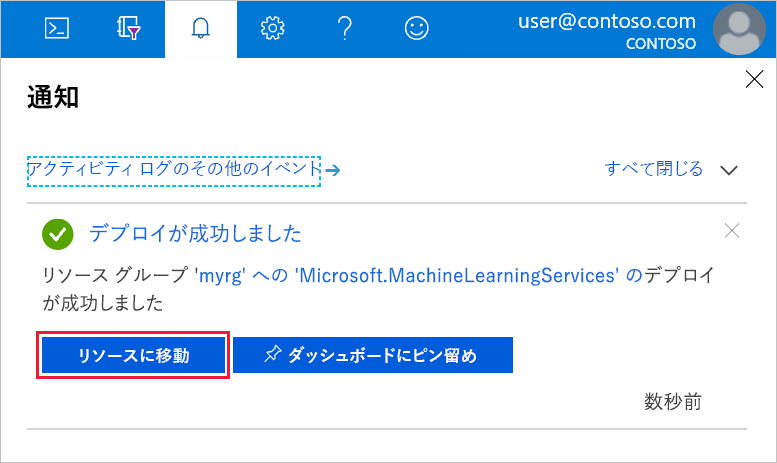

使用する Azure サブスクリプションの資格情報を使って、[Azure portal](https://portal.azure.com/) にサインインします。 

ポータルのワークスペース ダッシュボードは、Microsoft Edge、Chrome、および Firefox ブラウザーでのみでサポートされます。

   

ポータルの左上隅にある **[+ リソースの作成]** を選択します。

   

検索バーに「**Machine Learning**」と入力します。 **[Machine Learning service workspace]** という検索結果を選択します。

   

**[ML サービス ワークスペース]** ウィンドウを一番下までスクロールし、**[作成]** を選択して開始します。

   

**[ML service Workspace]\(ML サービス ワークスペース\)** ウィンドウで、ワークスペースを構成します。

   フィールド|説明
   ---|---
   ワークスペース名 |ワークスペースを識別する一意名を入力します。 この例では、**docs-ws** を使用します。 名前は、リソース グループ全体で一意である必要があります。 覚えやすく、他のユーザーが作成したワークスペースと区別しやすい名前を使用します。  
   サブスクリプション |使用する Azure サブスクリプションを選択します。
   リソース グループ | サブスクリプションの既存のリソース グループを使用するか、任意の名前を入力して新しいリソース グループを作成します。 リソース グループは、Azure ソリューションの関連するリソースを保持するコンテナーです。 この例では、**docs-aml** を使用します。 
   場所 | ユーザーとデータ リソースに最も近い場所を選択します。 この場所に、ワークスペースが作成されます。

   

作成プロセスを開始するには、**[作成]** を選択します。 ワークスペースの作成には、しばらく時間がかかる場合があります。

デプロイの状態を確認するには、ツール バーの [通知] アイコン (**ベル**) を選択します。

   

プロセスが完了すると、デプロイ成功メッセージが表示されます。 このメッセージは、通知セクションにも表示されます。 新しいワークスペースを表示するには、**[Go to resource]\(リソースに移動\)** を選択します。
